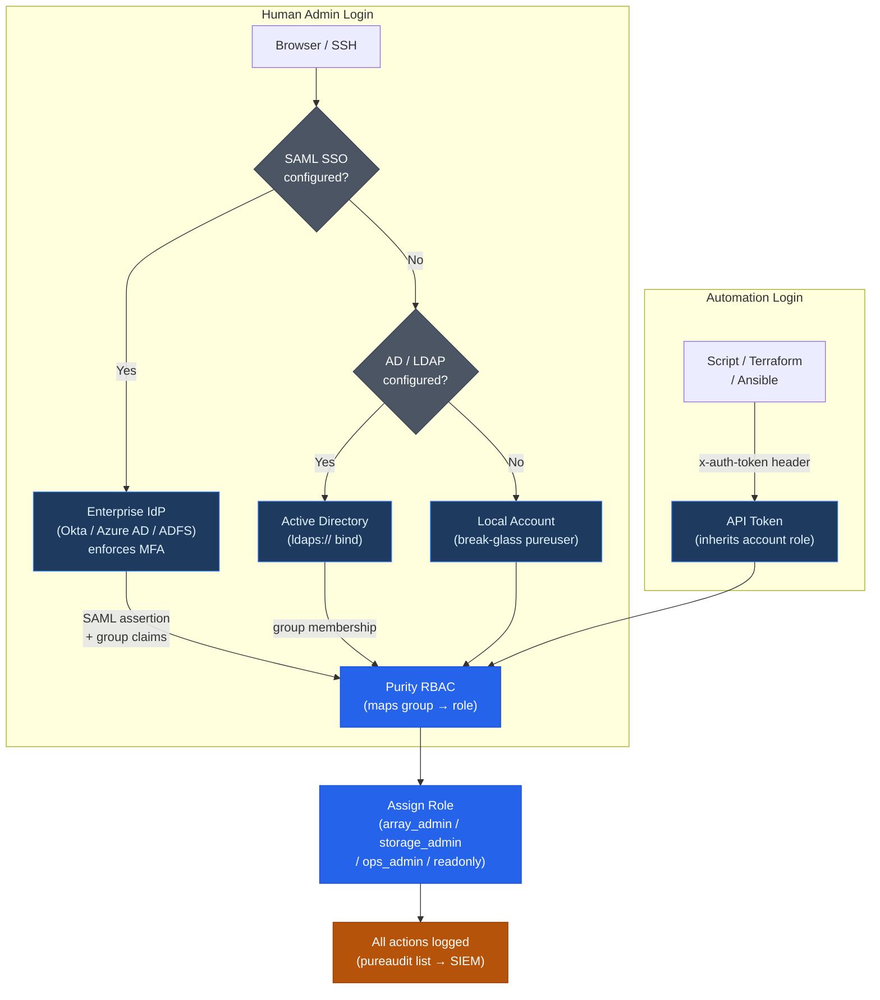

# FlashArray — Authentication


<div class="kb-summary">
Authentication reference covering Authentication Architecture, Local Accounts, Active Directory (AD), LDAP (Non-AD), SAML SSO and 4 more sections.
</div>

```text
FlashArray Authentication Flow
  Human admin login:
    Browser/SSH ──► SAML SSO configured?
                         │ Yes ──► IdP (Okta/Azure AD) ──► MFA
                         │         └──► SAML assertion ──► Purity RBAC
                         │ No  ──► AD/LDAP bind ──► group membership
                         │                └──► Purity RBAC
                         │         (fallback) local account (pureuser)

  Automation login:
    Script ──► x-auth-token: <api_token> ──► Purity RBAC

  Purity RBAC ──► role assigned ──► all actions logged (pureaudit)
                                    └──► SIEM via TLS syslog
```

FlashArray supports multiple identity sources for admin authentication: local accounts, Active Directory (AD), LDAP, and SAML SSO. All authentication is role-based — every admin account is bound to one of the four built-in Purity roles. API tokens are the recommended credential type for automation and monitoring integrations.

---

## Authentication Architecture



## Local Accounts

Local accounts are stored on the array itself and are independent of any directory service. Use them for break-glass access and initial setup. Minimise the number of local accounts in production — prefer AD or LDAP for human admin access.

```bash
# Create a local admin account with a specific role
pureadmin create --role storage_admin jsmith

# Set the account password (interactive prompt)
pureadmin setattr jsmith --password

# List all admin accounts and their roles
pureadmin list

# List accounts with lockout status
pureadmin list --lockout

# Lock an account (temporary lockout)
pureadmin reset jsmith --lockout

# Unlock a locked account
pureadmin refresh --clear jsmith

# Change a user's role
pureadmin setattr jsmith --role readonly

# Delete a local account
pureadmin delete jsmith
```

**Default `pureuser` account:**

The factory default local admin account is `pureuser` with a default password printed on the array's label. It has `array_admin` privileges. After configuring AD/LDAP authentication and validating that at least two AD accounts can log in successfully:

1. Change the `pureuser` password to a strong randomly-generated credential
2. Store it in the organisation's PAM vault (CyberArk, HashiCorp Vault, etc.) as break-glass access
3. Restrict who knows the password — it should be emergency-only

Do not delete `pureuser` — it is the only guaranteed fallback if directory service integration fails.

---

## Active Directory (AD)

AD integration allows domain accounts to log into the array using their existing AD credentials, with role assignment driven by AD group membership.

### Configuration

```bash
# Join the array to Active Directory
puredirectoryservice setattr \
    --base-dn "DC=example,DC=com" \
    --bind-user "svc-pure-bind" \
    --bind-password "<bind_password>" \
    --domain "example.com" \
    --uri "ldaps://dc01.example.com"

# Verify the directory service configuration
pureds list

# Test AD connectivity and bind credentials
pureds check
```

### Group-to-Role Mapping

Create AD security groups that correspond to Purity roles, then map them:

| AD Group (example) | Purity Role | Who |
|---|---|---|
| `CN=pure-array-admins,OU=Groups,DC=example,DC=com` | `array_admin` | Storage team leads; break-glass admins |
| `CN=pure-storage-admins,OU=Groups,DC=example,DC=com` | `storage_admin` | Day-to-day provisioning engineers |
| `CN=pure-ops-admins,OU=Groups,DC=example,DC=com` | `ops_admin` | Operations and on-call engineers |
| `CN=pure-readonly,OU=Groups,DC=example,DC=com` | `readonly` | Monitoring; application teams; audit accounts |

```bash
# Map an AD group to a Purity role
pureadmin setattr --role array_admin \
    --group "CN=pure-array-admins,OU=Groups,DC=example,DC=com"

pureadmin setattr --role storage_admin \
    --group "CN=pure-storage-admins,OU=Groups,DC=example,DC=com"

pureadmin setattr --role ops_admin \
    --group "CN=pure-ops-admins,OU=Groups,DC=example,DC=com"

pureadmin setattr --role readonly \
    --group "CN=pure-readonly,OU=Groups,DC=example,DC=com"

# Verify the group mappings are active
pureadmin list
```

### Validation Steps

Before removing or disabling local accounts after AD integration:

1. Log out of the current session
2. Log in with a domain account that is a member of a mapped group
3. Verify the role is correctly applied: `pureadmin list` should show the domain account and its role
4. Test login from a second domain account in a different role group
5. Confirm break-glass `pureuser` credentials are vaulted, then proceed to restrict shared local accounts

---

## LDAP (Non-AD)

For environments using OpenLDAP, Red Hat Directory Server, or similar LDAP providers:

```bash
# Configure LDAP directory service
puredirectoryservice setattr \
    --base-dn "dc=example,dc=com" \
    --bind-user "cn=svc-pure,ou=service-accounts,dc=example,dc=com" \
    --bind-password "<password>" \
    --uri "ldap://ldap01.example.com:389"

# For LDAP over TLS (recommended)
puredirectoryservice setattr \
    --uri "ldaps://ldap01.example.com:636"

# Verify
pureds list
pureds check
```

**LDAP attribute mapping considerations:**

Purity uses the `memberOf` attribute (or equivalent) to determine group membership for role assignment. Verify that your LDAP directory populates `memberOf` on user objects, or configure the appropriate group attribute mapping. Consult the Purity//FA Administration Guide for the specific attribute names if your LDAP schema differs from the default.

---

## SAML SSO

SAML 2.0 SSO allows admin logins to be federated through an enterprise Identity Provider (IdP) such as Okta, Azure AD (Entra ID), or ADFS. SAML support requires Purity//FA 6.0 or later.

### Overview

In SAML terminology, FlashArray acts as the **Service Provider (SP)** — it redirects authentication requests to the IdP and accepts SAML assertions in return. The IdP authenticates the user (including enforcing MFA if configured) and returns a signed assertion specifying the user's identity and group memberships. Purity maps those group memberships to roles using the same AD group-to-role mapping as described above.

### Configuration Steps

1. **Export the FlashArray SP metadata** from the Purity GUI:
   - Navigate to `Settings > Access > Single Sign-On`
   - Download the SP metadata XML file

2. **Register FlashArray as an application in your IdP:**
   - In Okta: create a new SAML 2.0 application; upload or paste the SP metadata
   - In Azure AD: create an enterprise application; configure SAML SSO with the FlashArray metadata
   - In ADFS: add a Relying Party Trust using the SP metadata

3. **Configure the IdP to pass group membership claims** in the SAML assertion — this is what drives role assignment in Purity

4. **Import IdP metadata into Purity:**
   ```bash
   # Configure SAML with IdP metadata URL
   puredirectoryservice saml setattr \
       --idp-metadata-url "https://idp.example.com/metadata"
   
   # Or import from a local file
   puredirectoryservice saml setattr \
       --idp-metadata-file /tmp/idp_metadata.xml
   
   # Enable SSO
   pureadmin global enable --single-sign-on
   ```

5. **Validate SSO login** before disabling local accounts — log out and log back in using the IdP-authenticated path from the Purity GUI

### SAML Fallback

If SAML is misconfigured or the IdP is unavailable, local account login remains functional. Always maintain a vaulted `pureuser` break-glass credential for this scenario.

---

## API Token Authentication

API tokens are the recommended authentication method for automation, monitoring integrations, scripts, and service accounts. Tokens are long-lived credentials tied to a specific admin account; they bypass the interactive login flow and do not require a username/password exchange.

```bash
# Create a service account and generate an API token
pureadmin create --role readonly svc-monitoring
pureadmin apitoken create svc-monitoring
# Save the displayed token securely — it cannot be retrieved again after creation

# Create a service account with a storage_admin role for provisioning automation
pureadmin create --role storage_admin svc-terraform
pureadmin apitoken create svc-terraform

# List all accounts and their API token status
pureadmin list --api-token

# Expose (display) an existing token — requires array_admin privilege
pureadmin list --api-token --expose

# Delete an API token (disables API access for the account without deleting the account)
pureadmin delete svc-monitoring --api-token

# Delete the account entirely
pureadmin delete svc-old-automation
```

**Using a token for REST API access:**

```bash
# Authenticate using an API token header (no session cookie required)
curl -sk \
    -H "x-auth-token: <api_token>" \
    "https://<array_ip>/api/2.x/arrays" | jq .

# Or obtain a session token via login endpoint
curl -sk -X POST \
    -H "api-token: <api_token>" \
    "https://<array_ip>/api/2.x/login" \
    -c /tmp/fa_session.txt

curl -sk \
    -b /tmp/fa_session.txt \
    "https://<array_ip>/api/2.x/volumes" | jq .
```

**Token security guidelines:**

- Store all API tokens in a secrets manager (HashiCorp Vault, AWS Secrets Manager, CyberArk) — never in plaintext config files or environment variables in CI systems
- Create one token per integration/tool — do not share tokens between multiple automation systems
- Rotate tokens at least annually; rotate immediately if a system is decommissioned or a credentials leak is suspected
- Assign the minimum necessary role — use `readonly` for monitoring, `storage_admin` for provisioning, and `array_admin` only if account management is required
- Audit active API tokens quarterly: `pureadmin list --api-token`

---

## Session and Password Policies

Global login policies apply to all local and directory-service accounts.

```bash
# Show global admin settings
pureadmin global list

# Show lockout policy
pureadmin global list --lockout

# Set maximum failed login attempts before lockout
pureadmin global setattr --max-login-attempts 5

# Set lockout duration (e.g., 30 minutes)
pureadmin global setattr --lockout-duration 30m

# Set minimum password length for local accounts
pureadmin global setattr --min-password-length 16

# Set CLI/GUI session idle timeout (minutes)
purearray setattr --idle-timeout 15
```

**Recommended policy settings:**

| Setting | Recommended Value | Rationale |
|---|---|---|
| Max login attempts | 5 | Prevents brute-force without locking out accidental mistypers |
| Lockout duration | 30 minutes | Sufficient deterrent; short enough to avoid support burden |
| Minimum password length | 16 characters | Aligns with NIST SP 800-63B guidance |
| Session idle timeout | 15 minutes | Limits exposure from unattended sessions |

---

## Audit Logging

Purity logs all authentication events and administrative actions. Logs are stored locally and should be forwarded to an external syslog/SIEM immediately — locally stored logs can potentially be altered by a compromised `array_admin` account.

**What is logged:**

- All successful and failed login attempts (CLI, GUI, REST API)
- All configuration changes with the account name, timestamp, and command
- All data operations: volume create/delete/connect, snapshot create/delete, replication changes
- API token creation and deletion events
- SafeMode-related operations

```bash
# View the audit log on the array
pureaudit list

# Filter by user
pureaudit list --filter 'user = "jsmith"'

# Filter by command
pureaudit list --filter 'command="purevol"'

# Filter for volume deletion events
pureaudit list --filter 'command="purevol" and subcommand="destroy"'

# Show last 20 entries
pureaudit list --limit 20 --sort time-

# Configure syslog forwarding (UDP — not recommended for production)
puresyslog create --uri udp://<syslog_ip>:514 siem-syslog

# Configure syslog forwarding with TLS (recommended)
puresyslog create --uri tls://<syslog_ip>:6514 siem-syslog-tls

# List syslog destinations
puresyslog list
```

**SIEM integration note:** When forwarding to a SIEM, use TLS syslog (`tls://`) to protect log integrity in transit. Configure the SIEM to alert on repeated failed login attempts, API token creation by non-standard accounts, and SafeMode-related audit events.
---

## Related Reference

- [Standard LDAP Integration](../../../../../security/ldap-integration/index.md) — field reference, service account standards, TLS requirements, and connectivity testing
- [Standard SAML Configuration](../../../../../security/saml-configuration/index.md) — SP/IdP setup, Azure AD and Okta steps, attribute mapping, and security requirements
