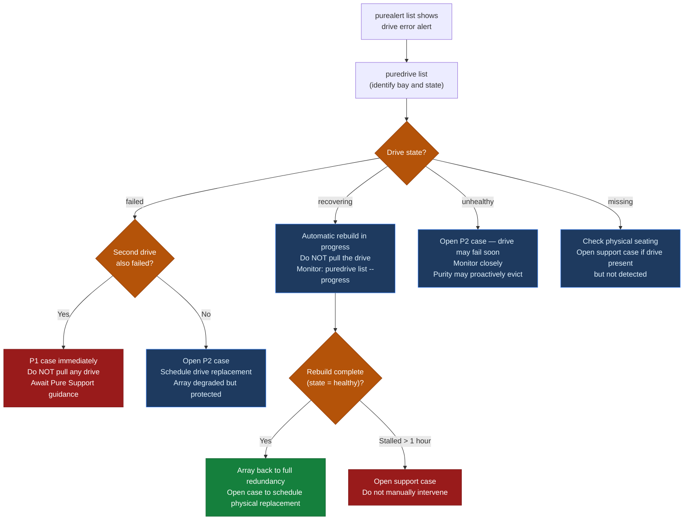
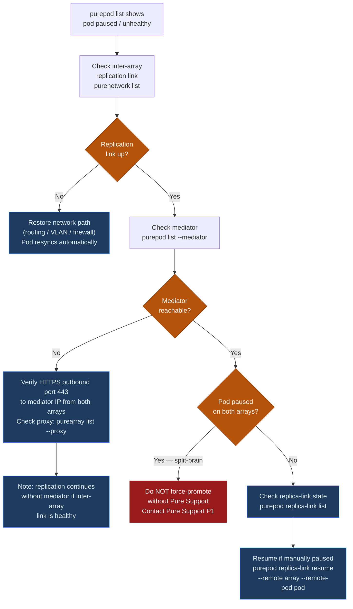

# FlashArray — Common Issues


<div class="kb-summary">
Detailed resolution procedures for the most frequently encountered FlashArray issues. Each section includes diagnostic commands, root cause identification, and resolution steps.
</div>

---

## Drive Failure and Rebuild

### Symptoms
- `purealert list` shows a drive failure alert with severity `error`
- `puredrive list` shows a drive in `failed`, `recovering`, or `unhealthy` state



### Diagnosis

```bash
# Identify the failed drive and its bay location
puredrive list

# Monitor rebuild progress on a recovering drive
puredrive list --progress

# Check if there are multiple drive failures (increases risk)
puredrive list | grep -v healthy

# Check array hardware alerts for related events
purehw list
purealert list --filter "severity='error'"
```

### Resolution

| Scenario | Action |
|---|---|
| Single drive in `recovering` state | Purity is rebuilding automatically — no action required; monitor rebuild progress; do not pull the drive |
| Single drive in `failed` state | Open a Pure Support case to schedule a replacement; the array is degraded but data is protected (RAID-equivalent protection) |
| Two drives in `failed` state simultaneously | Open a P1 support case immediately; do not pull any drives until Pure Support authorises a replacement sequence |
| Drive in `unhealthy` state (not yet failed) | Open a P2 case; monitor closely; Purity may evict and replace the drive proactively |
| Drive rebuild stalled (progress not advancing) | Open a support case; do not attempt manual intervention on the drive |

**Never pull a drive that is in `recovering` state** — this interrupts the rebuild and may leave the array in a double-degraded state depending on the protection scheme.

After replacement, confirm rebuild completes:

```bash
# Confirm new drive is admitted and rebuilding
puredrive list
# Confirm new drive transitions from 'recovering' to 'healthy'
```

---

## Host Loses All Paths to Volumes

### Symptoms
- Application I/O errors or storage timeouts on one or more hosts
- Multipath driver reports no active paths to the device
- `purehost list` shows a host with no active connections

### Diagnosis

```bash
# Check host path status on the array
purehost list --connection

# Check FC port status on the array
pureport list --type fc
pureport list --initiator

# Check which host initiators are registered
purehost list --wwn   # for FC
purehost list --iqn   # for iSCSI

# Check for array-side alerts that could explain path loss
purealert list

# Check controller health — a controller restart causes brief path interruption
purearray list --controller
```

**Host-side diagnostics (Linux):**

```bash
# Check multipath device status
multipath -ll

# Check DM-Multipath path status
multipathd show paths

# Check HBA port status
systool -c fc_host -v | grep -E "(host_name|port_name|port_state)"

# iSCSI session status
iscsiadm -m session
```

**Host-side diagnostics (Windows):**

```powershell
# Check MPIO paths
Get-MSDSMSupportedHW
mpclaim -s -d    # MPIO device path status

# Check iSCSI sessions
Get-IscsiSession
```

### Resolution by Root Cause

| Root Cause | Identification | Fix |
|---|---|---|
| FC zone removed or misconfigured | Array port WWN missing from zone; `pureport list --initiator` does not show the host | Restore the zone on the FC switch; confirm single-initiator/single-target zone design |
| Host HBA failed | No paths on both ports; host-side HBA driver shows error | Replace HBA; re-register WWNs on array: `purehost setattr <host> --addwwnlist <new_wwn>` |
| Array FC port down | `pureport list --type fc` shows port in `down` state | Check SFP and cable; open support case if port remains down |
| Volume disconnected accidentally | `purehost list --connection` does not show the volume | Reconnect: `purehgroup connect <hgroup> --vol <vol>` |
| Controller restart during upgrade (NDU) | Controller shows `not ready` briefly; paths restore automatically | Expected behaviour for single-path hosts; verify multipathing; paths restore when controller returns |
| iSCSI network routing changed | Ping from host to array iSCSI IP fails | Restore routing; verify iSCSI VLANs are intact |

---

## Host Has Only One Active Path (Single-Path Warning)

### Symptoms
- Multipath driver on the host shows only one active path instead of the expected two or more
- `purealert list` may show a host-specific alert about degraded path count

### Diagnosis

```bash
# Confirm expected path count per host
purehost list --connection

# Identify which paths are active/standby
pureport list --initiator
```

### Resolution

1. Identify which HBA or port is missing paths — compare expected ports (CT0.FC0 and CT1.FC0 for a two-path design) against `pureport list --initiator`
2. Check the FC switch port connected to the missing path — look for port errors, offline ports, or zone configuration issues
3. If the missing path is on CT1 (the secondary controller), confirm CT1 is in `ready` state: `purearray list --controller`
4. If the path was lost due to a zoning change, restore the zone and verify the initiator appears in `pureport list --initiator`
5. Rescan multipath on the host after restoring the path

**Resolution is urgent:** a host with one active path is one failure away from complete I/O interruption. Restore the second path before performing any maintenance on the array.

---

## ActiveCluster Pod Mediator Unreachable

### Symptoms
- `purealert list` shows a mediator connectivity alert
- `purepod list --mediator` shows mediator as `unreachable` or `unknown`

### Diagnosis

```bash
# Check mediator status for all pods
purepod list --mediator

# Confirm pod is still replicating despite mediator loss
purepod list --replicating

# Check if mediator is the Pure1-hosted mediator or a custom on-premises instance
purepod list --mediator oracle-pod
# Note the mediator IP — if it is a Pure1 cloud address, the issue is internet connectivity
```

### Resolution

**Important:** A mediator outage alone does not stop synchronous replication. The mediator is only required as a tiebreaker if the inter-array replication link also fails (split-brain). If the mediator is unreachable but the inter-array link is healthy, the pod continues replicating normally.

| Mediator Type | Resolution |
|---|---|
| Pure1-hosted mediator | Verify outbound HTTPS (port 443) from both arrays to `*.purestorage.com`; check proxy configuration: `purearray list --proxy` |
| On-premises mediator VM | Check VM health and network connectivity; verify the mediator service is running; check firewall rules |
| Both mediator and inter-array link failed | This is a split-brain scenario — `purepod list` will show the pod as `paused` on one or both arrays; see split-brain resolution below |

**Do not attempt to force-promote a pod during split-brain without Pure Support guidance** — incorrect promotion can result in data divergence between the two sites.

---

## ActiveCluster Pod Out of Sync (Paused or Unhealthy)

### Symptoms
- `purepod list` shows pod status as `paused` or `unhealthy`
- `purealert list` shows replication error alert
- Hosts at one site may be serving I/O on stale data



### Diagnosis

```bash
# Check pod status and member arrays
purepod list oracle-pod

# Check replica-link status
purepod replica-link list

# Check replication network interface status
pureport list --type eth
purenetwork list

# Check for bandwidth saturation on replication interface
purearray monitor --bandwidth
```

### Resolution

| Root Cause | Identification | Fix |
|---|---|---|
| Replication network link down | Replication interface shows `down`; ping to remote array replication IP fails | Restore network path; pod will resync automatically when link comes back |
| Replication bandwidth saturated | Array monitor shows bandwidth at 100% of replication interface capacity | Identify the cause of the spike (large data change); increase replication interface bandwidth or rate-limit the source workload temporarily |
| Split-brain event | Pod paused on both arrays; mediator and inter-array link both lost | Contact Pure Support; manual pod promotion sequence required to resolve |
| Pod manually paused | Replica-link is paused | Resume: `purepod replica-link resume <pod> --remote <array> --remote-pod <pod>` |

After resolving the network issue, confirm resync:

```bash
# Confirm pod returns to replicating state
purepod list --replicating oracle-pod

# Monitor resync progress via replica-link
purepod replica-link monitor --replication
```

---

## Unexpected Capacity Growth

### Symptoms
- `purearray list --space` shows capacity growing faster than expected
- `purealert list` shows a capacity threshold alert

### Diagnosis

```bash
# Check overall capacity and data reduction ratio
purearray list --space

# Identify top capacity consumers (volumes)
purevol list --space --sort size-

# Identify top snapshot capacity consumers
puresnap list --space --sort size-

# Check protection group retention settings
purepgroup list --schedule

# Count snapshots per protection group
puresnap list | awk '{print $1}' | cut -d. -f1 | sort | uniq -c | sort -rn | head -10
```

### Resolution

| Root Cause | Fix |
|---|---|
| Snapshot schedule creating more snaps than retention deletes | Reduce `snap-per-day` or `snap-frequency` in the PG schedule; `purepgroup schedule <pg> --snap-per-day 4` |
| `snap-for-days` set too long | Reduce retention window; old snapshots will expire on their next scheduled check |
| No expiry on manual snapshots | Manually eradicate old on-demand snapshots: `puresnap eradicate <snap>` |
| Volume thin-provisioning consuming more than expected | Identify high-growth volumes; check application for unexpected write amplification or log accumulation |
| Data reduction ratio dropped | Check for workload changes — encrypted data does not deduplicate or compress; confirm no misconfigured application is writing pre-compressed or pre-encrypted data |

**Eradicating old snapshots:**

```bash
# Eradicate a specific snapshot (destructive — cannot undo)
puresnap eradicate prod-oracle-pg.premigration-20250101

# List all pending (destroyed but not yet eradicated) snapshots
puresnap list --pending

# Eradicate all pending snapshots (use with caution)
puresnap eradicate --all
```

---

## Purity Upgrade Hangs or Fails

### Symptoms
- `purearray upgrade --exec` was run but upgrade is not progressing
- `purearray list` shows controllers at different Purity versions after expected completion time
- `purealert list` shows an upgrade-related alert

### Diagnosis

```bash
# Check upgrade status
purearray upgrade --status

# Check if both controllers are running the same version
purearray list --controller

# Check for active alerts that may be blocking upgrade
purealert list

# Check drive health — drive rebuilds during upgrade can cause delays
puredrive list
```

### Resolution

- **Do not manually reboot controllers** during an upgrade — this can corrupt the Purity state
- If the upgrade appears stuck (no progress for > 30 minutes): contact Pure Support with the output of `purearray upgrade --status` and `purealert list`
- If the upgrade failed pre-check: run `purearray upgrade --check` to identify the specific blocker; resolve the blocking condition and re-run `purearray upgrade --exec`
- Common pre-check blockers: active drive rebuild, critical alerts unresolved, single-path hosts, insufficient capacity for the upgrade staging area

---

## Volume Not Visible on Host After Provisioning

### Symptoms
- Volume was created and connected on the array but the host OS does not see the device
- Multipath driver does not show the new LUN

### Diagnosis

```bash
# Verify the volume exists and is not in destroyed state
purevol list prod-new-vol-01

# Verify the volume is connected to the host or host group
purehost list prod-oracle-01 --connection
purehgroup list prod-oracle-cluster --connection

# Verify the host WWN/IQN is registered on the array
purehost list prod-oracle-01 --wwn   # for FC
purehost list prod-oracle-01 --iqn   # for iSCSI

# Confirm the host is in the correct host group
purehgroup list prod-oracle-cluster
```

### Resolution Steps

1. Confirm volume is connected: `purehost list <host> --connection` — if not listed, connect it:
   ```bash
   purehgroup connect prod-oracle-cluster --vol prod-new-vol-01
   ```

2. Confirm the host WWN/IQN matches what is registered on the array:
   - On the host, get the HBA WWN: `cat /sys/class/fc_host/host*/port_name` (Linux) or Device Manager (Windows)
   - On the array: `purehost list <host> --wwn`
   - If they do not match: `purehost setattr <host> --addwwnlist <correct_wwn>`

3. Rescan for new LUNs on the host:
   - Linux: `echo "- - -" > /sys/class/scsi_host/hostX/scan` or `rescan-scsi-bus.sh`
   - Windows: Disk Management > Action > Rescan Disks (or `diskpart > rescan`)
   - ESXi: vCenter > Storage > Rescan (or `esxcli storage core adapter rescan --adapter vmhbaX`)

4. Check multipath driver has picked up the new device:
   - Linux: `multipath -ll` — look for the new device
   - Windows: `mpclaim -s -d`

---

## Array Reporting High Latency

### Symptoms
- Application response times degraded
- `purearray monitor` shows read or write latency above 1 ms
- `purealert list` may show a performance alert

### Diagnosis

```bash
# Real-time performance snapshot
purearray monitor
purearray monitor --latency
purearray monitor --iops

# Identify top volume consumers
purevol monitor --latency
purevol monitor --iops

# Check for drive rebuilds consuming controller resources
puredrive list
puredrive list --progress

# Check array capacity (high capacity > 90% increases write amplification)
purearray list --space

# Check for active QoS limits that may be creating queue depth
purevol list <vol> --space   # check bw_limit and iops_limit fields
```

### Resolution

| Root Cause | Fix |
|---|---|
| Drive rebuild in progress | Rebuild increases controller load temporarily; latency should return to normal after rebuild completes; open a support case if latency is critically high |
| Noisy neighbour workload | Apply QoS limit to the high-consumer volume: `purevol setattr prod-etl-vol --iops-limit 10000` |
| Array capacity above 90% | Free capacity by eradicating expired snapshots or expanding; high capacity causes increased write amplification |
| Workload is genuinely exceeding array capacity | Review Pure1 capacity planning data; consider workload redistribution or array upgrade |
| Queue depth spike from host | Check host application for runaway queries or batch jobs generating excessive I/O |

---

## Controller Shows `not ready` or Missing

### Symptoms
- `purearray list --controller` shows one controller in `not ready` or `offline` state
- `purealert list` shows a controller-related critical alert
- This is a P1 incident

### Immediate Actions

```bash
# Confirm which controller is affected and current role distribution
purearray list --controller

# Confirm surviving controller is serving I/O (check for active alerts)
purealert list --filter "severity='error'"

# Check volume access from the host side — are hosts still serving I/O?
purehost list --connection
```

**Do not:**
- Reboot the surviving controller
- Manually power cycle the array
- Replace any hardware without Pure Support authorisation

**Do:**
- Open a P1 support case immediately — provide `purearray list --controller` output, `purealert list` output, and the diagnostic bundle
- Collect the diagnostic bundle: `purediag --output /tmp/diag_$(date +%Y%m%d_%H%M).tgz`
- Call the Pure Support P1 hotline directly (do not wait for email response)
- Confirm from the host side that I/O is continuing on surviving paths — if hosts are down, this is a full outage

**Expected behaviour during normal controller failure:**
- Hosts with proper multipathing (two paths, one per controller) experience no I/O interruption
- The failed controller will attempt to reboot and rejoin automatically
- `purearray list --controller` will show the recovering controller return to `ready` status within 5–15 minutes for a software-initiated restart
- Hardware failures take longer and require Pure field service
