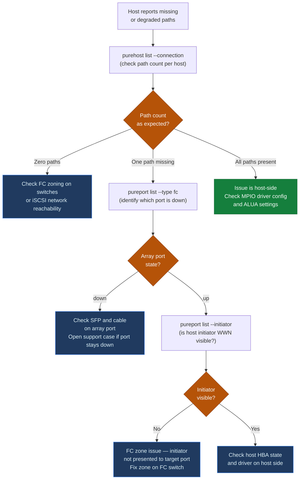

# FlashArray — Diagnostics

Structured diagnostic approach for identifying and isolating FlashArray issues. Start with alert triage, then drill into the specific failure domain.

---

## First-Response Sequence

When an incident is reported, run these commands in order. Capture all output to a file for the support case.

```bash
# 1. Check array reachability and Purity version
purearray list

# 2. Check controller health (critical — confirm both controllers are up)
purearray list --controller

# 3. Check all active alerts — this is the fastest path to the failure domain
purealert list

# 4. Check drive health — most common hardware event
puredrive list

# 5. Check array space — rule out capacity as a contributing factor
purearray list --space

# 6. Check pod (ActiveCluster) state — replication events are high-impact
purepod list

# 7. Check host connectivity — are hosts affected?
purehost list
purehost list --connection

# 8. Check port status — identify any downed FC or Ethernet ports
pureport list

# 9. Real-time performance snapshot
purearray monitor

# 10. Collect and save full diagnostic bundle for support
purediag --output /tmp/fa_diag_$(date +%Y%m%d_%H%M).tgz
```

---

## Alert Triage

Alerts are the first place to look. Purity generates alerts for hardware faults, replication failures, capacity thresholds, and software events.

```bash
# List all active alerts (all severities)
purealert list

# Filter for critical/error severity only
purealert list --filter "severity='error'"

# Filter for warning severity
purealert list --filter "severity='warning'"

# Show only open (unresolved) alerts
purealert list --filter "state='open'"

# Show flagged alerts (manually flagged by an admin)
purealert list --flagged

# Show all alerts including closed/resolved (audit view)
purealert list --filter "state='closed'"
```

**Alert severity mapping:**

| Severity | Meaning | Response |
|---|---|---|
| `error` | Critical fault — hardware failure, controller issue, replication broken | Immediate response; open P1 or P2 support case |
| `warning` | Degraded state or threshold breach — drive recovering, capacity above 80%, single-path host | Investigate within the hour; open P2 or P3 case |
| `info` | Informational — upgrade completed, replication resumed, drive admitted | Acknowledge and close; no action required |

---

## Controller Diagnostics

```bash
# Show both controllers with status, role, and Purity version
purearray list --controller

# Expected output:
# NAME     STATUS   ROLE    VERSION
# CT0      ready    primary 6.6.3
# CT1      ready    secondary 6.6.3

# Show detailed hardware status for all controller components
purehw list --type ct

# Show NVRAM module status (critical for write path health)
purehw list --type nvram

# Show all hardware components
purehw list
```

**Interpreting controller states:**

| Controller Status | Meaning | Action |
|---|---|---|
| `ready` | Controller is healthy and serving I/O | Normal |
| `not ready` | Controller is recovering after a restart or failover | Monitor; it should return to `ready` within minutes |
| `offline` | Controller is powered off or completely unresponsive | Open a P1 support case immediately |
| `unknown` | Purity cannot determine controller state | Open a P1 support case |

If one controller is `not ready` or `offline`: hosts with proper multipathing are continuing to serve I/O on the surviving controller. Verify hosts are not reporting I/O errors before escalating.

---

## Drive Diagnostics

```bash
# List all drives and their state
puredrive list

# Show drive specification (capacity, type, firmware, bay location)
puredrive list --spec

# Show rebuild progress for a recovering drive
puredrive list --progress

# List drives in a specific bay
puredrive list CH0.BAY10

# Show total drive capacity
puredrive list --total
```

**Drive state reference:**

| State | Action |
|---|---|
| `healthy` | No action |
| `recovering` | Active rebuild in progress — do not pull the drive; monitor progress with `puredrive list --progress` |
| `failed` | Drive has failed; array is degraded — open support case immediately; schedule replacement |
| `missing` | Bay is empty or drive not detected — check physical seating; open support case if drive is installed but undetected |
| `evicting` | Purity is migrating data off the drive — wait for eviction to complete; do not interrupt |
| `unhealthy` | Drive is operating but reporting errors — open a support case; monitor closely |

**Multiple drive failures:**

If two or more drives are in `failed` state simultaneously, the array may be at risk of data loss depending on the protection scheme. Open a P1 case immediately. Do not pull any drives until a Pure Support engineer authorises the replacement sequence.

---

## Path Failover Decision Tree



## Port and Connectivity Diagnostics

```bash
# List all ports (FC, Ethernet, NVMe-oF)
pureport list

# FC ports only — note WWNs for zoning verification
pureport list --type fc

# Ethernet ports only
pureport list --type eth

# Show connected host initiator ports (registered initiators seen on FC fabric)
pureport list --initiator

# Filter by specific port on CT0
pureport list --raw --filter "name='CT0.FC0'"
pureport list --raw --filter "name='CT0.FC1'"

# Network interface configuration (management, replication, iSCSI)
purenetwork list
```

**FC port troubleshooting flow:**

```
Host reports path missing
    ↓
pureport list --type fc
    ↓ Is the port in 'up' state?
    
No: Port is down
    → Check physical SFP and cable on the array
    → Check the FC switch port connected to this array port
    → Open a support case if port remains down after physical check
    
Yes: Port is up — check zoning
    → pureport list --initiator — is the host initiator WWN visible?
    → If not: FC fabric is not presenting the initiator to the target port
    → Check FC zone on the relevant FC switch
    → Verify zone contains one initiator (host HBA WWN) and one target (array port WWN)
```

**iSCSI connectivity troubleshooting:**

```bash
# Confirm iSCSI interfaces are up and have IPs
purenetwork list
# Look for iSCSI interfaces with valid IP addresses

# From the host — test IP reachability to the array iSCSI IP
ping -c 4 <array_iscsi_ip>

# Check iSCSI sessions on Linux
iscsiadm -m session

# Check iSCSI sessions on Windows (PowerShell)
Get-IscsiSession
```

---

## Host and Volume Connectivity Diagnostics

```bash
# List all hosts and their registered initiators
purehost list

# List host volume connections
purehost list --connection

# Show all volume connections for a specific host
purehost list prod-oracle-01 --connection

# List all host groups
purehgroup list

# List host group volume connections
purehgroup list --connection

# List volumes with their connection status
purevol list

# Check a specific volume's connection
purevol list prod-oracle-data-01
purehost list --connection | grep prod-oracle-data-01
```

**Volume not visible on host — diagnostic flow:**

```
Host does not see volume
    ↓
purehost list --connection
    ↓ Is the volume connected to the host or its host group?
    
No: Volume is not connected
    → purehgroup connect <hgroup> --vol <vol>
    → or: purehost connect <host> --vol <vol>
    → Then rescan HBA on the host
    
Yes: Volume is connected — check initiator registration
    → purehost list --wwn (for FC) or purehost list --iqn (for iSCSI)
    → Compare host HBA WWN/IQN against what is registered
    → If mismatch: purehost setattr <host> --addwwnlist <correct_wwn>
    → Then rescan HBA on the host
```

---

## Performance Diagnostics

```bash
# Real-time array performance (1-second refresh)
purearray monitor

# Latency breakdown (read/write, per queue depth)
purearray monitor --latency

# IOPS breakdown
purearray monitor --iops

# Bandwidth breakdown
purearray monitor --bandwidth

# Queue depth
purearray monitor --queue-depth

# Per-volume performance (identify top consumers)
purevol monitor
purevol monitor --latency
purevol monitor --iops

# Historical performance (last 24 hours)
purevol monitor --historical 24h

# Per-host performance
purehost monitor --bandwidth
purehost monitor --iops

# Per-port bandwidth
pureport monitor --bandwidth
```

**Latency diagnostic targets:**

| Metric | Normal | Elevated | Critical |
|---|---|---|---|
| Read latency (4K random) | < 300 µs | 300–1000 µs | > 1 ms |
| Write latency (4K random) | < 300 µs | 300–1000 µs | > 1 ms |
| Queue depth | < 4 | 4–16 | > 16 |

**High latency investigation flow:**

```
purearray monitor — note read/write latency and queue depth
    ↓
purevol monitor --latency — identify which volumes have the highest latency
    ↓
puredrive list — check for active drive rebuilds (rebuilds consume controller resources)
    ↓
Check for active QoS limits: purevol list --space (check bw_limit / iops_limit fields)
    ↓
Check for capacity > 90%: purearray list --space (high capacity triggers write amplification)
    ↓
If a specific volume is the culprit — consider applying a temporary QoS limit:
    purevol setattr prod-noisy-vol-01 --iops-limit 5000
```

---

## Replication and ActiveCluster Diagnostics

```bash
# List all pods and their status
purepod list

# Show which array has failover preference for each pod
purepod list --failover-preference

# Show mediator status (critical for split-brain resolution)
purepod list --mediator

# Show pod replication state
purepod list --replicating

# Show volumes inside a pod
purepod listobj --type vol oracle-pod

# List replica-links (for ActiveDR async replication)
purepod replica-link list

# Monitor replication throughput
purepod replica-link monitor --replication

# List async protection group replication status
purepgroup list --replication
purepgroup list --schedule
```

**Pod unhealthy or paused — diagnostic flow:**

```
purepod list — note the pod status and which arrays are members
    ↓
Is the inter-array replication link up?
    → purenetwork list — confirm replication interface IPs are correct
    → Ping the remote array replication IP from local array (via support tunnel if needed)
    → Check for network events (routing changes, VLAN misconfiguration, bandwidth saturation)
    ↓
Is the mediator reachable?
    → purepod list --mediator — check mediator IP and version
    → Confirm outbound HTTPS (port 443) is reachable to the mediator IP from both arrays
    → Note: mediator failure alone does not stop replication — it only affects split-brain resolution
    ↓
If replication link is down: resolve network issue first
If mediator is unreachable: resolve connectivity; pod continues replicating with full inter-array link
If pod is paused: purepod replica-link resume (for async) or investigate network for sync
```

---

## Capacity Diagnostics

```bash
# Overall array capacity and data reduction
purearray list --space

# Volume-level space usage (sorted by used capacity)
purevol list --space --sort size-

# Snapshot space usage (identify capacity consumers)
puresnap list --space --sort size-

# Protection group space usage
purepgroup list --space
```

**Unexpected capacity growth — investigation flow:**

```
purearray list --space — confirm overall capacity % and snapshot %
    ↓
puresnap list --space --sort size- — identify largest snapshot consumers
    ↓
purepgroup list --schedule — check retention settings
    ↓
Are snapshots being created faster than the schedule expires them?
    → Reduce snap-per-day or snap-for-days in the protection group schedule
    → Manually eradicate stale snapshots: puresnap eradicate <snap_name>
    ↓
Is volume used capacity unexpectedly high?
    → Check for volumes with high write activity (application logs, temp tables)
    → Check data reduction ratio — incompressible/encrypted data does not reduce
```

---

## Log Locations and Analysis

| Log / Data Source | Access Method |
|---|---|
| Purity array events log | `purearray list --log` — shows controller events, upgrades, failovers |
| Admin audit log | `pureaudit list` — all admin actions with timestamp and user |
| Alert history | `purealert list --filter "state='closed'"` — resolved alerts |
| Replication log | `purepgroup list --replication` |
| Diagnostic bundle (all logs) | `purediag --output /tmp/diag.tgz` — comprehensive bundle for support |
| Pure1 event timeline | Pure1 portal > Arrays > select array > Events |
| Syslog (external SIEM) | Forwarded via `puresyslog` configuration — all Purity events in syslog format |

**Collecting the diagnostic bundle for support:**

```bash
# Save diagnostic bundle locally
purediag --output /tmp/fa_diag_$(hostname)_$(date +%Y%m%d_%H%M).tgz

# Or send directly to Pure Support (requires active phone-home connection)
purediag --send
# Confirm with `purearray phonehome list` that phone-home is active before using --send
```

The diagnostic bundle includes controller logs, Purity event logs, drive health data, performance metrics, configuration snapshots, and network interface state. It is the primary input for Pure Support triage. Always collect it before or immediately after opening a support case — do not wait for the support engineer to request it.

---

## Pure1 Portal Diagnostics

Pure1 provides historical analytics and AI-driven anomaly detection that complement real-time CLI diagnostics.

**Key views for incident triage:**

| Pure1 View | Path | Use |
|---|---|---|
| Array health status | Arrays > select array > Overview | Overall health at a glance; hardware fault indicators |
| Historical performance | Arrays > select array > Performance | Correlate latency spikes with events (upgrades, VM migrations, replication spikes) |
| Capacity trend | Arrays > select array > Capacity | Project days-to-full; identify snapshot growth |
| Alert history | Arrays > select array > Alerts | Full alert history including acknowledged/resolved alerts |
| Event timeline | Arrays > select array > Events | Ordered timeline of all array events including controller restarts, drive events, and Purity upgrades |
| Support cases | Support > Cases | Track open cases and add attachments |

Pure1's AI-driven recommendations (Pure1 Meta) surface workload anomalies and right-sizing recommendations that may not be visible in real-time CLI output. Review these weekly during normal operations and immediately during a performance incident.
