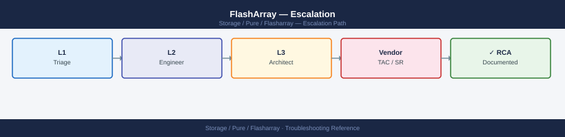
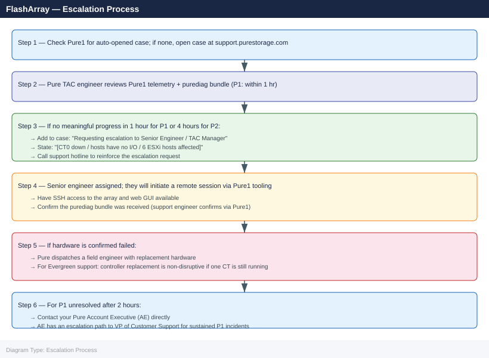

---
tags:
  - pure
  - troubleshooting
search:
  boost: 1.5
---
# FlashArray — Escalation

<div class="kb-summary">
How to escalate Pure Storage FlashArray issues to Pure support: what data to collect, how to generate the diagnostic bundle, step-by-step case creation on the Pure support portal, and the escalation path when progress stalls.

*Applies to: FlashArray Purity 6.x*
</div>



---

```d2
direction: down

symptom: Identify Symptom {shape: diamond}
preescalation_selfcheck: "Pre-Escalation Self-Check" {shape: rectangle}
stepbystep_data_collection: "Step-by-Step Data Collection" {shape: rectangle}
how_to_open_the_sr_on_supportpuresto: "How to Open the SR on support.purestorage.com" {shape: rectangle}
escalation_path: "Escalation Path" {shape: rectangle}
what_not_to_do: "What NOT to Do" {shape: rectangle}
useful_commands_for_case_updates: "Useful Commands for Case Updates" {shape: rectangle}
resolution: Resolve or Escalate {shape: oval}

symptom -> preescalation_selfcheck: investigate
symptom -> stepbystep_data_collection: investigate
symptom -> how_to_open_the_sr_on_supportpuresto: investigate
symptom -> escalation_path: investigate
symptom -> what_not_to_do: investigate
symptom -> useful_commands_for_case_updates: investigate
preescalation_selfcheck -> resolution
stepbystep_data_collection -> resolution
how_to_open_the_sr_on_supportpuresto -> resolution
escalation_path -> resolution
what_not_to_do -> resolution
useful_commands_for_case_updates -> resolution
```

## Before you begin

- **Access required:** FlashArray admin credentials (SSH to array management IP or web GUI); Pure support account at support.purestorage.com with the array registered in Pure1
- **Check Pure1 first:** if phone-home is enabled, Pure may have already automatically opened a case for qualifying hardware faults (drive failures, controller faults, capacity thresholds). Log into **pure1.purestorage.com → Support → Cases** before opening a duplicate
- **Do NOT pull failed drives** without Pure guidance — the replacement procedure and sequencing is critical to avoid losing RAID redundancy
- **Do NOT disable phone-home** during the case — Pure1 telemetry is what the support engineer uses for remote diagnosis; disabling it delays resolution

---

## Pre-Escalation Self-Check

Run these from the FlashArray CLI (SSH to management IP, then `purectl` or direct CLI commands).

| Check | Command | Expected result |
|---|---|---|
| Purity version | `purearray list` | Note full Purity//FA version string |
| Array serial | `purearray list` | Note the serial number for the case |
| Controller health | `purearray list --controller` | Both CT0 and CT1 show `ready` |
| Active alerts | `purealert list` | No unflagged Critical or Error alerts |
| Drive health | `puredrive list` | No drives in `failed` or `degraded` state |
| Volume accessibility | `purevol list` | No volumes in `unhealthy` state |
| Port state | `pureport list` | All connected ports show `connected` |
| ActiveCluster pod state | `purepod list` | All pods show `online` and `uniform` |
| Replication group state | `purepgroup list` | All pgroups show expected replication status |
| Pure1 auto-case | pure1.purestorage.com → Support → Cases | Check for existing auto-opened case |

---

## Step-by-Step Data Collection

### 1. Get the Purity version and array serial number

```bash
# Array identity, version, and serial — SSH to array management IP
purearray list

# Example output:
# Name         Version     ID             Model     Status
# flasharray1  6.4.10      <uuid>         FA-X70R4  ready
```


```text title="Expected output"
Name         Version     ID                                   Model     Status
flasharray1  6.4.10      8b3e4c2a-91f7-4d2e-b8a1-7c5d9e2f1a3b FA-X70R4  ready
```

!!! warning "Common errors"
    **`purearray: command not found`** — Ensure you are SSH'd directly to the array management IP (not a controller host) and the Pure CLI tools are installed.
    **`Connection refused`** — Verify the management IP is reachable with `ping` and that SSH is enabled on the array (check array network settings in the GUI).
    **`Authentication failed`** — Confirm you are using the correct credentials and that your SSH key or password is valid for the pureuser account.
Note the **Version** field (e.g. `6.4.10`) and the **Serial** field — both required for the support case.

### 2. Capture current array state

```bash
# All active alerts — most important data for the case
purealert list

# Controller health (CT0 and CT1)
purearray list --controller

# Drive health — flag any 'failed' or 'degraded' entries
puredrive list

# Volume health
purevol list

# Port state (FC, iSCSI, NVMe-oF)
pureport list

# Host connections
purehost list --connection

# Array capacity and data reduction ratios
purearray list --space
```


```text title="Expected output"
Name                             Severity  Code  Description                          Created
vol-backup-20240115             critical  230   Volume has failed                    2024-01-15T09:23:14Z
cache-tier-01                   warning   120   Controller temperature elevated      2024-01-15T08:47:22Z
repl-lag-prod                   warning   105   Replication lag exceeds threshold    2024-01-15T07:12:09Z

Name  Status   Model              Speed
CT0   healthy  FlashArray//X70-2  7.2.0.1234
CT1   healthy  FlashArray//X70-2  7.2.0.1234

Name        Status     Capacity  Serial
SSD-0.0     healthy    1.92TB    PUREFC191234567
SSD-0.1     healthy    1.92TB    PUREFC191234568
SSD-1.0     degraded   1.92TB    PUREFC191234569
SSD-1.1     failed     1.92TB    PUREFC191234570

Name                  Size      Provisioned  Data Reduction
prod-db-01            500GB     1.2TB        3.8:1
backup-archive        2TB       4.5TB        2.1:1
dev-test-vol          100GB     250GB        1.5:1

Name      Wwn                Port  Speed  Status
CT0.FC0   50:00:14:40:1a:2b:3c:4d  0      16Gb   online
CT0.FC1   50:00:14:40:1a:2b:3c:4e  1      16Gb   online
CT1.iSCSI 50:00:14:40:1a:2b:3c:4f  2      10Gb   online

Name           Iqn                                    Volumes
host-esx-01    iqn.1991-05.com.example:esx-01        prod-db-01, dev-test-vol
host-esx-02    iqn.1991-05.com.example:esx-02        prod-db-01
host-backup    iqn.1991-05.com.example:backup-srv    backup-archive

Capacity      Used       Data Reduction  Snapshots  Replication
10TB          6.2TB      2.3:1           1.8TB      0.9TB
```

!!! warning "Common errors"
    **`purealert: command not found`** — Verify the Pure Storage CLI tools are installed and the PATH includes the Pure bin directory (typically `/opt/pureapp/bin`).
    **`Error: Array unreachable at <ip_address>`** — Confirm network connectivity to the array management IP and verify credentials are set via `pureconfig` or environment variables.
    **`Error: Invalid credentials`** — Re-authenticate using `pureconfig --username <user> --password` or check that the API token in your session has not expired.
Save all CLI output to a text file for pasting into the case.

### 3. Check ActiveCluster pod state (if ActiveCluster is configured)

```bash
# Pod health — shows whether pods are Online and synchronized
purepod list

# If a pod is not Online, check the mediator status
purepod list --mediator

# Pod member volumes
purepod list --member-type volume
```


```text title="Expected output"
Name                          Status    Mediator Status    Replication Status
pod-prod-01                   Online    Connected         Synchronized
pod-prod-02                   Online    Connected         Synchronized
pod-dr-backup                 Online    Connected         Synchronized

Name                          Status    Mediator IP       Mediator Status
pod-prod-01                   Online    10.45.12.88       Connected
pod-prod-02                   Online    10.45.12.88       Connected
pod-dr-backup                 Online    10.45.12.89       Disconnected

Name                          Pod Name              Volume Count
pod-prod-01                   flasharray-1          847
pod-prod-01                   flasharray-2          847
pod-prod-02                   flasharray-3          923
pod-dr-backup                 flasharray-4          612
```

!!! warning "Common errors"
    **`Error: Invalid option '--mediator'`** — Use `purepod list --mediator-status` or check your Pure OS version supports this flag.
    **`Error: Pod 'pod-name' status is Offline`** — Verify network connectivity between array members and check mediator connectivity with `purepod list --mediator`.
### 4. Generate and send the diagnostic bundle

```bash
# If phone-home is enabled (recommended) — sends bundle directly to Pure TAC
purediag --send

# If phone-home is disabled — generate a local bundle for manual upload
purediag --output /tmp/diag_$(hostname)_$(date +%Y%m%d_%H%M).tgz

# Copy from the array to a management host
scp pureuser@<array-mgmt-ip>:/tmp/diag_*.tgz /tmp/
```


```text title="Expected output"
Generating diagnostic bundle...
Connecting to Pure TAC...
Bundle size: 2.3 GB
Uploading: ████████████████████ 100%
Upload complete. Case #: CS-2024-0847392
Transmission time: 47 seconds

Generating diagnostic bundle...
Bundle written to: /tmp/diag_flasharray-prod-01_20240215_1423.tgz
Size: 2.3 GB
Generation time: 89 seconds

pureuser@192.168.1.45's password: 
diag_flasharray-prod-01_20240215_1423.tgz          100% 2342MB   18.5MB/s   02:06
```

!!! warning "Common errors"
    **`purediag: command not found`** — Ensure you are running this command on the FlashArray management interface or install the Pure CLI tools on your management host.
    **`Permission denied (publickey,password)`** — Verify the pureuser account credentials and that SSH key-based authentication is configured, or use `ssh-keyscan` to add the array to your known_hosts file first.
    **`No such file or directory`** — The diagnostic bundle may still be generating; wait 2-3 minutes and retry the scp command, or check available disk space on the array with `ssh pureuser@<array-mgmt-ip> df -h`.
Note: `purediag --send` ties the bundle to the array's Pure1 account. When you open the case, Pure support can retrieve the bundle from Pure1 directly using the array serial number.

### 5. Write the timeline

```text
Purity version: 6.4.10
Array: flasharray-prod-01 (serial: <array-serial>)
Model: FlashArray //X70R4
Issue first observed: 2026-06-14 14:30 UTC
Last known good state: 2026-06-14 12:00 UTC
Changes in 24h before the issue:
  - 12:00: Purity upgrade from 6.4.9 → 6.4.10 applied via web GUI
  - 14:30: Alert fired: "CT0 hardware fault — controller degraded"
  - 14:35: 6 hosts lost access to volumes on CT0's preferred paths
Steps already taken:
  - purealert list: 2 Critical alerts for CT0 hardware fault
  - purearray list --controller: CT0 shows degraded; CT1 shows ready
  - purediag --send: bundle sent at 14:40 UTC
  - Pure1 portal: no automatic case found for this array
  - Did NOT reboot controllers or pull drives
Blast radius: 6 ESXi hosts have partial path loss; VMs are I/O retrying on CT1 paths
```

---

## How to Open the SR on support.purestorage.com

1. Go to **support.purestorage.com** and sign in with your Pure account. If you do not have one: click **Register** and use your company email — your account must be linked to the array in Pure1. Request access from your Pure account team if needed.

2. First check **Support → Cases** to see if Pure has already auto-opened a case for this fault. If yes, add your notes to the existing case.

3. Click **Open a New Case** (or **Create Case**).

4. Under **Product**, select **FlashArray**.

5. Under **Array**, select your array from the registered array list (linked via Pure1). If the array does not appear, enter the serial number manually.

6. Under **Purity Version**, enter your Purity//FA version from Step 1.

7. Under **Severity**, select:
   - **P1 — Critical**: Both controllers unreachable; all hosts have lost I/O access; production completely halted; data inaccessible; no workaround
   - **P2 — High**: Single controller degraded; drive failures reducing RAID redundancy; ActiveCluster pod partitioned; significant I/O impact; alternate paths still functional
   - **P3 — Medium**: Non-critical issue with a workaround; isolated performance degradation; non-production host affected; slow alert not affecting I/O
   - **P4 — Low**: How-to, pre-upgrade planning, documentation request, or general advisory question

8. In the **Subject** field: array model + symptom + scope. Example: `FlashArray //X70R4 flasharray-prod-01 — CT0 controller degraded after Purity 6.4.10 upgrade, 6 hosts have partial path loss`.

9. In the **Description** field, paste:
   - Purity version and array serial from Step 1
   - The full `purealert list` output from Step 2
   - The `purearray list --controller` and `puredrive list` output from Step 2
   - The timeline from Step 5

10. Under **Attachments**, upload the purediag bundle if you generated it locally (Step 4). If you used `--send`, note that in the description: "purediag --send executed at 14:40 UTC".

11. Click **Submit**. You will receive a case number by email immediately.

12. **P1 only:** call Pure support immediately after submission:
    - Global: **+1-650-729-4088** (24×7)
    - EMEA: +44 808 189 0119
    - State "P1 — FlashArray controller down / hosts have no storage / production halted" at the start of the call.

---

## Escalation Path



---

## What NOT to Do

| Do NOT do this | Why | What to do instead |
|---|---|---|
| Pull a failed drive without Pure guidance | The replacement sequence is critical; removing the wrong drive first can lose RAID redundancy | Wait for Pure to confirm which drive to replace and the exact sequence |
| Run `purearray reset` without Pure | Factory resets the array; destroys all data and configuration | This is never the right action during a P1 incident — escalate instead |
| Delete protection groups or pods mid-case | Changes the replication topology Pure is analysing | Freeze all replication configuration changes |
| Disable phone-home (Pure1 connectivity) | Severs the telemetry channel Pure uses for remote diagnosis and automated dispatch | Leave phone-home enabled; it dramatically accelerates diagnosis |
| Apply a Purity upgrade mid-incident | Changes the OS version under investigation; upgrade may be blocked by the current fault | Freeze all upgrades until the case is resolved |
| Open multiple cases for the same array | Splits diagnostic context; Pure1 may link the telemetry to the wrong case | Use one case; add all updates to the same SR number |

---

## Useful Commands for Case Updates

```bash
# Array state snapshot — paste into every case update
purearray list
purearray list --controller
purealert list

# Drive health (flag any 'failed' or 'degraded' entries)
puredrive list

# Volume health
purevol list

# Port and host connectivity
pureport list
purehost list --connection

# ActiveCluster pod state
purepod list

# Replication group state
purepgroup list

# Performance snapshot (latency and throughput)
purearray monitor

# Send updated diagnostic bundle to Pure1
purediag --send
```


```text title="Expected output"
Name             Status      Version      Model
flasharray-prod  Online      6.4.2        FA-405
flasharray-prod  Online      6.4.2        FA-405

AlertId  Severity  Code           Message                          Timestamp
12847    warning   DRIVE_WEAR     Drive nearing end of life        2024-01-15T09:23:14Z
12891    critical  CTRL_TEMP      Controller temperature elevated  2024-01-15T10:45:22Z

Name       Status     Capacity   Used       Type
SSD.1      Healthy    1.92TB     1.54TB     SSD
SSD.2      Healthy    1.92TB     1.68TB     SSD
SSD.3      Healthy    1.92TB     1.71TB     SSD
SSD.4      Degraded   1.92TB     1.89TB     SSD
...

Name                Status     Size       Provisioned
prod-db-vol-01     Online     500GB      450GB
prod-db-vol-02     Online     1TB        950GB
backup-vol-03      Online     2TB        1.8TB
...

Name          Status    Speed    Enabled
CT0.ETH0      Online    10Gbps   Yes
CT0.ETH1      Online    10Gbps   Yes
CT1.ETH0      Online    10Gbps   Yes
CT1.ETH1      Online    10Gbps   Yes

HostName              IQN/WWN                    Connection
esx-host-01          iqn.1991-05.com.emc:...    Connected
esx-host-02          iqn.1991-05.com.emc:...    Connected
db-server-prod       iqn.1991-05.com.emc:...    Connected
...

Name          Status    Replication  Mediator
pod-primary   Online    Active       mediator-01
pod-secondary Online    Active       mediator-01

Name                Status    Direction    Lag
pg-prod-to-dr      Synced    Outbound     0ms
pg-backup-sync     Synced    Outbound     2ms

Timestamp            Read_Latency  Write_Latency  Throughput_Read  Throughput_Write
2024-01-15T10:50:00  1.2ms         2.1ms          4.2GB/s          3.8GB/s

Diagnostic bundle generated: diag_flasharray-prod_20240115_105234.tar.gz
Uploading to Pure1... [████████████████████] 100%
Upload complete. Case reference: CS-2024-0847291
```

!!! warning "Common errors"
    **`purearray: command not found`** — Ensure the Pure Storage CLI tools are installed and the PATH includes the installation directory (typically `/opt/purearray/bin`).
    **`Error: Array unreachable at 192.168.1.100`** — Verify network connectivity to the array management IP and confirm firewall rules allow access to port 443.
    **`purediag: Authentication failed`** — Confirm your Pure1 API token is valid and has not expired; regenerate credentials in Pure1 if necessary.
---

## Support SLA Reference

| Severity | Definition | Initial Response SLA |
|---|---|---|
| P1 — Critical | Both controllers down; all I/O stopped; data inaccessible | 1 hour (24×7) |
| P2 — High | Single controller degraded; drive failures; pod partitioned | 4 hours (24×7) |
| P3 — Medium | Non-critical issue; workaround available; limited impact | Next business day |
| P4 — Low | How-to, planning, documentation, advisory | Best effort |

---

## See also

- [FlashArray — Diagnostics](../diagnostics/)
- [FlashArray — Common Issues](../common-issues/)

---

## Verify resolution

- Run `purearray list --controller` and confirm both CT0 and CT1 show `ready`
- Run `purealert list` and confirm no Critical or Error alerts remain active
- Run `puredrive list` and confirm all drives show `healthy` (or replacement confirmed by Pure)
- Run `purehost list --connection` and confirm all expected host connections are active
- Run `purevol list` and confirm all volumes show expected status
- For ActiveCluster: run `purepod list` and confirm all pods show `online` and `uniform`
- Confirm hosts can access storage: run an I/O test from one affected host
- Monitor for 15 minutes after the fix before confirming resolution to Pure
