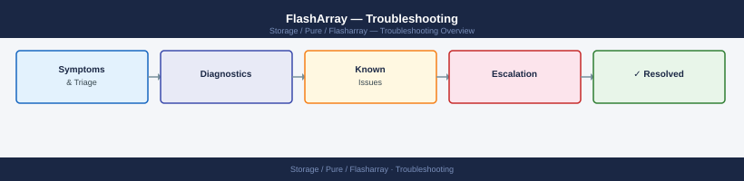

---
tags:
  - pure
  - troubleshooting
search:
  boost: 1.5
---
# FlashArray — Troubleshooting


<div class="kb-summary">
FlashArray — Troubleshooting navigation for Common Issues, Diagnostics, Escalation.

*Applies to: FlashArray Purity 6.x*
</div>



```text
FlashArray Triage Entry Points
  Alert type ──► purealert list
       │
       ├── Hardware ──► puredrive list / purehw list
       │                └── Open Pure support case if drive failed
       │
       ├── Connectivity ──► purehost list + pureport list
       │                    └── Check FC zoning / iSCSI network
       │
       ├── Replication ──► purepod list + purepod list --replicating
       │                   └── Check inter-array replication link
       │
       ├── Performance ──► purearray monitor / purevol monitor
       │                   └── Check QoS limits, check queue depth
       │
       └── Escalate ──► Pure1 diagnostics ──► Open support case
                        └── purediag --send (upload bundle to case)
```

<div class="kb-grid kb-grid-3">
<a class="kb-card" href="common-issues/"><strong>Common Issues</strong><span>Quick reference for common problems and resolutions.</span></a>
<a class="kb-card" href="diagnostics/"><strong>Diagnostics</strong><span>Diagnostic procedures and log analysis.</span></a>
<a class="kb-card" href="escalation/"><strong>Escalation</strong><span>Vendor escalation procedures and support contacts.</span></a>
</div>

