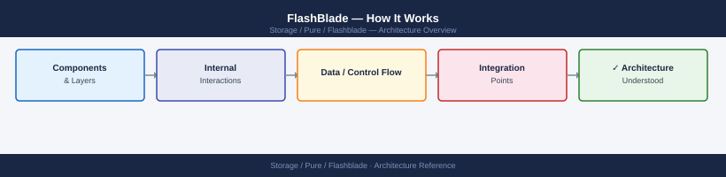
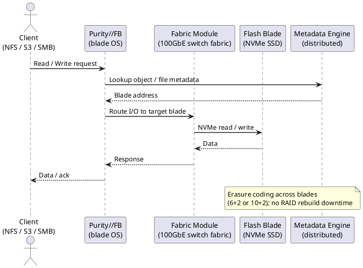
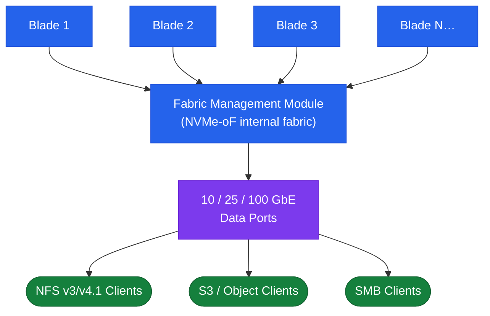

---
tags:
  - architecture
  - pure
---
# FlashBlade — How It Works

<div class="kb-summary">
How It Works reference covering Overview, Scale-Out Architecture, HA Topology, Connectivity, File Services and 3 more sections.

*Applies to: FlashBlade Purity//FB 4.x*
</div>




## Overview

Pure Storage FlashBlade is a scale-out all-flash storage platform running Purity//FB OS, purpose-built for unstructured data workloads: AI/ML training data, analytics, high-performance computing, backup repositories, and large-scale file storage. Unlike FlashArray's fixed dual-controller appliance, FlashBlade uses a disaggregated scale-out architecture where both compute and flash capacity scale together by adding blades to a chassis.

Each FlashBlade blade is an independent storage node containing its own NVMe flash and compute resources. The chassis hosts multiple blades plus Fabric Modules (FMs) that provide the high-speed internal interconnect. This delivers consistently high aggregate throughput regardless of access pattern — critical for GPU training jobs demanding tens of GB/s of sustained bandwidth.

FlashBlade serves NFS v3/v4.1, SMB 2/3, S3 object, and HDFS natively from a single platform without any protocol gateway.

## Scale-Out Architecture



## HA Topology

FlashBlade does not use a dual-controller model. High availability is achieved through blade-level and Fabric Module redundancy:

- **Blade redundancy:** Data is distributed (striped and replicated) across multiple blades; a single blade failure causes no data loss and only a proportional reduction in capacity and performance while the array rebalances.
- **Fabric Module redundancy:** Two FMs per chassis provide redundant internal connectivity; an FM failure does not interrupt data access.
- **Power and cooling:** Dual redundant power supplies and fan trays, each connected to separate PDUs.

**Failover behaviour for blade failure:**

1. Purity//FB detects the blade failure and marks it unavailable.
2. Data striped across the failed blade is reconstructed from parity/replicas on surviving blades.
3. Client access (NFS, SMB, S3, HDFS) continues uninterrupted — performance and capacity are reduced during rebuild.
4. Insert a replacement blade; Purity//FB automatically rebalances data across the new blade.

**Protocol service HA:** Each FlashBlade presents a virtual IP (VIP) per protocol service; VIPs float across blades automatically on blade failure. NFS and SMB clients reconnect automatically to the new VIP host; S3 clients require no reconfiguration.

## Connectivity

| Protocol | Standard | Notes |
|---|---|---|
| NFS v3 | NFSv3 over TCP/UDP | Widely supported; suitable for Linux clients and HPC workloads |
| NFS v4.1 | NFSv4.1 over TCP | Stateful; supports pNFS for parallel access; recommended for AI/ML |
| SMB 2.0 / 3.0 | SMB over TCP | Windows file sharing; SMB 3.0 supports encryption and multichannel |
| S3 (object) | S3-compatible REST API | Bucket/object model; compatible with AWS S3 SDK, Boto3, and most S3 clients |
| HDFS | HDFS-over-IP | Compatible with Hadoop/Spark workloads without a dedicated Hadoop cluster |

Network requirements: data interfaces 10 GbE minimum (25/100 GbE recommended for AI/ML); dedicated replication interface on separate VLAN; management on dedicated 1 GbE; MTU 9000 (jumbo frames) end-to-end for NFS and S3.

## File Services

FlashBlade provides NFS and SMB through managed filesystems.

```bash
purefb fs list                                     # list all filesystems
purefb fs list --all                               # includes destroyed

# Create an NFS filesystem
purefb fs create --name <fs_name> --size 10T --nfs-v3-enabled true --nfs-v4-1-enabled true

# Create an SMB filesystem
purefb fs create --name <fs_name> --size 10T --smb-enabled true

# Set NFS export rules
purefb fs update <fs_name> --nfs-rules "*(rw,no_root_squash)" --nfs-v4-1-enabled true

# Mount on client
mount -t nfs <FlashBlade_VIP>:/<fs_name> /mnt/<mountpoint>
mount -t nfs4 -o minorversion=1 <FlashBlade_VIP>:/<fs_name> /mnt/<mountpoint>

# Resize
purefb fs update <fs_name> --size 20T

# Destroy (recoverable 24 hours) / eradicate permanently
purefb fs destroy <fs_name>
purefb fs eradicate <fs_name>
```

## Object Services (S3)

FlashBlade provides S3-compatible object storage through accounts, buckets, and access keys.

```bash
purefb bucket list
purefb bucket create --name <bucket_name> --account <account_name>

purefb object-store-account create --name <account_name>
purefb object-store-user create --name <user_name> --account <account_name>
purefb object-store-access-key create --user <user_name>/<account_name>

# S3 client access
aws s3 ls --endpoint-url https://<flashblade_s3_vip>/
aws s3 cp local_file.txt s3://<bucket_name>/ --endpoint-url https://<flashblade_s3_vip>/
```

## Purity//FB Data Services

| Component | Description |
|---|---|
| Blades | Individual storage nodes; capacity and performance scale by adding blades |
| Fabric Modules (FM) | High-speed internal interconnect; redundant FMs provide fault tolerance |
| Purity//FB OS | Runs across all blades; manages data services including dedup, compression, snapshots, and replication |
| ActiveDR | Async replication for filesystems and object store to a remote FlashBlade for DR |
| ActiveCluster (FB) | Synchronous replication for filesystems between two FlashBlade arrays for RPO=0 (Purity//FB 4.x+) |
| SafeMode snapshots | Immutable, admin-delete-locked snapshots for ransomware protection |
| Pure1 | SaaS monitoring, capacity forecasting, upgrade scheduling, and AI analytics |

## Health Commands

```bash
purefb array list              # array status, Purity version
purefb blade list              # all blades with health state and capacity
purefb hardware list           # hardware components (FMs, PSUs, fans)
purefb alert list              # active alerts
purefb filesystem list         # filesystems with capacity usage
purefb bucket list             # S3 buckets
purefb snap list               # filesystem and object store snapshots
purefb replication list        # ActiveDR links and lag
purefb network interface list  # data and replication interface status
```

---

## See also

- [FlashBlade — Design Standards](../design-standards/)
- [FlashBlade — Integrations](../integrations/)
- [FlashBlade — Deploy](../deploy/)
