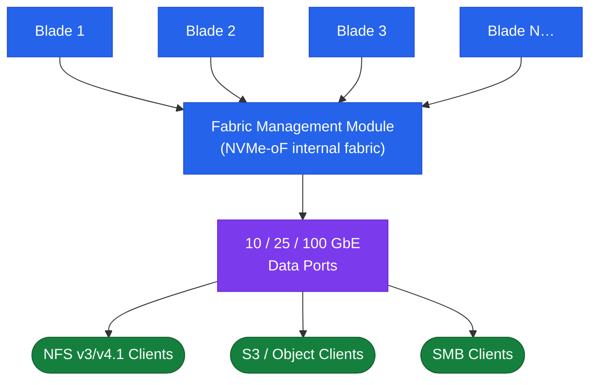

# FlashBlade — Overview

> Part of the [FlashBlade Architecture](../) reference.

---

## Overview

Pure Storage FlashBlade is a scale-out all-flash storage platform running Purity//FB OS, purpose-built for unstructured data workloads: AI/ML training data, analytics, high-performance computing, backup repositories, and large-scale file storage. The design philosophy differs fundamentally from FlashArray — rather than a fixed dual-controller appliance, FlashBlade is a disaggregated scale-out architecture where both compute and flash capacity scale together by adding blades to a chassis.

Each FlashBlade blade is an independent storage node containing its own NVMe flash and compute resources. The chassis hosts multiple blades plus Fabric Modules (FMs) that provide the high-speed internal interconnect. This architecture delivers consistently high aggregate throughput regardless of the access pattern — critical for workloads like GPU training jobs that demand tens of GB/s of sustained bandwidth.

FlashBlade serves multiple protocols natively from a single platform without any protocol gateway: NFS v3/v4.1, SMB 2/3, S3 object, and HDFS, all from the same filesystem or object store namespace.

## Scale-Out Blade Architecture

## HA Topology

FlashBlade does not use a dual-controller model. High availability is achieved through blade-level redundancy and Fabric Module redundancy within the chassis:

- **Blade redundancy:** Data is distributed (striped and replicated) across multiple blades within the chassis; a single blade failure causes no data loss and only a proportional reduction in capacity and performance while the array rebalances
- **Fabric Module redundancy:** Two FMs per chassis provide redundant internal connectivity; an FM failure does not interrupt access to data
- **Power and cooling:** Dual redundant power supplies and fan trays; each connects to separate PDUs

**Failover behaviour for blade failure:**

1. Purity//FB detects the blade failure and marks it as unavailable
2. Data striped across the failed blade is reconstructed from parity/replicas on surviving blades (similar to RAID rebuild)
3. Performance and capacity are reduced during rebuild; NFS, SMB, S3, and HDFS client access continues uninterrupted
4. Insert a replacement blade; Purity//FB automatically rebalances data across the new blade

**Protocol service HA:**

- Each FlashBlade presents a virtual IP (VIP) per protocol service; VIPs float across blades automatically if a blade fails
- NFS and SMB clients reconnect automatically to the new VIP host when their session reconnects
- S3 clients use the FlashBlade's S3 endpoint VIP; no client reconfiguration is needed on blade failure

## Connectivity

| Protocol | Standard | Notes |
|---|---|---|
| NFS v3 | NFSv3 over TCP/UDP | Widely supported; suitable for Linux clients and HPC workloads |
| NFS v4.1 | NFSv4.1 over TCP | Stateful; supports pNFS for parallel access from multiple clients; recommended for AI/ML |
| SMB 2.0 / 3.0 | SMB over TCP | Windows file sharing; SMB 3.0 supports encryption and multichannel |
| S3 (object) | S3-compatible REST API | Bucket/object model; compatible with AWS S3 SDK, Boto3, and most S3 clients |
| HDFS | HDFS-over-IP | Compatible with Hadoop/Spark workloads without a dedicated Hadoop cluster |

**Network requirements:**

- Data interfaces: 10 GbE minimum; 25 GbE or 100 GbE recommended for AI/ML and high-throughput workloads
- Replication interface: dedicated 10 GbE or 25 GbE interface on a separate VLAN for ActiveDR/ActiveCluster replication traffic
- Management interface: dedicated 1 GbE; accessible from admin hosts and Pure1 cloud
- Jumbo frames (MTU 9000) are recommended end-to-end for NFS and S3 data networks to maximise throughput
- Pure1 phone-home: outbound HTTPS (port 443) to `*.purestorage.com`

---

## In this section

<a class="kb-card" href="components/"><strong>Components</strong>Core components, services, and technical specifications.</a>
<a class="kb-card" href="integrations/"><strong>Integrations</strong>Integration with other platforms and external systems.</a>
<a class="kb-card" href="standards/"><strong>Standards</strong>Sizing guidelines, design standards, and best practices.</a>

