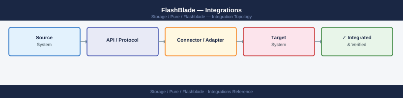

---
tags:
  - architecture
  - pure
---
# FlashBlade — Integrations


```sql

> Part of the [FlashBlade Architecture](index.md) reference.

---

## VMware Integration

FlashBlade integrates with VMware primarily as an NFS datastore and backup target — it is not a block storage device and does not use VMFS or vVols in the same way as FlashArray.

**NFS datastore for vSphere:**

- Mount FlashBlade filesystems as NFSv3 or NFSv4.1 datastores in vCenter
- NFSv4.1 is recommended for vSphere 7.x/8.x — enables Kerberos authentication and improved locking semantics
- Create a dedicated filesystem per datastore type (e.g., `prod-vsphere-vmstore`, `prod-vsphere-templates`)
- Set NFS export policies to restrict access to the ESXi management IP range only

**vSphere integration steps:**

1. Create a FlashBlade filesystem for the datastore: `purefb filesystem create --nfs --nfs-rules '<subnet>(rw,root_squash)' prod-vsphere-vmstore`
2. In vCenter, add a new NFS datastore pointing to the FlashBlade data VIP and the export path
3. Mount the datastore on all ESXi hosts in the cluster using vCenter's storage configuration wizard
4. Configure VAAI (vStorage APIs for Array Integration) — FlashBlade supports NAS VAAI for hardware-accelerated copy offload

**Backup target for Veeam:**

- Use a dedicated FlashBlade filesystem as a Veeam NFS backup repository
- FlashBlade's Rapid Restore integration with Veeam provides backup-from-snapshot and instant recovery capabilities — see Backup Integration below

## Backup Integration

**Veeam Backup & Replication:**

- Add FlashBlade as an NFS share repository in Veeam: `Backup Infrastructure > Backup Repositories > Add Repository > Network Attached Storage > NFS Share`
- For Veeam Rapid Restore (FlashBlade native integration): install the Pure Storage Veeam Plugin; configure FlashBlade as a snapshot-enabled repository
- Veeam uses FlashBlade snapshot APIs to create instant, consistent snapshots before backup starts — backup reads from the snapshot, not live data, so production filesystem performance is not impacted
- Use a dedicated filesystem per Veeam backup tier (daily, weekly, monthly) to simplify retention management

**Commvault:**

- Configure FlashBlade as an NFS media agent library in Commvault
- Commvault IntelliSnap integrates with FlashBlade via the REST API to orchestrate snapshot-based backups
- FlashBlade snapshots are used as the backup source, avoiding impact to live production filesystems

**Veritas NetBackup:**

- Add FlashBlade NFS exports as disk storage units in NetBackup
- NetBackup Snapshot Client can orchestrate FlashBlade filesystem snapshots via the FlashBlade REST API

**General backup best practices:**

- Dedicate separate filesystems per backup application and tier
- Set filesystem capacity limits to match backup retention design
- Enable per-filesystem snapshot schedules as an additional recovery layer
- Use NFS export IP restrictions to limit backup server access to the backup filesystem only

## Pure1 Monitoring

FlashBlade phones home to Pure1 automatically over HTTPS once registered.

**Phone-home requirements:**

- Outbound HTTPS (port 443) from the FlashBlade management interface to `*.purestorage.com`
- If a proxy is required: configure via the FlashBlade GUI under System > Support

**Pure1 capabilities for FlashBlade:**

- Fleet health dashboard including blade status, hardware faults, and capacity forecasting
- Throughput and latency analytics per filesystem and per protocol (NFS, SMB, S3)
- Replication lag monitoring for ActiveDR links
- Upgrade readiness reports and prescriptive upgrade paths
- AI-driven anomaly detection for capacity and performance trends

**Verify phone-home status:**

```

```bash
purefb array list --phonehome
```

```text title="Expected output"
Name                          Status    Phonehome  Model          Version
flashblade-prod-01            Online    Enabled    FB20012        4.10.5
flashblade-dr-02              Online    Enabled    FB60012        4.10.5
flashblade-test-03            Offline   Disabled   FB20012        4.9.8
flashblade-backup-04          Online    Enabled    FB60012        4.10.5
```

!!! warning "Common errors"
    **`Error: Invalid credentials or unable to connect to management IP`** — Verify the FlashBlade management IP is reachable and your API token is valid via `purefb list --help` to confirm authentication setup.
    **`Error: Command 'purefb' not found`** — Install the Pure Storage Python SDK with `pip install purestorage` and ensure it is in your system PATH.
```bash
## Log in and obtain a session token
curl -s -k -X POST "https://<fb_ip>/api/login" \
  -H "Content-Type: application/json" \
  -d '{"username":"pureuser","password":"<password>"}' \
  -c /tmp/fb_cookies.txt

## Use the session cookie for subsequent requests
curl -s -k -X GET "https://<fb_ip>/api/2.x/arrays" \
  -b /tmp/fb_cookies.txt | jq .

## Alternatively, use an API token (preferred for automation)
curl -s -k -X GET "https://<fb_ip>/api/2.x/arrays" \
  -H "x-auth-token: <api_token>" | jq .
```

```text title="Expected output"
{
  "items": [
    {
      "id": "5483e4f8-1234-5678-abcd-ef1234567890",
      "name": "flashblade-prod-01",
      "status": "healthy",
      "version": "4.2.1",
      "capacity": {
        "total": 107374182400,
        "used": 42949672960
      }
    }
  ],
  "continuation_token": null
}
```

!!! warning "Common errors"
    **`curl: (60) SSL certificate problem: self signed certificate`** — Add `-k` flag to curl command to skip SSL verification (already present in examples, but ensure it's not removed).
    **`jq: parse error: Invalid JSON text at line 1`** — Verify the API endpoint is correct and the authentication token/cookie is valid; test with `curl -s -k -X GET "https://<fb_ip>/api/2.x/arrays" -H "x-auth-token: <api_token>"` without piping to jq first.
    **`curl: (401) Unauthorized`** — Confirm the API token or username/password credentials are correct and the user has sufficient permissions on the FlashBlade system.
```bash
## On the array CLI
purefb admin apitoken create <username>
```

```text title="Expected output"
API Token created for user 'admin'
Token: 2b813e4a-7f2c-4d91-b8e3-9c1a5f7d2e6b
Expires: 2025-12-31T23:59:59Z
```

!!! warning "Common errors"
    **`Error: User '<username>' does not exist`** — Verify the username exists on the array with `purefb admin list` before creating a token.
    **`Error: API token limit reached for user`** — Delete an existing token with `purefb admin apitoken delete <username> --token=<token_id>` before creating a new one.
```bash
## Get array status and version
GET /api/2.x/arrays

## List all filesystems with space usage
GET /api/2.x/file-systems?space=true

## List all blades and health
GET /api/2.x/blades

## List all active alerts
GET /api/2.x/alerts?filter=state%3D%27unflagged%27

## List S3 buckets
GET /api/2.x/buckets

## List replication relationships
GET /api/2.x/array-connections
```


```text title="Expected output"
GET /api/2.x/arrays
{
  "items": [
    {
      "id": "0b2a3c4d-5e6f-7a8b-9c0d-1e2f3a4b5c6d",
      "name": "flashblade-prod-01",
      "version": "4.2.1",
      "status": "healthy",
      "capacity": 107374182400,
      "used": 53687091200
    }
  ]
}

GET /api/2.x/file-systems?space=true
{
  "items": [
    {
      "name": "data-tier-1",
      "provisioned": 10995116277760,
      "used": 5497558138880,
      "available": 5497558138880
    },
    {
      "name": "archive-fs",
      "provisioned": 5497558138880,
      "used": 2748779069440,
      "available": 2748779069440
    }
  ]
}

GET /api/2.x/blades
{
  "items": [
    {"name": "blade-1", "status": "healthy", "model": "FB20-4U"},
    {"name": "blade-2", "status": "healthy", "model": "FB20-4U"},
    {"name": "blade-3", "status": "healthy", "model": "FB20-4U"}
  ]
}

GET /api/2.x/alerts?filter=state%3D%27unflagged%27
{
  "items": [
    {
      "id": "alert-8472",
      "severity": "warning",
      "message": "Blade-2 temperature elevated",
      "created": "2024-01-15T09:23:45Z"
    }
  ]
}

GET /api/2.x/buckets
{
  "items": [
    {"name": "backup-bucket", "versioning": "enabled"},
    {"name": "archive-bucket", "versioning": "disabled"}
  ]
}

GET /api/2.x/array-connections
{
  "items": [
    {
      "id": "repl-001",
      "local_array": "flashblade-prod-01",
      "remote_array": "flashblade-dr-02",
      "status": "synced"
    }
  ]
}
```

!!! warning "Common errors"
    **`401 Unauthorized`** — Verify API token is valid and included in the Authorization header with format `Authorization: Bearer <token>`.
    **`404 Not Found`** — Confirm the FlashBlade API version matches your array version; use `/api/2.x/` for 4.x firmware or adjust the endpoint path accordingly.
---

## See also

- [FlashBlade — How It Works](../how-it-works/)
- [FlashBlade — Design Standards](../design-standards/)
