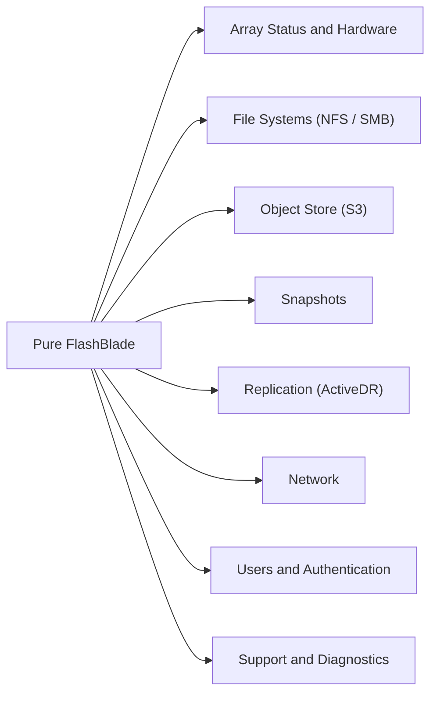

# Pure FlashBlade CLI Reference

Commonly used `purefb` commands for managing Pure Storage FlashBlade arrays. FlashBlade is a scale-out NAS and object storage platform — it serves NFS and SMB file shares as well as S3-compatible object storage.

> Connect via SSH to the FlashBlade management IP, or use `purefb` from a host with the CLI installed and configured.



---


<div class="kb-grid kb-grid-1">

<a class="kb-card" href="array-hardware/">
  <strong>Array Hardware</strong>
  <span>Array Hardware notes, checks, commands, and references.</span>
</a>

<a class="kb-card" href="file-systems/">
  <strong>File Systems</strong>
  <span>File Systems notes, checks, commands, and references.</span>
</a>

<a class="kb-card" href="snapshots/">
  <strong>Snapshots</strong>
  <span>Snapshots notes, checks, commands, and references.</span>
</a>

</div>
## Array Status & Hardware

These commands show you the overall state of the FlashBlade — capacity usage, blade health, and active alerts. Start here when checking system health.

### Array Status & Identity

```bash
# Array info — model, version, capacity
purefb array show
purefb array show --version

# Hardware status overview
purefb hardware show
purefb hardware show --blades
purefb hardware show --chassis

# Active alerts
purefb alert show
purefb alert show --filter "state='open'"

# Capacity usage
purefb array show --space
purefb filesystem show --space
```

### Blades & Hardware

```bash
# Blade status (each blade is a combined compute+flash module)
purefb blade show
purefb blade show --id <blade_id>

# Drive health
purefb drive show
purefb drive show --blade <blade_id>

# Chassis
purefb chassis show
```

---

## File Systems (NFS / SMB)

File systems are the NAS shares on a FlashBlade. You create a file system, set its size, and enable NFS or SMB access (or both). NFS rules control which client IPs can mount, and what read/write permissions they get.

### List File Systems

```bash
purefb filesystem show
purefb filesystem show --name <name>
purefb filesystem show --all    # includes destroyed
```

### Create a File System

```bash
# NFS file system with export rules
purefb filesystem create \
    --name <name> \
    --size 10T \
    --nfs \
    --nfs-rules "*(rw,no_root_squash)"

# SMB file system
purefb filesystem create --name <name> --size 10T --smb

# Both NFS and SMB
purefb filesystem create \
    --name <name> \
    --size 10T \
    --nfs --nfs-rules "*(rw,no_root_squash)" \
    --smb
```

### Resize a File System

```bash
purefb filesystem update --name <name> --size 20T
```

### Update NFS Export Rules

```bash
# Restrict to specific network
purefb filesystem update \
    --name <name> \
    --nfs-rules "<ip_cidr>(rw,no_root_squash)"

# Multiple rules
purefb filesystem update \
    --name <name> \
    --nfs-rules "10.0.1.0/24(rw,no_root_squash):10.0.2.0/24(ro)"
```

### SMB Shares

```bash
# List SMB shares
purefb smb-share show

# Create an SMB share
purefb smb-share create --name <share_name> --filesystem <fs_name>

# Delete an SMB share
purefb smb-share destroy --name <share_name>
```

### Destroy and Eradicate

```bash
# Destroy (recoverable for 24 hours)
purefb filesystem destroy --name <name>

# Permanently eradicate
purefb filesystem eradicate --name <name>

# Recover a destroyed file system
purefb filesystem recover --name <name>
```

### Common Issues

| Issue | Check | Action |
|---|---|---|
| NFS mount refused | Export rules | Verify client IP is in NFS rules |
| SMB share not visible | SMB enabled | Ensure `--smb` flag was used at create |
| File system full | Capacity | `purefb filesystem update --size` |
| Cannot destroy | NFS mounts active | Unmount all clients first |

---

## Object Store (S3)

FlashBlade serves S3-compatible object storage. Buckets hold objects (files), accounts group users, and access keys authenticate S3 API calls. This is used by applications that need cloud-style object storage on-premises.

### Buckets

```bash
# List buckets
purefb bucket list
purefb bucket list --all          # includes destroyed

# Create a bucket
purefb bucket create --name <bucket> --account <account>

# Destroy a bucket (must be empty)
purefb bucket destroy --name <bucket>

# Eradicate permanently
purefb bucket eradicate --name <bucket>
```

### Accounts and Users

```bash
# List object store accounts (tenants)
purefb object-store-account list

# Create an account
purefb object-store-account create --name <account>

# List users
purefb object-store-user list

# Create a user under an account
purefb object-store-user create --name <user> --account <account>

# Destroy a user
purefb object-store-user destroy --name <user> --account <account>
```

### Access Keys

```bash
# List all access keys
purefb object-store-access-key list

# Create an access key for a user
purefb object-store-access-key create --user <user>/<account>

# Delete an access key
purefb object-store-access-key destroy --name <key_id>
```

> The secret access key is only shown at creation time — store it securely immediately.

### S3 Endpoint

```bash
# Show S3 service endpoint
purefb array | grep s3

# Test S3 connectivity
aws s3 ls --endpoint-url https://<flashblade_s3_vip>/
```

### Bucket Replication

```bash
# List bucket replica links
purefb bucket-replica-link list

# Create a replica link to a remote FlashBlade
purefb bucket-replica-link create \
    --local-bucket <local_bucket> \
    --remote-bucket <remote_bucket> \
    --remote <remote_array_name>
```

---

## Snapshots

Snapshots are instant, space-efficient point-in-time copies of file systems. They are read-only and accessible via the `.snapshot` directory inside any NFS export — you can restore individual files without a full restore.

### List Snapshots

```bash
purefb snapshot show
purefb snapshot show --source <filesystem_name>
purefb snapshot show --name <snapshot_name>
```

### Create a Snapshot

```bash
# Manual snapshot of a file system
purefb snapshot create \
    --source <filesystem_name> \
    --name <snapshot_name>

# Pre-change snapshot example
purefb snapshot create --source prod-nfs --name pre-maint-20260506
```

### Restore from Snapshot

Restore creates a new file system from a snapshot (non-destructive — original snapshot preserved):

```bash
# Restore (copy) a snapshot to a new file system
purefb snapshot copy \
    --name <snapshot_name> \
    --target <new_filesystem_name>
```

### Destroy and Eradicate

```bash
# Step 1 — destroy (moves to pending eradication)
purefb snapshot destroy --name <snapshot_name>

# Step 2 — eradicate (permanently deletes — 24-hour hold by default)
purefb snapshot eradicate --name <snapshot_name>

# List pending eradication items
purefb snapshot show --pending-only
```

### Scheduled Snapshot Policies

```bash
# List snapshot policies
purefb snapshot-rule show

# Create a snapshot policy
purefb snapshot-rule create \
    --name <rule_name> \
    --keep-for 7d

# Attach a policy to a file system
purefb fs-snapshot-rule create \
    --filesystem <fs_name> \
    --rule <rule_name>
```

### Accessing Snapshots via NFS

```bash
# Snapshots are visible in the .snapshot directory on the NFS mount
ls /mnt/nfs_export/.snapshot/

# Restore a file from snapshot
cp /mnt/nfs_export/.snapshot/<snapshot_name>/path/to/file /mnt/nfs_export/path/to/file
```

---

## Replication (ActiveDR)

FlashBlade supports asynchronous snapshot-based replication and ActiveDR (near-synchronous) for file systems. Replication creates a linked copy on a remote FlashBlade that stays in sync — used for disaster recovery.

### Remote Array (Replication Target)

```bash
# List configured remote arrays
purefb remote-array show

# Add a replication target
purefb remote-array create \
    --name <target_name> \
    --management-address <target_management_ip>
```

### File System Replica Links

```bash
# List all replica links
purefb fs-replica-link show

# Detailed view — state, lag, direction
purefb fs-replica-link show --detailed

# Create a replica link
purefb fs-replica-link create \
    --local-filesystem <local_fs_name> \
    --remote-filesystem <remote_fs_name> \
    --remote-array <target_name>
```

### Replication Status

| Status | Meaning |
|---|---|
| `replicating` | Data actively syncing |
| `idle` | Up to date — no new changes |
| `paused` | Manually suspended |
| `broken` | Link failed — investigate |

### Pause and Resume

```bash
# Pause replication
purefb fs-replica-link update \
    --paused true \
    --local-filesystem <fs_name> \
    --remote-filesystem <remote_fs_name> \
    --remote-array <target_name>

# Resume replication
purefb fs-replica-link update \
    --paused false \
    --local-filesystem <fs_name> \
    --remote-filesystem <remote_fs_name> \
    --remote-array <target_name>

# Delete a replica link
purefb fs-replica-link delete \
    --local-filesystem <fs_name> \
    --remote-filesystem <remote_fs_name> \
    --remote-array <target_name>

# Monitor lag
purefb fs-replica-link show --detailed | grep -i lag
```

### Object Store Replication (Buckets)

```bash
purefb os-replica-link show

purefb os-replica-link create \
    --local-bucket <bucket_name> \
    --remote-bucket <remote_bucket_name> \
    --remote-array <target_name>
```

---

## Network

FlashBlade networking includes data interfaces for NFS/SMB/S3 traffic and VIPs (Virtual IPs) that float between blades for high availability. VIPs are what clients actually connect to.

### Network Interfaces

```bash
# List all interfaces (data, management, replication)
purefb network-interface show
purefb network-interface show --name <if_name>
purefb network-interface show | grep -E "Name|Speed|State|Address"
```

### Subnets

```bash
purefb subnet show

purefb subnet create \
    --name <subnet_name> \
    --prefix <cidr> \
    --gateway <gateway_ip>

purefb subnet delete --name <subnet_name>
```

### DNS and NTP

```bash
# DNS
purefb dns show
purefb dns update --nameservers <ns1_ip>,<ns2_ip>
purefb dns update --search <search_domain>

# NTP
purefb ntp show
purefb ntp update --ntpservers <ntp1_ip>,<ntp2_ip>
```

### VIPs (Virtual IPs) for NFS/SMB

VIPs are what NFS/SMB clients mount — they float between blades for availability:

```bash
# List VIPs
purefb vip show

# Create a VIP
purefb vip create \
    --name <vip_name> \
    --address <vip_ip> \
    --subnet <subnet_name> \
    --services <nfs,smb>
```

### Static Routes

```bash
purefb static-route show

purefb static-route create \
    --address <destination_cidr> \
    --gateway <gateway_ip>
```

### Network Troubleshooting

```bash
# Interface errors and statistics
purefb network-interface show --detailed | grep -i error

# Ping from FlashBlade
purefb ping --to <destination_ip>

# DNS resolution test
purefb dns-lookup --name <hostname>
```

| Issue | Check | Command |
|---|---|---|
| NFS mount fails | VIP exists and reachable? | `purefb vip show` |
| DNS not resolving | DNS servers configured? | `purefb dns show` |
| Interface down | Physical link? | `purefb network-interface show` |
| Replication not connecting | Remote array management IP reachable? | `purefb remote-array show` |

---

## Users & Authentication

These commands manage admin users, API clients, and directory service (LDAP/AD) integration. API clients are used for automation and REST API access.

### Local Admin Users

```bash
purefb admin show

purefb admin create --name <username> --role array_admin

purefb admin update --name <username> --password <new_password>

purefb admin delete --name <username>
```

### Roles

| Role | Permissions |
|---|---|
| `array_admin` | Full administrative access |
| `readonly` | Read-only — view configuration and stats |
| `ops_admin` | Operational access (not configuration) |

### API Clients

```bash
# List API clients / tokens
purefb api-client show

# Create an API client
purefb api-client create \
    --name <client_name> \
    --role array_admin

# Delete an API client
purefb api-client delete --name <client_name>

# Generate a new API token for a user
purefb admin apitoken create --name <username>
```

### Directory Services (LDAP / Active Directory)

```bash
purefb directory-service show

purefb directory-service update \
    --enabled true \
    --uri "ldap://ldap.corp.local" \
    --base-dn "DC=corp,DC=local" \
    --bind-user "CN=svcldap,OU=ServiceAccounts,DC=corp,DC=local" \
    --bind-password <password>

purefb directory-service test
```

### Audit Log

```bash
purefb audit show
purefb audit export
```

---

## Support & Diagnostics

These commands manage the array's connection to Pure Support — phonehome sends diagnostic data automatically, and you can manually collect logs for support cases.

```bash
# View phone home status
purefb phonehome show

# Send a phone home bundle manually
purefb phonehome send --type auto

# Test phonehome connectivity only
purefb phonehome send --type test

# View remote support configuration
purefb support show

# Enable / disable remote support
purefb support update --enabled true
purefb support update --enabled false

# Export logs for TAC support cases
purefb support log export

# Current Purity//FB version
purefb array show | grep -i version

# Available software upgrades
purefb software show
```

### Alerts

```bash
purefb alert show
purefb alert show --all
purefb alert update --id <alert_id> --status closed
```

### Common Support Scenarios

| Issue | First Step | Command |
|---|---|---|
| System alert | Check alert detail | `purefb alert show` |
| Blade failure | Check blade health | `purefb blade show --detailed` |
| Replication issue | Check replica link state | `purefb fs-replica-link show --detailed` |
| Capacity concern | Check capacity | `purefb array show` |
| Phone home not working | Check connectivity | `purefb support show` |
```
