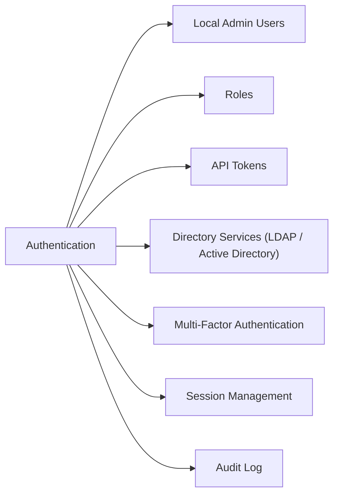

# Users & Authentication

> Part of the [Pure FlashBlade CLI Reference](../).



## Local Admin Users

```bash
# List all local admin users
purefb admin show

# Create a local user
purefb admin create --name <username> --role array_admin

# Set password
purefb admin update --name <username> --password <new_password>

# Delete a user
purefb admin delete --name <username>
```

## Roles

| Role | Permissions |
|---|---|
| `array_admin` | Full administrative access |
| `readonly` | Read-only — view configuration and stats |
| `ops_admin` | Operational access (not configuration) |

## API Tokens

API tokens are used for automation and integration (Pure1, scripts, REST API):

```bash
# List API clients / tokens
purefb api-client show

# Create an API client
purefb api-client create \
    --name <client_name> \
    --role array_admin

# Delete an API client
purefb api-client delete --name <client_name>

# Generate a new API token for a user
purefb admin apitoken create --name <username>
```

## Directory Services (LDAP / Active Directory)

```bash
# View directory service configuration
purefb directory-service show

# Configure LDAP/AD authentication
purefb directory-service update \
    --enabled true \
    --uri "ldap://ldap.corp.local" \
    --base-dn "DC=corp,DC=local" \
    --bind-user "CN=svcldap,OU=ServiceAccounts,DC=corp,DC=local" \
    --bind-password <password>

# Test directory service connectivity
purefb directory-service test
```

## Multi-Factor Authentication

```bash
# MFA configuration
purefb mfa show

# Require MFA for all admin logins
purefb mfa update --enabled true
```

## Session Management

```bash
# Active admin sessions
purefb admin show --sessions

# Logout all sessions for a user (emergency)
purefb admin invalidate-sessions --name <username>
```

## Audit Log

```bash
# View admin audit log (login, config changes)
purefb audit show

# Export audit log
purefb audit export
```
