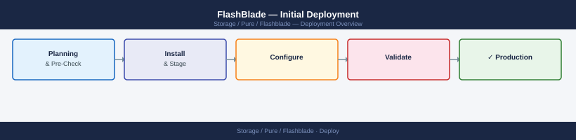
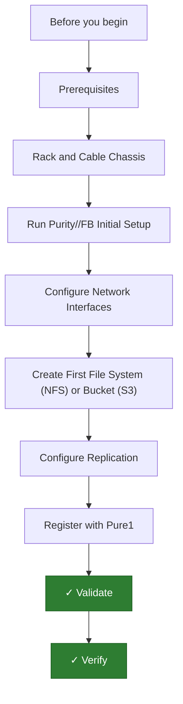

---
tags:
  - deployment
  - pure
search:
  boost: 1.5
---

## Before you begin

- **Access:** admin credentials for the target system and any upstream dependencies (DNS, NTP, vCenter, directory services)
- **Timing:** safe to run during a scheduled maintenance window; allow 1-2 hours for initial deployment
- **Dependencies:** network connectivity verified; DNS resolvable; NTP configured; any licence keys available
- **Logging:** record every IP address, hostname, and credential set assigned during this deployment

---

# FlashBlade — Initial Deployment



This guide covers deploying a Pure Storage FlashBlade (//S or //E series) from physical installation through validated NFS or S3 access. All steps apply to Purity//FB 4.x and later.

---




## Prerequisites

**Hardware:**

- FlashBlade chassis (4U) with blade modules pre-installed (Pure typically ships blades installed in the chassis)
- Chassis management module with dual management ports
- 100GbE data network switches with sufficient ports for all chassis network interface cards (NICs)
- OOB management switch for chassis management interface connectivity
- PDU circuits — FlashBlade uses dual redundant power supplies per chassis shelf

**Network planning:**

| Component                 | IP / Interface |
|---------------------------|----------------|
| Chassis management IP     | 10.0.0.60      |
| Data VIF (NFS/S3)         | 192.168.20.100 |
| Replication VIF           | 10.0.20.60     |

**Software and accounts:**

- Purity//FB 4.x (pre-installed at factory)
- Pure1 account for monitoring
- NFS client tools on hosts (`nfs-utils` on Linux)
- S3 client (AWS CLI or `s3cmd`) if object storage access is needed
- NTP server accessible from management network (critical — S3 authentication depends on accurate time)

---

## Rack and Cable Chassis

1. Mount the FlashBlade chassis into the rack using the provided rails. The chassis is 4U and weighs approximately 80 kg fully loaded with blades — use a mechanical lift.
2. If additional expansion chassis are included, rack them directly adjacent to the primary chassis and connect the chassis management link cables between primary and expansion.
3. Connect dual PDU power cables from each power shelf — use separate circuit feeds for A and B power shelves.
4. Connect chassis management port 0 and port 1 to the OOB management switch. Both ports carry management traffic — connect both for redundancy.
5. Connect the 100GbE data ports from each blade's front-facing NIC to the 100GbE data switches. Each blade has two 100GbE ports; connect both to separate data switches for redundancy.
6. Power on the chassis by pressing the power button on the front panel of the chassis management module. Blades power on automatically. Full boot takes 20–30 minutes.

---

## Run Purity//FB Initial Setup

**Locate the chassis on the network:**

The chassis management interface acquires a DHCP address on first boot. Check your DHCP server for the lease or use the chassis management module's LCD panel to read the assigned IP.

**Connect to the CLI:**

```bash
ssh pureuser@<dhcp_assigned_ip>
```

**Run the setup wizard:**

```bash
purity setup
```

The wizard prompts for:

1. **System name:** Enter the array name (e.g., `fb-prod-01`). This appears in Pure1 and alert notifications.
2. **Management interface IP:** Enter a static management IP.
3. **Management gateway:** Enter the management network gateway.
4. **DNS server:** Enter primary DNS IP.
5. **NTP server:** Enter the NTP server address — time accuracy is required for S3 API signature validation.
6. **Admin password:** Set the initial admin password.

The setup script applies the configuration and reconnects management at the new static IP.

**Verify blade health:**

```bash
purehw list
# All blades (BL1, BL2, BL3, etc.) should show Status: healthy
# NICs should show Status: healthy
```

---

## Configure Network Interfaces

FlashBlade uses Virtual IP (VIP) interfaces that float between blades for high availability. Each VIP is called a VIF (Virtual Interface).

**Create a data VIF for NFS and S3 access:**

```bash
# Create a subnet (defines the data network segment)
purenetwork subnet create --name data_subnet --prefix 192.168.20.0/24 --gateway 192.168.20.1 --vlan 200 --mtu 9000

# Create a data VIF on the subnet
purenetwork vif create --name data_vif01 --address 192.168.20.100 --subnet data_subnet --enabled true
```

**Verify the VIF is online:**

```bash
purenetwork vif list
# Status should show "online"
purenetwork vif show --name data_vif01
```

**Create a replication VIF (if replication is planned):**

```bash
purenetwork subnet create --name repl_subnet --prefix 10.0.20.0/24 --gateway 10.0.20.1
purenetwork vif create --name repl_vif01 --address 10.0.20.60 --subnet repl_subnet --services replication --enabled true
```

**Test connectivity:**

```bash
purenetwork vif ping --name data_vif01 --destination <gateway_ip>
# Should show successful ping responses
```

---

## Create First File System (NFS) or Bucket (S3)

**Create an NFS file system:**

```bash
# Create the file system
purefs create --name nfs_share01 --size 10T

# Create an NFS export (export a directory within the file system)
purenfs rule add --policy global --client '*' --access rw,root-squash,secure --version nfsv3:nfsv4.1 nfs_share01
```

Verify the export:

```bash
purenfs list
# nfs_share01 should appear with status Enabled
```

Mount from a Linux client:

```bash
mount -t nfs -o vers=3,rw 192.168.20.100:/nfs_share01 /mnt/flashblade_nfs
df -h /mnt/flashblade_nfs
touch /mnt/flashblade_nfs/test_write
ls -la /mnt/flashblade_nfs/
```

**Create an S3 bucket:**

1. First, create an object store account and access credentials:

```bash
# Create an object store account
purearray objectstore account create --name prod_s3_account

# Create a user within the account
purearray objectstore account user create --account prod_s3_account --name s3_admin

# Create access keys for the user
purearray objectstore account user access-key create --account prod_s3_account --name s3_admin
# Record the access key ID and secret access key shown in the output
```

2. Create a bucket:

```bash
purefs create --name s3_bucket01 --size 50T
pures3 bucket create --account prod_s3_account s3_bucket01
```

3. Test S3 access:

```bash
# Configure AWS CLI with FlashBlade credentials
aws configure --profile flashblade
# Enter: Access Key ID, Secret Access Key, region (use us-east-1 or any placeholder), output format: json

# Test bucket access
aws s3 ls --endpoint-url https://192.168.20.100 --no-verify-ssl --profile flashblade
aws s3 cp /etc/hosts s3://s3_bucket01/test_upload --endpoint-url https://192.168.20.100 --no-verify-ssl --profile flashblade
```

---

## Configure Replication

FlashBlade supports file system replication to another FlashBlade for DR using replication policies.

**Configure array peering (run on source FlashBlade):**

```bash
purearray peer propose --name fb-dr --management-address <dr_flashblade_mgmt_ip>
# Record the pre-shared key shown

# On the DR FlashBlade, accept the peer:
purearray peer accept --name fb-prod --management-address <prod_flashblade_mgmt_ip> --pre-shared-key <key>
```

**Create a replication policy on the source:**

```bash
# Create a replication policy (defines schedule)
purepolicy replication create --name replicate_hourly --every 3600 --keep-for 86400

# Create a replication target (points to the remote FlashBlade's replication VIF)
purearray replicationtarget create --name fb-dr --address 10.0.20.70 --type remote

# Apply the policy to a file system
purepolicy replication add --policy replicate_hourly --filsystem nfs_share01
```

**Monitor replication:**

```bash
purepolicy replication monitor
# Shows replication status, lag, and bytes transferred
```

---

## Register with Pure1

1. From the Purity//FB CLI:

```bash
puresupport phonehome enable
puresupport phonehome test
# Should return: "Test phonehome succeeded"
```

2. Log in to `https://pure1.purestorage.com`.
3. The FlashBlade appears in the **Arrays** list within 30 minutes of enabling Phone Home.
4. Navigate to **Alerts** and add an email notification recipient.
5. Review the **Capacity** tab — verify used and available capacity match what you provisioned.

---

## Validate

1. Verify all hardware components are healthy:

```bash
purehw list
# All blades, NICs, and power supplies should show Status: healthy
```

2. Confirm NFS mount is accessible and performing:

```bash
# From a client:
mount | grep flashblade
dd if=/dev/zero of=/mnt/flashblade_nfs/throughput_test bs=1M count=10240 oflag=direct
# Throughput should reflect ordered blade count (FlashBlade//S200: ~135 GB/s at scale)
```

3. Confirm S3 bucket operations are working:

```bash
aws s3 ls s3://s3_bucket01 --endpoint-url https://192.168.20.100 --no-verify-ssl --profile flashblade
```

4. Verify replication is running:

```bash
purepolicy replication list
# Policy should show status "active"
```

5. In Pure1, confirm the FlashBlade shows no active critical alerts and Phone Home status is **Connected**.

---

## Verify

- **Cluster health:** all nodes show online in the management UI
- **Volume access:** mount a test LUN/NFS export from a host and confirm read/write
- **Replication:** confirm replication partner shows last-sync within RPO window

---

## See also

- [Flashblade — Procedures](../operations/procedures/)
- [Flashblade — Common Issues](../troubleshooting/common-issues/)
- [Flashblade — How It Works](../architecture/how-it-works/)
