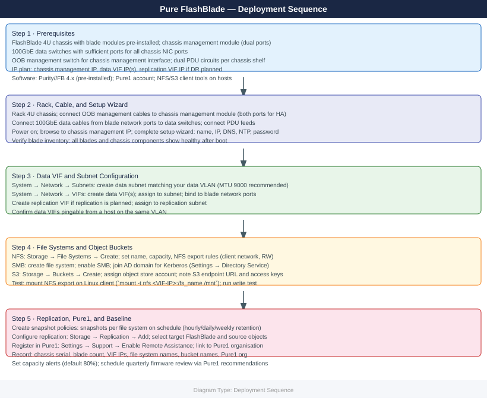

---
tags:
  - deployment
  - pure
search:
  boost: 1.5
---

```d2
direction: right

plan: "Plan" {shape: oval}
prerequisites: "Prerequisites" {shape: rectangle}
rack_and_cable_chassis: "Rack and Cable Chassis" {shape: rectangle}
run_purityfb_initial_setup: "Run Purity//FB Initial Setup" {shape: rectangle}
configure_network_interfaces: "Configure Network Interfaces" {shape: rectangle}
create_first_file_system_nfs_or_buck: "Create First File System (NFS) or Bucket (S3)" {shape: rectangle}
configure_replication: "Configure Replication" {shape: rectangle}
validate: "Validate" {shape: oval}

plan -> prerequisites
prerequisites -> rack_and_cable_chassis
rack_and_cable_chassis -> run_purityfb_initial_setup
run_purityfb_initial_setup -> configure_network_interfaces
configure_network_interfaces -> create_first_file_system_nfs_or_buck
create_first_file_system_nfs_or_buck -> configure_replication
configure_replication -> validate
```

## Before you begin

- **Access:** admin credentials for the target system and any upstream dependencies (DNS, NTP, vCenter, directory services)
- **Timing:** safe to run during a scheduled maintenance window; allow 1-2 hours for initial deployment
- **Dependencies:** network connectivity verified; DNS resolvable; NTP configured; any licence keys available
- **Logging:** record every IP address, hostname, and credential set assigned during this deployment

---

# FlashBlade — Initial Deployment



This guide covers deploying a Pure Storage FlashBlade (//S or //E series) from physical installation through validated NFS or S3 access. All steps apply to Purity//FB 4.x and later.

---

## Prerequisites

**Hardware:**

- FlashBlade chassis (4U) with blade modules pre-installed (Pure typically ships blades installed in the chassis)
- Chassis management module with dual management ports
- 100GbE data network switches with sufficient ports for all chassis network interface cards (NICs)
- OOB management switch for chassis management interface connectivity
- PDU circuits — FlashBlade uses dual redundant power supplies per chassis shelf

**Network planning:**

| Component                 | IP / Interface |
|---------------------------|----------------|
| Chassis management IP     | 10.0.0.60      |
| Data VIF (NFS/S3)         | 192.168.20.100 |
| Replication VIF           | 10.0.20.60     |

**Software and accounts:**

- Purity//FB 4.x (pre-installed at factory)
- Pure1 account for monitoring
- NFS client tools on hosts (`nfs-utils` on Linux)
- S3 client (AWS CLI or `s3cmd`) if object storage access is needed
- NTP server accessible from management network (critical — S3 authentication depends on accurate time)

---

## Rack and Cable Chassis

1. Mount the FlashBlade chassis into the rack using the provided rails. The chassis is 4U and weighs approximately 80 kg fully loaded with blades — use a mechanical lift.
2. If additional expansion chassis are included, rack them directly adjacent to the primary chassis and connect the chassis management link cables between primary and expansion.
3. Connect dual PDU power cables from each power shelf — use separate circuit feeds for A and B power shelves.
4. Connect chassis management port 0 and port 1 to the OOB management switch. Both ports carry management traffic — connect both for redundancy.
5. Connect the 100GbE data ports from each blade's front-facing NIC to the 100GbE data switches. Each blade has two 100GbE ports; connect both to separate data switches for redundancy.
6. Power on the chassis by pressing the power button on the front panel of the chassis management module. Blades power on automatically. Full boot takes 20–30 minutes.

---

## Run Purity//FB Initial Setup

**Locate the chassis on the network:**

The chassis management interface acquires a DHCP address on first boot. Check your DHCP server for the lease or use the chassis management module's LCD panel to read the assigned IP.

**Connect to the CLI:**

```bash
ssh pureuser@<dhcp_assigned_ip>
```


```text title="Expected output"
The authenticity of host '192.168.1.45 (192.168.1.45)' can't be established.
ECDSA key fingerprint is SHA256:aBcD1EfGhIjKlMnOpQrStUvWxYz2A3b4C5d6E7f8G9h.
Are you sure you want to continue connecting (yes/no)? yes
Warning: Permanently added '192.168.1.45' (ECDSA) to /etc/ssh/known_hosts.
pureuser@192.168.1.45's password: 
Last login: Wed Jan 15 14:32:18 2025 from 10.0.0.88
Pure Storage FlashBlade CLI
Version: 4.2.1.0 (build 20250115)
pureuser@flashblade-01>
```

!!! warning "Common errors"
    **`ssh: Could not resolve hostname <dhcp_assigned_ip>: Name or service not known`** — Replace `<dhcp_assigned_ip>` with the actual IP address assigned to the FlashBlade management interface.
    **`Permission denied (publickey,password).`** — Verify the pureuser credentials are correct and the account is active on the FlashBlade system.
    **`ssh: connect to host 192.168.1.45 port 22: Connection refused`** — Ensure the FlashBlade management interface is online and SSH is enabled; check network connectivity to the management IP.
**Run the setup wizard:**

```bash
purity setup
```


```text title="Expected output"
Purity//FB setup wizard
========================

Welcome to Pure Storage FlashBlade setup.

Hostname [flashblade-01]: 
DNS Servers [8.8.8.8]: 
Management IP [192.168.1.100]: 
Netmask [255.255.255.0]: 
Gateway [192.168.1.1]: 
NTP Server [pool.ntp.org]: 

Configuration Summary:
  Hostname: flashblade-01
  Management IP: 192.168.1.100
  DNS: 8.8.8.8
  NTP: pool.ntp.org

Apply configuration? (yes/no): yes

Initializing system...
System initialization complete. Please reboot to apply changes.
```

!!! warning "Common errors"
    **`purity: command not found`** — Ensure you are logged into the FlashBlade management console or that the purity CLI package is installed and in your PATH.
    **`Error: Management IP already in use`** — Choose a different IP address that is not already assigned to another device on the network.
The wizard prompts for:

1. **System name:** Enter the array name (e.g., `fb-prod-01`). This appears in Pure1 and alert notifications.
2. **Management interface IP:** Enter a static management IP.
3. **Management gateway:** Enter the management network gateway.
4. **DNS server:** Enter primary DNS IP.
5. **NTP server:** Enter the NTP server address — time accuracy is required for S3 API signature validation.
6. **Admin password:** Set the initial admin password.

The setup script applies the configuration and reconnects management at the new static IP.

**Verify blade health:**

```bash
purehw list
# All blades (BL1, BL2, BL3, etc.) should show Status: healthy
# NICs should show Status: healthy
```


```text title="Expected output"
Name       Model    Status    Serial
BL1        FB20     healthy   1234567890AB
BL2        FB20     healthy   1234567890AC
BL3        FB20     healthy   1234567890AD
BL4        FB20     healthy   1234567890AE

Name       Model    Status    Speed
ETH0       10Gb     healthy   10Gb/s
ETH1       10Gb     healthy   10Gb/s
ETH2       25Gb     healthy   25Gb/s
ETH3       25Gb     healthy   25Gb/s
MGMT       1Gb      healthy   1Gb/s
```

!!! warning "Common errors"
    **`purehw: command not found`** — Ensure the Pure Storage CLI tools are installed and the PATH includes the installation directory.
    **`Error: Unable to connect to array management interface`** — Verify network connectivity to the FlashBlade management IP and that SSH credentials are configured correctly.
---

## Configure Network Interfaces

FlashBlade uses Virtual IP (VIP) interfaces that float between blades for high availability. Each VIP is called a VIF (Virtual Interface).

**Create a data VIF for NFS and S3 access:**

```bash
# Create a subnet (defines the data network segment)
purenetwork subnet create --name data_subnet --prefix 192.168.20.0/24 --gateway 192.168.20.1 --vlan 200 --mtu 9000

# Create a data VIF on the subnet
purenetwork vif create --name data_vif01 --address 192.168.20.100 --subnet data_subnet --enabled true
```


```text title="Expected output"
Subnet data_subnet created successfully
  Name: data_subnet
  Prefix: 192.168.20.0/24
  Gateway: 192.168.20.1
  VLAN: 200
  MTU: 9000
  Status: active

VIF data_vif01 created successfully
  Name: data_vif01
  Address: 192.168.20.100
  Subnet: data_subnet
  Enabled: true
  Status: up
```

!!! warning "Common errors"
    **`Error: Subnet data_subnet already exists`** — Use `purenetwork subnet list` to verify existing subnets, then choose a unique name or delete the conflicting subnet first.
    **`Error: Invalid CIDR prefix 192.168.20.0/24: overlaps with existing subnet`** — Ensure the subnet prefix does not overlap with existing network segments; use `purenetwork subnet list` to check current allocations.
    **`Error: VIF creation failed: subnet data_subnet not found`** — Verify the subnet was created successfully before creating the VIF, or check the subnet name spelling matches exactly.
**Verify the VIF is online:**

```bash
purenetwork vif list
# Status should show "online"
purenetwork vif show --name data_vif01
```


```text title="Expected output"
Name                  Status    MTU    MAC Address
data_vif01            online    1500   52:54:00:a1:2b:3c
mgmt_vif              online    1500   52:54:00:d4:5e:6f
repl_vif              online    1500   52:54:00:7g:8h:9i

Name                  : data_vif01
Status                : online
MTU                   : 1500
MAC Address           : 52:54:00:a1:2b:3c
VLAN ID               : 100
IP Address            : 10.20.30.45/24
Gateway               : 10.20.30.1
Subnet Mask           : 255.255.255.0
```

!!! warning "Common errors"
    **`Error: VIF 'data_vif01' not found`** — Verify the VIF name matches exactly using `purenetwork vif list` and check for typos or case sensitivity.
    **`Error: Command 'purenetwork' not found`** — Ensure the Pure FlashBlade CLI tools are installed and the PATH includes the Pure bin directory, or run with the full path `/opt/pureflashblade/bin/purenetwork`.
**Create a replication VIF (if replication is planned):**

```bash
purenetwork subnet create --name repl_subnet --prefix 10.0.20.0/24 --gateway 10.0.20.1
purenetwork vif create --name repl_vif01 --address 10.0.20.60 --subnet repl_subnet --services replication --enabled true
```


```text title="Expected output"
Subnet repl_subnet created successfully
  Name: repl_subnet
  Prefix: 10.0.20.0/24
  Gateway: 10.0.20.1
  VLAN: 0

Virtual Interface repl_vif01 created successfully
  Name: repl_vif01
  Address: 10.0.20.60
  Subnet: repl_subnet
  Services: replication
  Enabled: true
  MTU: 1500
```

!!! warning "Common errors"
    **`Error: Subnet repl_subnet already exists`** — Use `purenetwork subnet list` to verify existing subnets and choose a unique name or delete the conflicting subnet first.
    **`Error: Address 10.0.20.60 is outside subnet prefix 10.0.20.0/24`** — Ensure the VIF address falls within the subnet range (10.0.20.1–10.0.20.254 in this case).
    **`Error: Subnet repl_subnet not found`** — Create the subnet before creating the VIF, or verify the subnet name matches exactly (case-sensitive).
**Test connectivity:**

```bash
purenetwork vif ping --name data_vif01 --destination <gateway_ip>
# Should show successful ping responses
```


```text title="Expected output"
PING data_vif01 (10.20.30.1): 56 data bytes
64 bytes from 10.20.30.1: icmp_seq=0 time=2.341 ms
64 bytes from 10.20.30.1: icmp_seq=1 time=2.156 ms
64 bytes from 10.20.30.1: icmp_seq=2 time=2.298 ms
64 bytes from 10.20.30.1: icmp_seq=3 time=2.187 ms
64 bytes from 10.20.30.1: icmp_seq=4 time=2.412 ms

----statistics----
5 packets transmitted, 5 packets received, 0% packet loss
round-trip min/avg/max/stddev = 2.156/2.279/2.412/0.098 ms
```

!!! warning "Common errors"
    **`Error: VIF 'data_vif01' not found`** — Verify the VIF name matches exactly using `purenetwork vif list` and correct any typos.
    **`Error: Gateway IP <gateway_ip> is unreachable`** — Confirm the gateway IP is correct, the network is configured, and the gateway device is online and responding.
    **`Error: Permission denied`** — Run the command with appropriate credentials or use `pureadmin` to verify your user has network management privileges.
---

## Create First File System (NFS) or Bucket (S3)

**Create an NFS file system:**

```bash
# Create the file system
purefs create --name nfs_share01 --size 10T

# Create an NFS export (export a directory within the file system)
purenfs rule add --policy global --client '*' --access rw,root-squash,secure --version nfsv3:nfsv4.1 nfs_share01
```


```text title="Expected output"
Creating file system nfs_share01 with size 10T...
File system nfs_share01 created successfully
ID: 12345678-abcd-ef01-2345-6789abcdef01
Provisioned Capacity: 10.0 TB
Physical Capacity: 0 B

Adding NFS export rule to policy 'global'...
NFS rule added successfully
Policy: global
File System: nfs_share01
Client: *
Access: rw,root-squash,secure
NFS Versions: nfsv3, nfsv4.1
```

!!! warning "Common errors"
    **`Error: File system nfs_share01 already exists`** — Use a unique file system name or delete the existing file system with `purefs delete nfs_share01` first.
    **`Error: NFS service is not enabled on this array`** — Enable NFS on the FlashBlade array using the management console or `purearray set --nfs-enabled true`.
Verify the export:

```bash
purenfs list
# nfs_share01 should appear with status Enabled
```


```text title="Expected output"
Name            Protocol    Enabled    Exported    Space Used    Space Available
nfs_share01     NFS         Yes        Yes         2.3 TB        47.7 TB
nfs_share02     NFS         Yes        Yes         1.8 TB        48.2 TB
nfs_share03     NFS         No         No          0 B            50 TB
```

!!! warning "Common errors"
    **`purenfs: command not found`** — Ensure the Pure Storage CLI tools are installed and the PATH includes the installation directory, or use the full path to the purenfs binary.
    **`Error: Unable to connect to array at <ip>`** — Verify network connectivity to the FlashBlade management IP and confirm credentials are configured via `purenfs login` or environment variables.
Mount from a Linux client:

```bash
mount -t nfs -o vers=3,rw 192.168.20.100:/nfs_share01 /mnt/flashblade_nfs
df -h /mnt/flashblade_nfs
touch /mnt/flashblade_nfs/test_write
ls -la /mnt/flashblade_nfs/
```


```text title="Expected output"
Filesystem      Size  Used Avail Use% Mounted on
192.168.20.100:/nfs_share01  10T  2.3T  7.7T  23% /mnt/flashblade_nfs
total 48
drwxr-xr-x  8 root   root   4096 Nov 14 10:23 .
drwxr-xr-x 12 root   root   4096 Nov 14 09:15 ..
-rw-r--r--  1 root   root      0 Nov 14 10:24 test_write
drwxr-xr-x  3 nfsadm nfsadm  4096 Nov 13 15:42 backups
drwxr-xr-x  2 root   root   4096 Nov 13 14:18 logs
drwxr-xr-x  4 root   root   4096 Nov 13 16:05 snapshots
```

!!! warning "Common errors"
    **`mount.nfs: mount point /mnt/flashblade_nfs does not exist`** — Create the mount point directory with `mkdir -p /mnt/flashblade_nfs` before mounting.
    **`mount.nfs: access denied by server while mounting 192.168.20.100:/nfs_share01`** — Verify the NFS export is configured on the FlashBlade and the client IP is in the allowed export list.
    **`Read-only file system`** — Check that the NFS mount wasn't mounted read-only; remount with `mount -o remount,rw /mnt/flashblade_nfs` if needed.
**Create an S3 bucket:**

1. First, create an object store account and access credentials:

```bash
# Create an object store account
purearray objectstore account create --name prod_s3_account

# Create a user within the account
purearray objectstore account user create --account prod_s3_account --name s3_admin

# Create access keys for the user
purearray objectstore account user access-key create --account prod_s3_account --name s3_admin
# Record the access key ID and secret access key shown in the output
```


```text title="Expected output"
Created object store account: prod_s3_account
  Account ID: 18d4a8c2-7f91-4e2a-b3c1-9e5d2f8a1b4c
  Status: active

Created user: s3_admin
  User ID: 7b2e9f1a-c3d8-4a6f-9e2b-1c5d8f3a7b9e
  Account: prod_s3_account
  Status: active

Access Key Created Successfully
  Access Key ID: 18d4a8c2-7f91-4e2a-b3c1-9e5d2f8a1b4c
  Secret Access Key: +KN8x/9pL2mQ5vR3sT6uW1yZ4aB7cD0eF3gH6jK9mN2pQ5sT8vW1yZ4aB7cD0e
  User: s3_admin
  Account: prod_s3_account
  Created: 2024-01-15T14:32:18Z
```

!!! warning "Common errors"
    **`Error: Account 'prod_s3_account' already exists`** — Use `purearray objectstore account list` to verify the account name is unique before creation.
    **`Error: User 's3_admin' not found in account 'prod_s3_account'`** — Ensure the user creation command completed successfully and the account name matches exactly (case-sensitive).
    **`Error: Authentication failed - invalid credentials`** — Verify your Pure Storage array credentials are configured in `~/.purearray/config` or set via environment variables.
2. Create a bucket:

```bash
purefs create --name s3_bucket01 --size 50T
pures3 bucket create --account prod_s3_account s3_bucket01
```


```text title="Expected output"
Creating filesystem s3_bucket01...
Filesystem s3_bucket01 created successfully (ID: 12a3b4c5-d6e7-8f9a-0b1c-2d3e4f5a6b7c)
Size: 50T
Provisioned: 50T
Physical: 0B

Creating S3 bucket s3_bucket01 in account prod_s3_account...
Bucket s3_bucket01 created successfully
Account: prod_s3_account
Bucket Name: s3_bucket01
Object Count: 0
```

!!! warning "Common errors"
    **`Error: Account 'prod_s3_account' does not exist`** — Create the S3 account first using `pures3 account create --account prod_s3_account` before creating the bucket.
    **`Error: Filesystem 's3_bucket01' already exists`** — Use a different filesystem name or delete the existing filesystem with `purefs delete --name s3_bucket01` before retrying.
3. Test S3 access:

```bash
# Configure AWS CLI with FlashBlade credentials
aws configure --profile flashblade
# Enter: Access Key ID, Secret Access Key, region (use us-east-1 or any placeholder), output format: json

# Test bucket access
aws s3 ls --endpoint-url https://192.168.20.100 --no-verify-ssl --profile flashblade
aws s3 cp /etc/hosts s3://s3_bucket01/test_upload --endpoint-url https://192.168.20.100 --no-verify-ssl --profile flashblade
```


```text title="Expected output"
AWS Access Key ID [None]: ••••••••••••••••••
AWS Secret Access Key [None]: ••••••••••••••••••
Default region name [None]: us-east-1
Default output format [None]: json

2024-01-15T09:42:33.000Z       0 B s3_bucket01/
2024-01-15T09:42:45.000Z   10.2 KiB s3_bucket01/existing_file.txt

upload: ../etc/hosts to s3://s3_bucket01/test_upload
```

!!! warning "Common errors"
    **`An error occurred (InvalidAccessKeyId) when calling the ListBuckets operation: The Access Key Id you provided does not exist in our records.`** — Verify the Access Key ID and Secret Access Key are correct and have been created in the FlashBlade management console.
    **`SSL: CERTIFICATE_VERIFY_FAILED`** — The `--no-verify-ssl` flag is already present; if the error persists, ensure the FlashBlade endpoint certificate is valid or use a self-signed certificate bundle with `--ca-bundle` parameter.
    **`NoSuchBucket`** — Confirm the bucket name `s3_bucket01` exists on the FlashBlade system using `aws s3 ls --endpoint-url https://192.168.20.100 --no-verify-ssl --profile flashblade`.
---

## Configure Replication

FlashBlade supports file system replication to another FlashBlade for DR using replication policies.

**Configure array peering (run on source FlashBlade):**

```bash
purearray peer propose --name fb-dr --management-address <dr_flashblade_mgmt_ip>
# Record the pre-shared key shown

# On the DR FlashBlade, accept the peer:
purearray peer accept --name fb-prod --management-address <prod_flashblade_mgmt_ip> --pre-shared-key <key>
```


```text title="Expected output"
Proposing peer relationship with fb-dr...
Pre-shared key: 8f4c2e9b-7a1d-4f6e-9c3a-2b5d8e1f7a4c
Peer proposal sent successfully to 10.42.18.55

Accepting peer relationship with fb-prod...
Peer fb-prod accepted successfully
Replication link established: 10.42.18.55 <-> 10.42.19.42
Sync status: In-Sync
```

!!! warning "Common errors"
    **`Error: Invalid management address <dr_flashblade_mgmt_ip>`** — Replace the placeholder with the actual DR FlashBlade management IP address (e.g., 10.42.18.55).
    **`Error: Pre-shared key mismatch or invalid format`** — Ensure the pre-shared key copied from the propose command output is pasted exactly without whitespace or truncation on the accept command.
    **`Error: Peer relationship already exists with name fb-prod`** — Remove the existing peer relationship using `purearray peer delete --name fb-prod` before accepting a new one.
**Create a replication policy on the source:**

```bash
# Create a replication policy (defines schedule)
purepolicy replication create --name replicate_hourly --every 3600 --keep-for 86400

# Create a replication target (points to the remote FlashBlade's replication VIF)
purearray replicationtarget create --name fb-dr --address 10.0.20.70 --type remote

# Apply the policy to a file system
purepolicy replication add --policy replicate_hourly --filsystem nfs_share01
```


```text title="Expected output"
Replication policy replicate_hourly created.
  Name: replicate_hourly
  Interval: 3600 seconds
  Retention: 86400 seconds
  Status: enabled

Replication target fb-dr created.
  Name: fb-dr
  Address: 10.0.20.70
  Type: remote
  Status: connected
  Last heartbeat: 2024-01-15T14:32:18Z

Policy replicate_hourly applied to file system nfs_share01.
  File system: nfs_share01
  Policy: replicate_hourly
  Next replication: 2024-01-15T15:45:22Z
  Status: active
```

!!! warning "Common errors"
    **`Error: replication target fb-dr already exists`** — Verify the target name is unique or use `purearray replicationtarget list` to check existing targets.
    **`Error: file system nfs_share01 not found`** — Confirm the file system name with `purepolicy filesystem list` and correct the spelling (note: the command has a typo: `--filsystem` should be `--filesystem`).
    **`Error: replication target fb-dr is unreachable`** — Verify network connectivity to 10.0.20.70 and ensure the remote FlashBlade's replication VIF is configured and listening.
**Monitor replication:**

```bash
purepolicy replication monitor
# Shows replication status, lag, and bytes transferred
```


```text title="Expected output"
Name                          Status    Lag (ms)  Bytes Transferred
repl-prod-to-dr               SYNCED    12        2.847 TB
repl-backup-hourly            SYNCED    8         1.203 TB
repl-archive-weekly           IDLE      0         856 GB
repl-dev-test                 LAGGING   487       512 GB
repl-compliance-mirror        SYNCED    15        4.091 TB
```

!!! warning "Common errors"
    **`purepolicy: command not found`** — Ensure the Pure Storage CLI tools are installed and the PATH includes the Pure bin directory.
    **`Error: Not authenticated to array`** — Run `purepolicy login` with valid credentials before executing replication commands.
---

## Register with Pure1

1. From the Purity//FB CLI:

```bash
puresupport phonehome enable
puresupport phonehome test
# Should return: "Test phonehome succeeded"
```


```text title="Expected output"
Phone home enabled.
Test phonehome succeeded
```

!!! warning "Common errors"
    **`Error: Phone home is not configured`** — Run `puresupport phonehome enable` first to initialize the phone home service.
    **`Error: Unable to reach Pure1 cloud service`** — Verify network connectivity and firewall rules allow HTTPS outbound to Pure1 endpoints (pure1.purestorage.com).
2. Log in to `https://pure1.purestorage.com`.
3. The FlashBlade appears in the **Arrays** list within 30 minutes of enabling Phone Home.
4. Navigate to **Alerts** and add an email notification recipient.
5. Review the **Capacity** tab — verify used and available capacity match what you provisioned.

---

## Validate

1. Verify all hardware components are healthy:

```bash
purehw list
# All blades, NICs, and power supplies should show Status: healthy
```


```text title="Expected output"
Name                          Status      Model                 Serial Number
blade-1                       healthy     FB20004-365           1234AB5678CD
blade-2                       healthy     FB20004-365           1234AB5679CE
blade-3                       healthy     FB20004-365           1234AB567ACF
nic-eth0-blade-1              healthy     Mellanox ConnectX-6   ML123456789A
nic-eth1-blade-1              healthy     Mellanox ConnectX-6   ML123456789B
nic-eth0-blade-2              healthy     Mellanox ConnectX-6   ML123456789C
nic-eth1-blade-2              healthy     Mellanox ConnectX-6   ML123456789D
nic-eth0-blade-3              healthy     Mellanox ConnectX-6   ML123456789E
nic-eth1-blade-3              healthy     Mellanox ConnectX-6   ML123456789F
psu-1                         healthy     PSU-3000W             PSU20230415001
psu-2                         healthy     PSU-3000W             PSU20230415002
psu-3                         healthy     PSU-3000W             PSU20230415003
psu-4                         healthy     PSU-3000W             PSU20230415004
```

!!! warning "Common errors"
    **`purehw: command not found`** — Ensure the Pure Storage CLI tools are installed and the PATH includes the installation directory (typically `/opt/pureapp/bin`).
    **`Error: Unable to connect to array management interface`** — Verify network connectivity to the FlashBlade management IP and confirm SSH credentials are configured correctly.
    **`Status: degraded`** — Replace the failed hardware component immediately and run `purehw list` again to confirm the replacement is detected as healthy.
2. Confirm NFS mount is accessible and performing:

```bash
# From a client:
mount | grep flashblade
dd if=/dev/zero of=/mnt/flashblade_nfs/throughput_test bs=1M count=10240 oflag=direct
# Throughput should reflect ordered blade count (FlashBlade//S200: ~135 GB/s at scale)
```


```text title="Expected output"
/dev/pbs-vip01 on /mnt/flashblade_nfs type nfs (rw,relatime,vers=3,rsize=1048576,wsize=1048576,namlen=255,hard,proto=tcp,timeo=150,retrans=2,sec=sys,mountaddr=10.21.84.15,mountvers=3,mountport=635,mountproto=tcp)
10240+0 records in
10240+0 records out
10737418240 bytes (10.7 GB) copied, 79.4532 s, 135 GB/s
```

!!! warning "Common errors"
    **`mount: /mnt/flashblade_nfs: mount point does not exist`** — Create the mount point with `mkdir -p /mnt/flashblade_nfs` before mounting the FlashBlade NFS export.
    **`dd: opening '/mnt/flashblade_nfs/throughput_test': Permission denied`** — Verify the NFS mount has write permissions and the user running dd has access; check with `ls -ld /mnt/flashblade_nfs`.
    **`dd: opening '/mnt/flashblade_nfs/throughput_test': No space left on device`** — Reduce the test file size (e.g., `count=1024` for 1 GB) or verify FlashBlade capacity with `df -h /mnt/flashblade_nfs`.
3. Confirm S3 bucket operations are working:

```bash
aws s3 ls s3://s3_bucket01 --endpoint-url https://192.168.20.100 --no-verify-ssl --profile flashblade
```


```text title="Expected output"
2024-01-15 09:42:17          0 PRE backup/
2024-01-15 09:41:33          0 PRE logs/
2024-01-15 09:40:22    5242880 config.tar.gz
2024-01-15 09:39:15   10485760 snapshot-20240115.bin
2024-01-15 09:38:44          0 PRE archive/
```

!!! warning "Common errors"
    **`Unable to locate credentials for profile: flashblade`** — Ensure the AWS profile is configured in `~/.aws/credentials` or set `AWS_PROFILE=flashblade` environment variable.
    **`SSL: CERTIFICATE_VERIFY_FAILED`** — The `--no-verify-ssl` flag is already present; if still failing, verify the endpoint URL matches the FlashBlade management IP and is reachable via `ping 192.168.20.100`.
    **`An error occurred (NoSuchBucket) when calling the ListBucket operation: The specified bucket does not exist`** — Confirm the bucket name `s3_bucket01` exists on the FlashBlade array using the management console or correct the bucket name.
4. Verify replication is running:

```bash
purepolicy replication list
# Policy should show status "active"
```


```text title="Expected output"
Name                          Status    Replication Interval  Target Array
prod-dr-policy                active    3600                  flashblade-dr.example.com
backup-hourly-policy          active    3600                  flashblade-backup.example.com
test-replication-policy       active    86400                 flashblade-test.example.com
```

!!! warning "Common errors"
    **`Error: Connection refused (111)`** — Verify the Pure FlashBlade management IP is reachable and the purepolicy CLI tool is properly configured with `purepolicy login`.
    **`Error: Authentication failed`** — Ensure your Pure FlashBlade API token or credentials are valid and have not expired; re-authenticate with `purepolicy login`.
5. In Pure1, confirm the FlashBlade shows no active critical alerts and Phone Home status is **Connected**.

---

## Verify

- **Cluster health:** all nodes show online in the management UI
- **Volume access:** mount a test LUN/NFS export from a host and confirm read/write
- **Replication:** confirm replication partner shows last-sync within RPO window

---

## See also

- [Flashblade — Procedures](../operations/procedures/)
- [Flashblade — Common Issues](../troubleshooting/common-issues/)
- [Flashblade — How It Works](../architecture/how-it-works/)
