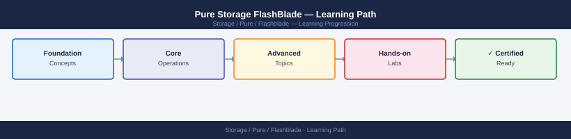

---
tags:
  - learning-path
  - pure
---
# Pure Storage FlashBlade — Learning Path

Recommended reading order for Pure Storage FlashBlade. Follow these stages in order to build a complete mental model before working with it in production.

*Applies to: FlashBlade Purity//FB 4.x*

## Stage 1 — Architecture

**Goal**: Understand how FlashBlade blades aggregate into a scale-out fabric, how file systems and object stores are structured, and how Rapid Restore delivers fast recovery.

**Read in this order**:

- [How It Works](../architecture/how-it-works/) — blade architecture (metadata and data blades), Purity//FB OS data services, file system protocol stack (NFS v3/v4.1, SMB 2/3), object store S3 API model, internal fabric interconnect, and Rapid Restore parallel rebuild
- [Design Standards](../architecture/design-standards/) — file system sizing and hard/soft quota design, NFS export and SMB share naming conventions, S3 bucket and versioning policies, replication target pairing, and blade expansion planning
- [Integrations](../architecture/integrations/) — NFS mount for AI/ML workloads, S3 integration with backup targets (Veeam, Cohesity), SMB share for Windows environments, and Pure1 cloud management

**Why first**: FlashBlade's scale-out blade model differs from traditional NAS filers. Misunderstanding the metadata blade role leads to incorrect capacity planning and unexpected performance ceilings.

---

## Stage 2 — Deployment

**Goal**: Understand initial array setup, protocol service enablement, and how to validate file system and object store access before onboarding workloads.

**Read**:

- [Deploy](../deploy/) — initial Purity//FB setup, management and data network configuration, NFS/SMB/S3 service activation, replication target pairing, and post-deployment validation checklist
- [Install & Upgrade](../operations/install-upgrade/) — Purity//FB non-disruptive upgrade procedure, pre-upgrade health checks, blade firmware updates, and post-upgrade protocol connectivity validation

**Why second**: Protocol service configuration order matters — S3 virtual-hosted-style routing requires DNS wildcard configuration that must be in place before bucket creation. Deploying out of order causes client-side connection failures.

---

## Stage 3 — Operations

**Goal**: Manage file systems, object store buckets, snapshots, and replication confidently, and maintain performance under mixed NFS/S3 workloads.

**Read in this order**:

- [Health Checks](../operations/health-checks/) — run the routine first on every shift; covers blade health, replication lag, snapshot age, capacity utilisation vs quota, and NFS/SMB session counts
- [CLI Reference](../operations/cli-reference/) — `purefb` CLI and REST API reference for file system, object store, snapshot, and replication management
- [Procedures](../operations/procedures/) — file system provisioning and export management, S3 bucket lifecycle policy configuration, snapshot schedule setup, replication policy management, and Rapid Restore invocation
- [Backup & Restore](../operations/backup-restore/) — file system snapshot schedules, S3 bucket replication to remote FlashBlade, snapshot-based restore, and object lock (WORM) configuration for compliance
- [Scripts](../operations/scripts/) — automation for snapshot age reporting, capacity trending by file system, and S3 bucket object count monitoring

**Why third**: FlashBlade quota management is independent for file systems and object stores. Understanding both quota models before provisioning prevents capacity contention between NFS and S3 workloads.

---

## Stage 4 — Security

**Goal**: Enforce NFS/SMB access controls, secure S3 with access policies and object lock, and validate encryption across file and object data paths.

**Read**:

- [Access Control](../security/access-control/) — Purity//FB role model (array admin/storage admin/read-only), NFS export access rules (client IP, root squash), and SMB share ACL inheritance
- [Authentication](../security/authentication/) — Active Directory join for SMB Kerberos authentication, NFS Kerberos (krb5/krb5i/krb5p) configuration, S3 access key and secret management, and LDAP user mapping
- [Encryption](../security/encryption/) — data-at-rest encryption on blades (FIPS 140-2), NFS in-transit encryption (krb5p), SMB signing and encryption, S3 TLS enforcement, and KMIP key management
- [Hardening](../security/hardening/) — management network isolation, S3 bucket public access blocking, SMB share audit log forwarding, and disabling unused protocol services

**Why fourth**: NFS root squash misconfiguration silently grants root-equivalent access to all clients. Validate export rules and Kerberos configuration in a test file system before production onboarding.

---

## Stage 5 — Troubleshooting

**Goal**: Diagnose NFS/SMB/S3 access failures, replication stalls, and performance degradation using Purity logs and Pure1 analytics before escalating.

**Read**:

- [Common Issues](../troubleshooting/common-issues/) — NFS mount failures (export rule mismatch, Kerberos keytab), SMB access denied (AD join issues), S3 403 errors (access key/bucket policy), and replication paused states
- [Diagnostics](../troubleshooting/diagnostics/) — Purity//FB diagnostic bundle collection, Pure1 performance anomaly alerts, per-protocol latency breakdown, and replication pipeline status checks
- [Escalation](../troubleshooting/escalation/) — Pure Support case creation, diagnostic bundle upload via Pure1, blade hardware replacement workflow, and Evergreen SLA response time tiers

**Why last**: Troubleshooting makes most sense once you know the normal operating state — healthy replication lag ranges, expected NFS/S3 latency baselines, and normal blade utilisation patterns.

---

## See also

- [Flashblade — Deploy](../../deploy/)
