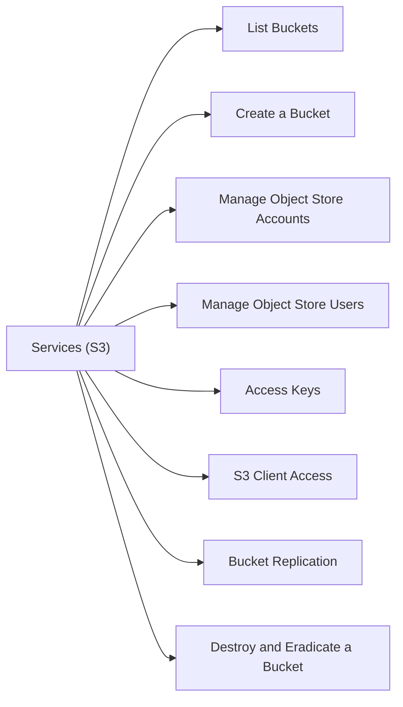

# FlashBlade Object Services (S3)

FlashBlade provides S3-compatible object storage through object store accounts, buckets, and access keys.



## List Buckets

```bash
purefb bucket list
```

## Create a Bucket

```bash
purefb bucket create --name <bucket_name> --account <account_name>
```

## Manage Object Store Accounts

```bash
# List accounts
purefb object-store-account list

# Create an account
purefb object-store-account create --name <account_name>

# Delete an account (all buckets must be empty)
purefb object-store-account destroy --name <account_name>
```

## Manage Object Store Users

```bash
# List users
purefb object-store-user list

# Create a user
purefb object-store-user create --name <user_name> --account <account_name>

# Delete a user
purefb object-store-user destroy --name <user_name> --account <account_name>
```

## Access Keys

```bash
# List access keys
purefb object-store-access-key list

# Create an access key for a user
purefb object-store-access-key create --user <user_name>/<account_name>
```

The output provides the `access_key_id` and `secret_access_key` — save the secret immediately (it is not retrievable later).

## S3 Client Access

```bash
# Configure AWS CLI to point at FlashBlade S3 endpoint
aws configure
# Set: access key, secret key, region (any string), output format

aws s3 ls --endpoint-url https://<flashblade_s3_vip>/
aws s3 cp local_file.txt s3://<bucket_name>/ --endpoint-url https://<flashblade_s3_vip>/
```

## Bucket Replication

```bash
# List bucket replica links (replication to remote FlashBlade)
purefb bucket-replica-link list

# Show replication lag
purefb bucket-replica-link list --all
```

## Destroy and Eradicate a Bucket

```bash
# Destroy (bucket must be empty)
purefb bucket destroy --name <bucket_name>

# Eradicate
purefb bucket eradicate --name <bucket_name>
```

## Common Issues

| Issue | Check | Action |
|---|---|---|
| S3 access denied | Access key credentials | Verify key matches user/account |
| Bucket not found | Bucket name correct | `purefb bucket list` |
| Replication lag high | Network or capacity | Check inter-array connectivity |
| Cannot delete bucket | Bucket not empty | Delete objects first |
