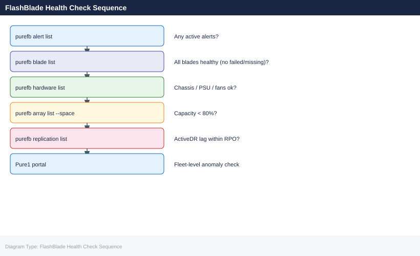
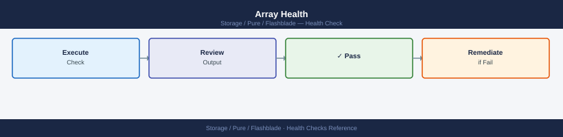

---
tags:
  - operations
  - pure
---
# FlashBlade — Health Checks

<div class="kb-summary">
Health Checks reference covering Daily Checks, Health Check, Array Health, Blade Health, Drive / Media Health and 4 more sections.

*Applies to: FlashBlade Purity//FB 4.x*
</div>



> Part of the [FlashBlade Operations](index.md) reference.

---

## Before you begin

- **Access:** Storage admin credentials (cluster admin or equivalent)
- **Timing:** safe to run during business hours unless a step is marked ⚠ (causes interruption)
- **Dependencies:** no active upgrades or migrations on the same infrastructure
- **Logging:** capture command output — paste into the change record on completion

---

## Run This Routine

1. **Blade health** — Pure1 or FlashBlade UI → Hardware — all blades and chassis components should be green
2. **File system health** — `pureds list --flagged` — should return empty for object store datasets
3. **Replication status** — `pureremote list` — all remote connections should show Connected
4. **Snapshot lag** — `purepgroup list --snap` — verify replication snapshots are within RPO
5. **Capacity** — FlashBlade UI → Storage → Capacity — check free space per file system and object store
6. **Client connectivity** — verify NFS/SMB/S3 clients are connecting successfully (check access logs)
7. **Phone home** — Pure1 → Settings → Phone Home — verify FlashBlade is reporting to Pure1
8. **Active alerts** — FlashBlade UI → Alerts — resolve all open alerts

## Daily Checks


| Check | Command | Notes |
|---|---|---|
| [ ] Run `purefb alert list` | `purefb alert list` | review all active alerts; flag any hardware, capacity, or replication warnings |
| [ ] Run `purefb blade list` | `purefb blade list` | confirm all blades are in `healthy` state; flag any `failed` or `missing` blades |
| [ ] Run `purefb hardware list` | `purefb hardware list` | confirm all hardware components (power supplies, fans, fabric modules) are healthy |
| [ ] Run `purefb filesystem list` | `purefb filesystem list` | review filesystem utilization; flag any filesystem above 80% of provisioned limit |
| [ ] Run `purefb bucket list` | `purefb bucket list` | check S3 bucket count and data growth trends |
| [ ] Run `purefb replication list` | `purefb replication list` | confirm all ActiveDR links are in `active` status with lag within RPO |
| [ ] Check Pure1 portal for capacity growth forecasts, anomalies, and hardware alerts | | |

## Health Check


- [ ] No active alerts in `purefb alert list`
- [ ] All blades are `healthy` — no `failed` or `missing` blades in `purefb blade list`
- [ ] All hardware components healthy — no PSU, fan, or FM (fabric module) failures
- [ ] No filesystems at or above provisioned limit — clients would receive ENOSPC errors
- [ ] All ActiveDR replication links are `active` and lag is within RPO
- [ ] All network interfaces are `up`: `purefb network interface list`
- [ ] Purity//FB version is within Pure's supported N-2 release window

```bash
# FlashBlade array status and Purity//FB version
purefb array list

# All blades and their health state
purefb blade list

# All hardware components (PSUs, fans, FMs) and status
purefb hardware list

# All filesystems with provisioned and used capacity
purefb filesystem list

# All S3 buckets and usage
purefb bucket list

# All active alerts
purefb alert list

# ActiveDR replication links and lag
purefb replication list

# All snapshots for filesystems and object store
purefb snap list

# Network interfaces and their operational state
purefb network interface list
```


```text title="Expected output"
Name    Status    Version    Revision
fb-array-01    Healthy    4.10.5    84e2f9c1
┌───────────────────────────────────────────────────────────────────────────────────────────────────────┐
│ BLADE                                                                                                 │
├──────────┬────────────┬──────────┬──────────┬──────────────────┤
│ Name     │ Status     │ Slot     │ Model    │ Serial                                                  │
├──────────┼────────────┼──────────┼──────────┼──────────────────┤
│ blade-1  │ Healthy    │ 1        │ FB20004  │ PFB2K4A001234                                           │
│ blade-2  │ Healthy    │ 2        │ FB20004  │ PFB2K4A001235                                           │
│ blade-3  │ Healthy    │ 3        │ FB20004  │ PFB2K4A001236                                           │
└──────────┴────────────┴──────────┴──────────┴─────────────────────────────────────────────────────────┘
Name                Status      Type
psu-1               Healthy     PSU
psu-2               Healthy     PSU
fan-1               Healthy     Fan
fan-2               Healthy     Fan
fm-1                Healthy     FM
...
Name              Provisioned    Used       Available    Snapshots
data-fs-01        10.0T          4.2T       5.8T         12
archive-fs-02     50.0T          28.5T      21.5T        8
logs-fs-03        5.0T           2.1T       2.9T         4
Name              Size       Used       Owner
prod-bucket-01    100.0G     67.3G      s3-user-prod
backup-bucket-02  500.0G     412.1G     s3-user-backup
Severity    Message                                    Created
warning     Blade-2 temperature elevated (68°C)       2024-01-15T09:23:41Z
info        Replication lag on link-dr-01: 2.3s       2024-01-15T08:15:22Z
Name                    Status      Lag         Target
link-dr-01              Active      2.3s        fb-array-dr-01
link-dr-02              Syncing     15.2s       fb-array-dr-02
Name                    Filesystem    Created              Size
data-fs-01.snap-20240115  data-fs-01    2024-01-15T06:00:00Z  4.2T
archive-fs-02.snap-20240114  archive-fs-02  2024-01-14T06:00:00Z  28.5T
...
Name          Status      MTU    Speed      IP Address
eth0          Up          1500   10Gb/s     192.168.1.10
eth1          Up          1500   10Gb/s     192.168.1.11
mgmt0         Up          1500   1Gb/s      10.0.0.50
```

!!! warning "Common errors"
    **`Error: Connection refused (10.0.0.50:443)`** — Verify the FlashB
## Array Health



```bash
purefb array
purefb hardware
purefb alert list
```


```text title="Expected output"
Name                          Model           Revision  Serial Number
flashblade-prod-01            FB20012         5.2.1     PFB2A1234567890AB

Slot  Model      Status  Temperature  Power Supply  Fan Module
0     FB20012    OK      28°C         OK            OK
1     FB20012    OK      27°C         OK            OK
2     FB20012    OK      29°C         OK            OK

Name                 Severity  Code    Message                              Timestamp
fan-module-slot-1    Warning   FAN001  Fan module 1 operating at 85% speed  2024-01-15T09:23:45Z
power-supply-slot-0  Info      PSU002  Power supply 0 voltage nominal       2024-01-15T08:15:22Z
temperature-slot-2   Warning   TEMP003 Slot 2 temperature elevated         2024-01-15T07:45:10Z
```

!!! warning "Common errors"
    **`Error: Invalid credentials or API token expired`** — Regenerate the API token in the Pure1 management console and update your local authentication configuration.
    **`Error: Connection refused — unable to reach management IP`** — Verify the FlashBlade management IP is reachable and that the array is online using `ping` or `ssh`.
Or via the FlashBlade GUI:
- **Overview → Array** — overall health summary
- **Storage → File Systems** / **Object Store** — capacity and status
- **Alerts → Active** — unacknowledged alerts

## Blade Health


```bash
purefb blade list
```


```text title="Expected output"
Name                          Status    Model              Serial Number        Version
blade-01.prod.local           Online    Pure FlashBlade//E  PFB2110A0001         4.2.1.0
blade-02.prod.local           Online    Pure FlashBlade//E  PFB2110A0002         4.2.1.0
blade-03.prod.local           Online    Pure FlashBlade//E  PFB2110A0003         4.2.1.0
blade-04.prod.local           Degraded  Pure FlashBlade//E  PFB2110A0004         4.2.1.0
blade-05.prod.local           Online    Pure FlashBlade//E  PFB2110A0005         4.2.1.0
```

!!! warning "Common errors"
    **`Error: Unable to connect to management interface on blade-01.prod.local`** — Verify network connectivity to the blade's management IP and confirm the FlashBlade is powered on.
    **`Error: Authentication failed for user 'admin'`** — Check that your API token or credentials are valid and have not expired; re-authenticate with `purefb login`.
All blades should show `status: healthy`. Any blade showing `unhealthy` or `failed` requires investigation.

## Drive / Media Health


FlashBlade uses direct-attached blade storage. Drive-level health is abstracted — monitor at the blade level:

```bash
purefb blade list --all
```


```text title="Expected output"
Name                          Status    Model          Serial Number        Version
fb-prod-01                    healthy   FlashBlade//E  PURE-FB-E-12345678   4.10.2
fb-prod-02                    healthy   FlashBlade//E  PURE-FB-E-87654321   4.10.2
fb-dr-01                      healthy   FlashBlade//X  PURE-FB-X-11223344   4.10.2
fb-test-01                    degraded  FlashBlade//E  PURE-FB-E-55667788   4.9.5
fb-archive-01                 offline   FlashBlade//S  PURE-FB-S-99887766   4.8.1
```

!!! warning "Common errors"
    **`Error: Unable to connect to management IP 10.20.30.40`** — Verify network connectivity to the FlashBlade management interface and confirm the IP is reachable.
    **`Error: Invalid credentials for user 'admin'`** — Ensure the Pure Storage API token or username/password is correctly configured in your authentication credentials.
    **`Error: Command 'purefb' not found`** — Install the Pure Storage Python SDK using `pip install purity-fb` or add the Pure CLI tools to your system PATH.
## Network Interface Health


```bash
purefb network-interface list
```


```text title="Expected output"
Name     Status  MTU  MAC Address        IP Address       Netmask          Gateway
eth0     up      1500 52:54:00:a1:2b:3c 192.168.1.100    255.255.255.0    192.168.1.1
eth1     up      1500 52:54:00:a1:2b:3d 10.0.0.50        255.255.255.0    10.0.0.1
mgmt0    up      1500 52:54:00:a1:2b:3e 172.16.0.25      255.255.255.0    172.16.0.1
eth2     down    1500 52:54:00:a1:2b:3f —                —                —
eth3     down    1500 52:54:00:a1:2b:40 —                —                —
```

!!! warning "Common errors"
    **`Error: Connection refused — unable to reach management IP`** — Verify the FlashBlade management IP is reachable and the REST API service is running with `purefb list`.
    **`Error: Invalid credentials — authentication failed`** — Ensure your Pure Storage API token is valid and set in the environment or configuration file.
All data VIPs should show `enabled: true` and `type: vip`.

## Replication Health


```bash
purefb fs-replica-link list
purefb bucket-replica-link list
```


```text title="Expected output"
Name                          Status    Remote Array          Remote FS/Bucket      Direction    Lag
fs-replica-prod-01            Synced    pureflashblade-dr-01  fs-replica-prod-01   Bi-Directional  0 B
fs-replica-prod-02            Synced    pureflashblade-dr-01  fs-replica-prod-02   Uni-Directional  0 B
fs-replica-test               Synced    pureflashblade-dr-02  fs-replica-test      Uni-Directional  128 KB

Name                          Status    Remote Array          Remote Bucket         Direction    Lag
bucket-app-data-01            Synced    pureflashblade-dr-01  bucket-app-data-01    Bi-Directional  0 B
bucket-backup-vault           Synced    pureflashblade-dr-01  bucket-backup-vault   Uni-Directional  2.3 MB
bucket-logs-archive           Synced    pureflashblade-dr-02  bucket-logs-archive   Uni-Directional  512 KB
```

!!! warning "Common errors"
    **`Error: Invalid credentials or unable to connect to array`** — Verify the FlashBlade management IP is reachable and authentication credentials in `~/.purerc` are current.
    **`Error: No filesystem/bucket replica links found`** — Confirm replica links have been created using `purefb fs-replica-link create` or `purefb bucket-replica-link create` before listing.
Verify replica links show `lag-time` within expected RPO.

## Pre-Change Checklist

- [ ] All blades `healthy`
- [ ] No active critical alerts
- [ ] All network VIPs enabled
- [ ] Replication healthy (lag within RPO)
- [ ] Capacity below 80%

## Health Summary Table

| Check | Command | Expected |
|---|---|---|
| Array health | `purefb array` | No warnings |
| Blades | `purefb blade list` | All healthy |
| Alerts | `purefb alert list` | No critical |
| Network | `purefb network-interface list` | All VIPs enabled |
| Replication | `purefb fs-replica-link list` | Low lag |

---

## Verify

- Confirm the operation completed without errors in the log or management UI
- Verify the expected state change is visible (service running, object created, config applied)
- Document the outcome in the change record

---

## See also

- [FlashBlade — Procedures](../procedures/)
- [FlashBlade — CLI Reference](../cli-reference/)
- [FlashBlade — Common Issues](../../troubleshooting/common-issues/)
