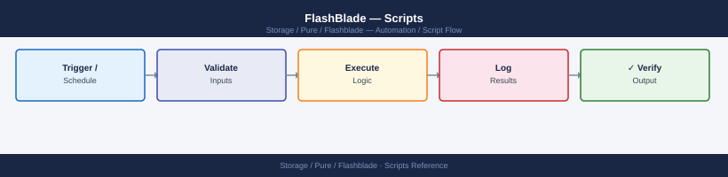

---
tags:
  - operations
  - pure
---
# FlashBlade — Scripts


<div class="kb-summary">
Scripts reference covering Array Health Check (Python), Filesystem Capacity Report (Bash), ActiveDR Replication Monitor (Python), Daily Check Script (Bash via SSH), S3 Bucket Audit (Python) and 1 more sections.

*Applies to: FlashBlade Purity//FB 4.x*
</div>



```text
Automation Architecture — FlashBlade
  Python / Bash / Ansible
             │
             ▼
  Purity//FB REST API (HTTPS/443)
  ├── /api/2.x/arrays           — system info + capacity
  ├── /api/2.x/blades           — blade health
  ├── /api/2.x/alerts           — active alerts
  ├── /api/2.x/file-systems     — filesystem inventory
  └── /api/2.x/buckets          — S3 bucket inventory
             │
             ▼
  FlashBlade Fabric Module ──► Blades
```

> Part of the [FlashBlade Operations](index.md) reference.

---

## Before you begin

- **Access:** Storage admin credentials (cluster admin or equivalent)
- **Timing:** safe to run during business hours unless a step is marked ⚠ (causes interruption)
- **Dependencies:** no active upgrades or migrations on the same infrastructure
- **Logging:** capture command output — paste into the change record on completion

---

## Array Health Check (Python)

Connect to a FlashBlade via the `py-pure-client` SDK, check blades, hardware, active alerts, file systems, and buckets, then print a health summary. Exits non-zero if alerts or blade failures are detected.

```python
#!/usr/bin/env python3
"""
FlashBlade Array Health Check
Requires: pip install py-pure-client
Variables: FB_HOST, FB_API_TOKEN
"""

import os
import sys

try:
    from pypureclient import flashblade
except ImportError:
    sys.exit("ERROR: Install py-pure-client:  pip install py-pure-client")

# -------------------------------------------------------------------
# Configuration
# -------------------------------------------------------------------
FB_HOST  = os.environ.get("FB_HOST",      "")
FB_TOKEN = os.environ.get("FB_API_TOKEN", "")

if not FB_HOST or not FB_TOKEN:
    sys.exit("Set FB_HOST and FB_API_TOKEN environment variables.")

RED  = "\033[0;31m"; YEL  = "\033[0;33m"; GRN  = "\033[0;32m"; NC = "\033[0m"

worst  = 0
issues = []

def crit(msg): global worst; issues.append(("CRITICAL", msg)); worst = max(worst, 2)
def warn(msg): global worst; issues.append(("WARNING",  msg)); worst = max(worst, 1)

# -------------------------------------------------------------------
# Connect
# -------------------------------------------------------------------
try:
    client = flashblade.Client(target=FB_HOST, api_token=FB_TOKEN)
except Exception as exc:
    sys.exit(f"Connection failed: {exc}")

print(f"\n{'='*60}")
print(f"  FlashBlade Health Check: {FB_HOST}")
print(f"{'='*60}\n")

# -------------------------------------------------------------------
# Array info
# -------------------------------------------------------------------
try:
    arr_resp = client.get_arrays()
    if arr_resp.status_code == 200:
        a = list(arr_resp.items)[0]
        print(f"Array  : {a.name}")
        print(f"Purity : {a.os}")
        print()
except Exception as exc:
    warn(f"Cannot get array info: {exc}")

# -------------------------------------------------------------------
# Check: Blades
# -------------------------------------------------------------------
print("Checking blades...")
try:
    blades_resp = client.get_blades()
    blades = list(blades_resp.items) if blades_resp.status_code == 200 else []
    bad_blades = [b for b in blades if getattr(b, "status", "healthy") != "healthy"]
    if bad_blades:
        for b in bad_blades:
            crit(f"Blade {b.name} status: {b.status}")
    else:
        print(f"  {GRN}OK{NC}  All {len(blades)} blades healthy")
except Exception as exc:
    warn(f"Cannot get blade status: {exc}")

# -------------------------------------------------------------------
# Check: Hardware
# -------------------------------------------------------------------
print("Checking hardware components...")
try:
    hw_resp = client.get_hardware()
    hw_items = list(hw_resp.items) if hw_resp.status_code == 200 else []
    bad_hw = [
        h for h in hw_items
        if getattr(h, "status", "ok") not in ("ok", "not_installed", "")
    ]
    if bad_hw:
        for h in bad_hw:
            crit(f"Hardware {h.name} status: {h.status}")
    else:
        print(f"  {GRN}OK{NC}  All hardware components OK ({len(hw_items)} checked)")
except Exception as exc:
    warn(f"Cannot get hardware: {exc}")

# -------------------------------------------------------------------
# Check: Alerts
# -------------------------------------------------------------------
print("Checking active alerts...")
try:
    alerts_resp = client.get_alerts(filter="flagged='true'")
    alerts = list(alerts_resp.items) if alerts_resp.status_code == 200 else []
    crit_alerts = [a for a in alerts if getattr(a, "severity", "") == "error"]
    warn_alerts = [a for a in alerts if getattr(a, "severity", "") == "warning"]

    for a in crit_alerts:
        crit(f"Alert [{a.id}] {a.summary}")
    for a in warn_alerts:
        warn(f"Alert [{a.id}] {a.summary}")
    if not crit_alerts and not warn_alerts:
        print(f"  {GRN}OK{NC}  No flagged alerts")
except Exception as exc:
    warn(f"Cannot get alerts: {exc}")

# -------------------------------------------------------------------
# Check: File systems
# -------------------------------------------------------------------
print("Checking file systems...")
try:
    fs_resp = client.get_file_systems()
    fs_items = list(fs_resp.items) if fs_resp.status_code == 200 else []
    print(f"  File systems: {len(fs_items)} configured")
    for fs in fs_items:
        space = getattr(fs, "space", None)
        if space:
            used       = getattr(space, "virtual", 0) or 0
            provisioned = getattr(fs, "provisioned", 0) or 0
            if provisioned and (used / provisioned) > 0.90:
                warn(f"Filesystem {fs.name} is >90% utilised ({used}/{provisioned} bytes)")
except Exception as exc:
    warn(f"Cannot get file systems: {exc}")

# -------------------------------------------------------------------
# Check: Buckets (object store)
# -------------------------------------------------------------------
print("Checking S3 buckets...")
try:
    bkt_resp = client.get_buckets()
    bkts = list(bkt_resp.items) if bkt_resp.status_code == 200 else []
    print(f"  Buckets: {len(bkts)} configured")
except Exception as exc:
    warn(f"Cannot get buckets: {exc}")

# -------------------------------------------------------------------
# Summary
# -------------------------------------------------------------------
print(f"\n{'='*60}")
label  = ("CRITICAL" if worst == 2 else "WARNING" if worst == 1 else "HEALTHY")
colour = (RED if worst == 2 else YEL if worst == 1 else GRN)
print(f"  {colour}Overall: {label}{NC}")
for level, msg in issues:
    c = RED if level == "CRITICAL" else YEL
    print(f"  {c}[{level}]{NC} {msg}")
print(f"{'='*60}\n")
sys.exit(worst)
```

### How to run this script — step by step

**Before you start — what you need**
- Python 3 installed (download from python.org — tick "Add Python to PATH" during setup)
- Network access to your FlashBlade management IP
- A FlashBlade API token — log in to your FlashBlade GUI at `https://your-flashblade-ip`, go to **Settings → Users**, and create or copy an API token

**Step 1 — Save the file**

1. Open **Notepad** (press the Windows key, type `Notepad`, press Enter)
2. Copy the entire code block above
3. Click **File → Save As**
4. Change "Save as type" to **All Files**
5. Name it `fb_health.py` — save it to your Desktop

**Step 2 — Fill in your details**

| Variable | What to put here | Where to find it |
|---|---|---|
| `FB_HOST` | FlashBlade management IP or hostname | Your storage admin |
| `FB_API_TOKEN` | FlashBlade API token | FlashBlade GUI → Settings → Users → API Tokens |

**Step 3 — Open Command Prompt and install the package**

Press the Windows key, type `cmd`, press Enter:
```bash
pip install py-pure-client
```

**Step 4 — Set variables and run**

```bash
set FB_HOST=192.168.1.20
set FB_API_TOKEN=your-token-here
cd %USERPROFILE%\Desktop
python fb_health.py
```

---

## Filesystem Capacity Report (Bash)

Run `purefb filesystem list` and produce a formatted capacity table, flagging any filesystems over 80% used. Useful for weekly capacity reviews.

```bash
#!/bin/bash
# FlashBlade Filesystem Capacity Report
# Usage: FB_HOST=flashblade01 FB_API_TOKEN=xxx ./fb_fs_report.sh

set -euo pipefail

FB_HOST="${FB_HOST:?Set FB_HOST}"
FB_API_TOKEN="${FB_API_TOKEN:?Set FB_API_TOKEN}"
WARN_PCT="${FB_WARN_PCT:-80}"

export PUREFB_HOST="$FB_HOST"
export PUREFB_API_TOKEN="$FB_API_TOKEN"

RED='\033[0;31m'; YEL='\033[0;33m'; GRN='\033[0;32m'; NC='\033[0m'

echo
echo "=== FlashBlade Filesystem Capacity Report ==="
echo "Array : $FB_HOST  |  Time : $(date)"
echo "Warning threshold: ${WARN_PCT}%"
echo

RAW=$(purefb filesystem list --notree 2>/dev/null)

printf "%-35s %12s %12s %6s  %-6s %-6s  %s\n" \
    "FILESYSTEM" "PROVISIONED" "USED" "PCT" "NFS" "SMB" "STATUS"
printf '%0.s-' {1..100}; echo

total=0; over_warn=0

while IFS= read -r line; do
    [[ "$line" =~ ^(Name|[[:space:]]*$) ]] && continue

    name=$(       awk '{print $1}' <<< "$line")
    provisioned=$(awk '{print $2}' <<< "$line")
    used=$(       awk '{print $3}' <<< "$line")
    nfs=$(        awk '{print $5}' <<< "$line" 2>/dev/null || echo "-")
    smb=$(        awk '{print $6}' <<< "$line" 2>/dev/null || echo "-")

    prov_num=$(grep -oE '^[0-9.]+' <<< "$provisioned" 2>/dev/null || echo "0")
    used_num=$(grep -oE '^[0-9.]+' <<< "$used"        2>/dev/null || echo "0")

    pct=0
    if awk "BEGIN{exit ($prov_num>0)?0:1}" 2>/dev/null; then
        pct=$(awk "BEGIN{printf \"%.0f\", ($used_num/$prov_num)*100}" 2>/dev/null || echo 0)
    fi

    (( total++ ))

    if (( pct >= WARN_PCT )); then
        colour="$YEL"; tag="WARNING"
        (( over_warn++ ))
    else
        colour="$GRN"; tag="OK"
    fi

    printf "%-35s %12s %12s %5d%%  %-6s %-6s  " \
        "$name" "$provisioned" "$used" "$pct" "${nfs:-?}" "${smb:-?}"
    echo -e "${colour}${tag}${NC}"

done <<< "$RAW"

echo
printf '%0.s-' {1..100}; echo
printf "Total filesystems: %d  |  Over %d%%: %d\n" "$total" "$WARN_PCT" "$over_warn"

(( over_warn > 0 )) && echo -e "${YEL}Review filesystems approaching their provisioned limit.${NC}"
exit $(( over_warn > 0 ? 1 : 0 ))
```

---

## ActiveDR Replication Monitor (Python)

Connect to source and target FlashBlades via the REST API, list all replication links, check status, direction, lag time, and throughput, then alert if any link is not Active or if lag exceeds the RPO threshold.

```python
#!/usr/bin/env python3
"""
FlashBlade ActiveDR Replication Monitor
Requires: pip install py-pure-client tabulate
Variables: FB_SRC_HOST, FB_SRC_API_TOKEN, FB_DST_HOST, FB_DST_API_TOKEN
           FB_RPO_MINUTES (default: 15)
"""

import os
import sys

try:
    from pypureclient import flashblade
    from tabulate import tabulate
except ImportError:
    sys.exit("ERROR: pip install py-pure-client tabulate")

SRC_HOST  = os.environ.get("FB_SRC_HOST",      "")
SRC_TOKEN = os.environ.get("FB_SRC_API_TOKEN", "")
DST_HOST  = os.environ.get("FB_DST_HOST",      "")
DST_TOKEN = os.environ.get("FB_DST_API_TOKEN", "")
RPO_MIN   = int(os.environ.get("FB_RPO_MINUTES", "15"))

if not SRC_HOST or not SRC_TOKEN or not DST_HOST or not DST_TOKEN:
    sys.exit("Set FB_SRC_HOST, FB_SRC_API_TOKEN, FB_DST_HOST, FB_DST_API_TOKEN.")

RED  = "\033[0;31m"; YEL  = "\033[0;33m"; GRN  = "\033[0;32m"; NC = "\033[0m"

worst  = 0
issues = []

def crit(msg): global worst; issues.append(("CRITICAL", msg)); worst = max(worst, 2)
def warn(msg): global worst; issues.append(("WARNING",  msg)); worst = max(worst, 1)

def connect(host, token, label):
    try:
        return flashblade.Client(target=host, api_token=token)
    except Exception as exc:
        crit(f"Cannot connect to {label}: {exc}")
        return None

src = connect(SRC_HOST, SRC_TOKEN, "source")
dst = connect(DST_HOST, DST_TOKEN, "destination")

if not src or not dst:
    for lvl, msg in issues:
        print(f"[{lvl}] {msg}")
    sys.exit(2)

def get_links(client, label):
    try:
        resp = client.get_file_system_replica_links()
        return list(resp.items) if resp.status_code == 200 else []
    except Exception as exc:
        warn(f"Cannot get replica links from {label}: {exc}")
        return []

src_links = get_links(src, "source")
dst_links = get_links(dst, "destination")
all_links = src_links + dst_links

if not all_links:
    print("No replication links found. Is ActiveDR configured?")
    sys.exit(0)

rows = []
seen = set()

for link in all_links:
    key = (getattr(link, "local_file_system", {}).get("name", "?"),
           getattr(link, "remote_file_system", {}).get("name", "?"))
    if key in seen:
        continue
    seen.add(key)

    local_fs  = getattr(link, "local_file_system",  {})
    remote_fs = getattr(link, "remote_file_system", {})
    status    = getattr(link, "status",    "unknown")
    direction = getattr(link, "direction", "unknown")
    lag_ms    = getattr(link, "lag",       None)
    lag_min   = round(lag_ms / 60000, 1) if lag_ms else 0
    bps       = getattr(link, "bytes_per_sec", 0) or 0

    local_name  = local_fs.get("name",  "?") if isinstance(local_fs, dict)  else getattr(local_fs, "name", "?")
    remote_name = remote_fs.get("name", "?") if isinstance(remote_fs, dict) else getattr(remote_fs, "name", "?")

    if status != "replicating":
        crit(f"{local_name} -> {remote_name}: status={status}")
        flag = f"{RED}NOT ACTIVE{NC}"
    elif lag_min > RPO_MIN:
        warn(f"{local_name} -> {remote_name}: lag={lag_min}m exceeds RPO={RPO_MIN}m")
        flag = f"{YEL}LAG WARN{NC}"
    else:
        flag = f"{GRN}OK{NC}"

    rows.append([
        f"{local_name} -> {remote_name}",
        status,
        direction,
        f"{lag_min} min",
        f"{bps/1024/1024:.1f} MB/s" if bps else "-",
        flag,
    ])

print(f"\nFlashBlade ActiveDR Replication Report")
print(f"Source: {SRC_HOST}  |  Destination: {DST_HOST}  |  RPO threshold: {RPO_MIN} min\n")
print(tabulate(rows, headers=["Link", "Status", "Direction", "Lag", "Throughput", "Health"],
               tablefmt="simple"))

print()
label  = ("CRITICAL" if worst == 2 else "WARNING" if worst == 1 else "ALL LINKS HEALTHY")
colour = (RED if worst == 2 else YEL if worst == 1 else GRN)
print(f"{colour}{label}{NC}")
for lvl, msg in issues:
    c = RED if lvl == "CRITICAL" else YEL
    print(f"  {c}[{lvl}]{NC} {msg}")
sys.exit(worst)
```

---

## Daily Check Script (Bash via SSH)

Connect to a FlashBlade via SSH, check array status, active alerts, hardware health, and filesystem capacity. Flag any filesystem over 80% used or any hardware component not healthy.

```bash
#!/bin/bash
# fb_daily_check.sh
# Usage: FB_HOST=flashblade01 SSH_USER=pureuser ./fb_daily_check.sh

FB_HOST="${FB_HOST:?Set FB_HOST}"
SSH_USER="${SSH_USER:-pureuser}"
WARN_PCT="${WARN_PCT:-80}"

SSH="ssh -o StrictHostKeyChecking=no -o ConnectTimeout=10 ${SSH_USER}@${FB_HOST}"
RED='\033[0;31m'; GRN='\033[0;32m'; YEL='\033[0;33m'; NC='\033[0m'
FAIL=0

pass() { echo -e "  ${GRN}[PASS]${NC} $*"; }
fail() { echo -e "  ${RED}[FAIL]${NC} $*"; FAIL=1; }
warn() { echo -e "  ${YEL}[WARN]${NC} $*"; }

echo "=== FlashBlade Daily Check: ${FB_HOST} ==="
echo "Time: $(date)"
echo

echo "--- Array Info ---"
$SSH "purity fb-array list" 2>/dev/null || fail "Cannot connect or run purity commands"

echo
echo "--- Active Alerts ---"
ALERTS=$($SSH "purity alert list" 2>/dev/null)
CRIT=$(echo "$ALERTS" | grep -ic 'critical' || true)
WARN_COUNT=$(echo "$ALERTS" | grep -ic 'warning' || true)
if [[ $CRIT -gt 0 ]]; then
    fail "$CRIT critical alert(s) active"
    echo "$ALERTS" | grep -i 'critical'
elif [[ $WARN_COUNT -gt 0 ]]; then
    warn "$WARN_COUNT warning alert(s) active"
else
    pass "No active alerts"
fi

echo
echo "--- Hardware Health ---"
HW=$($SSH "purity hardware list" 2>/dev/null)
HW_FAIL=$(echo "$HW" | awk 'NR>1 && $NF!="healthy" && $NF!="ok" && $NF!="" {print}')
if [[ -n "$HW_FAIL" ]]; then
    fail "Unhealthy hardware components detected:"
    echo "$HW_FAIL"
else
    pass "All hardware components healthy"
fi

echo
echo "--- Filesystem Capacity ---"
FS=$($SSH "purity fs list --space" 2>/dev/null)
FS_OVER=$(echo "$FS" | awk -v thr="$WARN_PCT" 'NR>1 {
    gsub(/%/, "", $NF)
    if ($NF+0 > thr+0) print $0
}')
if [[ -n "$FS_OVER" ]]; then
    fail "Filesystems over ${WARN_PCT}% used:"
    echo "$FS_OVER"
else
    pass "All filesystems below ${WARN_PCT}% used"
fi

echo
if [[ $FAIL -eq 0 ]]; then
    echo -e "${GRN}RESULT: PASS${NC}"
else
    echo -e "${RED}RESULT: FAIL${NC}"
fi
exit $FAIL
```

---

## S3 Bucket Audit (Python)

Connect to a FlashBlade S3 endpoint using `boto3`, list all buckets, count objects and total size per bucket, and flag buckets with versioning enabled and large object counts.

```python
#!/usr/bin/env python3
"""
FlashBlade S3 Bucket Audit
Requires: pip install boto3 tabulate
Variables: FB_S3_ENDPOINT, AWS_ACCESS_KEY_ID, AWS_SECRET_ACCESS_KEY
           FB_VERSION_WARN_COUNT (default: 10000)
"""

import os
import sys

try:
    import boto3
    from botocore.config import Config
    from tabulate import tabulate
except ImportError:
    sys.exit("ERROR: pip install boto3 tabulate")

ENDPOINT    = os.environ.get("FB_S3_ENDPOINT",      "")
ACCESS_KEY  = os.environ.get("AWS_ACCESS_KEY_ID",   "")
SECRET_KEY  = os.environ.get("AWS_SECRET_ACCESS_KEY","")
VERSION_WARN = int(os.environ.get("FB_VERSION_WARN_COUNT", "10000"))

if not ENDPOINT or not ACCESS_KEY or not SECRET_KEY:
    sys.exit("Set FB_S3_ENDPOINT, AWS_ACCESS_KEY_ID, AWS_SECRET_ACCESS_KEY.")

YEL = "\033[0;33m"; GRN = "\033[0;32m"; NC = "\033[0m"

session = boto3.Session(
    aws_access_key_id=ACCESS_KEY,
    aws_secret_access_key=SECRET_KEY,
)
s3 = session.client(
    "s3",
    endpoint_url=ENDPOINT,
    config=Config(signature_version="s3v4"),
    verify=False,
)

try:
    response = s3.list_buckets()
    buckets  = response.get("Buckets", [])
except Exception as exc:
    sys.exit(f"Cannot list buckets: {exc}")

if not buckets:
    print("No S3 buckets found.")
    sys.exit(0)

print(f"\nFlashBlade S3 Bucket Audit: {ENDPOINT}")
print(f"Buckets found: {len(buckets)}\n")

rows = []

for bucket in buckets:
    name = bucket["Name"]

    try:
        ver = s3.get_bucket_versioning(Bucket=name)
        versioning = ver.get("Status", "Disabled")
    except Exception:
        versioning = "Unknown"

    obj_count = 0
    total_bytes = 0
    try:
        paginator = s3.get_paginator("list_objects_v2")
        for page in paginator.paginate(Bucket=name):
            contents = page.get("Contents", [])
            obj_count   += len(contents)
            total_bytes += sum(o.get("Size", 0) for o in contents)
    except Exception as exc:
        obj_count = -1
        total_bytes = -1

    total_gb = total_bytes / (1024 ** 3) if total_bytes >= 0 else -1

    flag = ""
    if versioning == "Enabled" and obj_count > VERSION_WARN:
        flag = f"{YEL}VERSION WARN (many objects){NC}"
    elif obj_count >= 0:
        flag = f"{GRN}OK{NC}"
    else:
        flag = "(scan error)"

    rows.append([
        name,
        f"{obj_count:,}" if obj_count >= 0 else "error",
        f"{total_gb:.2f} GB" if total_gb >= 0 else "error",
        versioning,
        flag,
    ])

rows_sortable = [
    (r, float(r[2].replace(" GB","").replace(",","")) if "GB" in r[2] else -1)
    for r in rows
]
rows_sorted = [r for r, _ in sorted(rows_sortable, key=lambda x: -x[1])]

print(tabulate(
    rows_sorted,
    headers=["Bucket", "Objects", "Total Size", "Versioning", "Flag"],
    tablefmt="simple",
))

print(f"\nNote: Buckets with versioning enabled and >{VERSION_WARN:,} objects may have significant version overhead.")
```

---

## Windows: FlashBlade Health Check via REST API (PowerShell)

Authenticate to the FlashBlade REST API, retrieve array information, active alerts, and hardware component health, then print a formatted health summary.

```powershell
# fb_health_rest.ps1 — FlashBlade Health Check via REST API (Windows PowerShell)
# Requires: PowerShell 5.1+ (pre-installed on Windows 10/11)
# Run: .\fb_health_rest.ps1

$FbHost   = "192.168.1.20"         # Your FlashBlade management IP or hostname
$ApiToken = "your-api-token-here"  # Found in FlashBlade GUI: Settings -> Users -> API Tokens

if (-not ([System.Management.Automation.PSTypeName]'TrustAll').Type) {
    Add-Type @"
    using System.Net; using System.Security.Cryptography.X509Certificates;
    public class TrustAll : ICertificatePolicy {
        public bool CheckValidationResult(ServicePoint s, X509Certificate c, WebRequest r, int p) { return true; }
    }
"@
    [System.Net.ServicePointManager]::CertificatePolicy = New-Object TrustAll
}
[Net.ServicePointManager]::SecurityProtocol = [Net.SecurityProtocolType]::Tls12

$ApiVersion = "2.3"
$ApiBase    = "https://$FbHost/api/$ApiVersion"

Write-Host "`nAuthenticating to FlashBlade $FbHost ..." -ForegroundColor Cyan

try {
    $LoginResp = Invoke-WebRequest `
        -Uri     "$ApiBase/login" `
        -Method  POST `
        -Headers @{ "api-token" = $ApiToken } `
        -UseBasicParsing `
        -ErrorAction Stop
} catch {
    Write-Error "Authentication failed: $($_.Exception.Message)"
    exit 1
}

$AuthToken = $LoginResp.Headers["x-auth-token"]
if (-not $AuthToken) {
    Write-Error "No x-auth-token returned. Check API token."
    exit 1
}

$AuthHeaders = @{ "x-auth-token" = $AuthToken; "Content-Type" = "application/json" }
Write-Host "Authenticated successfully." -ForegroundColor Green

function Invoke-FbApi {
    param([string]$Path)
    try {
        return Invoke-RestMethod -Uri "$ApiBase$Path" -Headers $AuthHeaders -Method GET -ErrorAction Stop
    } catch {
        Write-Warning "API call failed for $Path : $($_.Exception.Message)"
        return $null
    }
}

Write-Host "`n=== FlashBlade Health Summary ===" -ForegroundColor Cyan
Write-Host ("-" * 60)

$arrays = Invoke-FbApi "/arrays"
if ($arrays -and $arrays.items -and $arrays.items.Count -gt 0) {
    $arr = $arrays.items[0]
    Write-Host "Array Name  : $($arr.name)"
    Write-Host "Purity//FB  : $($arr.os)"
    $usedTiB  = [math]::Round($arr.space.total_physical / 1TB, 2)
    Write-Host "Used Space  : $usedTiB TiB"
}

Write-Host "`n--- Alerts ---"
$alerts = Invoke-FbApi "/alerts?filter=flagged%3D%27true%27"
if ($alerts -and $alerts.items -and $alerts.items.Count -gt 0) {
    foreach ($alert in $alerts.items) {
        $colour = if ($alert.severity -eq "error") { "Red" } else { "Yellow" }
        Write-Host "  [$($alert.severity.ToUpper())] $($alert.summary)" -ForegroundColor $colour
    }
} else {
    Write-Host "  No active alerts." -ForegroundColor Green
}

Write-Host "`n--- Hardware Components ---"
$hw = Invoke-FbApi "/hardware"
if ($hw -and $hw.items) {
    $badHw = $hw.items | Where-Object { $_.status -notin @("ok", "not_installed", "") }
    if ($badHw -and $badHw.Count -gt 0) {
        Write-Host "  $($badHw.Count) component(s) NOT OK:" -ForegroundColor Red
        foreach ($h in $badHw) {
            Write-Host "    $($h.name): status=$($h.status)" -ForegroundColor Red
        }
    } else {
        Write-Host "  All $($hw.items.Count) hardware components are OK." -ForegroundColor Green
    }
}

try {
    Invoke-RestMethod -Uri "$ApiBase/logout" -Method DELETE -Headers $AuthHeaders -ErrorAction SilentlyContinue | Out-Null
} catch {}

Write-Host "`n=== Health check complete ===" -ForegroundColor Cyan
```

---

## Verify

- Confirm the operation completed without errors in the log or management UI
- Verify the expected state change is visible (service running, object created, config applied)
- Document the outcome in the change record

---

## See also

- [FlashBlade — Procedures](procedures/)
- [FlashBlade — CLI Reference](cli-reference/)
- [FlashBlade — Health Checks](health-checks/)
