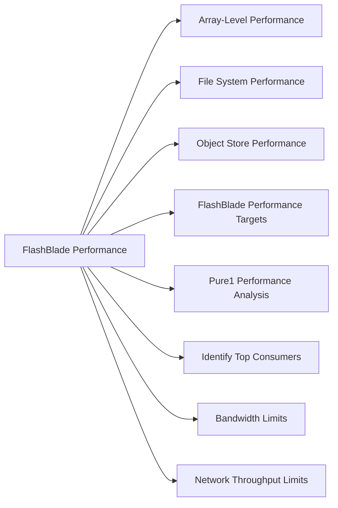

# FlashBlade Performance



## Array-Level Performance

```bash
purefb array --performance
```

Key metrics:
- `read_bytes_per_sec` / `write_bytes_per_sec` — throughput
- `reads_per_sec` / `writes_per_sec` — IOPS
- `usec_per_read_op` / `usec_per_write_op` — latency

## File System Performance

```bash
purefb fs list --performance
purefb fs list <fs_name> --performance
```

## Object Store Performance

```bash
purefb bucket list --performance
```

## FlashBlade Performance Targets

| Protocol | Expected Latency | Notes |
|---|---|---|
| NFS (sequential) | < 1 ms | High-bandwidth workloads |
| NFS (small random) | < 5 ms | Metadata-heavy workloads |
| S3 | < 5 ms | Object GET/PUT |

FlashBlade is optimized for high-bandwidth, large-block workloads — analytics, backup targets, media rendering, AI/ML datasets.

## Pure1 Performance Analysis

- **Pure1 → Analysis → Performance** — array throughput, IOPS, latency over time
- **Pure1 → Analysis → Workload** — per-file-system breakdown
- AI-driven anomaly detection surfaces unexpected performance changes

## Identify Top Consumers

```bash
# Rank file systems by throughput
purefb fs list --performance | sort -k3 -rn

# Rank buckets by throughput
purefb bucket list --performance
```

## Bandwidth Limits

FlashBlade does not enforce per-file-system QoS on most versions. Capacity planning and workload isolation (dedicated file systems per application) is the standard approach.

## Network Throughput Limits

```bash
# Check network interface utilization
purefb network-interface list
```

Each FlashBlade chassis has multiple 100GbE or 25GbE ports. Aggregate bandwidth is the limiting factor for very large workloads.

## Common Issues

| Symptom | Check | Action |
|---|---|---|
| Low NFS throughput | Client mount options | Use `rsize/wsize=1048576` |
| High latency | Network congestion | Check switch utilization |
| S3 slow | Large object count | Optimize key namespace; check prefix distribution |
| Blade degraded | Blade health | `purefb blade list` — contact Pure Support |
