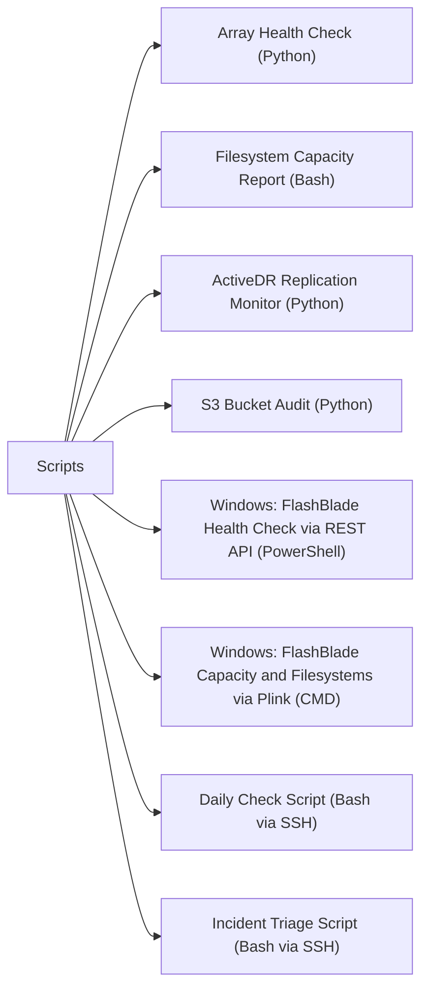

# Scripts

> Part of the [Pure FlashBlade](../) reference.

---



## Array Health Check (Python)

Connect to a FlashBlade via the `py-pure-client` SDK, check blades, hardware, active alerts, file systems, and buckets, then print a health summary. Exits non-zero if alerts or blade failures are detected.

~~~python
#!/usr/bin/env python3
"""
FlashBlade Array Health Check
Requires: pip install py-pure-client
Variables: FB_HOST, FB_API_TOKEN
"""

import os
import sys

try:
    from pypureclient import flashblade
except ImportError:
    sys.exit("ERROR: Install py-pure-client:  pip install py-pure-client")

# -------------------------------------------------------------------
# Configuration
# -------------------------------------------------------------------
FB_HOST  = os.environ.get("FB_HOST",      "")
FB_TOKEN = os.environ.get("FB_API_TOKEN", "")

if not FB_HOST or not FB_TOKEN:
    sys.exit("Set FB_HOST and FB_API_TOKEN environment variables.")

RED  = "\033[0;31m"; YEL  = "\033[0;33m"; GRN  = "\033[0;32m"; NC = "\033[0m"

worst  = 0
issues = []

def crit(msg): global worst; issues.append(("CRITICAL", msg)); worst = max(worst, 2)
def warn(msg): global worst; issues.append(("WARNING",  msg)); worst = max(worst, 1)

# -------------------------------------------------------------------
# Connect
# -------------------------------------------------------------------
try:
    client = flashblade.Client(target=FB_HOST, api_token=FB_TOKEN)
except Exception as exc:
    sys.exit(f"Connection failed: {exc}")

print(f"\n{'='*60}")
print(f"  FlashBlade Health Check: {FB_HOST}")
print(f"{'='*60}\n")

# -------------------------------------------------------------------
# Array info
# -------------------------------------------------------------------
try:
    arr_resp = client.get_arrays()
    if arr_resp.status_code == 200:
        a = list(arr_resp.items)[0]
        print(f"Array  : {a.name}")
        print(f"Purity : {a.os}")
        print()
except Exception as exc:
    warn(f"Cannot get array info: {exc}")

# -------------------------------------------------------------------
# Check: Blades
# -------------------------------------------------------------------
print("Checking blades...")
try:
    blades_resp = client.get_blades()
    blades = list(blades_resp.items) if blades_resp.status_code == 200 else []
    bad_blades = [b for b in blades if getattr(b, "status", "healthy") != "healthy"]
    if bad_blades:
        for b in bad_blades:
            crit(f"Blade {b.name} status: {b.status}")
    else:
        print(f"  {GRN}OK{NC}  All {len(blades)} blades healthy")
except Exception as exc:
    warn(f"Cannot get blade status: {exc}")

# -------------------------------------------------------------------
# Check: Hardware
# -------------------------------------------------------------------
print("Checking hardware components...")
try:
    hw_resp = client.get_hardware()
    hw_items = list(hw_resp.items) if hw_resp.status_code == 200 else []
    bad_hw = [
        h for h in hw_items
        if getattr(h, "status", "ok") not in ("ok", "not_installed", "")
    ]
    if bad_hw:
        for h in bad_hw:
            crit(f"Hardware {h.name} status: {h.status}")
    else:
        print(f"  {GRN}OK{NC}  All hardware components OK ({len(hw_items)} checked)")
except Exception as exc:
    warn(f"Cannot get hardware: {exc}")

# -------------------------------------------------------------------
# Check: Alerts
# -------------------------------------------------------------------
print("Checking active alerts...")
try:
    alerts_resp = client.get_alerts(filter="flagged='true'")
    alerts = list(alerts_resp.items) if alerts_resp.status_code == 200 else []
    crit_alerts = [a for a in alerts if getattr(a, "severity", "") == "error"]
    warn_alerts = [a for a in alerts if getattr(a, "severity", "") == "warning"]

    for a in crit_alerts:
        crit(f"Alert [{a.id}] {a.summary}")
    for a in warn_alerts:
        warn(f"Alert [{a.id}] {a.summary}")
    if not crit_alerts and not warn_alerts:
        print(f"  {GRN}OK{NC}  No flagged alerts")
except Exception as exc:
    warn(f"Cannot get alerts: {exc}")

# -------------------------------------------------------------------
# Check: File systems
# -------------------------------------------------------------------
print("Checking file systems...")
try:
    fs_resp = client.get_file_systems()
    fs_items = list(fs_resp.items) if fs_resp.status_code == 200 else []
    print(f"  File systems: {len(fs_items)} configured")
    for fs in fs_items:
        space = getattr(fs, "space", None)
        if space:
            used       = getattr(space, "virtual", 0) or 0
            provisioned = getattr(fs, "provisioned", 0) or 0
            if provisioned and (used / provisioned) > 0.90:
                warn(f"Filesystem {fs.name} is >90% utilised ({used}/{provisioned} bytes)")
except Exception as exc:
    warn(f"Cannot get file systems: {exc}")

# -------------------------------------------------------------------
# Check: Buckets (object store)
# -------------------------------------------------------------------
print("Checking S3 buckets...")
try:
    bkt_resp = client.get_buckets()
    bkts = list(bkt_resp.items) if bkt_resp.status_code == 200 else []
    print(f"  Buckets: {len(bkts)} configured")
except Exception as exc:
    warn(f"Cannot get buckets: {exc}")

# -------------------------------------------------------------------
# Summary
# -------------------------------------------------------------------
print(f"\n{'='*60}")
label  = ("CRITICAL" if worst == 2 else "WARNING" if worst == 1 else "HEALTHY")
colour = (RED if worst == 2 else YEL if worst == 1 else GRN)
print(f"  {colour}Overall: {label}{NC}")
for level, msg in issues:
    c = RED if level == "CRITICAL" else YEL
    print(f"  {c}[{level}]{NC} {msg}")
print(f"{'='*60}\n")
sys.exit(worst)
~~~

#### How to run this script — step by step

**Before you start — what you need**
- Python 3 installed (download from python.org — tick "Add Python to PATH" during setup)
- Network access to your FlashBlade management IP
- A FlashBlade API token — log in to your FlashBlade GUI at `https://your-flashblade-ip`, go to **Settings → Users**, and create or copy an API token

**Step 1 — Save the file**

1. Open **Notepad** (press the Windows key, type `Notepad`, press Enter)
2. Copy the entire code block above
3. Click **File → Save As**
4. Change "Save as type" to **All Files**
5. Name it `fb_health.py` — save it to your Desktop

**Step 2 — Fill in your details**

| Variable | What to put here | Where to find it |
|---|---|---|
| `FB_HOST` | FlashBlade management IP or hostname | Your storage admin |
| `FB_API_TOKEN` | FlashBlade API token | FlashBlade GUI → Settings → Users → API Tokens |

**Step 3 — Open Command Prompt and install the package**

Press the Windows key, type `cmd`, press Enter:
```
pip install py-pure-client
```

**Step 4 — Set variables and run**

```
set FB_HOST=192.168.1.20
set FB_API_TOKEN=your-token-here
cd %USERPROFILE%\Desktop
python fb_health.py
```

**What you should see**

The script connects and prints the array name and Purity//FB version. It then checks blades (storage modules), hardware components, active alerts, filesystems (flagging any over 90% used), and S3 buckets. Each check shows `OK` in green or lists issues in red/yellow. The final summary line shows HEALTHY, WARNING, or CRITICAL.

---

## Filesystem Capacity Report (Bash)

Run `purefb filesystem list` and produce a formatted capacity table, flagging any filesystems over 80% used. Useful for weekly capacity reviews.

~~~bash
#!/bin/bash
# FlashBlade Filesystem Capacity Report
# Usage: FB_HOST=flashblade01 FB_API_TOKEN=xxx ./fb_fs_report.sh

set -euo pipefail

FB_HOST="${FB_HOST:?Set FB_HOST}"
FB_API_TOKEN="${FB_API_TOKEN:?Set FB_API_TOKEN}"
WARN_PCT="${FB_WARN_PCT:-80}"

export PUREFB_HOST="$FB_HOST"
export PUREFB_API_TOKEN="$FB_API_TOKEN"

RED='\033[0;31m'; YEL='\033[0;33m'; GRN='\033[0;32m'; NC='\033[0m'

echo
echo "=== FlashBlade Filesystem Capacity Report ==="
echo "Array : $FB_HOST  |  Time : $(date)"
echo "Warning threshold: ${WARN_PCT}%"
echo

RAW=$(purefb filesystem list --notree 2>/dev/null)

printf "%-35s %12s %12s %6s  %-6s %-6s  %s\n" \
    "FILESYSTEM" "PROVISIONED" "USED" "PCT" "NFS" "SMB" "STATUS"
printf '%0.s-' {1..100}; echo

total=0; over_warn=0

while IFS= read -r line; do
    [[ "$line" =~ ^(Name|[[:space:]]*$) ]] && continue

    name=$(       awk '{print $1}' <<< "$line")
    provisioned=$(awk '{print $2}' <<< "$line")
    used=$(       awk '{print $3}' <<< "$line")
    nfs=$(        awk '{print $5}' <<< "$line" 2>/dev/null || echo "-")
    smb=$(        awk '{print $6}' <<< "$line" 2>/dev/null || echo "-")

    # Compute percentage (values may be in GiB/TiB; compare raw bytes if possible)
    # Simplified: extract numeric from provisioned and used (assume same unit)
    prov_num=$(grep -oE '^[0-9.]+' <<< "$provisioned" 2>/dev/null || echo "0")
    used_num=$(grep -oE '^[0-9.]+' <<< "$used"        2>/dev/null || echo "0")

    pct=0
    if awk "BEGIN{exit ($prov_num>0)?0:1}" 2>/dev/null; then
        pct=$(awk "BEGIN{printf \"%.0f\", ($used_num/$prov_num)*100}" 2>/dev/null || echo 0)
    fi

    (( total++ ))

    if (( pct >= WARN_PCT )); then
        colour="$YEL"; tag="WARNING"
        (( over_warn++ ))
    else
        colour="$GRN"; tag="OK"
    fi

    printf "%-35s %12s %12s %5d%%  %-6s %-6s  " \
        "$name" "$provisioned" "$used" "$pct" "${nfs:-?}" "${smb:-?}"
    echo -e "${colour}${tag}${NC}"

done <<< "$RAW"

echo
printf '%0.s-' {1..100}; echo
printf "Total filesystems: %d  |  Over %d%%: %d\n" "$total" "$WARN_PCT" "$over_warn"

(( over_warn > 0 )) && echo -e "${YEL}Review filesystems approaching their provisioned limit.${NC}"
exit $(( over_warn > 0 ? 1 : 0 ))
~~~

#### How to run this script — step by step

**Before you start — what you need**
- WSL (Windows Subsystem for Linux) or Git Bash on Windows
- The Pure FlashBlade CLI tool `purefb` — install with `pip install py-pure-client`
- A FlashBlade API token

**Step 1 — Save the file**

1. Open **Notepad** (press the Windows key, type `Notepad`, press Enter)
2. Copy the entire code block above
3. Click **File → Save As**
4. Change "Save as type" to **All Files**
5. Name it `fb_fs_report.sh` — save it to your Desktop

**Step 2 — Fill in your details**

| Variable | What to put here | Where to find it |
|---|---|---|
| `FB_HOST` | FlashBlade management IP or hostname | Your storage admin |
| `FB_API_TOKEN` | FlashBlade API token | FlashBlade GUI → Settings → Users → API Tokens |
| `FB_WARN_PCT` | Percentage threshold for WARNING (default: 80) | Your capacity policy |

**Step 3 — Open WSL**

Open Ubuntu from the Start menu.

**Step 4 — Install, set variables, and run**

```
pip install py-pure-client
export FB_HOST=192.168.1.20
export FB_API_TOKEN=your-token-here
cd /mnt/c/Users/YourName/Desktop
bash fb_fs_report.sh
```

**What you should see**

A table listing each FlashBlade filesystem with its provisioned size, used space, percentage used, NFS/SMB protocol flags, and a status of OK (green) or WARNING (yellow) if over 80% used. A summary at the bottom shows how many filesystems are approaching their limit.

---

## ActiveDR Replication Monitor (Python)

Connect to source and target FlashBlades via the REST API, list all replication links, check status, direction, lag time, and throughput, then alert if any link is not Active or if lag exceeds the RPO threshold.

~~~python
#!/usr/bin/env python3
"""
FlashBlade ActiveDR Replication Monitor
Requires: pip install py-pure-client tabulate
Variables: FB_SRC_HOST, FB_SRC_API_TOKEN, FB_DST_HOST, FB_DST_API_TOKEN
           FB_RPO_MINUTES (default: 15)
"""

import os
import sys

try:
    from pypureclient import flashblade
    from tabulate import tabulate
except ImportError:
    sys.exit("ERROR: pip install py-pure-client tabulate")

# -------------------------------------------------------------------
# Configuration
# -------------------------------------------------------------------
SRC_HOST  = os.environ.get("FB_SRC_HOST",      "")
SRC_TOKEN = os.environ.get("FB_SRC_API_TOKEN", "")
DST_HOST  = os.environ.get("FB_DST_HOST",      "")
DST_TOKEN = os.environ.get("FB_DST_API_TOKEN", "")
RPO_MIN   = int(os.environ.get("FB_RPO_MINUTES", "15"))

if not SRC_HOST or not SRC_TOKEN or not DST_HOST or not DST_TOKEN:
    sys.exit("Set FB_SRC_HOST, FB_SRC_API_TOKEN, FB_DST_HOST, FB_DST_API_TOKEN.")

RED  = "\033[0;31m"; YEL  = "\033[0;33m"; GRN  = "\033[0;32m"; NC = "\033[0m"

worst  = 0
issues = []

def crit(msg): global worst; issues.append(("CRITICAL", msg)); worst = max(worst, 2)
def warn(msg): global worst; issues.append(("WARNING",  msg)); worst = max(worst, 1)

def connect(host, token, label):
    try:
        return flashblade.Client(target=host, api_token=token)
    except Exception as exc:
        crit(f"Cannot connect to {label}: {exc}")
        return None

src = connect(SRC_HOST, SRC_TOKEN, "source")
dst = connect(DST_HOST, DST_TOKEN, "destination")

if not src or not dst:
    for lvl, msg in issues:
        print(f"[{lvl}] {msg}")
    sys.exit(2)

# -------------------------------------------------------------------
# Collect replication links from both endpoints
# -------------------------------------------------------------------
def get_links(client, label):
    try:
        resp = client.get_file_system_replica_links()
        return list(resp.items) if resp.status_code == 200 else []
    except Exception as exc:
        warn(f"Cannot get replica links from {label}: {exc}")
        return []

src_links = get_links(src, "source")
dst_links = get_links(dst, "destination")
all_links = src_links + dst_links

if not all_links:
    print("No replication links found. Is ActiveDR configured?")
    sys.exit(0)

# -------------------------------------------------------------------
# Evaluate each link
# -------------------------------------------------------------------
rows = []
seen = set()

for link in all_links:
    key = (getattr(link, "local_file_system", {}).get("name", "?"),
           getattr(link, "remote_file_system", {}).get("name", "?"))
    if key in seen:
        continue
    seen.add(key)

    local_fs  = getattr(link, "local_file_system",  {})
    remote_fs = getattr(link, "remote_file_system", {})
    status    = getattr(link, "status",    "unknown")
    direction = getattr(link, "direction", "unknown")
    lag_ms    = getattr(link, "lag",       None)
    lag_min   = round(lag_ms / 60000, 1) if lag_ms else 0
    bps       = getattr(link, "bytes_per_sec", 0) or 0

    local_name  = local_fs.get("name",  "?") if isinstance(local_fs, dict)  else getattr(local_fs, "name", "?")
    remote_name = remote_fs.get("name", "?") if isinstance(remote_fs, dict) else getattr(remote_fs, "name", "?")

    if status != "replicating":
        crit(f"{local_name} -> {remote_name}: status={status}")
        flag = f"{RED}NOT ACTIVE{NC}"
    elif lag_min > RPO_MIN:
        warn(f"{local_name} -> {remote_name}: lag={lag_min}m exceeds RPO={RPO_MIN}m")
        flag = f"{YEL}LAG WARN{NC}"
    else:
        flag = f"{GRN}OK{NC}"

    rows.append([
        f"{local_name} -> {remote_name}",
        status,
        direction,
        f"{lag_min} min",
        f"{bps/1024/1024:.1f} MB/s" if bps else "-",
        flag,
    ])

# -------------------------------------------------------------------
# Print table
# -------------------------------------------------------------------
print(f"\nFlashBlade ActiveDR Replication Report")
print(f"Source: {SRC_HOST}  |  Destination: {DST_HOST}  |  RPO threshold: {RPO_MIN} min\n")
print(tabulate(rows, headers=["Link", "Status", "Direction", "Lag", "Throughput", "Health"],
               tablefmt="simple"))

print()
label  = ("CRITICAL" if worst == 2 else "WARNING" if worst == 1 else "ALL LINKS HEALTHY")
colour = (RED if worst == 2 else YEL if worst == 1 else GRN)
print(f"{colour}{label}{NC}")
for lvl, msg in issues:
    c = RED if lvl == "CRITICAL" else YEL
    print(f"  {c}[{lvl}]{NC} {msg}")
sys.exit(worst)
~~~

#### How to run this script — step by step

**Before you start — what you need**
- Python 3 installed (python.org — tick "Add Python to PATH")
- API tokens for **both** FlashBlades in your ActiveDR pair
- Network access to both FlashBlade management IPs

**Step 1 — Save the file**

1. Open **Notepad** (press the Windows key, type `Notepad`, press Enter)
2. Copy the entire code block above
3. Click **File → Save As**
4. Change "Save as type" to **All Files**
5. Name it `fb_activedr.py` — save it to your Desktop

**Step 2 — Fill in your details**

| Variable | What to put here | Where to find it |
|---|---|---|
| `FB_SRC_HOST` | Source FlashBlade management IP | Your storage admin |
| `FB_SRC_API_TOKEN` | API token for source FlashBlade | FlashBlade GUI → Settings → Users → API Tokens |
| `FB_DST_HOST` | Destination FlashBlade management IP | Your storage admin |
| `FB_DST_API_TOKEN` | API token for destination FlashBlade | FlashBlade GUI → Settings → Users → API Tokens |
| `FB_RPO_MINUTES` | Maximum acceptable lag in minutes (default: 15) | Your DR policy |

**Step 3 — Open Command Prompt and install packages**

```
pip install py-pure-client tabulate
```

**Step 4 — Set variables and run**

```
set FB_SRC_HOST=192.168.1.20
set FB_SRC_API_TOKEN=source-token
set FB_DST_HOST=192.168.2.20
set FB_DST_API_TOKEN=destination-token
cd %USERPROFILE%\Desktop
python fb_activedr.py
```

**What you should see**

A table listing all ActiveDR replication links showing source/destination filesystem pair, replication status, direction, current lag time, and throughput. Links that are not actively replicating show `NOT ACTIVE` in red. Links with lag above your RPO threshold show `LAG WARN` in yellow. A summary at the bottom shows the overall health.

---

## S3 Bucket Audit (Python)

Connect to a FlashBlade S3 endpoint using `boto3`, list all buckets, count objects and total size per bucket using a paginator, and flag buckets with versioning enabled and large object counts.

~~~python
#!/usr/bin/env python3
"""
FlashBlade S3 Bucket Audit
Requires: pip install boto3 tabulate
Variables: FB_S3_ENDPOINT, AWS_ACCESS_KEY_ID, AWS_SECRET_ACCESS_KEY
           FB_VERSION_WARN_COUNT (default: 10000)
"""

import os
import sys

try:
    import boto3
    from botocore.config import Config
    from tabulate import tabulate
except ImportError:
    sys.exit("ERROR: pip install boto3 tabulate")

# -------------------------------------------------------------------
# Configuration
# -------------------------------------------------------------------
ENDPOINT    = os.environ.get("FB_S3_ENDPOINT",      "")
ACCESS_KEY  = os.environ.get("AWS_ACCESS_KEY_ID",   "")
SECRET_KEY  = os.environ.get("AWS_SECRET_ACCESS_KEY","")
VERSION_WARN = int(os.environ.get("FB_VERSION_WARN_COUNT", "10000"))

if not ENDPOINT or not ACCESS_KEY or not SECRET_KEY:
    sys.exit("Set FB_S3_ENDPOINT, AWS_ACCESS_KEY_ID, AWS_SECRET_ACCESS_KEY.")

YEL = "\033[0;33m"; GRN = "\033[0;32m"; NC = "\033[0m"

# -------------------------------------------------------------------
# Connect to FlashBlade S3
# -------------------------------------------------------------------
session = boto3.Session(
    aws_access_key_id=ACCESS_KEY,
    aws_secret_access_key=SECRET_KEY,
)
s3 = session.client(
    "s3",
    endpoint_url=ENDPOINT,
    config=Config(signature_version="s3v4"),
    verify=False,   # set to True in production with a valid cert
)

# -------------------------------------------------------------------
# List all buckets
# -------------------------------------------------------------------
try:
    response = s3.list_buckets()
    buckets  = response.get("Buckets", [])
except Exception as exc:
    sys.exit(f"Cannot list buckets: {exc}")

if not buckets:
    print("No S3 buckets found.")
    sys.exit(0)

print(f"\nFlashBlade S3 Bucket Audit: {ENDPOINT}")
print(f"Buckets found: {len(buckets)}\n")

# -------------------------------------------------------------------
# Audit each bucket
# -------------------------------------------------------------------
rows = []

for bucket in buckets:
    name = bucket["Name"]

    # Check versioning
    try:
        ver = s3.get_bucket_versioning(Bucket=name)
        versioning = ver.get("Status", "Disabled")
    except Exception:
        versioning = "Unknown"

    # Count objects and total size via paginator
    obj_count = 0
    total_bytes = 0
    try:
        paginator = s3.get_paginator("list_objects_v2")
        for page in paginator.paginate(Bucket=name):
            contents = page.get("Contents", [])
            obj_count   += len(contents)
            total_bytes += sum(o.get("Size", 0) for o in contents)
    except Exception as exc:
        obj_count = -1
        total_bytes = -1

    total_gb = total_bytes / (1024 ** 3) if total_bytes >= 0 else -1

    # Flag: versioning enabled with high object count
    flag = ""
    if versioning == "Enabled" and obj_count > VERSION_WARN:
        flag = f"{YEL}VERSION WARN (many objects){NC}"
    elif obj_count >= 0:
        flag = f"{GRN}OK{NC}"
    else:
        flag = "(scan error)"

    rows.append([
        name,
        f"{obj_count:,}" if obj_count >= 0 else "error",
        f"{total_gb:.2f} GB" if total_gb >= 0 else "error",
        versioning,
        flag,
    ])

# Sort by total_bytes descending; objects with -1 go last
rows_sortable = [
    (r, float(r[2].replace(" GB","").replace(",","")) if "GB" in r[2] else -1)
    for r in rows
]
rows_sorted = [r for r, _ in sorted(rows_sortable, key=lambda x: -x[1])]

print(tabulate(
    rows_sorted,
    headers=["Bucket", "Objects", "Total Size", "Versioning", "Flag"],
    tablefmt="simple",
))

print(f"\nNote: Buckets with versioning enabled and >{VERSION_WARN:,} objects may have significant version overhead.")
print("Review with:  s3cmd versions s3://<bucket>  or  aws s3api list-object-versions --bucket <bucket>")
~~~

#### How to run this script — step by step

**Before you start — what you need**
- Python 3 installed (python.org — tick "Add Python to PATH")
- S3 access credentials for your FlashBlade — these are Object Store user credentials, not admin credentials. Create an Object Store user in the FlashBlade GUI under **Settings → Object Store Users** and generate an access key/secret key pair
- The FlashBlade S3 endpoint URL, typically `https://your-flashblade-ip` or a data VIP

**Step 1 — Save the file**

1. Open **Notepad** (press the Windows key, type `Notepad`, press Enter)
2. Copy the entire code block above
3. Click **File → Save As**
4. Change "Save as type" to **All Files**
5. Name it `fb_s3_audit.py` — save it to your Desktop

**Step 2 — Fill in your details**

| Variable | What to put here | Where to find it |
|---|---|---|
| `FB_S3_ENDPOINT` | FlashBlade S3 endpoint URL, e.g. `https://192.168.1.20` | Your storage admin |
| `AWS_ACCESS_KEY_ID` | S3 access key ID | FlashBlade GUI → Settings → Object Store Users |
| `AWS_SECRET_ACCESS_KEY` | S3 secret access key | FlashBlade GUI → Settings → Object Store Users |

**Step 3 — Open Command Prompt and install packages**

```
pip install boto3 tabulate
```

**Step 4 — Set variables and run**

```
set FB_S3_ENDPOINT=https://192.168.1.20
set AWS_ACCESS_KEY_ID=your-access-key
set AWS_SECRET_ACCESS_KEY=your-secret-key
cd %USERPROFILE%\Desktop
python fb_s3_audit.py
```

**What you should see**

A table sorted by bucket size (largest first) showing each bucket's name, object count, total size in GB, versioning status, and a flag. Buckets with versioning enabled and more than 10,000 objects are flagged in yellow — these may have high version overhead consuming unexpected capacity. A note at the bottom shows how to review object versions in detail.

---

## Windows: FlashBlade Health Check via REST API (PowerShell)

Authenticate to the FlashBlade REST API, retrieve array information, active alerts, and hardware component health, then print a formatted health summary. Works from any Windows PC on the same network.

~~~powershell
# fb_health_rest.ps1 — FlashBlade Health Check via REST API (Windows PowerShell)
# Requires: PowerShell 5.1+ (pre-installed on Windows 10/11)
# Run: .\fb_health_rest.ps1

$FbHost   = "192.168.1.20"         # Your FlashBlade management IP or hostname
$ApiToken = "your-api-token-here"  # Found in FlashBlade GUI: Settings -> Users -> API Tokens

# Handle self-signed SSL certificates
if (-not ([System.Management.Automation.PSTypeName]'TrustAll').Type) {
    Add-Type @"
    using System.Net; using System.Security.Cryptography.X509Certificates;
    public class TrustAll : ICertificatePolicy {
        public bool CheckValidationResult(ServicePoint s, X509Certificate c, WebRequest r, int p) { return true; }
    }
"@
    [System.Net.ServicePointManager]::CertificatePolicy = New-Object TrustAll
}
[Net.ServicePointManager]::SecurityProtocol = [Net.SecurityProtocolType]::Tls12

# FlashBlade REST API version — check your Purity//FB version for the right one
$ApiVersion = "2.3"
$ApiBase    = "https://$FbHost/api/$ApiVersion"

# --- Step 1: Authenticate ---
Write-Host "`nAuthenticating to FlashBlade $FbHost ..." -ForegroundColor Cyan

try {
    $LoginResp = Invoke-WebRequest `
        -Uri     "$ApiBase/login" `
        -Method  POST `
        -Headers @{ "api-token" = $ApiToken } `
        -UseBasicParsing `
        -ErrorAction Stop
} catch {
    Write-Error "Authentication failed: $($_.Exception.Message)"
    exit 1
}

$AuthToken = $LoginResp.Headers["x-auth-token"]
if (-not $AuthToken) {
    Write-Error "No x-auth-token returned. Check API token."
    exit 1
}

$AuthHeaders = @{ "x-auth-token" = $AuthToken; "Content-Type" = "application/json" }
Write-Host "Authenticated successfully." -ForegroundColor Green

function Invoke-FbApi {
    param([string]$Path)
    try {
        return Invoke-RestMethod -Uri "$ApiBase$Path" -Headers $AuthHeaders -Method GET -ErrorAction Stop
    } catch {
        Write-Warning "API call failed for $Path : $($_.Exception.Message)"
        return $null
    }
}

Write-Host "`n=== FlashBlade Health Summary ===" -ForegroundColor Cyan
Write-Host ("-" * 60)

# --- Array info ---
$arrays = Invoke-FbApi "/arrays"
if ($arrays -and $arrays.items -and $arrays.items.Count -gt 0) {
    $arr = $arrays.items[0]
    Write-Host "Array Name  : $($arr.name)"
    Write-Host "Purity//FB  : $($arr.os)"
    $usedTiB  = [math]::Round($arr.space.total_physical / 1TB, 2)
    Write-Host "Used Space  : $usedTiB TiB"
}

# --- Active alerts ---
Write-Host "`n--- Alerts ---"
$alerts = Invoke-FbApi "/alerts?filter=flagged%3D%27true%27"
if ($alerts -and $alerts.items -and $alerts.items.Count -gt 0) {
    foreach ($alert in $alerts.items) {
        $colour = if ($alert.severity -eq "error") { "Red" } else { "Yellow" }
        Write-Host "  [$($alert.severity.ToUpper())] $($alert.summary)" -ForegroundColor $colour
    }
} else {
    Write-Host "  No active alerts." -ForegroundColor Green
}

# --- Hardware component health ---
Write-Host "`n--- Hardware Components ---"
$hw = Invoke-FbApi "/hardware"
if ($hw -and $hw.items) {
    $badHw = $hw.items | Where-Object { $_.status -notin @("ok", "not_installed", "") }
    if ($badHw -and $badHw.Count -gt 0) {
        Write-Host "  $($badHw.Count) component(s) NOT OK:" -ForegroundColor Red
        foreach ($h in $badHw) {
            Write-Host "    $($h.name): status=$($h.status)" -ForegroundColor Red
        }
    } else {
        Write-Host "  All $($hw.items.Count) hardware components are OK." -ForegroundColor Green
    }
}

# --- Logout ---
try {
    Invoke-RestMethod -Uri "$ApiBase/logout" -Method DELETE -Headers $AuthHeaders -ErrorAction SilentlyContinue | Out-Null
} catch {}

Write-Host "`n=== Health check complete ===" -ForegroundColor Cyan
~~~

#### How to run this script — step by step

**Before you start — what you need**
- A Windows 10 or Windows 11 PC (PowerShell is already installed — nothing to download)
- Network access to your FlashBlade management IP
- A FlashBlade API token — log in to the FlashBlade GUI at `https://your-flashblade-ip`, go to **Settings → Users**, and create or copy an API token

**Step 1 — Save the file**

1. Open **Notepad** (press the Windows key, type `Notepad`, press Enter)
2. Copy the entire code block above
3. Click **File → Save As**
4. Change "Save as type" to **All Files**
5. Name it `fb_health_rest.ps1` — save it to your Desktop

**Step 2 — Fill in your details**

Open the saved file in Notepad and change these lines near the top:

| Variable | What to put here | Where to find it |
|---|---|---|
| `$FbHost` | FlashBlade management IP or hostname | Your storage admin |
| `$ApiToken` | Your FlashBlade API token | FlashBlade GUI → Settings → Users → API Tokens |
| `$ApiVersion` | REST API version (default: 2.3) | Check your Purity//FB version — use 2.3 for most deployments |

**Step 3 — Open PowerShell as Administrator**

Press the Windows key, type `PowerShell`, right-click **Windows PowerShell**, choose **Run as Administrator**.

**Step 4 — Allow script execution (one-time per session)**

```
Set-ExecutionPolicy -Scope Process -ExecutionPolicy Bypass
```

**Step 5 — Run the script**

```
cd C:\Users\YourName\Desktop
.\fb_health_rest.ps1
```

**What you should see**

The script authenticates and prints the FlashBlade array name, Purity//FB version, and used space. Then it lists any active (flagged) alerts in red (errors) or yellow (warnings). Finally it checks all hardware components — any component not in "ok" or "not_installed" state is listed in red. If everything is fine, all three sections show green confirmations.

---

## Windows: FlashBlade Capacity and Filesystems via Plink (CMD)

Use plink.exe to SSH into your FlashBlade and run the Purity CLI commands to list array capacity, alerts, and filesystems. Works from any Windows Command Prompt.

~~~batch
@echo off
REM fb_capacity_report.bat — FlashBlade Capacity and Filesystems via Plink (Windows CMD)
REM Uses plink.exe (part of PuTTY) to SSH into the FlashBlade.
REM Download PuTTY from: https://www.putty.org (free, trusted tool)
REM
REM FIRST-TIME SETUP: Run once to accept the FlashBlade host fingerprint:
REM   plink.exe -ssh pureuser@192.168.1.20
REM   Type 'y' when asked, then Ctrl+C to exit.

set FB_HOST=192.168.1.20
set SSH_USER=pureuser
set PLINK=plink.exe

echo.
echo === FlashBlade Capacity and Filesystem Report ===
echo Array: %FB_HOST%
echo Time: %date% %time%
echo.

REM --- Array capacity overview ---
echo --- Array Capacity ---
%PLINK% -ssh -l %SSH_USER% -batch %FB_HOST% "purity fb-array list"
if %ERRORLEVEL% neq 0 (
    echo ERROR: Could not connect to %FB_HOST%. Check hostname and that plink.exe is in PATH.
    goto :end
)

echo.

REM --- Active alerts ---
echo --- Active Alerts ---
%PLINK% -ssh -l %SSH_USER% -batch %FB_HOST% "purity alert list"

echo.

REM --- Filesystem list ---
echo --- Filesystems ---
%PLINK% -ssh -l %SSH_USER% -batch %FB_HOST% "purity fs list"

echo.
echo === Report complete ===

:end
~~~

#### How to run this script — step by step

**Before you start — what you need**
- PuTTY installed (download from putty.org — it is free). Make sure `plink.exe` is available
- Network access to your FlashBlade management IP
- SSH access to the FlashBlade — the default SSH user is `pureuser`

**Step 1 — Save the file**

1. Open **Notepad** (press the Windows key, type `Notepad`, press Enter)
2. Copy the entire code block above
3. Click **File → Save As**
4. Change "Save as type" to **All Files**
5. Name it `fb_capacity_report.bat` — save it to your Desktop

**Step 2 — Fill in your details**

Open the saved file in Notepad and change these lines near the top:

| Variable | What to put here | Where to find it |
|---|---|---|
| `FB_HOST` | FlashBlade management IP or hostname | Your storage admin |
| `SSH_USER` | SSH username (default: `pureuser`) | Your storage admin |

**Step 3 — First-time host key acceptance**

Open Command Prompt and run:
```
plink.exe -ssh pureuser@192.168.1.20
```
Type `y` when prompted, then press Ctrl+C.

**Step 4 — Add your password (optional)**

For unattended use, add `-pw yourpassword` after `-batch` on each plink line.

**Step 5 — Run the script**

Double-click `fb_capacity_report.bat` on your Desktop, or run from Command Prompt:
```
cd %USERPROFILE%\Desktop
fb_capacity_report.bat
```

**What you should see**

Three sections: overall array capacity from `purity fb-array list`, any active alerts from `purity alert list`, and a list of all filesystems with their size and usage from `purity fs list`. This is a quick read-only health snapshot using only SSH and the built-in FlashBlade Purity CLI.

---

## Daily Check Script (Bash via SSH)

Connect to a FlashBlade via SSH using the `purity` CLI, check array status, active alerts, hardware health, and filesystem capacity. Flag any filesystem over 80% used or any hardware component not healthy. Exit 0 for PASS, 1 for FAIL.

~~~bash
#!/bin/bash
# fb_daily_check.sh
# Usage: FB_HOST=flashblade01 SSH_USER=pureuser ./fb_daily_check.sh

FB_HOST="${FB_HOST:?Set FB_HOST}"
SSH_USER="${SSH_USER:-pureuser}"
WARN_PCT="${WARN_PCT:-80}"

SSH="ssh -o StrictHostKeyChecking=no -o ConnectTimeout=10 ${SSH_USER}@${FB_HOST}"
RED='\033[0;31m'; GRN='\033[0;32m'; YEL='\033[0;33m'; NC='\033[0m'
FAIL=0

pass() { echo -e "  ${GRN}[PASS]${NC} $*"; }
fail() { echo -e "  ${RED}[FAIL]${NC} $*"; FAIL=1; }
warn() { echo -e "  ${YEL}[WARN]${NC} $*"; }

echo "=== FlashBlade Daily Check: ${FB_HOST} ==="
echo "Time: $(date)"
echo

# Array info
echo "--- Array Info ---"
$SSH "purity fb-array list" 2>/dev/null || fail "Cannot connect or run purity commands"

echo
echo "--- Active Alerts ---"
ALERTS=$($SSH "purity alert list" 2>/dev/null)
CRIT=$(echo "$ALERTS" | grep -ic 'critical' || true)
WARN_COUNT=$(echo "$ALERTS" | grep -ic 'warning' || true)
if [[ $CRIT -gt 0 ]]; then
    fail "$CRIT critical alert(s) active"
    echo "$ALERTS" | grep -i 'critical'
elif [[ $WARN_COUNT -gt 0 ]]; then
    warn "$WARN_COUNT warning alert(s) active"
else
    pass "No active alerts"
fi

echo
echo "--- Hardware Health ---"
HW=$($SSH "purity hardware list" 2>/dev/null)
HW_FAIL=$(echo "$HW" | awk 'NR>1 && $NF!="healthy" && $NF!="ok" && $NF!="" {print}')
if [[ -n "$HW_FAIL" ]]; then
    fail "Unhealthy hardware components detected:"
    echo "$HW_FAIL"
else
    pass "All hardware components healthy"
fi

echo
echo "--- Filesystem Capacity ---"
FS=$($SSH "purity fs list --space" 2>/dev/null)
FS_OVER=$(echo "$FS" | awk -v thr="$WARN_PCT" 'NR>1 {
    gsub(/%/, "", $NF)
    if ($NF+0 > thr+0) print $0
}')
if [[ -n "$FS_OVER" ]]; then
    fail "Filesystems over ${WARN_PCT}% used:"
    echo "$FS_OVER"
else
    pass "All filesystems below ${WARN_PCT}% used"
fi

echo
if [[ $FAIL -eq 0 ]]; then
    echo -e "${GRN}RESULT: PASS${NC}"
else
    echo -e "${RED}RESULT: FAIL${NC}"
fi
exit $FAIL
~~~

---

## Incident Triage Script (Bash via SSH)

Capture a full snapshot of array state to a timestamped file for incident investigation. Collects array info, all alerts, hardware status, filesystem stats, network interfaces, and pod status.

~~~bash
#!/bin/bash
# fb_incident_triage.sh
# Usage: FB_HOST=flashblade01 SSH_USER=pureuser ./fb_incident_triage.sh

FB_HOST="${FB_HOST:?Set FB_HOST}"
SSH_USER="${SSH_USER:-pureuser}"
TS=$(date '+%Y%m%d_%H%M%S')
OUT="fb_triage_${FB_HOST}_${TS}.txt"

SSH="ssh -o StrictHostKeyChecking=no -o ConnectTimeout=10 ${SSH_USER}@${FB_HOST}"

log() { echo "$*" | tee -a "$OUT"; }

log "=== FlashBlade Incident Triage: ${FB_HOST} ==="
log "Timestamp: $(date)"
log "Output file: ${OUT}"
log ""

for section in \
    "Array Info:purity fb-array list" \
    "All Alerts:purity alert list" \
    "Hardware Status:purity hardware list" \
    "Filesystem Stats:purity fs list --space" \
    "Network Interfaces:purity network list" \
    "Pod Status:purity pod list"
do
    label="${section%%:*}"
    cmd="${section#*:}"
    log "--- ${label} ---"
    $SSH "$cmd" 2>&1 | tee -a "$OUT"
    log ""
done

echo
echo "Triage data saved to: ${OUT}"
~~~

---

## Change Pre-Check Script (Bash via SSH)

Run before any maintenance window on a FlashBlade. Verifies no active critical alerts, all hardware healthy, filesystems below 85% used, and both controllers healthy. Exits 2 if any check fails.

~~~bash
#!/bin/bash
# fb_precheck.sh
# Usage: FB_HOST=flashblade01 SSH_USER=pureuser ./fb_precheck.sh

FB_HOST="${FB_HOST:?Set FB_HOST}"
SSH_USER="${SSH_USER:-pureuser}"
FS_MAX_PCT=85
EXIT_CODE=0

SSH="ssh -o StrictHostKeyChecking=no -o ConnectTimeout=10 ${SSH_USER}@${FB_HOST}"
RED='\033[0;31m'; GRN='\033[0;32m'; NC='\033[0m'

go()   { echo -e "  ${GRN}[GO]${NC}    $*"; }
nogo() { echo -e "  ${RED}[NO-GO]${NC} $*"; EXIT_CODE=2; }

echo "=== FlashBlade Change Pre-Check: ${FB_HOST} ==="
echo "Time: $(date)"
echo

# Check 1: No active critical alerts
CRIT=$($SSH "purity alert list" 2>/dev/null | grep -ic 'critical' || true)
if [[ $CRIT -gt 0 ]]; then
    nogo "$CRIT critical alert(s) active — resolve before change"
else
    go "No critical alerts"
fi

# Check 2: All hardware healthy
HW_FAIL=$($SSH "purity hardware list" 2>/dev/null | awk 'NR>1 && $NF!="healthy" && $NF!="ok" && $NF!=""' | wc -l | tr -d ' ')
if [[ $HW_FAIL -gt 0 ]]; then
    nogo "$HW_FAIL hardware component(s) not healthy"
else
    go "All hardware components healthy"
fi

# Check 3: Filesystems below 85%
FS_OVER=$($SSH "purity fs list --space" 2>/dev/null | awk -v thr="$FS_MAX_PCT" 'NR>1 {
    gsub(/%/, "", $NF); if ($NF+0 >= thr+0) print $1
}')
if [[ -n "$FS_OVER" ]]; then
    nogo "Filesystem(s) at or above ${FS_MAX_PCT}%: $FS_OVER"
else
    go "All filesystems below ${FS_MAX_PCT}%"
fi

# Check 4: Both controllers healthy (CT0 + CT1)
CTLR=$($SSH "purity array list" 2>/dev/null)
CT_FAIL=$(echo "$CTLR" | grep -ic 'degraded\|failed\|offline' || true)
if [[ $CT_FAIL -gt 0 ]]; then
    nogo "One or more controllers not healthy"
else
    go "Both controllers healthy"
fi

echo
if [[ $EXIT_CODE -eq 0 ]]; then
    echo -e "${GRN}VERDICT: GO — safe to proceed${NC}"
else
    echo -e "${RED}VERDICT: NO-GO — resolve issues before proceeding${NC}"
fi
exit $EXIT_CODE
~~~

---

## Post-Change Validation Script (Bash via SSH)

Run after a maintenance window or blade firmware upgrade. Performs the same checks as pre-check and additionally confirms blade firmware matches the expected version.

~~~bash
#!/bin/bash
# fb_postcheck.sh
# Usage: FB_HOST=flashblade01 SSH_USER=pureuser [EXPECTED_FW=3.3.7] ./fb_postcheck.sh

FB_HOST="${FB_HOST:?Set FB_HOST}"
SSH_USER="${SSH_USER:-pureuser}"
EXPECTED_FW="${EXPECTED_FW:-}"
FS_MAX_PCT=85
EXIT_CODE=0

SSH="ssh -o StrictHostKeyChecking=no -o ConnectTimeout=10 ${SSH_USER}@${FB_HOST}"
RED='\033[0;31m'; GRN='\033[0;32m'; YEL='\033[0;33m'; NC='\033[0m'

ok()   { echo -e "  ${GRN}[OK]${NC}   $*"; }
fail() { echo -e "  ${RED}[FAIL]${NC} $*"; EXIT_CODE=1; }
warn() { echo -e "  ${YEL}[WARN]${NC} $*"; }

echo "=== FlashBlade Post-Change Validation: ${FB_HOST} ==="
echo "Time: $(date)"
echo

# Check 1: No critical alerts
CRIT=$($SSH "purity alert list" 2>/dev/null | grep -ic 'critical' || true)
[[ $CRIT -gt 0 ]] && fail "$CRIT critical alert(s)" || ok "No critical alerts"

# Check 2: All hardware healthy
HW_FAIL=$($SSH "purity hardware list" 2>/dev/null | awk 'NR>1 && $NF!="healthy" && $NF!="ok" && $NF!=""' | wc -l | tr -d ' ')
[[ $HW_FAIL -gt 0 ]] && fail "$HW_FAIL hardware component(s) not healthy" || ok "All hardware components healthy"

# Check 3: Filesystems below 85%
FS_OVER=$($SSH "purity fs list --space" 2>/dev/null | awk -v thr="$FS_MAX_PCT" 'NR>1 {
    gsub(/%/, "", $NF); if ($NF+0 >= thr+0) print $1
}')
[[ -n "$FS_OVER" ]] && fail "Filesystem(s) at or above ${FS_MAX_PCT}%: $FS_OVER" || ok "All filesystems below ${FS_MAX_PCT}%"

# Check 4: Controller health
CT_FAIL=$($SSH "purity array list" 2>/dev/null | grep -ic 'degraded\|failed\|offline' || true)
[[ $CT_FAIL -gt 0 ]] && fail "Controller health issue detected" || ok "Both controllers healthy"

# Check 5: Blade firmware (if EXPECTED_FW set)
if [[ -n "$EXPECTED_FW" ]]; then
    FW_MISMATCH=$($SSH "purity hardware list" 2>/dev/null | awk -v fw="$EXPECTED_FW" '$0 ~ /blade/ && $0 !~ fw {print $1}')
    if [[ -n "$FW_MISMATCH" ]]; then
        fail "Blade(s) not at expected firmware ${EXPECTED_FW}: $FW_MISMATCH"
    else
        ok "All blades at expected firmware ${EXPECTED_FW}"
    fi
else
    warn "EXPECTED_FW not set — skipping firmware version check"
fi

echo
[[ $EXIT_CODE -eq 0 ]] && echo -e "${GRN}RESULT: PASS${NC}" || echo -e "${RED}RESULT: FAIL${NC}"
exit $EXIT_CODE
~~~

---

## Health Check Script (Bash, cron-safe)

Lightweight cron-safe script. Outputs array model/version, active alert counts (CRIT/WARN), hardware status, and filesystem usage summary. Exits 0 (healthy), 1 (warning), or 2 (critical).

~~~bash
#!/bin/bash
# fb_health.sh — cron-safe FlashBlade health check
# Usage: FB_HOST=flashblade01 SSH_USER=pureuser ./fb_health.sh
# Cron: */15 * * * * FB_HOST=fb01 SSH_USER=pureuser /opt/scripts/fb_health.sh >> /var/log/fb_health.log 2>&1

FB_HOST="${FB_HOST:?Set FB_HOST}"
SSH_USER="${SSH_USER:-pureuser}"
SSH="ssh -o StrictHostKeyChecking=no -o ConnectTimeout=10 -o BatchMode=yes ${SSH_USER}@${FB_HOST}"

TS=$(date '+%Y-%m-%d %H:%M:%S')
worst=0

# Array info
ARRAY_INFO=$($SSH "purity fb-array list" 2>/dev/null | head -4)

# Alert counts
CRIT_COUNT=$($SSH "purity alert list" 2>/dev/null | grep -ic 'critical' || echo 0)
WARN_COUNT=$($SSH "purity alert list" 2>/dev/null | grep -ic 'warning' || echo 0)

# Hardware: count non-healthy
HW_FAIL=$($SSH "purity hardware list" 2>/dev/null | awk 'NR>1 && $NF!="healthy" && $NF!="ok" && $NF!=""' | wc -l | tr -d ' ')

# Filesystem summary: highest % used
FS_MAX=$($SSH "purity fs list --space" 2>/dev/null | awk 'NR>1 {gsub(/%/,""); print $NF+0}' | sort -n | tail -1)
FS_MAX="${FS_MAX:-0}"

# Determine exit code
[[ $CRIT_COUNT -gt 0 || $HW_FAIL -gt 0 ]] && worst=2
[[ $worst -lt 2 && ( $WARN_COUNT -gt 0 || $FS_MAX -ge 80 ) ]] && worst=1

STATUS="HEALTHY"
[[ $worst -eq 1 ]] && STATUS="WARNING"
[[ $worst -eq 2 ]] && STATUS="CRITICAL"

echo "[${TS}] ${FB_HOST} | ${STATUS} | CRIT_ALERTS=${CRIT_COUNT} WARN_ALERTS=${WARN_COUNT} HW_FAIL=${HW_FAIL} FS_MAX_PCT=${FS_MAX}%"
exit $worst
~~~
