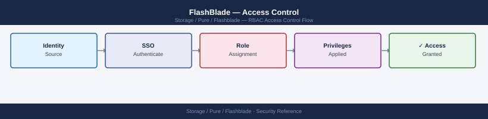
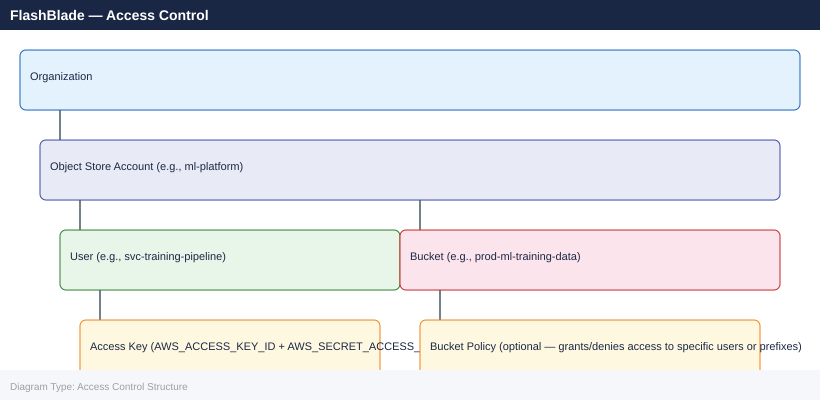

---
tags:
  - pure
  - security
---
# FlashBlade — Access Control


<div class="kb-summary">
FlashBlade access control: `pureadmin`, role-based management (`array_admin`, `ops_admin`, `readonly`), AD/LDAP group mapping, and API token scoping.

*Applies to: FlashBlade Purity//FB 4.x*
</div>



---

This page covers Purity//FB role-based access control (RBAC), NFS export policy access control, S3 bucket policies, SMB share permissions, and the principle of least privilege applied to FlashBlade operations.

---

```d2
direction: down

external: External / Untrusted {shape: rectangle}
admin_rbac: "Admin RBAC" {shape: rectangle}
nfs_export_policy_access_control: "NFS Export Policy Access Control" {shape: rectangle}
s3_bucket_access_control: "S3 Bucket Access Control" {shape: rectangle}
smb_share_permissions: "SMB Share Permissions" {shape: rectangle}
audit_logging: "Audit Logging" {shape: rectangle}
access_control_review_checklist: "Access Control Review Checklist" {shape: rectangle}
core: "FlashBlade Core" {shape: hexagon}

external -> admin_rbac: traffic in
admin_rbac -> nfs_export_policy_access_control
nfs_export_policy_access_control -> s3_bucket_access_control
s3_bucket_access_control -> smb_share_permissions
smb_share_permissions -> audit_logging
audit_logging -> access_control_review_checklist
access_control_review_checklist -> core: secured path
```

## Before you begin

- **Access:** Storage admin credentials (cluster admin or equivalent)
- **Change management:** security changes require CAB approval in most environments
- **Rollback plan:** document current state before any security control change
- **Testing:** validate in a non-production environment first where possible

---

## Admin RBAC

Purity//FB uses role-based access control with the following built-in roles:

| Role | Permissions | Use Case |
|---|---|---|
| `array_admin` | Full administrative access including system configuration, user management, network, and protocol settings | Array administrators responsible for full platform management; restrict to named senior engineers only |
| `storage_admin` | Manage filesystems, buckets, snapshots, and replication; cannot modify system or user configuration | Storage operations team creating and managing data resources; backup tool service accounts |
| `ops_admin` | Read access plus ability to acknowledge and resolve alerts; cannot modify configuration | Operations centre staff performing monitoring and alert response |
| `readonly` | Read-only access to all configuration and status information | Auditors, capacity planners, monitoring integrations using read-only queries |

**Principle of least privilege:** assign the minimum role required. Backup service accounts need `storage_admin` to create and delete snapshots; monitoring tools reading metrics need only `readonly`. No service account should hold `array_admin` unless it explicitly needs to manage users or system configuration.

```bash
# List all users and their assigned roles
purefb admin list

# Create a user with the minimum required role
purefb admin create --name svc-veeam --role storage_admin
purefb admin create --name svc-monitoring --role readonly

# Change a user's role
purefb admin update --name s.jones --role storage_admin

# List AD/LDAP group-to-role mappings
purefb admin list --groups
```

---

## NFS Export Policy Access Control

NFS export policies on FlashBlade control which clients can mount a filesystem and what operations they are permitted to perform. Export policies are applied per-filesystem and support multiple rules — each rule matches a client source (IP or CIDR) and defines the permissions for that source.

### Export Policy Rule Components

| Parameter | Values | Description |
|---|---|---|
| Client source | IP, CIDR, or `*` | Which hosts can mount; use CIDR ranges; avoid `*` in production |
| Access permission | `rw`, `ro` | Read-write or read-only |
| Root squash | `root_squash`, `no_root_squash` | Map root (UID 0) from the client to the anonymous UID to prevent root privilege escalation |
| UID/GID mapping | Requires LDAP | UID 0 from the client is mapped to nobody unless `no_root_squash` is set |

### Configure NFS Export Rules

```bash
# Restrict to a specific subnet with root squash (production standard)
purefb filesystem update \
    --name prod-ml-training-data \
    --nfs-rules "10.0.1.0/24(rw,root_squash)"

# Multiple rules — GPU cluster gets RW, monitoring subnet gets RO
purefb filesystem update \
    --name prod-ml-training-data \
    --nfs-rules "10.0.1.0/24(rw,root_squash):10.0.5.0/24(ro)"

# Backup server gets its own rule with no_root_squash (Veeam requirement)
purefb filesystem update \
    --name prod-veeam-daily \
    --nfs-rules "10.0.10.50/32(rw,no_root_squash)"

# Verify the current export rules on a filesystem
purefb filesystem list --name prod-ml-training-data
```

### Export Policy Best Practices

| Requirement | Configuration |
|---|---|
| Lock down production filesystems | Use specific CIDR ranges — never `*` in production |
| Prevent root privilege escalation via NFS | Always use `root_squash` unless the application explicitly requires `no_root_squash` (e.g., Veeam backup servers) |
| Read-only for consumer workloads | Use `ro` for analytics or monitoring clients that only read data |
| Separate backup from production mounts | Create dedicated filesystems for backup workloads so production clients cannot mount the backup target |
| Enforce NFSv4.1 for sensitive data | NFSv4.1 supports Kerberos (`sec=krb5p`) for authentication and encryption — use it for regulated workloads |

---

## S3 Bucket Access Control

FlashBlade S3 access control uses a two-layer model: object store accounts own buckets and define tenant isolation, and per-user access keys provide the S3 API credentials. Bucket policies add fine-grained access rules on top of the account model.

### Object Store Account Model



### Create Accounts, Users, and Access Keys

```bash
# Create an object store account (tenant namespace)
purefb object-store-account create --name ml-platform

# Create a user under the account
purefb object-store-user create \
    --name svc-training-pipeline \
    --account ml-platform

# Create an access key for the user
purefb object-store-access-key create \
    --user svc-training-pipeline/ml-platform
# Output includes access_key_id and secret_access_key — save the secret immediately

# List all object store accounts
purefb object-store-account list

# List all users and their accounts
purefb object-store-user list

# List all access keys (secrets are not shown after creation)
purefb object-store-access-key list
```

### Rotate an S3 Access Key

S3 access keys do not expire automatically. Rotate them on a defined schedule:

```bash
# Step 1 — Create a new access key for the user
purefb object-store-access-key create --user svc-training-pipeline/ml-platform
# Note the new key ID and secret

# Step 2 — Update the new key in the consuming application/service
# (update AWS_ACCESS_KEY_ID and AWS_SECRET_ACCESS_KEY in the application config)

# Step 3 — Verify the new key works
aws s3 ls s3://prod-ml-training-data \
    --endpoint-url https://<fb-s3-vip>/ \
    # (using new key credentials)

# Step 4 — Delete the old access key
purefb object-store-access-key delete \
    --name <old_access_key_id>
```

### Bucket Policies

Bucket policies provide IAM-style access control rules on a per-bucket basis. Use bucket policies when multiple accounts or users need different levels of access to the same bucket.

```bash
# Apply an S3 bucket policy (JSON policy document)
purefb bucket access-policy update \
    --name prod-ml-training-data \
    --policy '{
      "Version": "2012-10-17",
      "Statement": [
        {
          "Effect": "Allow",
          "Principal": {"AWS": ["arn:aws:iam:::user/svc-training-pipeline/ml-platform"]},
          "Action": ["s3:GetObject","s3:PutObject","s3:DeleteObject","s3:ListBucket"],
          "Resource": ["arn:aws:s3:::prod-ml-training-data/*",
                       "arn:aws:s3:::prod-ml-training-data"]
        },
        {
          "Effect": "Allow",
          "Principal": {"AWS": ["arn:aws:iam:::user/svc-analytics-reader/ml-platform"]},
          "Action": ["s3:GetObject","s3:ListBucket"],
          "Resource": ["arn:aws:s3:::prod-ml-training-data/*",
                       "arn:aws:s3:::prod-ml-training-data"]
        }
      ]
    }'

# View the current bucket policy
purefb bucket access-policy list --name prod-ml-training-data
```

**S3 access control best practices:**

| Requirement | Implementation |
|---|---|
| Least privilege for S3 consumers | Grant only the operations required — `s3:GetObject` and `s3:ListBucket` for readers; add `s3:PutObject` and `s3:DeleteObject` only for writers |
| Isolate application namespaces | Create a separate object store account per application team — bucket names and users do not cross account boundaries |
| Rotate access keys regularly | 90-day rotation schedule for all S3 access keys; revoke immediately on service account decommissioning |
| No wildcard principal grants | Avoid `"Principal": "*"` (public access) on production buckets |

---

## SMB Share Permissions

FlashBlade SMB shares use a combination of filesystem-level NFS/POSIX permissions and Windows-style share-level permissions backed by Active Directory. AD join is required for SMB access.

### Create an SMB Share

```bash
# Enable SMB on a filesystem and create a share
purefb filesystem update \
    --name prod-analytics-share \
    --smb-enabled true

purefb smb-share create \
    --name PROD-ANALYTICS \
    --filesystem prod-analytics-share

# Verify the share is created
purefb smb-share list
```

### Share-Level Access Control

SMB share-level permissions are configured in the Windows environment using the share's security descriptor. From a Windows host with appropriate AD credentials:

```powershell
# Grant an AD group Full Control on the share
$sharePath = "\\fb-smb-vip\PROD-ANALYTICS"
$acl = Get-Acl -Path $sharePath

$rule = New-Object System.Security.AccessControl.FileSystemAccessRule(
    "EXAMPLE\Storage-Admins",
    "FullControl",
    "ContainerInherit,ObjectInherit",
    "None",
    "Allow"
)
$acl.SetAccessRule($rule)
Set-Acl -Path $sharePath -AclObject $acl

# Grant read-only access to a broader group
$readRule = New-Object System.Security.AccessControl.FileSystemAccessRule(
    "EXAMPLE\Analytics-Users",
    "Read",
    "ContainerInherit,ObjectInherit",
    "None",
    "Allow"
)
$acl.SetAccessRule($readRule)
Set-Acl -Path $sharePath -AclObject $acl
```

**SMB encryption:** Enable SMB 3.0 in-transit encryption per share to protect data in transit between Windows clients and FlashBlade:

```bash
purefb smb-share update \
    --name PROD-ANALYTICS \
    --smb-encryption-mode required
```

---

## Audit Logging

All administrative actions performed via the Purity//FB GUI, CLI, or REST API are recorded in the audit log with the username, source IP address, timestamp, and the specific operation performed.

```bash
# View recent audit entries
purefb audit list

# Filter by user
purefb audit list --filter "user='s.jones'"

# Filter by action type (e.g., filesystem operations)
purefb audit list --filter "operation_name='filesystem'"

# Export audit log (full history)
purefb audit export
```

**Forward audit logs off-array** to prevent tampering and to maintain a persistent audit trail:

```bash
# Configure TLS syslog (preferred for integrity)
purefb syslog create --uri tls://siem.example.com:6514 siem-tls

# UDP syslog (fallback)
purefb syslog create --uri udp://siem.example.com:514 siem-udp

# Verify syslog destinations
purefb syslog list
```

Configure SIEM alerts for the following audit events:
- Multiple failed login attempts from the same source IP (brute force indicator)
- API token creation or deletion — especially outside business hours
- Filesystem or bucket permission changes
- Snapshot eradication events
- SafeMode modification attempts

---

## Access Control Review Checklist

Run this review quarterly and before any security audit:

```bash
# List all admin accounts and roles — look for unexpected accounts or over-provisioned roles
purefb admin list

# List all API tokens — confirm each has a documented owner
purefb admin apitoken list

# List AD/LDAP group-to-role mappings — verify group membership in AD separately
purefb admin list --groups

# List all object store accounts and users
purefb object-store-account list
purefb object-store-user list

# List all access keys — follow up on keys with old creation dates
purefb object-store-access-key list

# List SMB shares and confirm share-level permissions are current
purefb smb-share list

# List filesystems with NFS export rules — check for wildcard (*) source entries
purefb filesystem list
```

| Check | Expected State | Action if Unexpected |
|---|---|---|
| No `array_admin` service accounts | Only named human admins hold this role | Downgrade service account roles to `storage_admin` or lower |
| No wildcard `*` NFS export rules on production filesystems | All production exports use specific CIDR ranges | Update export rules to restrict source IP |
| All S3 access keys have a documented owner | Every key maps to an active service or person | Revoke unaccounted keys immediately |
| No AD group mappings to accounts that no longer exist in AD | Groups are still valid in AD directory | Remove stale group mappings |
| Audit logs are flowing to SIEM | SIEM shows recent FlashBlade audit events | Check syslog configuration and SIEM ingestion |

---

## See also

- [FlashBlade — Authentication](authentication/)
- [FlashBlade — Hardening](hardening/)
- [FlashBlade — Encryption](encryption/)
