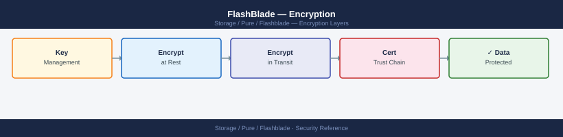
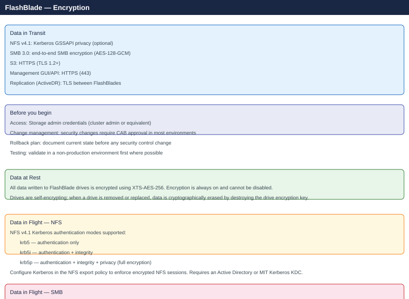

---
tags:
  - pure
  - security
---
# FlashBlade — Encryption





```bash
purefb smb-share update --smb-encryption-mode required <sharename>
```
```bash
purearray syslog add --uri udp://siem:514
```
```bash
purearray syslog add --uri tls://siem:6514
```
```bash
purearray syslog list
```

---

## See also

- [FlashBlade — Hardening](hardening/)
- [FlashBlade — Authentication](authentication/)
- [FlashBlade — Access Control](access-control/)
