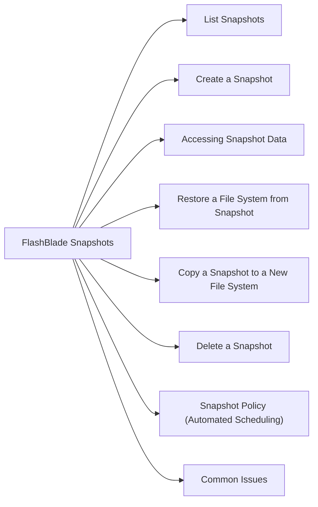

# FlashBlade Snapshots

FlashBlade supports snapshots at the file system level. Snapshots are space-efficient and near-instantaneous.



## List Snapshots

```bash
purefb fs-snapshot list
purefb fs-snapshot list --filter "source='<fs_name>'"
```

## Create a Snapshot

```bash
purefb fs-snapshot create --source <fs_name> --suffix <snap_name>
```

Example:
```bash
purefb fs-snapshot create --source prod-nfs --suffix daily-2026-05-06
```

## Accessing Snapshot Data

Snapshots are accessible via the NFS `.snapshot` directory (if enabled):

```bash
ls /mnt/<fs_mount>/.snapshot/
# Lists available snapshots by suffix
```

Users can browse and copy files directly from the `.snapshot` path without administrator involvement.

## Restore a File System from Snapshot

```bash
# Overwrite the live file system with snapshot content
purefb fs-snapshot restore <fs_name>.<snap_name> --overwrite-fs
```

> This replaces all current data on the file system — ensure this is intentional.

## Copy a Snapshot to a New File System

```bash
purefb fs-snapshot copy <fs_name>.<snap_name> --name <new_fs_name>
```

Creates a new independent file system from the snapshot without affecting the original.

## Delete a Snapshot

```bash
# Destroy (recoverable for 24 hours)
purefb fs-snapshot destroy <fs_name>.<snap_name>

# Eradicate permanently
purefb fs-snapshot eradicate <fs_name>.<snap_name>
```

## Snapshot Policy (Automated Scheduling)

FlashBlade supports policy-based snapshots via the GUI:
1. Navigate to **Protection → Snapshot Policies**
2. Create a policy with frequency and retention settings
3. Assign the policy to file systems

```bash
# View policies via CLI
purefb policies list
```

## Common Issues

| Issue | Check | Action |
|---|---|---|
| `.snapshot` not visible | Snapshots enabled on FS | `purefb fs update <name> --snapshot-enabled true` |
| Snapshot create fails | Capacity | Check array free space |
| Restore failed | File system in use | Unmount/quiesce clients first |
| Snapshots not auto-created | Policy attached? | Verify snapshot policy assignment |
