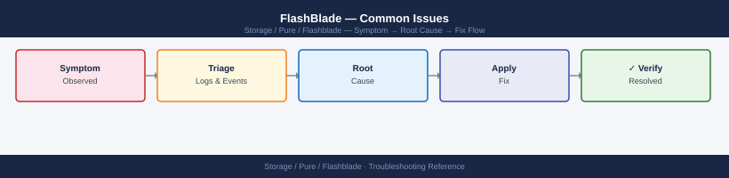
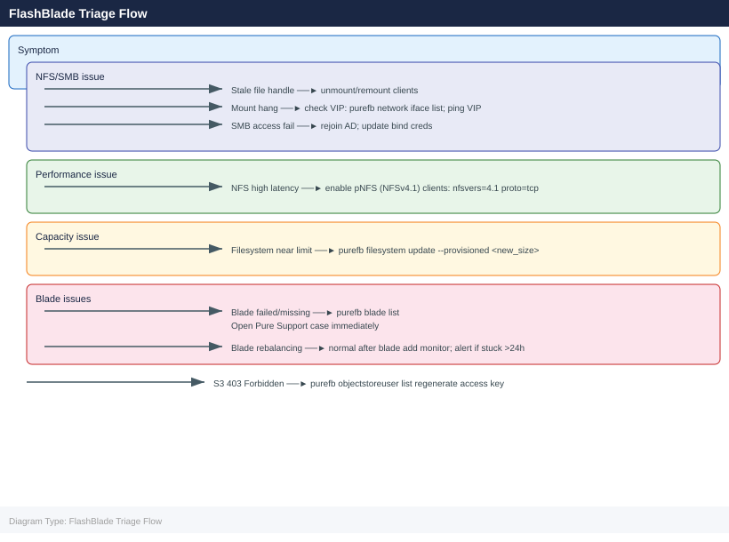
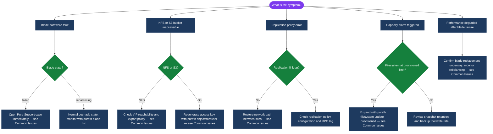

---
tags:
  - pure
  - troubleshooting
search:
  boost: 1.5
---
# FlashBlade — Common Issues


<div class="kb-summary">
FlashBlade Common Issues reference covering NFS/SMB mount problems, S3 403 errors, capacity expansion, blade hardware faults, ActiveDR replication lag, and snapshot policy failures.

*Applies to: FlashBlade Purity//FB 4.x*
</div>



---



```d2
direction: down

symptom: Identify Symptom {shape: diamond}
diagnostic_flow: "Diagnostic Flow" {shape: rectangle}
common_issues: "Common Issues" {shape: rectangle}
verify_resolution: "Verify resolution" {shape: rectangle}
resolution: Resolve or Escalate {shape: oval}

symptom -> diagnostic_flow: investigate
symptom -> common_issues: investigate
symptom -> verify_resolution: investigate
diagnostic_flow -> resolution
common_issues -> resolution
verify_resolution -> resolution
```

## Diagnostic Flow



---

## Before you begin

- **Access:** Storage admin credentials (cluster admin or equivalent)
- **Gather first:** recent error message text, event timestamps, and affected object names
- **Scope:** confirm whether the issue affects a single object, host, cluster, or site
- **Escalation:** open a vendor support ticket before running any destructive step
- **Logging:** document each command and output — required if escalation is needed

---

## Common Issues

| Symptom | Likely Cause | Action |
|---|---|---|
| Blade in `failed` or `missing` state | Physical blade hardware failure or seating issue | Run `purefb blade list`; open a Pure support case immediately — capacity and throughput are reduced until the blade is replaced; do not attempt to reseat the blade without Pure Support guidance |
| NFS clients showing stale file handle errors | Client-side NFS state not cleaned after a FlashBlade event (blade failover or upgrade) | Unmount and remount the NFS filesystem on affected clients; verify `/etc/fstab` uses `soft` or `intr` NFS mount options to prevent hard-hang on server-side events |
| NFS mounts timing out or hanging | FlashBlade data VIP unreachable due to network issue; NFS export policy blocking the client | Verify the FlashBlade data VIP is reachable from the client (`ping`); run `purefb network interface list` to confirm VIP is `up`; check NFS export policy source IP rules |
| S3 returning 403 Forbidden | S3 access key expired, suspended, or IAM bucket policy denies the operation | Run `purefb objectstoreuser list` to check key status; regenerate the access key; review bucket access policies under `purefb bucket list --access-policy` |
| ActiveDR replication lag exceeding RPO | Replication network bandwidth saturated or replication link down | Run `purefb replication list` to check lag and link state; verify network path between sites; check for bandwidth saturation on replication interfaces |
| SMB share inaccessible after AD credential change | FlashBlade machine account password or AD bind credentials have expired | Rejoin the FlashBlade to Active Directory from the GUI or CLI; update AD bind credentials in the directory service configuration |
| Filesystem approaching its provisioned limit | Organic data growth or backup tool writing more than expected | Expand the filesystem limit non-disruptively: `purefb filesystem update --provisioned <new_size> <fsname>`; review backup retention policies to expire older data |
| Blade in `rebalancing` state after blade add | Normal state during data rebalancing after a new blade is added | This is expected behaviour — monitor progress with `purefb blade list`; do not interrupt the rebalancing process; alert if rebalancing is stuck for more than 24 hours |
| High NFS latency during AI/ML training | Clients not using pNFS parallel access; single VIP bottleneck | Enable pNFS (NFSv4.1 pNFS) on the filesystem and verify client NFS mounts use `nfsvers=4.1` and `proto=tcp`; pNFS allows clients to access multiple blades in parallel |
| Snapshot schedule not creating snapshots | Snapshot policy not associated with the filesystem, or policy is paused | Run `purefb policy list` to verify the snapshot policy; check `purefb snap list` to confirm recent snapshots exist; re-associate the policy with the filesystem if needed |

---

## Verify resolution

- Confirm the original symptom no longer occurs
- Check logs for any residual errors related to the issue
- Monitor for 10–15 minutes to confirm the fix is stable

---

## See also

- [FlashBlade — Diagnostics](../diagnostics/)
- [FlashBlade — Escalation](../escalation/)
- [FlashBlade — Health Checks](../../operations/health-checks/)
