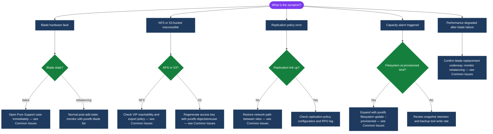

---
tags:
  - pure
  - troubleshooting
---
# FlashBlade — Common Issues


<div class="kb-summary">
FlashBlade Common Issues reference covering NFS/SMB mount problems, S3 403 errors, capacity expansion, blade hardware faults, ActiveDR replication lag, and snapshot policy failures.
</div>
```text
┌───────────────────────────────────── FlashBlade — Common Issues ──────────────────────────────────────┐
│                                                                                                       │
│   ┌───────────────────────────────────────────────────────────────────────────────────────────────┐   │
│   │      FlashBlade troubleshooting: NFS/SMB · S3 · Capacity · Blades · ActiveDR replication     │    │
│   │    Triage by symptom category; use purefb CLI for diagnostics; open case for blade faults    │    │
│   └───────────────────────────────────────────────────────────────────────────────────────────────┘   │
│                                                                                                       │
│                  ▼                                ▼                                ▼                  │
│                                                                                                       │
│   ┌─────────────────────────────┐  ┌─────────────────────────────┐  ┌─────────────────────────────┐   │
│   │      NFS / SMB Issues       │  │     S3 / Object Store       │  │    Capacity & Hardware       │  │
│   │      ─────────────────      │  │     ─────────────────       │  │    ─────────────────         │  │
│   │  Stale handle → remount     │  │  403 Forbidden: regen key   │  │  FS near limit → expand      │  │
│   │  Mount hang → check VIP     │  │  purefb objectstoreuser     │  │  update --provisioned        │  │
│   │  SMB fail → rejoin AD       │  │  Check bucket access policy │  │  Blade failed → open case    │  │
│   │  High latency → use pNFS    │  │  Review access key status   │  │  Rebalancing → wait 24h      │  │
│   └─────────────────────────────┘  └─────────────────────────────┘  └─────────────────────────────┘   │
│                                                                                                       │
│                          ▼                                                 ▼                          │
│                                                                                                       │
│   ┌───────────────────────────────────────────────────────────────────────────────────────────────┐   │
│   │   Category   │     Symptom          │       Action          │     CLI Command          │       │  │
│   │   NFS/SMB    │  Stale file handle   │  Unmount/remount      │  purefb network iface    │       │  │
│   │   S3         │  403 Forbidden       │  Regenerate key       │  purefb objectstoreuser  │       │  │
│   │   Capacity   │  FS near limit       │  Expand provisioned   │  purefb filesystem update│       │  │
│   │   Hardware   │  Blade failed        │  Open support case    │  purefb blade list       │       │  │
│   │   ActiveDR   │  Replication lag     │  Check link/bandwidth │  purefb replication list │       │  │
│   └───────────────────────────────────────────────────────────────────────────────────────────────┘   │
│                                                                                                       │
│    Physical: FlashBlade chassis · storage blades · metadata blades · data VIPs · replication link     │
│                                                                                                       │
│    Key terms:                                                                                         │
│                                                                                                       │
│    VIP            = Virtual IP for NFS/SMB data access; must be reachable from all client hosts       │
│    pNFS           = Parallel NFS (NFSv4.1); enables parallel access across multiple storage blades    │
│    ActiveDR       = Pure async replication with RPO tracking; check lag with replication list         │
│    purefb         = FlashBlade CLI; used for all config, diagnostics, and operational status          │
│    Rebalancing    = Post-blade-add data redistribution; normal state; alert only if stuck >24h        │
│    Provisioned    = Logical filesystem size ceiling; expand non-disruptively at any time              │
│    Access key     = S3 credential pair per object store user; regenerate on any 403 errors            │
│    Snapshot policy= Must be linked to a filesystem to create snapshots; check with policy list        │
│                                                                                                       │
└───────────────────────────────────────────────────────────────────────────────────────────────────────┘
```

---

```text
  FlashBlade Triage Flow

  Symptom
  ├─ NFS/SMB issue ─────────────────────────────────────────┐
  │    ├─ Stale file handle ──► unmount/remount clients     │
  │    ├─ Mount hang ──► check VIP: purefb network iface    │
  │    │                            list; ping VIP          │
  │    └─ SMB access fail ──► rejoin AD; update bind creds  │
  │                                                         │
  ├─ Performance issue ─────────────────────────────────────┤
  │    └─ NFS high latency ──► enable pNFS (NFSv4.1)        │
  │         clients: nfsvers=4.1 proto=tcp                  │
  │                                                         │
  ├─ Capacity issue ────────────────────────────────────────┤
  │    └─ Filesystem near limit ──► purefb filesystem       │
  │         update --provisioned <new_size>                 │
  │                                                         │
  └───────────────────────────────────────────────────────────────────────────────────────────────────────┘
       ├─ Blade failed/missing ──► purefb blade list        │
       │    Open Pure Support case immediately              │
       └─ Blade rebalancing ──► normal after blade add      │
            monitor; alert if stuck >24h                   ▼
  S3 403 Forbidden ──► purefb objectstoreuser list
                       regenerate access key
```

## Diagnostic Flow



---

## Before you begin

- **Access:** Storage admin credentials (cluster admin or equivalent)
- **Gather first:** recent error message text, event timestamps, and affected object names
- **Scope:** confirm whether the issue affects a single object, host, cluster, or site
- **Escalation:** open a vendor support ticket before running any destructive step
- **Logging:** document each command and output — required if escalation is needed

---

## Common Issues

| Symptom | Likely Cause | Action |
|---|---|---|
| Blade in `failed` or `missing` state | Physical blade hardware failure or seating issue | Run `purefb blade list`; open a Pure support case immediately — capacity and throughput are reduced until the blade is replaced; do not attempt to reseat the blade without Pure Support guidance |
| NFS clients showing stale file handle errors | Client-side NFS state not cleaned after a FlashBlade event (blade failover or upgrade) | Unmount and remount the NFS filesystem on affected clients; verify `/etc/fstab` uses `soft` or `intr` NFS mount options to prevent hard-hang on server-side events |
| NFS mounts timing out or hanging | FlashBlade data VIP unreachable due to network issue; NFS export policy blocking the client | Verify the FlashBlade data VIP is reachable from the client (`ping`); run `purefb network interface list` to confirm VIP is `up`; check NFS export policy source IP rules |
| S3 returning 403 Forbidden | S3 access key expired, suspended, or IAM bucket policy denies the operation | Run `purefb objectstoreuser list` to check key status; regenerate the access key; review bucket access policies under `purefb bucket list --access-policy` |
| ActiveDR replication lag exceeding RPO | Replication network bandwidth saturated or replication link down | Run `purefb replication list` to check lag and link state; verify network path between sites; check for bandwidth saturation on replication interfaces |
| SMB share inaccessible after AD credential change | FlashBlade machine account password or AD bind credentials have expired | Rejoin the FlashBlade to Active Directory from the GUI or CLI; update AD bind credentials in the directory service configuration |
| Filesystem approaching its provisioned limit | Organic data growth or backup tool writing more than expected | Expand the filesystem limit non-disruptively: `purefb filesystem update --provisioned <new_size> <fsname>`; review backup retention policies to expire older data |
| Blade in `rebalancing` state after blade add | Normal state during data rebalancing after a new blade is added | This is expected behaviour — monitor progress with `purefb blade list`; do not interrupt the rebalancing process; alert if rebalancing is stuck for more than 24 hours |
| High NFS latency during AI/ML training | Clients not using pNFS parallel access; single VIP bottleneck | Enable pNFS (NFSv4.1 pNFS) on the filesystem and verify client NFS mounts use `nfsvers=4.1` and `proto=tcp`; pNFS allows clients to access multiple blades in parallel |
| Snapshot schedule not creating snapshots | Snapshot policy not associated with the filesystem, or policy is paused | Run `purefb policy list` to verify the snapshot policy; check `purefb snap list` to confirm recent snapshots exist; re-associate the policy with the filesystem if needed |

---

## Verify resolution

- Confirm the original symptom no longer occurs
- Check logs for any residual errors related to the issue
- Monitor for 10–15 minutes to confirm the fix is stable
