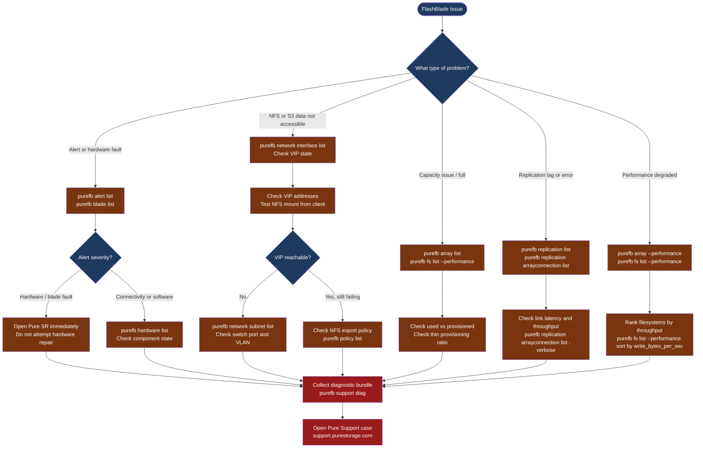

---
tags:
  - pure
  - troubleshooting
search:
  boost: 1.5
---
# FlashBlade — Diagnostics

<div class="kb-summary">
FlashBlade diagnostic commands: check array health and active alerts with purefb, inspect blade and hardware component status, diagnose NFS and S3 performance, verify replication link health, and generate the diagnostic bundle for Pure Storage support cases.

*Applies to: Pure Storage FlashBlade with Purity//FB 4.x*
</div>

```text
┌──────────────────────────────────── FlashBlade — Diagnostics ─────────────────────────────────────────┐
│                                                                                                       │
│   ┌───────────────────────────────────────────────────────────────────────────────────────────────┐   │
│   │   Start here: purefb alert list → purefb blade list → purefb array list → check performance  │    │
│   │   Storage not accessible: check network interface VIPs; check NFS/SMB/S3 mount or session    │    │
│   │   Blade degraded: open Pure SR immediately — hardware faults are resolved by Pure field team  │   │
│   └───────────────────────────────────────────────────────────────────────────────────────────────┘   │
│                                                                                                       │
│   ┌──────────────────────────────────────────────┐  ┌─────────────────────────────────────────────┐   │
│   │          Array and Blade Health              │  │           Network and Replication           │   │
│   │   purefb array list: version, capacity       │  │   purefb network interface list             │   │
│   │   purefb alert list: active alerts           │  │   purefb replication list: lag and state    │   │
│   │   purefb blade list: blade health            │  │   purefb replication arrayconnection list   │   │
│   │   purefb hardware list: chassis components   │  │   purefb bucket list / purefb fs list       │   │
│   └──────────────────────────────────────────────┘  └─────────────────────────────────────────────┘   │
│                                                                                                       │
│  Physical Infrastructure:                                                                             │
│  FlashBlade chassis · Blade modules · chassis management module · 10/25GbE NIC · Pure1 telemetry      │
│                                                                                                       │
│  Key terms:                                                                                           │
│  purefb          = FlashBlade CLI; SSH to the management IP and run these commands                    │
│  Blade           = storage compute module in the FlashBlade chassis; each has NVMe flash              │
│  VIP             = Virtual IP; floating management or data IP that moves between blades               │
│  ActiveDR        = Pure's synchronous replication for zero-RPO file and object workloads              │
│  Pure1           = cloud management portal; receives phone-home telemetry automatically               │
│  purefb support diag = generates a diagnostic bundle; if phone-home is active, it uploads to Pure     │
│                                                                                                       │
└───────────────────────────────────────────────────────────────────────────────────────────────────────┘
```



## Before you begin

- **Access:** FlashBlade admin credentials (SSH to management IP or Purity//FB web GUI); Pure1 portal access
- **Gather first:** the specific symptom (client cannot mount, alert in Pure1, replication stopped, performance degraded), the affected filesystem or bucket name, and when the issue started
- **Scope:** confirm whether the issue affects one filesystem, one protocol (NFS only vs. S3), one blade, or the entire array
- **Phone-home:** verify Pure1 phone-home is active (`purefb array list` shows phone-home status) — most hardware alerts are auto-detected by Pure

---

## Step 1 — Check array health and active alerts

```bash
# Connect to FlashBlade management CLI
ssh pureuser@<flashblade-management-ip>

# Overall array status, Purity//FB version, and capacity
purefb array list
# Key fields:
#   Version: Purity//FB version (confirm matches support matrix)
#   Space.Used / Space.Total: overall capacity utilization
#   Status: online (expected); degraded = hardware issue

# All active alerts (most critical first)
purefb alert list
# Expected: no alerts; or only informational (severity=info)
# Problem: severity=warning or severity=error alerts
# Common alerts: blade degraded, drive failure, capacity > 80%, replication lag

# Include resolved alerts for history (last 7 days)
purefb alert list --filter "time>='7 days ago'" | head -50

# Audit log (admin actions — useful if a config change caused the issue)
purefb admin list --audit | tail -50
```

---

## Step 2 — Check blade and hardware health

```bash
# Blade health and capacity contribution
purefb blade list
# Each blade shows: Name, Status, Capacity, RawCapacity
# Expected: Status = healthy for all blades
# Problem: Status = unhealthy or failed → open Pure SR immediately

# Full chassis hardware status (power supplies, fans, chassis modules)
purefb hardware list
# Each component shows: Name, Status, Temperature
# Expected: Status = ok for all hardware
# Problem: any Status = failed or warning → open Pure SR

# Network interface status (data and management VIPs)
purefb network interface list
# Shows: name, address, enabled, speed, services (management/replication/data)
# Expected: Enabled = True and Speed > 0 for all active interfaces
```

---

## Step 3 — Check filesystem and bucket state

```bash
# List all filesystems with provisioned and used capacity
purefb filesystem list
# Columns: Name, Provisioned, Space Used, % Used, NFS/SMB/HTTP enabled
# Alert: % Used > 80% = approaching full; provisioned size may need increasing

# List S3 buckets with usage
purefb bucket list
# Columns: Name, Object Count, Space Used, Account

# Check NFS export policies
purefb policy list
purefb policy list <policy-name>
# Shows which filesystem the policy applies to and the NFS rules

# Check directory services (AD / LDAP) for authentication
purefb directoryservice list
# Expected: Enabled = True and Status = connected for configured AD/LDAP

# Check SMB shares (if using SMB protocol)
purefb share list

# Check object store accounts and users
purefb objectstoreaccount list
purefb objectstoreuser list
```

---

## Step 4 — Check replication health

```bash
# Replication link status and lag (ActiveDR or async replication)
purefb replication list
# Shows: Name, Status, Lag, Bytes Transferred, Paused
# Expected: Status = replicating; Lag = low (seconds to minutes for async)
# Problem: Status = broken or Paused = True

# Remote array connection details
purefb replication arrayconnection list
# Shows: remote array name, management IP, replication IPs, connection status

# Check network interface used for replication
purefb network interface list | grep replication
# Replication VIPs must be able to reach the remote array's replication VIPs

# Snapshot list (source of replication)
purefb snap list
# Shows: name, source filesystem/bucket, created time, size
```

---

## Step 5 — Diagnose performance issues

```bash
# Array-level throughput, IOPS, and latency
purefb array --performance
# Key metrics:
#   read_bytes_per_sec / write_bytes_per_sec  → throughput
#   reads_per_sec / writes_per_sec           → IOPS
#   usec_per_read_op / usec_per_write_op     → latency in microseconds

# Filesystem-level performance (shows per-filesystem breakdown)
purefb fs list --performance
# Sort filesystems by write throughput to find hot spots
purefb fs list --performance | sort -k3 -rn

# Performance targets for FlashBlade:
#   NFS sequential I/O:   < 1 ms latency expected for large I/O
#   NFS small random I/O: < 5 ms latency
#   S3 object GET/PUT:    < 5 ms latency

# S3 bucket performance
purefb bucket list --performance

# Network interface utilization (check if NICs are saturated)
purefb network interface list
# Check Speed vs. actual throughput from purefb array --performance
```

**Common performance root causes:**

| Symptom | Check | Action |
|---|---|---|
| Low NFS throughput | Client mount options | Use `rsize=1048576,wsize=1048576` |
| High NFS latency | Network congestion | Check switch utilization and jumbo frames |
| S3 slow | Large object count in bucket | Optimize key prefix distribution |
| Blade degraded | `purefb blade list` | Open Pure SR immediately |

---

## Step 6 — Generate diagnostic bundle for Pure support

```bash
# Generate and upload diagnostic bundle (requires phone-home to be active)
purefb support diag
# This sends the diagnostic bundle to Pure Storage automatically via phone-home
# Confirmation: "Diagnostic information sent to Pure Storage support"

# If phone-home is not active, the bundle is saved locally
# Contact Pure Support to get the bundle download path

# What to include in the Pure Support case:
# - Array name and serial number: purefb array list
# - Purity//FB version: purefb array list (Version field)
# - Blade health: purefb blade list (full output)
# - Hardware health: purefb hardware list (full output)
# - Active alerts: purefb alert list (full output)
# - Filesystem or bucket details (if data-access related)
# - NFS mount options from affected clients: mount | grep nfs
# - Symptom description, start time, and business impact
```

---

## Log locations

| Source | Command | What to look for |
|---|---|---|
| Active alerts | `purefb alert list` | Hardware faults, capacity warnings, replication errors |
| Alert history | `purefb alert list --filter "time>='7 days ago'"` | Events leading up to the issue |
| Audit log | `purefb admin list --audit` | Admin configuration changes |
| Replication | `purefb replication list` | Replication lag and broken links |
| Performance | `purefb array --performance` | Throughput, IOPS, latency metrics |
| Pure1 portal | pure1.purestorage.com → Arrays → select array → Events | Phone-home events and alert timeline |

---

## See also

- [FlashBlade — Common Issues](common-issues/)
- [FlashBlade — Escalation](escalation/)
- [FlashBlade — Health Checks](../operations/health-checks/)

## Verify resolution

- `purefb alert list` shows no active alerts (or only informational)
- `purefb blade list` shows all blades with Status = healthy
- NFS test mount from an affected client succeeds and I/O test (e.g., `dd if=/dev/zero of=/nfs/test bs=1M count=1000`) completes at expected throughput
- `purefb replication list` shows Status = replicating with lag within expected bounds
- `purefb array --performance` shows latency within the expected thresholds listed above
