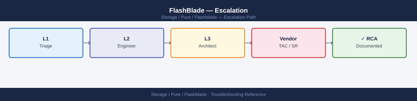
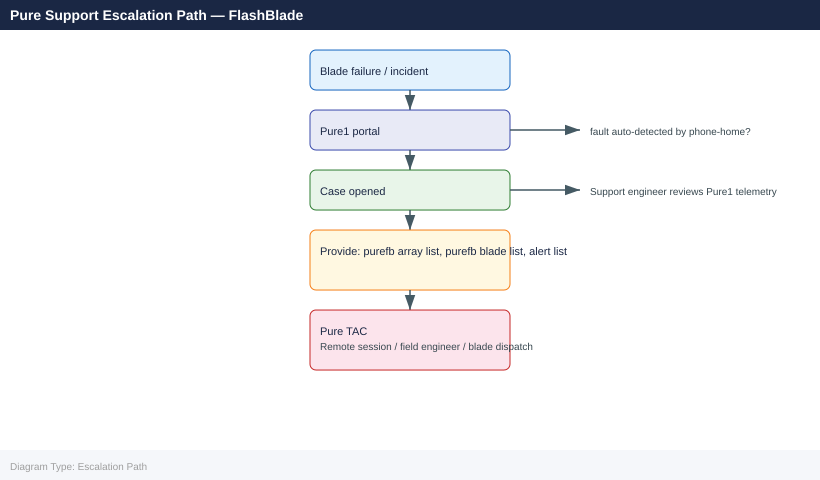

---
tags:
  - pure
  - troubleshooting
search:
  boost: 1.5
---
# FlashBlade — Escalation


<div class="kb-summary">
Escalation reference covering Support Portal, Opening a Case, Information to Collect, SLA Tiers, Escalation Path.

*Applies to: FlashBlade Purity//FB 4.x*
</div>





> Part of the [FlashBlade Troubleshooting](index.md) reference.

---

```d2
direction: down

symptom: Identify Symptom {shape: diamond}
support_portal: "Support Portal" {shape: rectangle}
opening_a_case: "Opening a Case" {shape: rectangle}
information_to_collect: "Information to Collect" {shape: rectangle}
sla_tiers: "SLA Tiers" {shape: rectangle}
escalation_path: "Escalation Path" {shape: rectangle}
verify_resolution: "Verify resolution" {shape: rectangle}
resolution: Resolve or Escalate {shape: oval}

symptom -> support_portal: investigate
symptom -> opening_a_case: investigate
symptom -> information_to_collect: investigate
symptom -> sla_tiers: investigate
symptom -> escalation_path: investigate
symptom -> verify_resolution: investigate
support_portal -> resolution
opening_a_case -> resolution
information_to_collect -> resolution
sla_tiers -> resolution
escalation_path -> resolution
verify_resolution -> resolution
```

## Before you begin

- **Access:** Storage admin credentials (cluster admin or equivalent)
- **Gather first:** recent error message text, event timestamps, and affected object names
- **Scope:** confirm whether the issue affects a single object, host, cluster, or site
- **Escalation:** open a vendor support ticket before running any destructive step
- **Logging:** document each command and output — required if escalation is needed

---

## Support Portal

Pure Storage support is accessed through the support portal at **https://support.purestorage.com**.

All FlashBlade arrays with an active subscription have automatic case creation capability through Pure1. Pure1 (https://pure1.purestorage.com) provides a unified view of array health, active alerts, and open support cases. Phonehome telemetry is transmitted from the array to Pure1 over port 443; when a hardware fault is detected, Pure1 can automatically open a support case and dispatch a replacement part without customer action.

Ensure phonehome is active at all times. To verify from the array:

```bash
purearray phonehome --status
```

## Opening a Case

When opening a case manually, provide the following information to reduce time to resolution:

| Field | How to Obtain |
|---|---|
| Array serial number | Purity GUI > System > Array, or `purearray list` |
| Purity//FB version | `purensshow --version` or `purearray list` |
| Symptom description | Clear description of what is wrong, when it started, and what changed |
| Impact severity | Number of affected users/services, whether production is down or degraded |
| Steps already taken | Commands run, reboots attempted, any changes made before opening the case |

Severity classification at case open determines SLA response time — set severity accurately to receive appropriate response.

## Information to Collect

Run the following commands and attach output to the support case before or immediately after opening:

```bash
# Array identity and software version
purearray list

# All active alerts with severity and description
purealert list

# Full diagnostic bundle (generates a support file on the array)
purediag

# Drive health and status
puredrive list

# Capacity usage across filesystems and object store
purearray list --space

# Recent system message log
puremsg list

# Filesystem list with provisioned and used capacity
purefb filesystem list

# Blade health and status
purefb blade list

# Replication link health and lag
purefb replication list
```

The `purediag` command generates a diagnostic bundle that Pure Support can pull directly via phonehome if the support tunnel is active. If phonehome is offline, download the diagnostic output and attach it to the case via the support portal.

## SLA Tiers

| Priority | Response Time | Description |
|---|---|---|
| P1 | 1 hour, 24x7 | Production system down or critically impaired; no workaround available |
| P2 | 4 hours, 24x7 | Production system degraded; workaround in place but operation is impacted |
| P3 | Next business day | Non-critical issue or question; system is operational with minor impact |
| P4 | Best effort | General enquiry, feature request, or documentation question |

P1 and P2 cases should be followed up with a phone call to the Pure Support line to ensure immediate engagement. Case severity can be escalated at any time if business impact increases.

## Escalation Path

If a case is not progressing at the expected pace or the business impact increases:

1. **Request a duty manager** — use the escalation option in the support portal or ask the support engineer to escalate to a duty manager for senior engagement
2. **Pure TAM contact** — for customers with a Technical Account Manager (TAM), contact the TAM directly for major incidents; the TAM can coordinate resources across support, engineering, and account management
3. **Account team escalation** — for contractual or SLA compliance issues, contact the Pure account executive or customer success manager
4. **Executive escalation** — in cases of sustained outage or repeated resolution failures, request executive-level escalation through your TAM or account executive

For P1 incidents involving data loss risk, request immediate engineering involvement alongside standard support engagement.

---

## Verify resolution

- Confirm the original symptom no longer occurs
- Check logs for any residual errors related to the issue
- Monitor for 10–15 minutes to confirm the fix is stable

---

## See also

- [FlashBlade — Diagnostics](diagnostics/)
- [FlashBlade — Common Issues](common-issues/)
