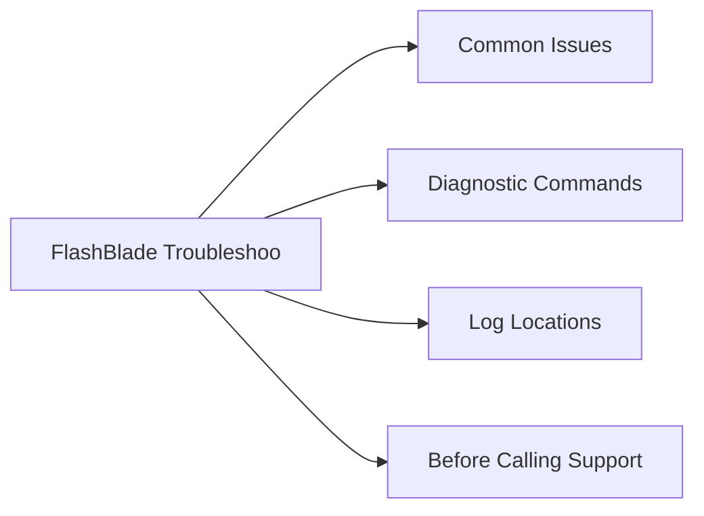

# FlashBlade Troubleshooting



## Common Issues

| Symptom | Likely Cause | Action |
|---|---|---|
| Blade in `failed` or `missing` state | Physical blade hardware failure or seating issue | Run `purefb blade list`; open a Pure support case immediately — capacity and throughput are reduced until the blade is replaced; do not attempt to reseat the blade without Pure Support guidance |
| NFS clients showing stale file handle errors | Client-side NFS state not cleaned after a FlashBlade event (blade failover or upgrade) | Unmount and remount the NFS filesystem on affected clients; verify `/etc/fstab` uses `soft` or `intr` NFS mount options to prevent hard-hang on server-side events |
| NFS mounts timing out or hanging | FlashBlade data VIP unreachable due to network issue; NFS export policy blocking the client | Verify the FlashBlade data VIP is reachable from the client (`ping`); run `purefb network interface list` to confirm VIP is `up`; check NFS export policy source IP rules |
| S3 returning 403 Forbidden | S3 access key expired, suspended, or IAM bucket policy denies the operation | Run `purefb objectstoreuser list` to check key status; regenerate the access key; review bucket access policies under `purefb bucket list --access-policy` |
| ActiveDR replication lag exceeding RPO | Replication network bandwidth saturated or replication link down | Run `purefb replication list` to check lag and link state; verify network path between sites; check for bandwidth saturation on replication interfaces |
| SMB share inaccessible after AD credential change | FlashBlade machine account password or AD bind credentials have expired | Rejoin the FlashBlade to Active Directory from the GUI or CLI; update AD bind credentials in the directory service configuration |
| Filesystem approaching its provisioned limit | Organic data growth or backup tool writing more than expected | Expand the filesystem limit non-disruptively: `purefb filesystem update --provisioned <new_size> <fsname>`; review backup retention policies to expire older data |
| Blade in `rebalancing` state after blade add | Normal state during data rebalancing after a new blade is added | This is expected behaviour — monitor progress with `purefb blade list`; do not interrupt the rebalancing process; alert if rebalancing is stuck for more than 24 hours |
| High NFS latency during AI/ML training | Clients not using pNFS parallel access; single VIP bottleneck | Enable pNFS (NFSv4.1 pNFS) on the filesystem and verify client NFS mounts use `nfsvers=4.1` and `proto=tcp`; pNFS allows clients to access multiple blades in parallel |
| Snapshot schedule not creating snapshots | Snapshot policy not associated with the filesystem, or policy is paused | Run `purefb policy list` to verify the snapshot policy; check `purefb snap list` to confirm recent snapshots exist; re-associate the policy with the filesystem if needed |

## Diagnostic Commands

```bash
# Overall FlashBlade status and Purity//FB version
purefb array list

# All blade health and capacity contribution
purefb blade list

# Hardware component status (FMs, PSUs, fans)
purefb hardware list

# All active alerts
purefb alert list

# Filesystem list with provisioned and used capacity
purefb filesystem list

# S3 bucket list with usage
purefb bucket list

# Object store accounts and users
purefb objectstoreaccount list
purefb objectstoreuser list

# Network interface status (data VIPs and replication)
purefb network interface list

# Snapshot list
purefb snap list

# Replication link status and lag
purefb replication list
purefb replication arrayconnection list

# NFS export policies
purefb policy list

# Active directory and directory service status
purefb directoryservice list

# Collect diagnostic bundle
purefb support diag         # sends to Pure Support if phone-home is active
```

## Log Locations

| Log | Location / Command |
|---|---|
| System and Purity//FB events | `purefb array list --logs` or via Pure1 portal > Events |
| Alert history | `purefb alert list` (include resolved alerts with `--resolved`) |
| Audit log (admin actions) | `purefb admin list --audit` |
| Replication log | `purefb replication list` |
| Diagnostic bundle | `purefb support diag` — includes system logs, configuration, and metrics |
| NFS export policy log | `purefb policy list` — review policy rules and associations |
| Pure1 event timeline | Pure1 portal > Arrays > select FlashBlade > Events |

## Before Calling Support

Collect the following before opening a Pure support case:

- [ ] Array name and serial number: `purefb array list`
- [ ] Purity//FB version: `purefb array list` (Version field)
- [ ] Blade health status: `purefb blade list` — copy full output
- [ ] Hardware component status: `purefb hardware list`
- [ ] Active alerts: `purefb alert list` — copy full output
- [ ] Network interface status: `purefb network interface list`
- [ ] Replication status (if replication is involved): `purefb replication list`
- [ ] Filesystem or bucket details (if data-access related): `purefb filesystem list` or `purefb bucket list`
- [ ] NFS mount options from affected clients (output of `mount | grep nfs`)
- [ ] Symptom description: what changed before the issue, when it started, and business impact
- [ ] Diagnostic bundle: `purefb support diag` and attach to the case
