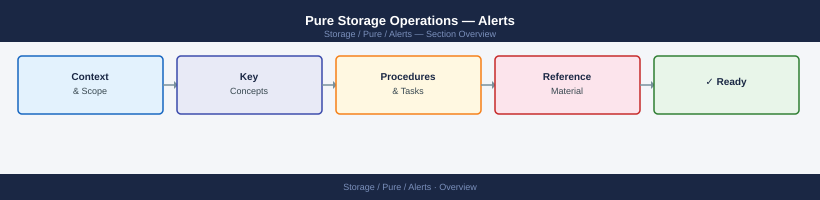
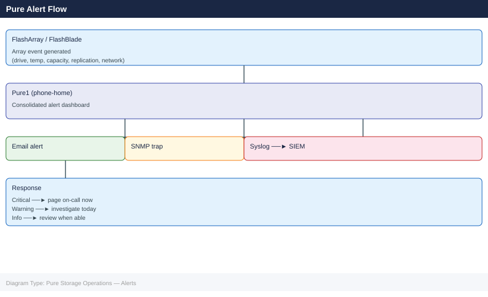

---
tags:
  - operations
  - pure
---
# Pure Storage Operations — Alerts


<div class="kb-summary">
Alerts reference covering Viewing Alerts, Alert Severity Levels, Common Alert Types, Pure1 Phone-Home Connectivity, Alert Notifications and 2 more sections.

*Applies to: FlashArray Purity 6.x*
</div>





```d2
direction: right

center: "Alerts" {shape: hexagon}
viewing_alerts: "Viewing Alerts" {shape: rectangle}
alert_severity_levels: "Alert Severity Levels" {shape: rectangle}
common_alert_types: "Common Alert Types" {shape: rectangle}
pure1_phonehome_connectivity: "Pure1 Phone-Home Connectivity" {shape: rectangle}
alert_notifications: "Alert Notifications" {shape: rectangle}
acknowledge_and_close_alerts: "Acknowledge and Close Alerts" {shape: rectangle}

center -> viewing_alerts
center -> alert_severity_levels
center -> common_alert_types
center -> pure1_phonehome_connectivity
center -> alert_notifications
center -> acknowledge_and_close_alerts
```

## Before you begin

- **Access:** Storage admin credentials (cluster admin or equivalent)
- **Timing:** safe to run during business hours unless a step is marked ⚠ (causes interruption)
- **Dependencies:** no active upgrades or migrations on the same infrastructure
- **Logging:** capture command output — paste into the change record on completion

---

## Viewing Alerts

```bash
# CLI — FlashArray
purecli alert list

# CLI — FlashBlade
purefb alert list
```

Via Pure1:
- **Pure1 → Alerts** — consolidated alerts across all arrays

## Alert Severity Levels

| Severity | Meaning | Response |
|---|---|---|
| Critical | Immediate risk to data or availability | Page on-call immediately |
| Warning | Degraded component or approaching threshold | Investigate same day |
| Info | Non-critical informational event | Review at next opportunity |

## Common Alert Types

| Alert | Cause | Action |
|---|---|---|
| Drive unhealthy / failed | Media degradation | Pure Support replaces proactively |
| Controller temperature high | Cooling issue or blocked airflow | Check data center cooling |
| Capacity above threshold | Data growth | Expand or clean up |
| Replication lag high | Network or congestion | Check inter-array connectivity |
| Pure1 connectivity lost | Outbound connectivity | Check firewall/proxy settings |

## Pure1 Phone-Home Connectivity

Pure arrays communicate with Pure1 for proactive support and monitoring. Verify connectivity:

```bash
# FlashArray
purecli phone-home list

# FlashBlade
purefb phone-home list
```

If phone-home fails, Pure Support cannot proactively monitor the array.

## Alert Notifications

Alerts are delivered via:
- **Email** — configured in array management settings
- **SNMP traps** — for integration with monitoring platforms (SCOM, Zabbix)
- **Pure1** — cloud management portal
- **Syslog** — for SIEM forwarding

## Acknowledge and Close Alerts

```bash
# FlashArray — acknowledge an alert
purecli alert acknowledge --id <alert_id>

# FlashBlade
purefb alert update --id <alert_id> --action acknowledge
```

## Pre-Change Alert Check

Before any maintenance:
```bash
purecli alert list      # FlashArray
purefb alert list       # FlashBlade
```

Do not proceed if critical alerts are active.

---

## Verify

- Confirm the operation completed without errors in the log or management UI
- Verify the expected state change is visible (service running, object created, config applied)
- Document the outcome in the change record

## See also

- [Pure Storage — Pure1](../pure1/)
- [Pure Storage — Support Cases](../support-cases/)
- [Pure Storage — Health Checks](../../flasharray/operations/health-checks/)
