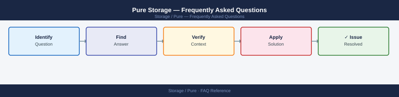

---
tags:
  - pure
  - faq
  - operations
---
# Pure Storage — Frequently Asked Questions

Common questions about Pure Storage operations, configuration, and troubleshooting. For step-by-step procedures, see the <a href="index.md">Operations</a> section.

## General

**Q: How do I get a consolidated view of software versions across all Pure arrays?**
A: Pure1 → Arrays → view the Software Version column. Use Pure1 API to export version data for all arrays: `GET /api/1.latest/arrays?fields=name,version`. Pure1 also shows upgrade recommendations per array.

**Q: How do I check the current Pure Storage version?**
A: `Pure1 → Arrays → Software Version column`

## Configuration

**Q: What is the default Pure1 alert notification configuration?**
A: By default, alerts go to the array admin email set during installation. Add team email aliases via Pure1 → Administration → Notification Settings. Configure PagerDuty or Slack webhooks for critical alert routing.

**Q: How do I enable Pure1 AI-driven forecasting?**
A: Pure1 predictive analytics are enabled by default for all enrolled arrays. View under Pure1 → Arrays → select array → Forecasting. Forecasting models capacity and performance trends using fleet-wide ML models.

## Operations

**Q: How do I coordinate Purity upgrades across a mixed FlashArray and FlashBlade environment?**
A: Upgrade FlashArray first (more workloads depend on it). Then FlashBlade. Use Pure1's upgrade scheduler to stagger upgrades. Ensure no critical backup windows overlap with the upgrade schedule.

**Q: What is the correct procedure to add a new Pure array to Pure1 monitoring?**
A: Arrays enrol automatically via phone-home (HTTPS 443 to pure1.purestorage.com). Verify in Pure1 → Arrays — the new array should appear within 1 hour of first contact. If not, check firewall rules.

## Troubleshooting

**Q: Pure1 shows 'Array at Risk' for a system. What does it mean?**
A: Pure AI has detected a hardware degradation, software bug, or configuration risk. Click through for details and recommended action. Pure Support may reach out proactively for Critical risks under Evergreen support.

**Q: Pure1 shows a performance anomaly for an array — where do I start?**
A: Pure1 → Arrays → select array → Performance. Review the anomaly timeline. Pure1 AI contextualises the anomaly against historical baseline and fleet averages. If anomalous, open a Pure Support case with the Pure1 link.

## Backup and Recovery

**Q: How often should I review Pure1 health summaries?**
A: Daily quick check of Pure1 dashboard for any new Critical/Warning alerts. Weekly review of capacity forecasting and upgrade recommendations. Monthly review of performance trends against workload growth.

**Q: Can I use Pure1 to initiate a restore from a snapshot?**
A: Pure1 provides visibility but not direct restore initiation. Initiate restores via the array CLI, FlashArray UI, or vSphere/PowerShell plugins. Pure1 shows snapshot inventory and protection policy compliance.

## See Also

- [Pure Storage Operations](index.md)
- [Pure Storage Troubleshooting](../../troubleshooting/index.md)
