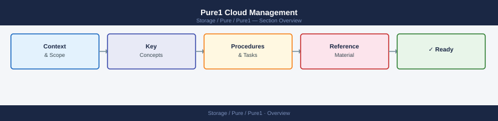
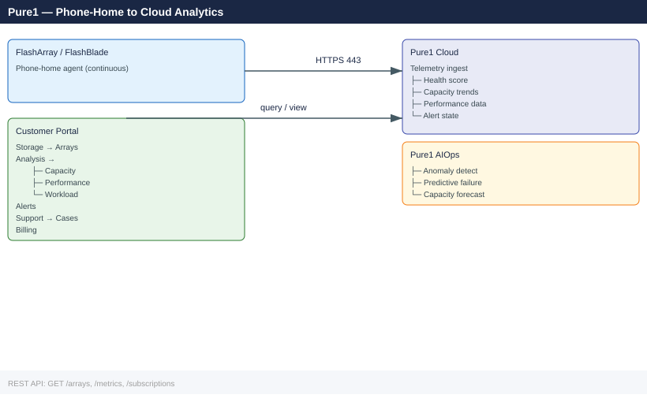

---
tags:
  - operations
  - pure
---
# Pure1 Cloud Management


<div class="kb-summary">
Pure1 Cloud Management reference covering Accessing Pure1, Key Navigation Areas, Capacity Planning, Pure1 AI (Copilot), Phone-Home Connectivity and 2 more sections.

*Applies to: FlashArray Purity 6.x*
</div>





Pure1 is Pure Storage's cloud-based management and monitoring platform. It provides a unified view of all FlashArray and FlashBlade systems.

```d2
direction: right

center: "Pure1" {shape: hexagon}
accessing_pure1: "Accessing Pure1" {shape: rectangle}
key_navigation_areas: "Key Navigation Areas" {shape: rectangle}
capacity_planning: "Capacity Planning" {shape: rectangle}
pure1_ai_copilot: "Pure1 AI (Copilot)" {shape: rectangle}
phonehome_connectivity: "Phone-Home Connectivity" {shape: rectangle}
rolebased_access_in_pure1: "Role-Based Access in Pure1" {shape: rectangle}

center -> accessing_pure1
center -> key_navigation_areas
center -> capacity_planning
center -> pure1_ai_copilot
center -> phonehome_connectivity
center -> rolebased_access_in_pure1
```

## Before you begin

- **Access:** Storage admin credentials (cluster admin or equivalent)
- **Timing:** safe to run during business hours unless a step is marked ⚠ (causes interruption)
- **Dependencies:** no active upgrades or migrations on the same infrastructure
- **Logging:** capture command output — paste into the change record on completion

---

## Accessing Pure1

Log in at **pure1.purestorage.com** with your Pure Storage account credentials.

## Key Navigation Areas

| Section | Purpose |
|---|---|
| **Storage → Arrays** | Array inventory, health, and status |
| **Storage → Fleet** | Consolidated view of all arrays |
| **Analysis → Capacity** | Current and forecast capacity per array |
| **Analysis → Performance** | IOPS, throughput, latency over time |
| **Analysis → Workload** | Per-volume / per-file-system performance breakdown |
| **Alerts** | Active and historical alerts across all arrays |
| **Support → Cases** | Open and track support cases |
| **Billing** | Evergreen subscription and usage reports |

## Capacity Planning

**Pure1 → Analysis → Capacity → Forecast**

Pure1 uses AI to predict when an array will reach capacity based on consumption trends. Review forecasts monthly to plan expansion ahead of time.

## Pure1 AI (Copilot)

Pure1 includes AI-driven:
- Anomaly detection — flags unusual performance or capacity trends
- Predictive failure analysis — identifies hardware at risk
- Workload insights — identifies top consumers

## Phone-Home Connectivity

Arrays must be able to reach Pure1 for proactive monitoring. Required outbound access:

| Destination | Port | Protocol |
|---|---|---|
| pure1.purestorage.com | 443 | HTTPS |
| phone-home.purestorage.com | 443 | HTTPS |

```bash
# Verify phone-home status — FlashArray
purecli phone-home list

# Verify phone-home status — FlashBlade
purefb phone-home list
```

## Role-Based Access in Pure1

Pure1 supports multiple roles:
- **Array Admin** — full array management
- **Storage Admin** — provisioning without system changes
- **Read-only** — monitoring and reporting only

Manage users under **Settings → Users** in Pure1.

## Pure1 API

Pure1 provides a REST API for automation and integration:

```bash
# Authenticate and get token
curl -X POST https://api.pure1.purestorage.com/oauth2/1.0/token \
    -d "grant_type=client_credentials&client_id=<id>&client_secret=<secret>"

# List arrays
curl -H "Authorization: Bearer <token>" \
    https://api.pure1.purestorage.com/api/1.latest/arrays
```

---

## Verify

- Confirm the operation completed without errors in the log or management UI
- Verify the expected state change is visible (service running, object created, config applied)
- Document the outcome in the change record

## See also

- [Pure Storage — Alerts](../alerts/)
- [Pure Storage — Support Cases](../support-cases/)
- [Pure Storage — Overview](../../)
