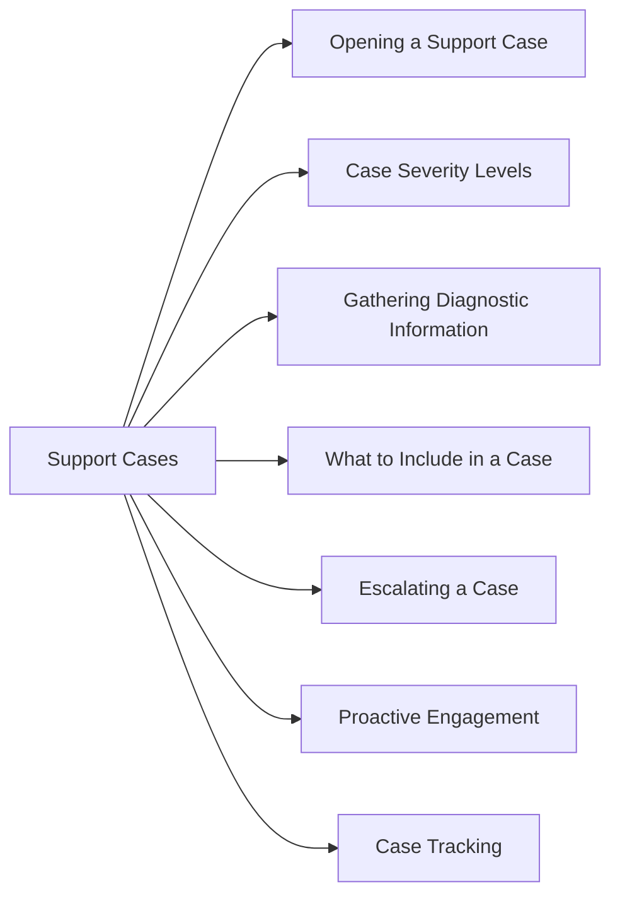

# Pure Storage Support Cases



## Opening a Support Case

**Via Pure1:**
1. Log in to **pure1.purestorage.com**
2. Navigate to **Support → Cases → Create Case**
3. Select the affected array
4. Describe the issue, attach relevant logs
5. Submit — Pure Support responds based on severity SLA

**Via Phone:**
Pure Storage provides 24/7 global phone support for critical issues.

## Case Severity Levels

| Severity | Definition | Target Response |
|---|---|---|
| P1 — Critical | Production down or data at risk | 15–30 minutes (24/7) |
| P2 — High | Degraded performance or redundancy lost | 1–2 hours |
| P3 — Medium | Non-critical issue; workaround available | Next business day |
| P4 — Low | Question, documentation, feature request | 2–3 business days |

## Gathering Diagnostic Information

Before or during a case, capture diagnostic data:

```bash
# FlashArray — phonehome sends diagnostics automatically
purecli support info

# FlashArray — generate a diagnostic bundle
purecli support diagnostics

# FlashBlade
purefb support info
```

Pure Support can also pull diagnostics directly via Pure1 phone-home.

## What to Include in a Case

- Array name and serial number (from Pure1 or GUI)
- Purity version
- Symptom description with timestamps
- Impact (hosts affected, I/O interruption, etc.)
- Recent changes (upgrades, cabling, reconfigurations)
- Alert IDs from `purecli alert list` or Pure1

## Escalating a Case

If a case is not progressing:
1. Request escalation within the case
2. Contact your Pure Storage Customer Success Manager or TAM
3. For P1 issues: phone Pure Support directly — do not rely on email/portal

## Proactive Engagement

Pure Support is proactive for Evergreen subscribers:
- Drive failures are often replaced before the customer notices
- Pure1 AI flags potential issues and Pure Support opens cases proactively
- Check Pure1 → Cases for proactively opened items

## Case Tracking

All open and closed cases are visible in **Pure1 → Support → Cases**.
