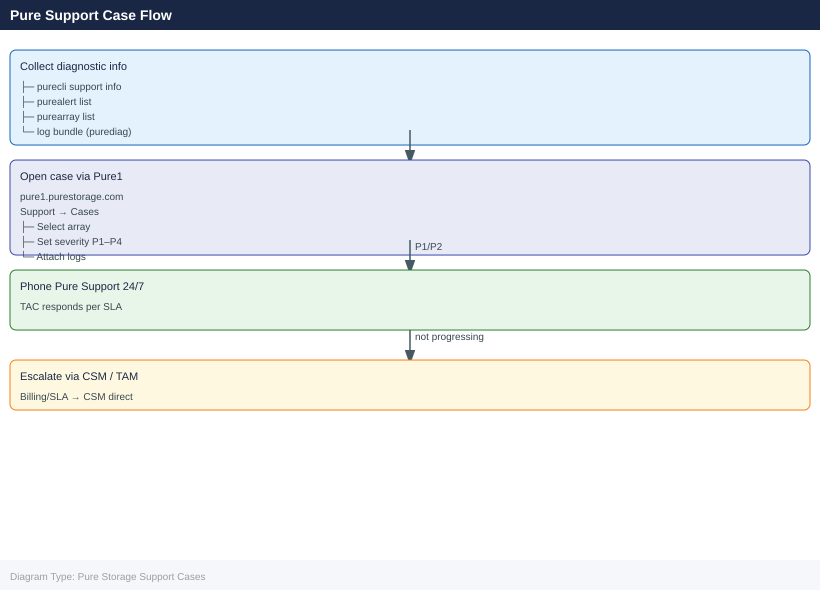

---
tags:
  - operations
  - pure
---
# Pure Storage Support Cases

<div class="kb-summary">
Pure Storage Support Cases reference covering Opening a Support Case, Case Severity Levels, Gathering Diagnostic Information, What to Include in a Case, Escalating a Case and 2 more sections.

*Applies to: FlashArray Purity 6.x*
</div>



## Before you begin

- **Access:** Storage admin credentials (cluster admin or equivalent)
- **Timing:** safe to run during business hours unless a step is marked ⚠ (causes interruption)
- **Dependencies:** no active upgrades or migrations on the same infrastructure
- **Logging:** capture command output — paste into the change record on completion

---

## Opening a Support Case

**Via Pure1:**
1. Log in to **pure1.purestorage.com**
2. Navigate to **Support → Cases → Create Case**
3. Select the affected array
4. Describe the issue, attach relevant logs
5. Submit — Pure Support responds based on severity SLA

**Via Phone:**
Pure Storage provides 24/7 global phone support for critical issues.

## Case Severity Levels

| Severity | Definition | Target Response |
|---|---|---|
| P1 — Critical | Production down or data at risk | 15–30 minutes (24/7) |
| P2 — High | Degraded performance or redundancy lost | 1–2 hours |
| P3 — Medium | Non-critical issue; workaround available | Next business day |
| P4 — Low | Question, documentation, feature request | 2–3 business days |

## Gathering Diagnostic Information

Before or during a case, capture diagnostic data:

```bash
# FlashArray — phonehome sends diagnostics automatically
purecli support info

# FlashArray — generate a diagnostic bundle
purecli support diagnostics

# FlashBlade
purefb support info
```


```text title="Expected output"
=== FlashArray Support Information ===
Support Status: Enabled
Phone Home: Active
Last Phone Home: 2024-01-15 14:32:18 UTC
Support Contract ID: ABC-123456-XYZ
Entitlement: Premium Support Plus
Array Serial: FA-m70-123456
Array Model: FlashArray//m70
Purity Version: 6.4.2
=== Generating Diagnostic Bundle ===
Diagnostic bundle creation started
Bundle ID: diag-20240115-143245-fa-m70-123456
Estimated size: 2.3 GB
Estimated time: 8-12 minutes
Status: In Progress (45%)
=== FlashBlade Support Information ===
Support Status: Enabled
Phone Home: Active
Last Phone Home: 2024-01-15 14:31:52 UTC
Support Contract ID: DEF-789012-UVW
Entitlement: Standard Support
Blade Serial: FB-e220-654321
Blade Model: FlashBlade//e220
Purity Version: 4.2.1
```

!!! warning "Common errors"
    **`purecli: command not found`** — Install the Pure CLI tools or add the installation directory to your PATH environment variable.
    **`Error: Unable to connect to array management IP`** — Verify network connectivity to the array's management interface and confirm the array hostname/IP is configured in your purecli credentials.
    **`Error: Authentication failed - invalid credentials`** — Re-authenticate using `purecli login` or verify your API token has not expired.
Pure Support can also pull diagnostics directly via Pure1 phone-home.

## What to Include in a Case

- Array name and serial number (from Pure1 or GUI)
- Purity version
- Symptom description with timestamps
- Impact (hosts affected, I/O interruption, etc.)
- Recent changes (upgrades, cabling, reconfigurations)
- Alert IDs from `purecli alert list` or Pure1

## Escalating a Case

If a case is not progressing:
1. Request escalation within the case
2. Contact your Pure Storage Customer Success Manager or TAM
3. For P1 issues: phone Pure Support directly — do not rely on email/portal

## Proactive Engagement

Pure Support is proactive for Evergreen subscribers:
- Drive failures are often replaced before the customer notices
- Pure1 AI flags potential issues and Pure Support opens cases proactively
- Check Pure1 → Cases for proactively opened items

## Case Tracking

All open and closed cases are visible in **Pure1 → Support → Cases**.

---

## Verify

- Confirm the operation completed without errors in the log or management UI
- Verify the expected state change is visible (service running, object created, config applied)
- Document the outcome in the change record

## See also

- [Pure Storage — Alerts](../alerts/)
- [Pure Storage — Pure1](../pure1/)
- [Pure Storage — Overview](../../)
