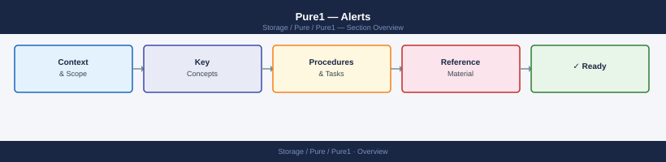

---
tags:
  - pure
---
# Pure1 — Alerts


<div class="kb-summary">
Alerts reference covering Viewing Alerts in Pure1, Alerts via CLI, Alerts via Pure1 API, Alert Severity Definitions, Common Alert Types and 2 more sections.

*Applies to: Pure1*
</div>



```d2
direction: right

center: "Pure1" {shape: hexagon}
alert_severity_definitions: "Alert Severity Definitions" {shape: rectangle}
common_alert_types: "Common Alert Types" {shape: rectangle}
alert_notification_configuration: "Alert Notification Configuration" {shape: rectangle}
alert_integration_with_prometheus: "Alert Integration with Prometheus" {shape: rectangle}

center -> alert_severity_definitions
center -> common_alert_types
center -> alert_notification_configuration
center -> alert_integration_with_prometheus
```

## Alert Severity Definitions

| Severity | Meaning | Response |
|---|---|---|
| **Info** | Informational — no immediate action needed | Review at next check |
| **Warning** | Degraded state or approaching threshold | Investigate within 24h |
| **Error** | Service or hardware impact; data protection at risk | Investigate immediately |
| **Critical** | Data loss risk or complete component failure | Escalate immediately |

## Common Alert Types

| Alert | Severity | What it means | Action |
|---|---|---|---|
| `hardware` — drive failed | Error | Physical drive failure | Open Pure support case — covered by Evergreen |
| `hardware` — controller offline | Critical | Controller failure | Open Priority support case immediately |
| `array` — space above 80% | Error | Array approaching capacity | Review snapshots; plan expansion |
| `replication` — lag | Warning | Replication behind RPO target | Check network; investigate source/target load |
| `volume` — almost full | Warning | Thin-provisioned volume near limit | Extend volume or reduce data |
| `phonehome` — disconnected | Warning | Array cannot reach Pure cloud | Check firewall; test outbound TCP 443 |
| `network` — interface down | Error | FC or iSCSI port down | Check cable, switch port, SFP |

## Alert Notification Configuration

### Email

```text
Pure1 → Administration → Notification → Email
Add individual or distribution list email addresses
```

### SNMP Traps

```bash
Array CLI:
puresnmp list          # show current SNMP config
puresnmp set --manager <nms-ip> --community <community>
puresnmp enable

# Import Pure Storage MIB for alert descriptions:
# PURESTORAGE-FA-MIB.txt — available on Pure support portal
```

### Syslog

```bash
# FlashArray
puresyslog list
puresyslog add --address <syslog-ip> --port 514 --protocol udp

# Alerts appear as syslog messages with facility local7
# Format: <severity> <timestamp> <array> <alert-summary>
```

### Webhooks (FlashArray 6.3+)

```text
Array UI → Settings → Notification → Webhooks → Add Webhook
URL: https://your-endpoint/pure-webhook
Events: hardware, capacity, replication, network
```

## Alert Integration with Prometheus

Use the `pure-fa-om` Prometheus exporter:

```yaml
# prometheus.yml
scrape_configs:
  - job_name: pure_flasharray
    static_configs:
      - targets: ['<flasharray-ip>']
    metrics_path: /metrics
    params:
      endpoint: ['<flasharray-ip>']
    relabel_configs:
      - target_label: __address__
        replacement: <pure-exporter-host>:9490

# Alert rule example
groups:
  - name: pure
    rules:
      - alert: PureArrayCapacityCritical
        expr: pure_array_space_used_bytes / pure_array_capacity_bytes > 0.85
        labels:
          severity: critical
        annotations:
          summary: "Pure array {{ $labels.array_name }} above 85% capacity"
```
