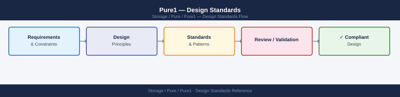

---
tags:
  - architecture
  - pure
---
# Pure1 — Design Standards

<div class="kb-summary">
Array naming standards, team access model, alert threshold configuration, and operational baselines for Pure1.

*Applies to: Pure1*
</div>



```d2
direction: right

center: "Pure1" {shape: hexagon}
array_naming_standards: "Array Naming Standards" {shape: rectangle}
access_model: "Access Model" {shape: rectangle}
alert_threshold_baselines: "Alert Threshold Baselines" {shape: rectangle}
operational_standards: "Operational Standards" {shape: rectangle}
configuration_checklist: "Configuration Checklist" {shape: rectangle}

center -> array_naming_standards
center -> access_model
center -> alert_threshold_baselines
center -> operational_standards
center -> configuration_checklist
```

## Array Naming Standards

Array names in Pure1 are inherited from the array's configured hostname. Enforce the hostname standard at array deployment — it cannot be changed without array rename.

| Array Type | Convention | Example |
|---|---|---|
| FlashArray | `fa-{site}-{seq}` | `fa-dc1-01` |
| FlashBlade | `fb-{site}-{seq}` | `fb-dc1-01` |

- Use lowercase only; no underscores (Pure1 URL-encodes them inconsistently)
- Site code should match the site codes used in vCenter, CMDB, and monitoring

## Access Model

| Role | Pure1 Permission | Scope |
|---|---|---|
| Storage Admin | Array Admin | Full access to all arrays + Pure1 |
| Storage Operator | Read-only | View performance, capacity, alerts |
| On-call Engineer | Read-only + alert subscription | Alert emails + Pure1 dashboard |
| Vendor Support | Pure Support access (via SupportAssist) | Pure-managed access, logged |

- Use AD group-based SSO for Pure1 access (SAML via Entra ID or Okta)
- Do not create individual accounts — group membership controls access
- Review access quarterly; remove leavers within 24 hours

## Alert Threshold Baselines

Pure1 applies AI-driven thresholds by default. Override only when the default produces excessive noise:

| Alert Type | Override Threshold | Rationale |
|---|---|---|
| Capacity utilisation | 70% warning / 80% critical | Earlier lead time than default 80/90 |
| Drive failure | No override — alert immediately | Hardware fault = always critical |
| Replication lag | > 2× RPO target | Alert before SLA breach |
| Array health score | < 90 | Proactive; default is < 80 |

## Operational Standards

- Review Pure1 capacity forecasting monthly — act on any "full within 90 days" projection
- Subscribe storage team DL to all Critical alerts; on-call engineer to all alerts
- Tag arrays with `site`, `team`, and `tier` tags in Pure1 for dashboard filtering
- Enable **Pure1 Support** (remote support channel) on all production arrays

## Configuration Checklist

- [ ] All FlashArrays and FlashBlades visible in Pure1 (connected via Purity OS outbound HTTPS)
- [ ] SSO configured (SAML with Entra ID / Okta)
- [ ] AD groups mapped to Pure1 roles
- [ ] Alert notification rules configured (email to team DL for Critical)
- [ ] Array tags applied: `site`, `tier`, `team`
- [ ] Pure1 Support (remote support) enabled on all production arrays
- [ ] Capacity forecast reviewed and any < 90-day projections actioned

---

## See also

- [Pure1 — How It Works](how-it-works/)
- [Pure1 — Integrations](integrations/)
- [Pure1 — Deploy](../deploy/)
