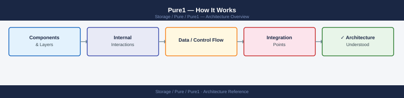
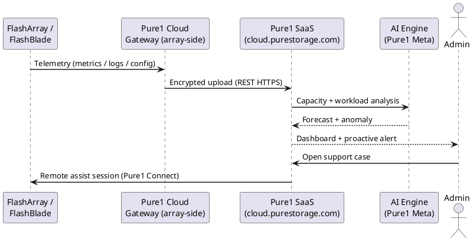

---
tags:
  - architecture
  - pure
---
# Pure1 — How It Works

How It Works reference covering Architecture, High Availability.

*Applies to: Pure1*

Pure1 is Pure Storage's cloud-based management and analytics platform for FlashArray and FlashBlade systems. It requires no on-premises management infrastructure — each array connects to Pure1 directly via outbound HTTPS. Pure1 provides AI-driven analytics (Pure1 Meta), capacity forecasting, health scoring, and a REST API for programmatic fleet management.

---

## Architecture

```mermaid
graph LR
    Arrays["FlashArray / FlashBlade<br/>Purity OS phonehome<br/>every 30 seconds<br/>HTTPS outbound"]
    Pure1Cloud["Pure1 Cloud Platform<br/>SaaS · Pure-managed<br/>time-series DB<br/>full resolution storage"]
    Meta["Pure1 Meta (AI)<br/>ML health scoring<br/>workload classification<br/>capacity forecasting"]
    Dashboard["Pure1 Dashboard<br/>fleet management<br/>health scores · alerts<br/>capacity trends"]
    TAC["Pure Storage TAC<br/>auto case creation<br/>proactive swap<br/>zero-touch resolution"]

    Arrays -->|"phonehome telemetry HTTPS"| Pure1Cloud
    Pure1Cloud -->|"metrics ingest"| Meta
    Meta -->|"health scores · alerts"| Dashboard
    Meta -->|"pre-failure detection"| TAC
    TAC -->|"auto case + diagnostics"| Dashboard

    style Arrays fill:#2563eb,stroke:#1d4ed8,color:#fff
    style Pure1Cloud fill:#7c3aed,stroke:#6d28d9,color:#fff
    style Meta fill:#b45309,stroke:#92400e,color:#fff
    style Dashboard fill:#15803d,stroke:#166534,color:#fff
    style TAC fill:#15803d,stroke:#166534,color:#fff
```

---

## High Availability

Pure1 is managed entirely by Pure Storage as a SaaS platform. Availability SLA and disaster recovery are Pure Storage's responsibility. Customer action is not required for Pure1 infrastructure HA.

---

## See also

- [Pure1 — Design Standards](../design-standards/)
- [Pure1 — Integrations](../integrations/)
- [Pure1 — Deploy](../../deploy/)
