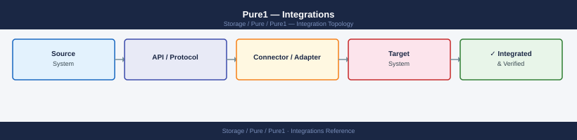

---
tags:
  - architecture
  - pure
---
# Pure1 — Integrations

<div class="kb-summary">
Pure1 integrates natively with FlashArray and FlashBlade via Purity OS telemetry, and outbound to ITSM systems, notification channels, and the Pure1 REST API for automation.

*Applies to: Pure1*
</div>



---

```d2
direction: right

center: "Pure1" {shape: hexagon}
component_a: "Component A" {shape: rectangle}
component_b: "Component B" {shape: rectangle}
component_c: "Component C" {shape: rectangle}

center -> component_a
center -> component_b
center -> component_c
```

## See also

- [Pure1 — How It Works](how-it-works/)
- [Pure1 — Design Standards](design-standards/)
