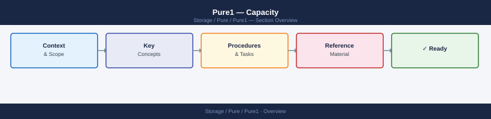

---
tags:
  - pure
---
# Pure1 — Capacity


<div class="kb-summary">
Capacity reference covering Capacity via Pure1 API, Capacity Alerts, Capacity Planning, Snapshot Space Management, Common Capacity Issues.

*Applies to: Pure1*
</div>



```d2
direction: right

center: "Pure1" {shape: hexagon}
capacity_alerts: "Capacity Alerts" {shape: rectangle}
capacity_planning: "Capacity Planning" {shape: rectangle}
snapshot_space_management: "Snapshot Space Management" {shape: rectangle}
common_capacity_issues: "Common Capacity Issues" {shape: rectangle}

center -> capacity_alerts
center -> capacity_planning
center -> snapshot_space_management
center -> common_capacity_issues
```

```vegalite
{
  "$schema": "https://vega.github.io/schema/vega-lite/v5.json",
  "title": {
    "text": "Capacity \u2014 Thresholds",
    "fontSize": 13,
    "fontWeight": "normal"
  },
  "width": 480,
  "height": {
    "step": 26
  },
  "data": {
    "values": [
      {
        "metric": "Snapshot excessive",
        "zone": "Safe",
        "val": 50
      },
      {
        "metric": "Snapshot excessive",
        "zone": "Alert",
        "val": 50
      }
    ]
  },
  "mark": {
    "type": "bar",
    "cornerRadiusEnd": 3
  },
  "encoding": {
    "y": {
      "field": "metric",
      "type": "nominal",
      "axis": {
        "title": null,
        "labelLimit": 200
      },
      "sort": null
    },
    "x": {
      "field": "val",
      "type": "quantitative",
      "stack": "normalize",
      "axis": {
        "title": "Threshold boundary",
        "format": ".0%"
      }
    },
    "color": {
      "field": "zone",
      "type": "nominal",
      "scale": {
        "domain": [
          "Safe",
          "Alert"
        ],
        "range": [
          "#15803d",
          "#dc2626"
        ]
      },
      "legend": {
        "title": "Zone"
      }
    },
    "order": {
      "field": "zone",
      "sort": [
        "Safe",
        "Alert"
      ]
    },
    "tooltip": [
      {
        "field": "metric",
        "type": "nominal",
        "title": "Metric"
      },
      {
        "field": "zone",
        "type": "nominal",
        "title": "Zone"
      },
      {
        "field": "val",
        "type": "quantitative",
        "title": "Segment %",
        "format": ".0f"
      }
    ]
  }
}
```

## Capacity Alerts

Pure1 raises automatic capacity alerts at these thresholds:

| Alert | Default threshold | Severity |
|---|---|---|
| Array space warning | 70% usable used | Warning |
| Array space critical | 80% usable used | Error |
| Volume nearly full | 90% of volume size | Warning |
| Snapshot excessive | > 50% of usable used by snapshots | Warning |

Thresholds can be adjusted under **Pure1 → Settings → Alert Policies**.

## Capacity Planning

```bash
# Pure1 UI: Arrays → Capacity → Forecast
# Shows projected days to full at current growth rate

# Recommended actions when forecast < 90 days:
# 1. Review and delete aged snapshots
# 2. Identify top space consumers (purevol list --space)
# 3. Check volumes without thin provisioning savings (large unique)
# 4. Open Evergreen sizing request if expansion needed
```

## Snapshot Space Management

Stale snapshots are the most common cause of unexpected capacity growth:

```bash
# List snapshots older than 30 days sorted by size
puresnapshot list --space | awk 'NR==1 || $6 > 30' | sort -k5 -rh

# Destroy snapshots matching a pattern
puresnapshot destroy --name "vol01.*" --notail

# Eradicate immediately (skip 24h pending period)
puresnapshot eradicate --name "vol01.*"

# Show pending eradication queue
puresnapshot list --pending-only
```

## Common Capacity Issues

| Symptom | Cause | Action |
|---|---|---|
| Used growing faster than expected | Snapshot accumulation | Review snapshot policies; delete stale snapshots |
| Data reduction ratio dropped | New data type (already-compressed data like video) | Normal — not actionable; pure capacity has grown |
| Volume space used ≠ array space used | Thin provisioning — volumes report provisioned, array reports actual | Expected behaviour |
| Forecast shows < 30 days to full | Rapid data growth or snapshot accumulation | Escalate to storage team; open Evergreen expansion request |
