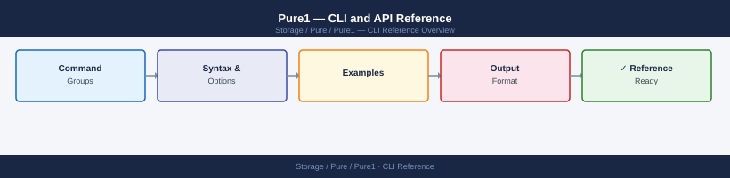

---
tags:
  - pure
---
# Pure1 — CLI and API Reference



```bash
# Generate RSA key pair for Pure1 API auth
openssl genrsa -out pure1-private.pem 2048
openssl rsa -in pure1-private.pem -pubout -out pure1-public.pem

# Create a JWT assertion (Python example)
python3 -c "
import jwt, time
payload = {'iss': '<application_id>', 'iat': int(time.time()), 'exp': int(time.time()) + 86400}
token = jwt.encode(payload, open('pure1-private.pem').read(), algorithm='RS256')
print(token)
"

# Exchange JWT for access token
curl -X POST https://api.pure1.purestorage.com/oauth2/1.0/token   -d "grant_type=urn:ietf:params:oauth:grant-type:token-exchange&subject_token=<jwt>&subject_token_type=urn:ietf:params:oauth:token-type:jwt"
```

```bash
# Get capacity metrics for all arrays
curl -X GET "https://api.pure1.purestorage.com/api/1.latest/arrays?fields=name,capacity,space"   -H "Authorization: Bearer <token>"

# Get capacity for a specific array
curl -X GET "https://api.pure1.purestorage.com/api/1.latest/arrays?filter=name%3D%27<array_name>%27&fields=name,capacity,space"   -H "Authorization: Bearer <token>"
```
```python
from py_pure_client import PureOneClient

client = PureOneClient(private_key_file="pure1-private.pem",
                       private_key_password=None,
                       app_id="<application_id>")

# List all arrays
arrays = client.get_arrays()
for a in arrays.items:
    print(a.name, a.model)

# Get active alerts
alerts = client.get_alerts(filter="state='open'")
for alert in alerts.items:
    print(alert.summary, alert.severity)
```

```d2
direction: right

center: "Pure1" {shape: rectangle}
component_a: "Component A" {shape: rectangle}
component_b: "Component B" {shape: rectangle}
component_c: "Component C" {shape: rectangle}

center -> component_a
center -> component_b
center -> component_c
```

## See also

- [Pure1 — Overview](../../)
