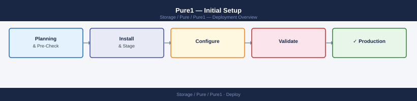
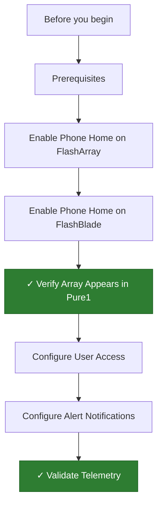

---
tags:
  - deployment
  - pure
search:
  boost: 1.5
---
# Pure1 — Initial Setup

<div class="kb-summary">
Step-by-step guide to enabling Phone Home on Pure Storage FlashArray and FlashBlade, verifying array registration in the Pure1 cloud portal, and configuring access and alerting.

*Applies to: Pure1*
</div>





## Before you begin

- **Access:** admin credentials for the target system and any upstream dependencies (DNS, NTP, vCenter, directory services)
- **Timing:** safe to run during a scheduled maintenance window; allow 1-2 hours for initial deployment
- **Dependencies:** network connectivity verified; DNS resolvable; NTP configured; any licence keys available
- **Logging:** record every IP address, hostname, and credential set assigned during this deployment

---


## Prerequisites

Before starting Pure1 setup, confirm the following.

**Internet-connected FlashArray/FlashBlade:**

- FlashArray running Purity//FA 5.3.0 or later (Purity 6.x recommended)
- FlashBlade running Purity//FB 3.2.0 or later
- Array management IP must have outbound HTTPS (443/TCP) access to `pure1.purestorage.com`
- DNS resolution must work from the array management interface
- If an outbound proxy is in use, the proxy hostname, port, and credentials are required

**Pure Storage support account:**

- Active Pure Storage support account at `support.purestorage.com`
- The account must be linked to the organisation that owns the arrays
- Arrays must have an active support contract

**NTP:**

- Array NTP must be synchronised — time skew causes Phone Home authentication failures

**Network checklist:**

| Destination | Port | Protocol | Purpose |
|---|---|---|---|
| `pure1.purestorage.com` | 443 | HTTPS | Phone Home and API |
| `support.purestorage.com` | 443 | HTTPS | Support case integration |

---

## Enable Phone Home on FlashArray

Phone Home is the mechanism by which FlashArray sends telemetry and configuration data to Pure1.

**Via the FlashArray UI:**

1. Open a browser to `https://<flasharray-management-ip>` and log in as `pureuser` or an array admin account.
2. Navigate to **Settings → Support → Phone Home**.
3. Toggle **Phone Home** to **On**.
4. If a proxy is required, click **Proxy** and enter the proxy server address and port.
5. Click **Test Phone Home** — the test must return **Success** before proceeding.
6. Confirm the **Last Phone Home** timestamp updates to the current time.

**Via the FlashArray CLI:**

```bash
# SSH to the array
ssh pureuser@<flasharray-ip>

# Enable Phone Home
puresupport phonehome --enable

# Set proxy if required
puresupport phonehome --proxy https://proxy.company.local:3128

# Test Phone Home
puresupport phonehome --test

# Confirm status
puresupport phonehome
```

Expected output from `puresupport phonehome` after enabling:

```text
Enabled:   True
Status:    Connected
Proxy:     -
```

---

## Enable Phone Home on FlashBlade

**Via the FlashBlade UI:**

1. Open a browser to `https://<flashblade-management-ip>` and log in as an admin account.
2. Navigate to **Settings → Support → Phone Home**.
3. Toggle **Phone Home** to **On**.
4. Click **Send Now** to initiate an immediate Phone Home and confirm the status shows **Sent**.

**Via the FlashBlade CLI:**

```bash
# SSH to the FlashBlade
ssh pureuser@<flashblade-ip>

# Check Phone Home status
purefb support

# Enable Phone Home
purefb support set --phonehome-enabled true

# Test Phone Home
purefb support test

# Confirm last send time
purefb support
```

**Proxy configuration for FlashBlade:**

```bash
purefb support set --proxy https://proxy.company.local:3128
```

---

## Verify Array Appears in Pure1

1. Open a browser to `https://pure1.purestorage.com` and sign in with your Pure Storage support account.
2. Navigate to **Fleet → Arrays**.
3. Arrays that have successfully completed Phone Home appear in the list within 15–30 minutes of enabling Phone Home.
4. If an array does not appear after 30 minutes:
   - Confirm Phone Home is enabled and the last send timestamp is recent.
   - Check that outbound HTTPS to `pure1.purestorage.com` is not blocked by firewall.
   - Review the array syslog for Phone Home errors.

**What to verify per array:**

- **Status:** shows **Normal**, **Warning**, or **Critical**
- **Capacity:** used and free capacity values match the array UI
- **Performance:** IOPS and throughput graphs are populating
- **Health:** no critical alerts that were not already known

---

## Configure User Access

1. In the Pure1 portal, navigate to **Settings → Users**.
2. Click **Invite User**.
3. Enter the user's email address.
4. Assign the appropriate role:
   - **Administrator:** full access including billing and account management
   - **Array Admin:** can manage arrays and alerts but not account settings
   - **Viewer:** read-only access to all dashboards and data
5. Click **Send Invitation**.
6. The invited user receives an email to create or link their Pure Storage account.

**SAML SSO (if configured at the organisation level):**

1. Navigate to **Settings → Security → SSO**.
2. Click **Configure SSO** and enter the IdP metadata URL or upload the IdP metadata XML.
3. Map the IdP attribute for email to the Pure1 user identity field.
4. Test SSO login with a non-admin account before enabling for all users.

---

## Configure Alert Notifications

1. In the Pure1 portal, navigate to **Settings → Notifications**.
2. Click **Add Notification Rule**.
3. Configure the rule:
   - **Name:** descriptive label (e.g. `Critical Alerts - Storage Team`)
   - **Severity:** Critical, Warning, or both
   - **Arrays:** all arrays, or select specific arrays
   - **Channel:** Email (enter comma-separated addresses) or Webhook (enter endpoint URL)
4. Click **Save**.
5. Click **Send Test** to confirm the notification channel is working.

**Recommended notification rules:**

| Rule name | Severity | Channel |
|---|---|---|
| Critical storage alerts | Critical | On-call distribution list |
| Warning alerts | Warning | Storage team distribution list |
| Capacity forecast | Informational (capacity) | Capacity planning team |

**Webhook (PagerDuty / Slack example):**

- PagerDuty: use the PagerDuty Events API v2 URL as the webhook endpoint
- Slack: create an incoming webhook in Slack and paste the webhook URL into the notification rule

---

## Validate Telemetry

Run through the following checks to confirm the setup is complete and data is flowing correctly.

**Phone Home status:**

- FlashArray: `puresupport phonehome` shows `Enabled: True` and a recent **Last Phone Home** time
- FlashBlade: `purefb support` shows Phone Home enabled and a recent **Last Sent** time

**Pure1 portal:**

- All arrays appear under **Fleet → Arrays** with a valid health status
- Performance charts show data for at least the last hour
- Capacity values match the array management UI (within 1%)
- No arrays show **Data Collection Error** or **Disconnected** status

**Notifications:**

- At least one test notification has been sent and received for each notification rule
- Review **Pure1 → Alerts** to confirm active alerts are visible and match the array state

**Access:**

- Invite at least one non-admin user and confirm they can sign in and view the assigned arrays
- If SSO is configured, confirm SSO login completes successfully for a test user account

---

## See also

- [Pure1 — How It Works](../architecture/how-it-works/)
