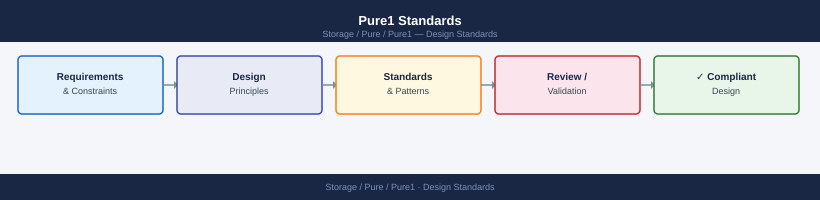

---
tags:
  - pure
---
# Pure1 Standards


<div class="kb-summary">
Pure1 Standards reference covering Array Tagging Policy, Capacity Threshold Standards, Alert Notification Routing, Health Score Standards, API Access Standards and 3 more sections.

*Applies to: Pure1*
</div>



```d2
direction: down

capacity_threshold_standards: "Capacity Threshold Standards" {shape: rectangle}
alert_notification_routing: "Alert Notification Routing" {shape: rectangle}
health_score_standards: "Health Score Standards" {shape: rectangle}
api_access_standards: "API Access Standards" {shape: rectangle}
reporting_cadence: "Reporting Cadence" {shape: rectangle}
purity_version_standards: "Purity Version Standards" {shape: rectangle}

capacity_threshold_standards -> alert_notification_routing: hardens
alert_notification_routing -> health_score_standards: hardens
health_score_standards -> api_access_standards: hardens
api_access_standards -> reporting_cadence: hardens
reporting_cadence -> purity_version_standards: hardens
```

## Capacity Threshold Standards

| Metric | Warning | Critical | Action |
|---|---|---|---|
| Usable capacity used | 70% | 85% | Warning: track; Critical: raise capacity planning request same day |
| Data reduction ratio decline | > 15% below 30-day baseline | > 25% decline | Investigate workload change; review dedup/compression settings |
| Days to capacity exhaustion | 45 days | 15 days | 45 days: plan expansion; 15 days: emergency action |

Capacity alerts are configured in **Pure1 > Administration > Notifications** with severity-based routing.

## Alert Notification Routing

| Severity | Channel | SLA |
|---|---|---|
| CRITICAL | PagerDuty (on-call) + ServiceNow incident | Acknowledge within 15 minutes |
| WARNING | Email — storage-ops distribution list | Review within 4 hours |
| INFO | Pure1 portal only | Review in daily checklist |

Notification rules are configured per array tag filter (e.g., separate rules for prod vs. non-prod).

## Health Score Standards

Pure1 array health is expressed as a pass/fail component health model rather than a numerical score. The equivalent operational thresholds:

| Array Status | Action |
|---|---|
| Healthy (all components green) | Normal monitoring |
| Degraded (non-critical component fault) | Raise in daily stand-up; investigate within 4 hours |
| Error / Critical fault | Raise ServiceNow incident immediately; engage Pure Storage support |

## API Access Standards

- One API service account per consuming system (Splunk, Grafana, automation scripts, Aria Operations)
- API keys are RSA private keys — store securely in the secrets manager (not in filesystem or repos)
- Rotation schedule: annual; rotation dates tracked in the credential register
- Read-only API access for monitoring and reporting; no write access unless required

## Reporting Cadence

| Report | Schedule | Format | Audience |
|---|---|---|---|
| Weekly Capacity Report | Weekly (Monday 07:00) | Email + CSV | Storage team |
| Monthly Fleet Health Summary | Monthly, 1st working day | PDF | Storage team + management |
| Capacity Trend Archive | Weekly (automated script) | CSV → shared drive | Capacity planning |

Reports are generated via the `pure1_capacity_report.py` script and distributed via email. Archive capacity trend data to the shared drive for 2-year retention.

## Purity Version Standards

- Production arrays: must be on a supported Purity release (not EOS)
- Non-production arrays: may lag production by one minor version
- All arrays: plan upgrades within 6 months of EOS announcement
- Review Pure Storage release calendar quarterly

## Change Management

All planned Purity upgrades and array configuration changes must be logged in ServiceNow as standard change records. Emergency changes (e.g., critical patch) use the emergency change process with post-change documentation within 24 hours.
