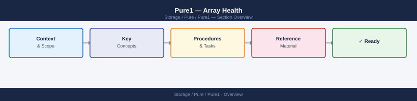

---
tags:
  - pure
---
# Pure1 — Array Health


<div class="kb-summary">
Array Health reference covering FlashBlade Health, Health via Pure1 REST API, Connectivity Health — Phone Home, Health Monitoring Integration, Common Health Issues.

*Applies to: Pure1*
</div>



```d2
direction: right

center: "Pure1" {shape: hexagon}
connectivity_health_phone_home: "Connectivity Health — Phone Home" {shape: rectangle}
health_monitoring_integration: "Health Monitoring Integration" {shape: rectangle}
common_health_issues: "Common Health Issues" {shape: rectangle}

center -> connectivity_health_phone_home
center -> health_monitoring_integration
center -> common_health_issues
```

## Connectivity Health — Phone Home

Pure1 requires outbound HTTPS connectivity (TCP 443) from the array to Pure Storage cloud. If Phone Home is failing:

```bash
# Test outbound connectivity from array
purentp list           # NTP also tests DNS/network

# Check Phone Home status
purearray list --csv   # includes phone_home_enabled, phone_home_last_contact

# Proxy configuration (if internet access is via proxy)
puresupport proxy list
puresupport proxy set --host <proxy-ip> --port 8080
```

## Health Monitoring Integration

Pure1 can send health events to external systems:

- **SNMP:** Configure under Settings → Notification → SNMP. Use the Pure Storage MIB.
- **Syslog:** Settings → Notification → Syslog → add syslog server IP
- **Webhooks:** Settings → Notification → Webhooks (FlashArray 6.3+)
- **Email:** Settings → Notification → Email → add recipients

## Common Health Issues

| Symptom | Cause | Action |
|---|---|---|
| Drive shows Failed | Drive hardware fault | Open Pure support case — drive replacement covered by Evergreen |
| Controller Offline | Controller fault | Open Priority support case immediately |
| Phone Home last contact > 24h | Firewall blocking TCP 443 to pure1.purestorage.com | Check proxy/firewall; test with `curl https://pure1.purestorage.com` from array |
| Array not visible in Pure1 | Array not registered or API key expired | Re-register array under Pure1 → Settings → Arrays |
