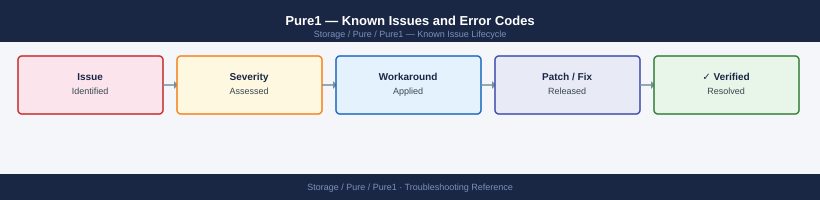

---
tags:
  - troubleshooting
  - pure1
  - pure-storage
  - known-issues
---
# Pure1 — Known Issues and Error Codes

<div class="kb-summary">
Catalog of known Pure1 issues covering array connectivity, portal access, and data display problems. Pure1 is a SaaS platform — most issues are phone-home connectivity from arrays.

*Applies to: Pure1 cloud portal*
</div>



```d2
direction: down

symptom: Identify Symptom {shape: diamond}
array_connectivity: "Array Connectivity" {shape: rectangle}
portal_access: "Portal Access" {shape: rectangle}
resolution: Resolve or Escalate {shape: oval}

symptom -> array_connectivity: investigate
symptom -> portal_access: investigate
array_connectivity -> resolution
portal_access -> resolution
```

## Before you begin

- Pure1 issues are either phone-home connectivity (array side) or portal access (browser side).
- Array connectivity: verify outbound TCP 443 from array management IP to `pure1.purestorage.com`.
- Portal issues: log in at `pure1.purestorage.com`; contact Pure Storage support if portal is unavailable.

## Array Connectivity

| Error / Symptom | Affected Versions | Cause | Workaround / Fix | Fixed In |
|---|---|---|---|---|
| Array shows `Offline` in Pure1 | All | TCP 443 blocked from array management IP to pure1.purestorage.com | Open firewall; test: `curl -sk https://pure1.purestorage.com` from array management network | N/A |
| Array connected but data stale >24 hours | All | Intermittent network drops interrupting telemetry upload | Check network stability from array management IP; review firewall session table for timeouts | N/A |
| `puremessage test` returns `Connection failed` | Purity 6.x | Proxy required but not configured | Configure HTTP proxy on array: `purearray setattr --proxy http://<proxy>:<port>` | N/A |

## Portal Access

| Error / Symptom | Affected Versions | Cause | Workaround / Fix | Fixed In |
|---|---|---|---|---|
| Cannot log in to Pure1 portal | N/A | SSO federation issue or Pure1 outage | Try direct login at `pure1.purestorage.com`; check `status.purestorage.com` for outage | N/A |
| Array visible in Pure1 but showing no performance data | All | Array model not yet configured for full telemetry | Contact Pure support — some older models have limited telemetry | N/A |

## See also

- [Pure Storage FlashArray — Known Issues](../../flasharray/troubleshooting/known-issues.md)
- [Pure Storage FlashBlade — Known Issues](../../flashblade/troubleshooting/known-issues.md)
