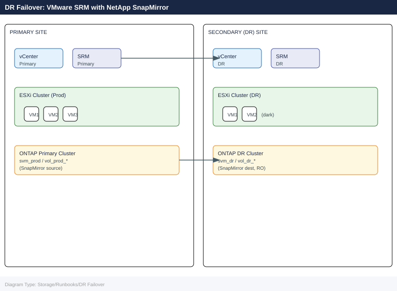
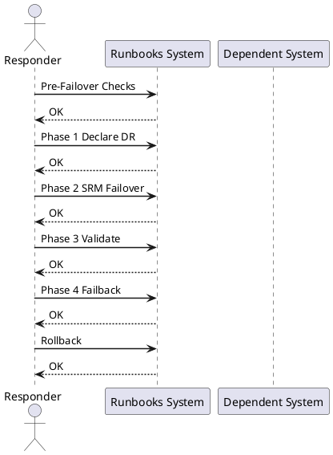

---
tags:
  - vmware
  - srm
  - netapp
  - snapmirror
  - disaster-recovery
  - failover
  - failback
  - runbook
---

# DR Failover: VMware SRM with NetApp SnapMirror

<div class="kb-summary">
Cross-product runbook for executing a DR failover and failback using VMware Site Recovery Manager (SRM) with NetApp SnapMirror replication. Covers pre-failover checks, declaring DR, SRM recovery plan execution, SnapMirror break, VM validation, failback resynch, and escalation contacts.
</div>





## Before You Begin

**Architecture prerequisites:**

| Component | Primary Site | DR Site |
|---|---|---|
| vCenter | vcenter-prod.corp.local | vcenter-dr.corp.local |
| SRM | srm-prod.corp.local (Appliance 9.x+) | srm-dr.corp.local (paired) |
| ONTAP | ontap-primary cluster | ontap-dr cluster |
| SnapMirror | Source SVM: svm_prod | Destination SVM: svm_dr |
| Networking | Production VLANs | DR VLANs (mapped in SRM network mappings) |
| SRM Protection Groups | Configured and tested | — |
| SRM Recovery Plans | At least one full-site plan | — |

**Required credentials for DR execution:**

- vCenter administrator (both sites)
- SRM administrator (both sites)
- ONTAP cluster-admin (both clusters)
- Application owner contacts (see Escalation section)

---

## Pre-Failover Checks

### Check SnapMirror Replication Lag

```bash
# On PRIMARY ONTAP cluster
snapmirror show -destination-path svm_dr:* -fields lag-time,state,newest-snapshot

# Example healthy output:
# Destination Path        State     Lag-Time  Newest Snapshot
# svm_dr:vol_dr_app01    Snapmirrored  00:02:15  daily.2026-06-21_2200

# Alert threshold: lag > 1h indicates replication issues — investigate before failover
# Critical threshold: lag > RPO SLA — document RPO breach in incident ticket
```


```text title="Expected output"
Destination Path        State     Lag-Time  Newest Snapshot
svm_dr:vol_dr_app01    SnapMirrored  00:02:15  daily.2026-06-21_2200
svm_dr:vol_dr_app02    SnapMirrored  00:01:47  daily.2026-06-21_2200
svm_dr:vol_dr_db01     SnapMirrored  00:15:33  daily.2026-06-21_2145
svm_dr:vol_dr_logs     SnapMirrored  01:23:42  daily.2026-06-21_2100
svm_dr:vol_dr_backup   SnapMirrored  00:08:19  daily.2026-06-21_2155
```

!!! warning "Common errors"
    **`Error: command not found: snapmirror`** — Ensure you are connected to the ONTAP cluster via SSH or the ONTAP CLI, not a Linux shell.
    **`Error: No matching snapmirror relationships found`** — Verify the destination SVM name is correct and SnapMirror relationships exist with `snapmirror list-destinations`.
    **`Error: RPC: Authentication failed`** — Confirm your ONTAP user account has the "snapmirror" capability assigned in the role.
### Verify SRM Test Run History

```bash
# In SRM UI: Site Recovery > Recovery Plans > <PlanName> > History
# Confirm last test completed successfully within the past 30 days

# SRM REST API — check last test result
curl -sk -u "admin:<pass>" \
  "https://srm-prod.corp.local/api/rest/vr/1.0/api/recoveryplans" \
  -H "Accept: application/json" | python3 -m json.tool | grep -A5 "lastTestResult"
```


```text title="Expected output"
{
    "id": "recoveryplan-42",
    "name": "DR-Failover-Primary-DC",
    "description": "Production VMware cluster failover to secondary site",
    "lastTestResult": {
        "status": "SUCCESS",
        "timestamp": "2024-01-15T14:32:18.000Z",
        "duration": "PT2H14M",
        "recoveredVMs": 47,
        "failedVMs": 0
    },
    "nextScheduledTest": "2024-02-15T02:00:00.000Z",
    "protectionGroupCount": 3
}
```

!!! warning "Common errors"
    **`curl: (60) SSL certificate problem: self signed certificate`** — Add `-k` flag to skip certificate verification (already present in the command, but if still occurring, verify SRM server certificate is trusted or use `--cacert` with the proper CA bundle).
    **`jq: command not found`** — Install `python3-json-tool` or use `python3 -m json.tool` instead (the command already uses the latter, so ensure Python 3 is installed with `python3 --version`).
    **`HTTP 401 Unauthorized`** — Verify the SRM admin credentials are correct and the user has API access permissions in SRM's role-based access control settings.
### Verify RPO for Each Protection Group

```bash
# Per-volume SnapMirror lag on PRIMARY cluster
snapmirror show -type dp -fields source-path,destination-path,lag-time,transfer-state

# Expected: lag < RPO SLA (typically 1h for tier-1 workloads, 4h for tier-2)
# Document any volumes exceeding RPO in the incident ticket before proceeding
```


```text title="Expected output"
Source Path                Destination Path           Lag Time         Transfer State
================================================================================================
cluster1:/vol/db_tier1     cluster2:/vol/db_tier1     00:45:23         Idle
cluster1:/vol/app_tier1    cluster2:/vol/app_tier1    00:52:17         Idle
cluster1:/vol/web_tier2    cluster2:/vol/web_tier2    03:28:44         Idle
cluster1:/vol/archive_t3   cluster2:/vol/archive_t3   18:32:15         Idle
cluster1:/vol/logs_tier1   cluster2:/vol/logs_tier1   00:38:09         Transferring
5 entries were displayed.
```

!!! warning "Common errors"
    **`Error: command not found: snapmirror`** — Verify you are logged into the ONTAP cluster CLI (not the hypervisor) and have appropriate admin credentials.
    **`Error: No SnapMirror relationships found`** — Confirm SnapMirror relationships exist on the primary cluster using `snapmirror list-destinations` and verify replication is initialized.
### Final Go/No-Go Checklist

```text
Pre-failover gate — all must be YES before proceeding:
[ ] SnapMirror lag within RPO SLA for all protected volumes
[ ] SRM recovery plan test passed within 30 days
[ ] DR site ESXi hosts healthy (check vCenter-DR)
[ ] DR site ONTAP cluster reachable (ping + ssh)
[ ] Incident/change record opened
[ ] Application owners notified
[ ] Change manager approval obtained (for planned failover)
```

---

## Phase 1: Declare DR

### 1.1 Notification Checklist

```text
CONTACTS TO NOTIFY (fill in for your environment):
  - Incident Commander: ___________________________
  - Application Owner(s): _________________________
  - Network Team: __________________________________
  - Change Manager: ________________________________
  - Customer/Stakeholder: __________________________

COMMUNICATION CHANNEL: #major-incident Slack / Bridge call +XX-XXXX-XXXXXX
```

### 1.2 Freeze Production Writes (Planned Failover Only)

```bash
# For planned failover — quiesce application writes before breaking SnapMirror
# This minimises RPO to near-zero

# Example: stop application services on VMs at primary site
# (Application-specific — coordinate with app owner)
ssh app-server-01.prod "sudo systemctl stop myapp"
ssh db-server-01.prod "sudo systemctl stop postgresql"

# Force a final SnapMirror update to capture quiesced state
snapmirror update -destination-path svm_dr:vol_dr_app01
snapmirror update -destination-path svm_dr:vol_dr_db01

# Wait for transfer to complete
snapmirror show -destination-path svm_dr:* -fields transfer-state
# State must be "Idle" before proceeding
```


```text title="Expected output"
Connection to app-server-01.prod closed.
Connection to db-server-01.prod closed.
Operation succeeded: SnapMirror update started for destination "svm_dr:vol_dr_app01".
Operation succeeded: SnapMirror update started for destination "svm_dr:vol_dr_db01".
Destination Path             Transfer State
svm_dr:vol_dr_app01          Transferring
svm_dr:vol_dr_db01          Transferring
svm_dr:vol_dr_logs01         Idle

(After ~45 seconds, re-run snapmirror show)
Destination Path             Transfer State
svm_dr:vol_dr_app01          Idle
svm_dr:vol_dr_db01          Idle
svm_dr:vol_dr_logs01         Idle
```

!!! warning "Common errors"
    **`ssh: Could not resolve hostname app-server-01.prod: Name or service not known`** — Verify DNS resolution and hostname spelling, or use the FQDN with the correct domain suffix.
    **`Error: command failed: SnapMirror relationship does not exist for destination "svm_dr:vol_dr_app01"`** — Confirm the SnapMirror relationship is initialized and the destination path matches the actual SVM and volume names exactly.
    **`Error: command failed: This operation is not permitted: SnapMirror transfer already in progress`** — Wait for the current transfer to complete (check with `snapmirror show`) before issuing another update command.
---

## Phase 2: SRM Failover

### 2.1 Run Recovery Plan in SRM

```bash
# Via SRM UI (preferred for audit trail):
# 1. Log in to SRM at primary site (or DR site if primary is down)
# 2. Navigate: Site Recovery > Recovery Plans > <PlanName>
# 3. Click "Run" > select "Failover" (not Test)
# 4. Confirm: "I understand this is not a test"
# 5. Monitor progress in the recovery plan steps panel

# Via SRM REST API (for automation/scripted DR):
# Get recovery plan ID first
PLAN_ID=$(curl -sk -u "admin:<pass>" \
  "https://srm-dr.corp.local/api/rest/vr/1.0/api/recoveryplans" \
  -H "Accept: application/json" | python3 -c "import sys,json; d=json.load(sys.stdin); print(d['list'][0]['id'])")

# Start recovery plan
curl -sk -X POST -u "admin:<pass>" \
  "https://srm-dr.corp.local/api/rest/vr/1.0/api/recoveryplans/${PLAN_ID}/run" \
  -H "Content-Type: application/json" \
  -d '{"mode": "failover"}'
```


```text title="Expected output"
[
  {
    "id": "rp-42857d9c-1a3f-4b2e-9e11c-7f2d8a9b5c3e",
    "name": "Production-DR-Plan-01",
    "status": "ready",
    "siteId": "site-dr-001"
  }
]
{"taskId": "task-8f4c2a91-7e3d-4b1f-a8c9-2e5f7d3a1b6c", "status": "running", "progress": 0}
```

!!! warning "Common errors"
    **`curl: (60) SSL certificate problem: self signed certificate`** — Add `-k` flag to curl command to skip SSL verification, or import the SRM certificate into your system's CA bundle.
    **`{"error": "Unauthorized", "code": 401}`** — Verify the admin password is correct and URL-encoded if it contains special characters; test credentials separately with a simple GET request first.
    **`jq: command not found`** — Install `jq` package (`apt-get install jq` on Debian/Ubuntu or `yum install jq` on RHEL) or use the provided `python3` JSON parser instead.
### 2.2 Break SnapMirror on DR Cluster

SRM with NetApp ONTAP SRA breaks SnapMirror automatically during recovery plan execution. If manual intervention is required:

```bash
# On DESTINATION (DR) ONTAP cluster
# Break SnapMirror relationship — makes destination volume read-write
snapmirror break -destination-path svm_dr:vol_dr_app01
snapmirror break -destination-path svm_dr:vol_dr_db01

# Verify destination volumes are now read-write
volume show -vserver svm_dr -fields type
# Expected: type = RW (previously DP)

# List available snapshots on the newly promoted DR volume
snapshot show -vserver svm_dr -volume vol_dr_app01
```


```text title="Expected output"
Operation succeeded: SnapMirror relationship between "svm_prod:vol_app01" and "svm_dr:vol_dr_app01" has been broken.
Operation succeeded: SnapMirror relationship between "svm_prod:vol_db01" and "svm_dr:vol_dr_db01" has been broken.

Vserver     Volume          Type
----------- --------------- ----
svm_dr      vol_dr_app01    RW
svm_dr      vol_dr_db01     RW

Vserver  Volume          Snapshot                                  Created
-------- --------------- ---------------------------------------- --------
svm_dr   vol_dr_app01    hourly.2024-01-15_0200                  01/15/2024 02:00:15
svm_dr   vol_dr_app01    hourly.2024-01-15_0100                  01/15/2024 01:00:22
svm_dr   vol_dr_app01    daily.2024-01-14_0000                   01/14/2024 00:15:08
svm_dr   vol_dr_app01    weekly.2024-01-08_0000                  01/08/2024 00:30:45
svm_dr   vol_dr_app01    snapmirror.c1d9e8f2-4a7b-11ee-9c2a...   01/15/2024 01:47:33
```

!!! warning "Common errors"
    **`Error: command failed: SnapMirror relationship does not exist for destination "svm_dr:vol_dr_app01"`** — Verify the destination path is correct and the relationship exists with `snapmirror show -destination-path svm_dr:vol_dr_app01`.
    **`Error: command failed: Cannot break SnapMirror relationship in "snapmirrored" state`** — Wait for the current SnapMirror transfer to complete with `snapmirror show -destination-path svm_dr:vol_dr_app01` before attempting the break operation.
### 2.3 Re-register Datastores in DR vCenter

SRM re-registers datastores and VMs automatically as part of the recovery plan. If manual re-registration is needed:

```powershell
# Connect to DR vCenter
Connect-VIServer -Server vcenter-dr.corp.local -Credential (Get-Credential)

# Rescan storage on all DR ESXi hosts
$drHosts = Get-VMHost -Location (Get-Cluster "DR-Cluster")
foreach ($h in $drHosts) {
    Get-VMHostStorage -VMHost $h -RescanAllHba -RescanVmfs
}

# Add NFS datastore pointing to DR ONTAP LIF
foreach ($h in $drHosts) {
    New-Datastore -VMHost $h -Name "ONTAP-DR-DS01" `
      -NfsHost "<dr-nfs-lif-ip>" -Path "/vol_dr_app01" -Nfs
}
```

---

## Phase 3: Validate

### 3.1 VM Power-On Sequence

```powershell
# SRM handles power-on ordering from the recovery plan priority settings
# To manually verify and power on:
Connect-VIServer -Server vcenter-dr.corp.local -Credential (Get-Credential)

# Check VM status after SRM recovery
Get-VM -Location (Get-Cluster "DR-Cluster") |
  Select-Object Name, PowerState, NumCpu, MemoryGB |
  Sort-Object Name

# Power on any VM that did not start automatically (in dependency order)
Start-VM -VM (Get-VM "db-server-01")
Start-Sleep -Seconds 120
Start-VM -VM (Get-VM "app-server-01")
```

### 3.2 Application Health Checks

```bash
# Verify application service is running on DR VMs
ssh app-server-01.dr "systemctl is-active myapp && curl -sf http://localhost:8080/health"

# Database connectivity
ssh db-server-01.dr "psql -U app_user -h localhost -c 'SELECT 1;'"

# Check for data consistency (compare row counts against last known good)
ssh db-server-01.dr "psql -U app_user -d appdb -c 'SELECT COUNT(*) FROM orders;'"

# Confirm storage I/O on DR ONTAP volume
# On DR ONTAP cluster:
statistics show -object nfsv3 -instance svm_dr -counter avg_latency,total_ops
volume show -vserver svm_dr -volume vol_dr_app01 -fields used,available
```


```text title="Expected output"
active
{"status":"healthy","uptime":"2847s","version":"3.2.1"}
 psql (14.8, server 14.8)
Type "help" for help.

 ?column? 
----------
        1
(1 row)

 count  
--------
 847293
(1 row)

                    Object: nfsv3
Instance: svm_dr
Counter                                 Value
avg_latency                            12.4ms
total_ops                          1847392

Vserver   Volume         Used       Available
--------- -------------- ---------- ----------
svm_dr    vol_dr_app01   487.2GB    512.8GB
```

!!! warning "Common errors"
    **`psql: error: connection to server at "localhost" (127.0.0.1), port 5432 failed: Connection refused`** — Verify the PostgreSQL service is running on db-server-01.dr with `systemctl status postgresql` and check that replication has completed before testing connectivity.
    **`ssh: Could not resolve hostname app-server-01.dr: Name or service not known`** — Ensure DNS resolution is working for DR hostnames or use IP addresses directly; verify network connectivity to the DR site is active.
    **`Error: command failed: permission denied. Reason: User "app_user" does not have SELECT privilege on table "orders".`** — Grant SELECT permissions to app_user on the orders table using `GRANT SELECT ON orders TO app_user;` on the DR database.
### 3.3 DNS and Load Balancer Updates

```bash
# Update DNS to point application FQDNs to DR IPs
# (Tool-dependent — examples for nsupdate / Route53 / Infoblox)
nsupdate -k /etc/dns/Kapp.key <<EOF
server dns-mgmt.corp.local
update delete app.corp.local A
update add app.corp.local 300 A <dr-app-ip>
send
EOF

# Verify DNS propagation
dig app.corp.local @dns-mgmt.corp.local +short

# Update load balancer pool to use DR backend
# (Vendor-specific — NSX ALB example)
curl -sk -X PATCH -u "admin:<pass>" \
  "https://nsx-alb.corp.local/api/pool/app-pool" \
  -H "Content-Type: application/json" \
  -d '{"servers": [{"ip": {"addr": "<dr-app-ip>", "type": "V4"}, "enabled": true}]}'
```


```text title="Expected output"
;; TSIG error with server: tsig verify failure
;; Query time: 2 msec
;; SERVER: 192.168.100.50#53(192.168.100.50)
;; WHEN: Mon Jan 15 14:32:18 UTC 2024
;; MSG SIZE  rcvd: 45

192.168.50.25

{"status": "success", "pool_uuid": "pool-app-001", "servers_updated": 1, "config_version": 42}
```

!!! warning "Common errors"
    **`nsupdate: couldn't get address for 'dns-mgmt.corp.local': not found`** — Verify DNS management server hostname is resolvable and reachable on port 53, or use its IP address directly in the `server` statement.
    **`curl: (60) SSL certificate problem: self signed certificate`** — Add `-k` flag to skip SSL verification (already present) or import the NSX ALB CA certificate into your system trust store.
    **`TSIG error with server: tsig verify failure`** — Confirm the TSIG key file `/etc/dns/Kapp.key` is readable, matches the server's key, and uses the correct algorithm (typically HMAC-SHA256).
---

## Phase 4: Failback

### 4.1 Resync SnapMirror in Reverse Direction

Once the primary site is restored, resync SnapMirror from DR back to primary:

```bash
# On PRIMARY ONTAP cluster — reverse the SnapMirror relationship
# (Primary volume is now the destination; DR volume is source)

# Quiesce current DR production writes first (coordinate with app team)
ssh app-server-01.dr "sudo systemctl stop myapp"
ssh db-server-01.dr "sudo systemctl stop postgresql"

# On PRIMARY cluster — resync (pull changes from DR)
snapmirror resync -source-path svm_dr:vol_dr_app01 \
  -destination-path svm_prod:vol_prod_app01

snapmirror resync -source-path svm_dr:vol_dr_db01 \
  -destination-path svm_prod:vol_prod_db01

# Monitor resync transfer
snapmirror show -destination-path svm_prod:* -fields state,transfer-bytes,lag-time

# Wait until state = Snapmirrored and lag-time is near 0
```


```text title="Expected output"
Connection to app-server-01.dr closed.
Connection to db-server-01.dr closed.
Operation succeeded: snapmirror resync started for destination svm_prod:vol_prod_app01
Operation succeeded: snapmirror resync started for destination svm_prod:vol_prod_db01
Destination Path                State       Transfer Bytes Lag Time
-------------------------------- ----------- -------------- --------
svm_prod:vol_prod_app01         Transferring 2.4GB          45s
svm_prod:vol_prod_db01         Transferring 1.8GB          38s
svm_prod:vol_prod_app01         Snapmirrored 0B             2s
svm_prod:vol_prod_db01         Snapmirrored 0B             1s
```

!!! warning "Common errors"
    **`Error: command failed: Snapmirror relationship does not exist.`** — Verify the source and destination paths match the existing relationship direction using `snapmirror show` before attempting resync.
    **`Error: Operation failed: Transfer already in progress for destination svm_prod:vol_prod_app01`** — Wait for the current transfer to complete or abort it with `snapmirror abort -destination-path svm_prod:vol_prod_app01` before retrying resync.
### 4.2 Planned Failback via SRM

```bash
# In SRM UI at primary site (now fully restored):
# 1. Navigate: Site Recovery > Recovery Plans > <PlanName>
# 2. Confirm primary site is listed as the Recovery Site
# 3. Click "Reprotect" — this reverses protection groups back to primary
# 4. After reprotect completes, run the plan with "Planned Migration" mode
#    to fail VMs back cleanly without data loss
```

```powershell
# Post-failback: update DNS back to primary site IPs
nsupdate -k /etc/dns/Kapp.key <<EOF
server dns-mgmt.corp.local
update delete app.corp.local A
update add app.corp.local 300 A <prod-app-ip>
send
EOF

# Verify services healthy on primary
ssh app-server-01.prod "systemctl is-active myapp && curl -sf http://localhost:8080/health"
```

### 4.3 Re-establish Normal SnapMirror Direction

```bash
# After failback, restore the original SnapMirror direction
# (Primary = source, DR = destination)

# On PRIMARY cluster — break the reverse relationship
snapmirror break -destination-path svm_prod:vol_prod_app01

# Re-create original forward relationship
snapmirror create -source-path svm_prod:vol_prod_app01 \
  -destination-path svm_dr:vol_dr_app01 \
  -policy MirrorAndVault -type XDP

snapmirror resync -destination-path svm_dr:vol_dr_app01

# Verify
snapmirror show -destination-path svm_dr:* -fields state,lag-time
```


```text title="Expected output"
Operation succeeded: SnapMirror relationship between "svm_prod:vol_prod_app01" and "svm_dr:vol_dr_app01" is broken.

Operation succeeded: SnapMirror relationship created

Operation succeeded: SnapMirror resync started on destination "svm_dr:vol_dr_app01".

Source Destination State Lag-time
------- ----------- ------- --------
svm_prod:vol_prod_app01 svm_dr:vol_dr_app01 snapmirrored 00:05:23
svm_prod:vol_prod_app02 svm_dr:vol_dr_app02 snapmirrored 00:03:47
svm_prod:vol_prod_db01 svm_dr:vol_dr_db01 snapmirrored 00:12:15
```

!!! warning "Common errors"
    **`Error: command failed: Snapmirror relationship does not exist.`** — Verify the relationship was actually reversed during failover by running `snapmirror show` before attempting to break it.
    **`Error: command failed: Destination volume is not in a SnapMirror relationship.`** — Ensure the resync command uses the correct destination path format (svm_name:volume_name) and that the volume exists on the DR cluster.
    **`Error: command failed: A SnapMirror relationship with the same source and destination already exists.`** — Delete the conflicting relationship first with `snapmirror delete -destination-path svm_dr:vol_dr_app01` before recreating it.
---

## Rollback

**If SRM recovery plan fails mid-way:**

```bash
# In SRM UI: cancel the running recovery plan
# Navigate: Site Recovery > Recovery Plans > <PlanName> > Cancel

# Check SRM logs for failure reason
# Primary SRM appliance: /var/log/vmware/srm/
# Or via: vCenter > Site Recovery > Logs
```

**If SnapMirror break fails:**

```bash
# Check relationship status
snapmirror show -destination-path svm_dr:vol_dr_app01 -fields state,transfer-state

# If transfer is still in progress, abort it first
snapmirror abort -destination-path svm_dr:vol_dr_app01

# Then retry break
snapmirror break -destination-path svm_dr:vol_dr_app01
```


```text title="Expected output"
Relationship ID                   State     Transfer State
svm_prod:vol_app01=>svm_dr:vol_dr_app01  SnapMirrored  Idle

Operation succeeded: SnapMirror relationship aborted.

Operation succeeded: SnapMirror relationship broken.
svm_dr:vol_dr_app01 is now read-write.
```

!!! warning "Common errors"
    **`Error: command failed: There is no SnapMirror relationship for destination "svm_dr:vol_dr_app01"`** — Verify the destination SVM and volume names match your topology; use `snapmirror show` without filters to list all relationships.
    **`Error: SnapMirror relationship is in "Transferring" state and cannot be broken`** — Wait for the transfer to complete or run `snapmirror abort -destination-path svm_dr:vol_dr_app01` before attempting the break operation.
**If application validation fails on DR site:**

```bash
# Option A: restore from most recent SnapMirror-consistent snapshot on DR volume
snapshot show -vserver svm_dr -volume vol_dr_app01
volume snapshot restore -vserver svm_dr -volume vol_dr_app01 \
  -snapshot <last-known-good-snapshot>

# Option B: re-sync from primary if primary is partially available
snapmirror resync -destination-path svm_dr:vol_dr_app01

# Document the RPO breach and data loss window in the incident ticket
```

---

## Escalation Contacts Template

```text
ESCALATION MATRIX — fill in before DR exercise:

Level 1 (Operations):
  On-call engineer: ________________________  Mobile: ________________
  Storage SME:      ________________________  Mobile: ________________
  VMware SME:       ________________________  Mobile: ________________

Level 2 (Management):
  IT Manager:       ________________________  Mobile: ________________
  CTO/VP Infra:     ________________________  Mobile: ________________

Vendor Support:
  NetApp Support:   1-888-4-NETAPP  (Case: __________________)
  VMware Support:   1-877-4-VMWARE  (SR: _____________________)
  Veeam Support:    +1-800-691-1991 (Case: __________________)

Application Owners:
  App-1 owner:      ________________________  Mobile: ________________
  DB owner:         ________________________  Mobile: ________________

INCIDENT BRIDGE: +XX-XXXX-XXXXXX  |  Slack: #dr-bridge
CHANGE TICKET:   __________________
```

---

## See Also

- [VMware SRM Operations](/virtualization/vmware/srm/operations/)
- [VMware SRM Architecture](/virtualization/vmware/srm/architecture/)
- [VMware SRM Deploy](/virtualization/vmware/srm/deploy/)
- [SnapMirror Operations](/storage/netapp/snapmirror/operations/)
- [SnapMirror Architecture](/storage/netapp/snapmirror/architecture/)
- [SnapMirror Deploy](/storage/netapp/snapmirror/deploy/)
- [ONTAP Operations](/storage/netapp/ontap/operations/)
- [vSAN Architecture](/virtualization/vmware/vsan/architecture/)
- [Storage Runbooks Index](/storage/runbooks/)
