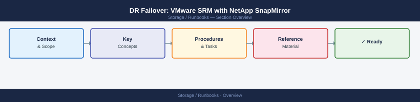
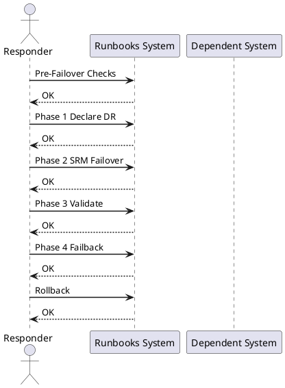

---
tags:
  - vmware
  - srm
  - netapp
  - snapmirror
  - disaster-recovery
  - failover
  - failback
  - runbook
---

# DR Failover: VMware SRM with NetApp SnapMirror

<div class="kb-summary">
Cross-product runbook for executing a DR failover and failback using VMware Site Recovery Manager (SRM) with NetApp SnapMirror replication. Covers pre-failover checks, declaring DR, SRM recovery plan execution, SnapMirror break, VM validation, failback resynch, and escalation contacts.
</div>





## Before You Begin

**Architecture prerequisites:**

| Component | Primary Site | DR Site |
|---|---|---|
| vCenter | vcenter-prod.corp.local | vcenter-dr.corp.local |
| SRM | srm-prod.corp.local (Appliance 9.x+) | srm-dr.corp.local (paired) |
| ONTAP | ontap-primary cluster | ontap-dr cluster |
| SnapMirror | Source SVM: svm_prod | Destination SVM: svm_dr |
| Networking | Production VLANs | DR VLANs (mapped in SRM network mappings) |
| SRM Protection Groups | Configured and tested | — |
| SRM Recovery Plans | At least one full-site plan | — |

**Required credentials for DR execution:**

- vCenter administrator (both sites)
- SRM administrator (both sites)
- ONTAP cluster-admin (both clusters)
- Application owner contacts (see Escalation section)

---

## Pre-Failover Checks

### Check SnapMirror Replication Lag

```bash
# On PRIMARY ONTAP cluster
snapmirror show -destination-path svm_dr:* -fields lag-time,state,newest-snapshot

# Example healthy output:
# Destination Path        State     Lag-Time  Newest Snapshot
# svm_dr:vol_dr_app01    Snapmirrored  00:02:15  daily.2026-06-21_2200

# Alert threshold: lag > 1h indicates replication issues — investigate before failover
# Critical threshold: lag > RPO SLA — document RPO breach in incident ticket
```

### Verify SRM Test Run History

```bash
# In SRM UI: Site Recovery > Recovery Plans > <PlanName> > History
# Confirm last test completed successfully within the past 30 days

# SRM REST API — check last test result
curl -sk -u "admin:<pass>" \
  "https://srm-prod.corp.local/api/rest/vr/1.0/api/recoveryplans" \
  -H "Accept: application/json" | python3 -m json.tool | grep -A5 "lastTestResult"
```

### Verify RPO for Each Protection Group

```bash
# Per-volume SnapMirror lag on PRIMARY cluster
snapmirror show -type dp -fields source-path,destination-path,lag-time,transfer-state

# Expected: lag < RPO SLA (typically 1h for tier-1 workloads, 4h for tier-2)
# Document any volumes exceeding RPO in the incident ticket before proceeding
```

### Final Go/No-Go Checklist

```text
Pre-failover gate — all must be YES before proceeding:
[ ] SnapMirror lag within RPO SLA for all protected volumes
[ ] SRM recovery plan test passed within 30 days
[ ] DR site ESXi hosts healthy (check vCenter-DR)
[ ] DR site ONTAP cluster reachable (ping + ssh)
[ ] Incident/change record opened
[ ] Application owners notified
[ ] Change manager approval obtained (for planned failover)
```

---

## Phase 1: Declare DR

### 1.1 Notification Checklist

```text
CONTACTS TO NOTIFY (fill in for your environment):
  - Incident Commander: ___________________________
  - Application Owner(s): _________________________
  - Network Team: __________________________________
  - Change Manager: ________________________________
  - Customer/Stakeholder: __________________________

COMMUNICATION CHANNEL: #major-incident Slack / Bridge call +XX-XXXX-XXXXXX
```

### 1.2 Freeze Production Writes (Planned Failover Only)

```bash
# For planned failover — quiesce application writes before breaking SnapMirror
# This minimises RPO to near-zero

# Example: stop application services on VMs at primary site
# (Application-specific — coordinate with app owner)
ssh app-server-01.prod "sudo systemctl stop myapp"
ssh db-server-01.prod "sudo systemctl stop postgresql"

# Force a final SnapMirror update to capture quiesced state
snapmirror update -destination-path svm_dr:vol_dr_app01
snapmirror update -destination-path svm_dr:vol_dr_db01

# Wait for transfer to complete
snapmirror show -destination-path svm_dr:* -fields transfer-state
# State must be "Idle" before proceeding
```

---

## Phase 2: SRM Failover

### 2.1 Run Recovery Plan in SRM

```bash
# Via SRM UI (preferred for audit trail):
# 1. Log in to SRM at primary site (or DR site if primary is down)
# 2. Navigate: Site Recovery > Recovery Plans > <PlanName>
# 3. Click "Run" > select "Failover" (not Test)
# 4. Confirm: "I understand this is not a test"
# 5. Monitor progress in the recovery plan steps panel

# Via SRM REST API (for automation/scripted DR):
# Get recovery plan ID first
PLAN_ID=$(curl -sk -u "admin:<pass>" \
  "https://srm-dr.corp.local/api/rest/vr/1.0/api/recoveryplans" \
  -H "Accept: application/json" | python3 -c "import sys,json; d=json.load(sys.stdin); print(d['list'][0]['id'])")

# Start recovery plan
curl -sk -X POST -u "admin:<pass>" \
  "https://srm-dr.corp.local/api/rest/vr/1.0/api/recoveryplans/${PLAN_ID}/run" \
  -H "Content-Type: application/json" \
  -d '{"mode": "failover"}'
```

### 2.2 Break SnapMirror on DR Cluster

SRM with NetApp ONTAP SRA breaks SnapMirror automatically during recovery plan execution. If manual intervention is required:

```bash
# On DESTINATION (DR) ONTAP cluster
# Break SnapMirror relationship — makes destination volume read-write
snapmirror break -destination-path svm_dr:vol_dr_app01
snapmirror break -destination-path svm_dr:vol_dr_db01

# Verify destination volumes are now read-write
volume show -vserver svm_dr -fields type
# Expected: type = RW (previously DP)

# List available snapshots on the newly promoted DR volume
snapshot show -vserver svm_dr -volume vol_dr_app01
```

### 2.3 Re-register Datastores in DR vCenter

SRM re-registers datastores and VMs automatically as part of the recovery plan. If manual re-registration is needed:

```powershell
# Connect to DR vCenter
Connect-VIServer -Server vcenter-dr.corp.local -Credential (Get-Credential)

# Rescan storage on all DR ESXi hosts
$drHosts = Get-VMHost -Location (Get-Cluster "DR-Cluster")
foreach ($h in $drHosts) {
    Get-VMHostStorage -VMHost $h -RescanAllHba -RescanVmfs
}

# Add NFS datastore pointing to DR ONTAP LIF
foreach ($h in $drHosts) {
    New-Datastore -VMHost $h -Name "ONTAP-DR-DS01" `
      -NfsHost "<dr-nfs-lif-ip>" -Path "/vol_dr_app01" -Nfs
}
```

---

## Phase 3: Validate

### 3.1 VM Power-On Sequence

```powershell
# SRM handles power-on ordering from the recovery plan priority settings
# To manually verify and power on:
Connect-VIServer -Server vcenter-dr.corp.local -Credential (Get-Credential)

# Check VM status after SRM recovery
Get-VM -Location (Get-Cluster "DR-Cluster") |
  Select-Object Name, PowerState, NumCpu, MemoryGB |
  Sort-Object Name

# Power on any VM that did not start automatically (in dependency order)
Start-VM -VM (Get-VM "db-server-01")
Start-Sleep -Seconds 120
Start-VM -VM (Get-VM "app-server-01")
```

### 3.2 Application Health Checks

```bash
# Verify application service is running on DR VMs
ssh app-server-01.dr "systemctl is-active myapp && curl -sf http://localhost:8080/health"

# Database connectivity
ssh db-server-01.dr "psql -U app_user -h localhost -c 'SELECT 1;'"

# Check for data consistency (compare row counts against last known good)
ssh db-server-01.dr "psql -U app_user -d appdb -c 'SELECT COUNT(*) FROM orders;'"

# Confirm storage I/O on DR ONTAP volume
# On DR ONTAP cluster:
statistics show -object nfsv3 -instance svm_dr -counter avg_latency,total_ops
volume show -vserver svm_dr -volume vol_dr_app01 -fields used,available
```

### 3.3 DNS and Load Balancer Updates

```bash
# Update DNS to point application FQDNs to DR IPs
# (Tool-dependent — examples for nsupdate / Route53 / Infoblox)
nsupdate -k /etc/dns/Kapp.key <<EOF
server dns-mgmt.corp.local
update delete app.corp.local A
update add app.corp.local 300 A <dr-app-ip>
send
EOF

# Verify DNS propagation
dig app.corp.local @dns-mgmt.corp.local +short

# Update load balancer pool to use DR backend
# (Vendor-specific — NSX ALB example)
curl -sk -X PATCH -u "admin:<pass>" \
  "https://nsx-alb.corp.local/api/pool/app-pool" \
  -H "Content-Type: application/json" \
  -d '{"servers": [{"ip": {"addr": "<dr-app-ip>", "type": "V4"}, "enabled": true}]}'
```

---

## Phase 4: Failback

### 4.1 Resync SnapMirror in Reverse Direction

Once the primary site is restored, resync SnapMirror from DR back to primary:

```bash
# On PRIMARY ONTAP cluster — reverse the SnapMirror relationship
# (Primary volume is now the destination; DR volume is source)

# Quiesce current DR production writes first (coordinate with app team)
ssh app-server-01.dr "sudo systemctl stop myapp"
ssh db-server-01.dr "sudo systemctl stop postgresql"

# On PRIMARY cluster — resync (pull changes from DR)
snapmirror resync -source-path svm_dr:vol_dr_app01 \
  -destination-path svm_prod:vol_prod_app01

snapmirror resync -source-path svm_dr:vol_dr_db01 \
  -destination-path svm_prod:vol_prod_db01

# Monitor resync transfer
snapmirror show -destination-path svm_prod:* -fields state,transfer-bytes,lag-time

# Wait until state = Snapmirrored and lag-time is near 0
```

### 4.2 Planned Failback via SRM

```bash
# In SRM UI at primary site (now fully restored):
# 1. Navigate: Site Recovery > Recovery Plans > <PlanName>
# 2. Confirm primary site is listed as the Recovery Site
# 3. Click "Reprotect" — this reverses protection groups back to primary
# 4. After reprotect completes, run the plan with "Planned Migration" mode
#    to fail VMs back cleanly without data loss
```

```powershell
# Post-failback: update DNS back to primary site IPs
nsupdate -k /etc/dns/Kapp.key <<EOF
server dns-mgmt.corp.local
update delete app.corp.local A
update add app.corp.local 300 A <prod-app-ip>
send
EOF

# Verify services healthy on primary
ssh app-server-01.prod "systemctl is-active myapp && curl -sf http://localhost:8080/health"
```

### 4.3 Re-establish Normal SnapMirror Direction

```bash
# After failback, restore the original SnapMirror direction
# (Primary = source, DR = destination)

# On PRIMARY cluster — break the reverse relationship
snapmirror break -destination-path svm_prod:vol_prod_app01

# Re-create original forward relationship
snapmirror create -source-path svm_prod:vol_prod_app01 \
  -destination-path svm_dr:vol_dr_app01 \
  -policy MirrorAndVault -type XDP

snapmirror resync -destination-path svm_dr:vol_dr_app01

# Verify
snapmirror show -destination-path svm_dr:* -fields state,lag-time
```

---

## Rollback

**If SRM recovery plan fails mid-way:**

```bash
# In SRM UI: cancel the running recovery plan
# Navigate: Site Recovery > Recovery Plans > <PlanName> > Cancel

# Check SRM logs for failure reason
# Primary SRM appliance: /var/log/vmware/srm/
# Or via: vCenter > Site Recovery > Logs
```

**If SnapMirror break fails:**

```bash
# Check relationship status
snapmirror show -destination-path svm_dr:vol_dr_app01 -fields state,transfer-state

# If transfer is still in progress, abort it first
snapmirror abort -destination-path svm_dr:vol_dr_app01

# Then retry break
snapmirror break -destination-path svm_dr:vol_dr_app01
```

**If application validation fails on DR site:**

```bash
# Option A: restore from most recent SnapMirror-consistent snapshot on DR volume
snapshot show -vserver svm_dr -volume vol_dr_app01
volume snapshot restore -vserver svm_dr -volume vol_dr_app01 \
  -snapshot <last-known-good-snapshot>

# Option B: re-sync from primary if primary is partially available
snapmirror resync -destination-path svm_dr:vol_dr_app01

# Document the RPO breach and data loss window in the incident ticket
```

---

## Escalation Contacts Template

```text
ESCALATION MATRIX — fill in before DR exercise:

Level 1 (Operations):
  On-call engineer: ________________________  Mobile: ________________
  Storage SME:      ________________________  Mobile: ________________
  VMware SME:       ________________________  Mobile: ________________

Level 2 (Management):
  IT Manager:       ________________________  Mobile: ________________
  CTO/VP Infra:     ________________________  Mobile: ________________

Vendor Support:
  NetApp Support:   1-888-4-NETAPP  (Case: __________________)
  VMware Support:   1-877-4-VMWARE  (SR: _____________________)
  Veeam Support:    +1-800-691-1991 (Case: __________________)

Application Owners:
  App-1 owner:      ________________________  Mobile: ________________
  DB owner:         ________________________  Mobile: ________________

INCIDENT BRIDGE: +XX-XXXX-XXXXXX  |  Slack: #dr-bridge
CHANGE TICKET:   __________________
```

---

## See Also

- [VMware SRM Operations](/virtualization/vmware/srm/operations/)
- [VMware SRM Architecture](/virtualization/vmware/srm/architecture/)
- [VMware SRM Deploy](/virtualization/vmware/srm/deploy/)
- [SnapMirror Operations](/storage/netapp/snapmirror/operations/)
- [SnapMirror Architecture](/storage/netapp/snapmirror/architecture/)
- [SnapMirror Deploy](/storage/netapp/snapmirror/deploy/)
- [ONTAP Operations](/storage/netapp/ontap/operations/)
- [vSAN Architecture](/virtualization/vmware/vsan/architecture/)
- [Storage Runbooks Index](/storage/runbooks/)
