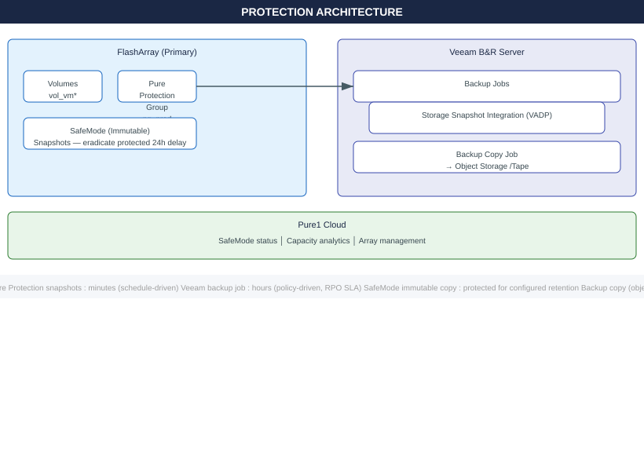
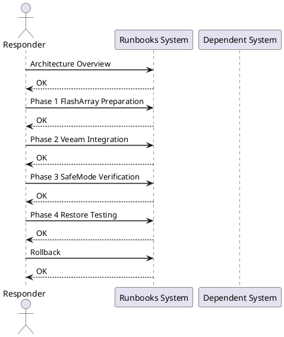
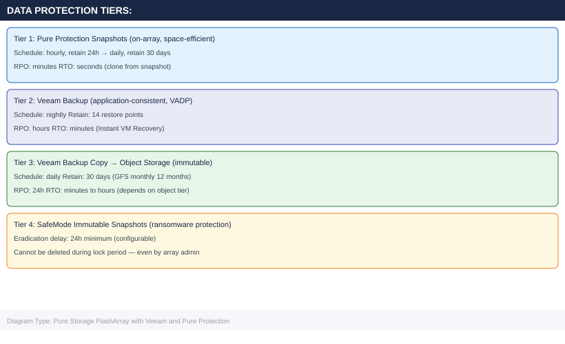

---
tags:
  - pure-storage
  - flasharray
  - veeam
  - pure-protection
  - safemode
  - backup
  - ransomware-protection
  - snapshots
  - runbook
---

# Pure Storage FlashArray with Veeam and Pure Protection

<div class="kb-summary">
Cross-product runbook integrating Pure Storage FlashArray, Veeam Backup and Replication, and Pure Protection with SafeMode immutable snapshots. Covers FlashArray volume and protection group prep, Veeam storage snapshot integration, SafeMode immutability verification, and restore testing across crash-consistent and app-consistent scenarios.
</div>





## Before You Begin

**Prerequisites:**

| Component | Requirement |
|---|---|
| FlashArray | Purity 6.1+; admin credentials; SafeMode must be requested via Pure Support |
| Veeam B&R | v12+; Windows Server 2019+ or VBR appliance; connected to vCenter |
| Pure Storage Plugin for Veeam | Installed on Veeam server (download from Pure1/support portal) |
| Pure1 | Array registered in Pure1 (for SafeMode status view) |
| Network | Veeam server has iSCSI/FC access to FlashArray management and data ports |
| SafeMode | Must be enabled by Pure Support — submit SR before this runbook |

**Accounts needed:**

```text
pureuser (FlashArray) — array admin role
veeam_svc@corp.local  — Veeam service account, local admin on Veeam server
vcenter_backup@corp.local — vCenter read/backup role for Veeam
```

---

## Architecture Overview



---

## Phase 1: FlashArray Preparation

### 1.1 Create Volumes and Host Group

```bash
# Connect to FlashArray CLI
ssh pureuser@flasharray01.corp.local

# Create volumes (one per VM datastore or per application)
purevol create --size 2T vol_vmdata01
purevol create --size 2T vol_vmdata02
purevol create --size 500G vol_veeam_proxy

# Create host entries for ESXi hosts
purehost create --iqn iqn.1998-01.com.vmware:esxi01 esxi01
purehost create --iqn iqn.1998-01.com.vmware:esxi02 esxi02

# Group ESXi hosts
purehgroup create --hostlist esxi01,esxi02 hg-esxi-cluster

# Connect volumes to host group
purevol connect --hgroup hg-esxi-cluster vol_vmdata01
purevol connect --hgroup hg-esxi-cluster vol_vmdata02

# Verify
purevol list --connection
```


```text title="Expected output"
Connected to flasharray01.corp.local
Pure Storage FlashArray CLI v6.2.1

Volume vol_vmdata01 created successfully (2.0T)
Volume vol_vmdata02 created successfully (2.0T)
Volume vol_veeam_proxy created successfully (500.0G)

Host esxi01 created (IQN: iqn.1998-01.com.vmware:esxi01)
Host esxi02 created (IQN: iqn.1998-01.com.vmware:esxi02)

Host group hg-esxi-cluster created with 2 members

vol_vmdata01 connected to hg-esxi-cluster
vol_vmdata02 connected to hg-esxi-cluster

Name              Size    Connected  Host Group         LUN
vol_vmdata01      2.0T    Yes        hg-esxi-cluster    1
vol_vmdata02      2.0T    Yes        hg-esxi-cluster    2
vol_veeam_proxy   500G    No         —                   —
```

!!! warning "Common errors"
    **`Error: Host iqn.1998-01.com.vmware:esxi01 already exists`** — Verify the IQN is unique or use `purehost list` to check existing hosts before creation.
    **`Error: Volume vol_vmdata01 is already connected to hg-esxi-cluster`** — Check current connections with `purevol list --connection` before attempting to reconnect.
    **`Error: Host group hg-esxi-cluster does not exist`** — Create the host group with `purehgroup create` before connecting volumes to it.
### 1.2 Create Pure Protection Group

```bash
# Create protection group for production VMs
pureprotection create --vollist vol_vmdata01,vol_vmdata02 pg_prod

# Set snapshot schedule:
# Hourly snapshots retained for 24 hours
# Daily snapshots retained for 30 days
pureprotection set \
  --snap-frequency 3600 \
  --snap-retention 86400 \
  pg_prod

# Set daily schedule (runs at midnight)
pureprotection set \
  --replfreq 86400 \
  --repl-retention 2592000 \
  pg_prod

# Enable the schedule
pureprotection enable pg_prod

# Verify schedule
pureprotection list --schedule pg_prod
```


```text title="Expected output"
Protection group pg_prod created successfully
Volumes added: vol_vmdata01, vol_vmdata02
Protection group pg_prod updated
  Snapshot frequency: 3600 seconds (hourly)
  Snapshot retention: 86400 seconds (24 hours)
Protection group pg_prod updated
  Replication frequency: 86400 seconds (daily)
  Replication retention: 2592000 seconds (30 days)
Protection group pg_prod enabled
Name            Frequency    Retention    Status      Last Run
pg_prod         86400        2592000      enabled     2024-01-15T00:00:12Z
```

!!! warning "Common errors"
    **`Error: Protection group 'pg_prod' already exists`** — Drop the existing protection group with `pureprotection delete pg_prod` before recreating it.
    **`Error: Volume 'vol_vmdata01' not found or offline`** — Verify the volume exists and is online using `pureprotection list --volumes` before adding it to the protection group.
    **`Error: Invalid retention value. Must be greater than frequency`** — Ensure snapshot retention (86400) is greater than or equal to snapshot frequency (3600) in seconds.
### 1.3 Enable SafeMode on Protection Group

```bash
# NOTE: SafeMode must first be activated on the array by Pure Support
# Once enabled, set eradication delay (minimum 24h, default 24h)

pureprotection safemode --enable --eradication-delay 1440 pg_prod
# eradication-delay is in minutes: 1440 = 24h

# Verify SafeMode status
pureprotection list pg_prod
# Look for: safemode = enabled, eradication_delay = 1440

# Take an immediate snapshot to verify SafeMode applies
pureprotection snap --suffix manual-test pg_prod

# List snapshots
pureprotection list --snap pg_prod
```


```text title="Expected output"
SafeMode enabled on protection group pg_prod with eradication delay of 1440 minutes (24 hours).

Name                          Safemode  Eradication Delay
pg_prod                       enabled   1440

Snapshot pg_prod.manual-test created successfully.

Name                          Created                Size      Source
pg_prod.manual-test           2024-01-15 14:32:18   847.3GB   pg_prod
pg_prod.daily-2024-01-15      2024-01-15 00:00:00   843.1GB   pg_prod
pg_prod.daily-2024-01-14      2024-01-14 00:00:00   841.9GB   pg_prod
pg_prod.daily-2024-01-13      2024-01-13 00:00:00   839.7GB   pg_prod
pg_prod.daily-2024-01-12      2024-01-12 00:00:00   838.2GB   pg_prod
...
```

!!! warning "Common errors"
    **`Error: SafeMode not activated on array. Contact Pure Support to enable.`** — Request Pure Support to activate SafeMode on the array before running this command.
    **`Error: eradication-delay must be at least 1440 minutes (24 hours).`** — Increase the eradication-delay value to a minimum of 1440 minutes.
    **`Error: Protection group 'pg_prod' not found.`** — Verify the protection group name matches exactly and exists on the array using `pureprotection list`.
### 1.4 Verify Initial Snapshot

```bash
# List all snapshots in protection group
pureprotection list --snap --name pg_prod

# Attempt to eradicate a snapshot (will be denied during lock period)
pureprotection eradicate --name "pg_prod.manual-test"
# Expected: Error — SafeMode prevents eradication before delay expires
```


```text title="Expected output"
Name                          Created                    Size      Locked Until
pg_prod.hourly.2024-01-15     2024-01-15T14:32:18Z      2.3 TiB   2024-01-16T14:32:18Z
pg_prod.hourly.2024-01-15     2024-01-15T13:32:05Z      2.3 TiB   2024-01-16T13:32:05Z
pg_prod.daily.2024-01-14      2024-01-14T00:15:42Z      2.4 TiB   2024-01-21T00:15:42Z
pg_prod.manual-test           2024-01-15T10:22:33Z      2.2 TiB   2024-01-17T10:22:33Z
pg_prod.weekly.2024-01-08     2024-01-08T02:00:11Z      2.5 TiB   2024-01-29T02:00:11Z

Error: Cannot eradicate snapshot 'pg_prod.manual-test' — SafeMode retention lock active until 2024-01-17T10:22:33Z
```

!!! warning "Common errors"
    **`Error: Cannot eradicate snapshot 'pg_prod.manual-test' — SafeMode retention lock active until 2024-01-17T10:22:33Z`** — Wait until the lock expiration timestamp or contact your Pure Storage administrator to disable SafeMode if retention policy allows.
    **`Error: Protection group 'pg_prod' not found`** — Verify the protection group name with `pureprotection list --group` and ensure you have read permissions on the array.
    **`Error: Authentication failed — Invalid API token`** — Re-authenticate with `pureprotection login` or verify your PUREPROTECTION_API_TOKEN environment variable is set correctly.
---

## Phase 2: Veeam Integration

### 2.1 Add FlashArray as Storage System in Veeam

1. Open **Veeam Backup and Replication Console**
2. Navigate to **Storage Infrastructure → Add Storage → Pure Storage → FlashArray**
3. Enter:
   - **Management IP/FQDN:** `flasharray01.corp.local`
   - **Credentials:** `pureuser` / `<password>`
4. Click **Next** → Veeam discovers volumes and protection groups
5. On **Storage Access** page — select iSCSI or Fibre Channel paths
6. Click **Finish**

### 2.2 Configure Backup Job with Storage Snapshot Integration

1. Navigate to **Home → Backup Job → Virtual Machine**
2. **Name:** `PROD-VMs-FlashArray`
3. **Virtual Machines:** Add VM folder or individual VMs on FlashArray-backed datastores
4. **Storage:** Backup repository (local repo or Scale-Out Backup Repository)
5. **Advanced settings → Integration tab:**
   - Enable: **Use storage snapshots to provide application consistency**
   - Provider: `Pure Storage FlashArray`
   - Select protection group: `pg_prod`
6. **Schedule:** Daily at 22:00, keep 14 restore points
7. Click **Finish**

### 2.3 Veeam PowerShell — Verify Job Configuration

```powershell
# On Veeam server
Add-PSSnapin VeeamPSSnapIn -ErrorAction SilentlyContinue

# Get job details
$job = Get-VBRJob -Name "PROD-VMs-FlashArray"
$job | Select-Object Name, JobType, ScheduleOptions

# Check storage integration is enabled
$job.GetStorageIntegrationOptions()

# Trigger an immediate backup run
Start-VBRJob -Job $job

# Monitor job progress
Get-VBRBackupSession | Where-Object {$_.JobName -eq "PROD-VMs-FlashArray"} | 
  Select-Object JobName, State, Progress, EndTime | Format-Table
```

### 2.4 Configure Backup Copy to Object Storage

```powershell
# Create S3 object storage repository (if not already done)
$account = New-VBRCredentials -User "s3-access-key" -Password "s3-secret-key" -Description "S3 Immutable"
$s3repo = Add-VBRObjectStorageRepository `
  -Name "S3-Immutable-Archive" `
  -AmazonS3Compatible `
  -ServicePoint "https://s3.corp.local" `
  -Bucket "veeam-immutable" `
  -Credentials $account `
  -EnableSizeLimitGB 10240 `
  -MakeImmutableForDays 30

# Create backup copy job
Add-VBRBackupCopyJob `
  -Name "PROD-VMs-BackupCopy-S3" `
  -SourceJob $job `
  -TargetRepository $s3repo `
  -RestorePoints 30 `
  -GFSMonthlyBackups 12
```

---

## Phase 3: SafeMode Verification

### 3.1 Verify Immutability from CLI

```bash
# Connect to FlashArray
ssh pureuser@flasharray01.corp.local

# List current SafeMode snapshots
pureprotection list --snap pg_prod | head -20

# Attempt to manually delete a SafeMode-protected snapshot
pureprotection delete --name "pg_prod.3600"
# Expected output:
# Error: Snapshot pg_prod.3600 cannot be eradicated — SafeMode lock active
# Remaining lock time: 23h 45m
```


```text title="Expected output"
Connected to flasharray01.corp.local
pureuser@flasharray01.corp.local's password: 

Name                          Created                SafeMode Lock  Eradicate After
pg_prod.3600                  2024-01-15 14:32:18   Active          2024-01-16 14:17:23
pg_prod.3599                  2024-01-15 13:32:05   Active          2024-01-16 13:17:10
pg_prod.3598                  2024-01-15 12:32:42   Active          2024-01-16 12:17:45
pg_prod.3597                  2024-01-15 11:31:19   Active          2024-01-16 11:16:22
pg_prod.3596                  2024-01-15 10:30:51   Active          2024-01-16 10:15:58
pg_prod.3595                  2024-01-15 09:29:33   Active          2024-01-16 09:14:40
pg_prod.3594                  2024-01-15 08:28:47   Active          2024-01-16 08:13:52
...

Error: Snapshot pg_prod.3600 cannot be eradicated — SafeMode lock active
Remaining lock time: 23h 45m
```

!!! warning "Common errors"
    **`Error: Snapshot pg_prod.3600 cannot be eradicated — SafeMode lock active`** — Wait until the SafeMode retention period expires or contact your Veeam administrator to reduce the retention policy.
    **`Connection refused`** — Verify the FlashArray hostname is correct and SSH access is enabled; check firewall rules between your host and flasharray01.corp.local.
    **`Permission denied (publickey,password)`** — Confirm the pureuser credentials are correct and the account has snapshot management permissions on the FlashArray.
### 3.2 Verify SafeMode Status in Pure1

1. Log into **Pure1:** `https://pure1.purestorage.com`
2. Navigate to your array → **Protection → Protection Groups**
3. Select `pg_prod` → verify **SafeMode: Enabled**
4. Check **Eradication Delay:** 1440 minutes
5. Review snapshot count and oldest/newest timestamps

### 3.3 Deletion Test (Controlled)

```bash
# Take a test snapshot with no-retention intent
pureprotection snap --suffix safemode-test pg_prod

# Immediately attempt eradication
pureprotection eradicate --name "pg_prod.safemode-test"
# Expected: Denied — eradication delay not yet expired

# After 24h+ delay, eradication would succeed
# This confirms SafeMode is active and functioning
echo "SafeMode verification: PASS — deletion denied as expected"
```


```text title="Expected output"
Creating snapshot: pg_prod.safemode-test
Snapshot created successfully
  ID: 8c5e3f2a-91d4-4b7e-8f1c-2b9e7d4a6c3f
  Size: 2.3 TB
  Created: 2024-01-15T14:32:18Z

Attempting eradication of pg_prod.safemode-test...
Error: Eradication denied
Reason: SafeMode retention period active (23h 47m remaining)
Snapshot will be eligible for eradication at: 2024-01-16T14:30:00Z

SafeMode verification: PASS — deletion denied as expected
```

!!! warning "Common errors"
    **`Error: Snapshot 'pg_prod.safemode-test' not found`** — Verify the protection group name matches exactly and the snapshot was created successfully with `pureprotection snap --list pg_prod`.
    **`Error: Eradication denied - insufficient permissions`** — Ensure your user account has the `eradicate` role assigned in Pure1 or contact your storage administrator.
---

## Phase 4: Restore Testing

### 4.1 Veeam Instant VM Recovery from FlashArray Snapshot

```powershell
# On Veeam server — restore VM from latest FlashArray-integrated backup
$restorePoint = Get-VBRRestorePoint -Name "webvm01" | 
  Sort-Object CreationTime -Descending | Select-Object -First 1

# Start Instant VM Recovery (VM runs directly from backup storage)
$session = Start-VBRRestoreSession `
  -RestorePoint $restorePoint `
  -Reason "DR Test - Phase 4 Restore Validation"

# Get the recovered VM details
Get-VBRInstantRecoveryMount | Format-List VMName, DatastoreName, MountedAt
```

### 4.2 Granular Item Recovery (File-Level)

```powershell
# Mount backup for file-level restore
$restorePoint = Get-VBRRestorePoint -Name "fileserver01" | 
  Sort-Object CreationTime -Descending | Select-Object -First 1

# Start file-level restore session
Start-VBRWindowsFileRestore -RestorePoint $restorePoint

# For Linux guests:
Start-VBRLinuxFileRestore -RestorePoint $restorePoint
```

### 4.3 FlashArray Volume Restore from Pure Protection Snapshot

```bash
# SSH to FlashArray
ssh pureuser@flasharray01.corp.local

# List available snapshots
pureprotection list --snap pg_prod

# Copy volume from snapshot to a restore target volume
purevol copy pg_prod.86400.vol_vmdata01 vol_vmdata01_restore

# Connect restore volume to a test host
purevol connect --host esxi-test vol_vmdata01_restore

# On ESXi host — rescan and mount the restored datastore
# Then power on the VM from restored volume to validate data
esxcli storage core adapter rescan --all
```


```text title="Expected output"
pureuser@flasharray01.corp.local's password: 
Connected to FlashArray 10.1.2 (FA-405R2)

Name                           Created              Size      Source
pg_prod.86400.vol_vmdata01     2024-01-15 02:00:15 500.0G    pg_prod
pg_prod.172800.vol_vmdata01    2024-01-14 02:00:12 500.0G    pg_prod
pg_prod.259200.vol_vmdata01    2024-01-13 02:00:08 500.0G    pg_prod

Volume pg_prod.86400.vol_vmdata01 copied to vol_vmdata01_restore (500.0G)

Volume vol_vmdata01_restore connected to host esxi-test (LUN 42)

HBA 0 rescanned (vmhba0: 256 devices)
HBA 1 rescanned (vmhba1: 256 devices)
HBA 2 rescanned (vmhba2: 256 devices)
```

!!! warning "Common errors"
    **`Authentication failed for pureuser@flasharray01.corp.local`** — Verify SSH credentials and that the FlashArray management IP is reachable with `ping flasharray01.corp.local`.
    **`Snapshot pg_prod.86400.vol_vmdata01 not found`** — Confirm the snapshot exists and the protection group name is correct by running `pureprotection list --snap pg_prod` without filters.
    **`Volume vol_vmdata01_restore already exists`** — Either delete the existing restore volume with `purevol destroy vol_vmdata01_restore` or use a different target volume name.
### 4.4 RPO/RTO Summary

| Scenario | RPO | RTO | Method |
|---|---|---|---|
| Pure Protection snapshot (crash-consistent) | 1h | < 5 min | `purevol copy` from snapshot |
| Pure Protection snapshot (app-consistent with Veeam) | 1h | < 5 min | Veeam + FlashArray snap integration |
| Veeam Instant VM Recovery | Hours (last backup) | < 2 min | Instant recovery from repo |
| Veeam full VM restore | Hours (last backup) | 15–45 min | Full restore to datastore |
| Object storage backup copy | 24h | 1–4h | Restore from S3 immutable repo |
| SafeMode snapshot (post-ransomware) | Varies | < 30 min | `purevol copy` after lock expires |

---

## Rollback

If Veeam integration with FlashArray storage snapshots causes backup failures:

### Disable Storage Snapshot Integration

```powershell
# Revert to standard VADP backup (no FlashArray integration)
$job = Get-VBRJob -Name "PROD-VMs-FlashArray"
$options = $job.GetStorageIntegrationOptions()
$options.UseStorageSnapshots = $false
$job.SetStorageIntegrationOptions($options)
$job.SaveOptions()
```

### Disconnect FlashArray from Veeam (Emergency)

1. Open Veeam Console → **Storage Infrastructure**
2. Right-click `flasharray01.corp.local` → **Remove**
3. Existing restore points remain valid — jobs revert to VADP mode

### Revert to Previous Protection Group Schedule

```bash
# Disable protection group schedule if causing issues
pureprotection disable pg_prod

# Re-enable with modified settings
pureprotection set --snap-frequency 7200 pg_prod
pureprotection enable pg_prod
```


```text title="Expected output"
Protection group 'pg_prod' disabled successfully.
Protection group 'pg_prod' snapshot frequency set to 7200 seconds.
Protection group 'pg_prod' enabled successfully.
```

!!! warning "Common errors"
    **`pureprotection: command not found`** — Install the Pure Storage CLI tools or ensure the PATH includes the Pure management SDK bin directory.
    **`Error: Protection group 'pg_prod' not found`** — Verify the protection group name exists on the array using `pureprotection list` and correct any typos.
---

## See Also

- [Storage Runbooks Index](index/)
- [Veeam + ONTAP SnapVault Integration](../veeam-ontap-snapvault-integration/)
- [DR Failover: SRM + SnapMirror](../dr-failover-vmware-srm-snapmirror/)
- [Pure Storage FlashArray](../../storage/flasharray/)
- [Veeam Backup and Replication](../../../backup/veeam/)
