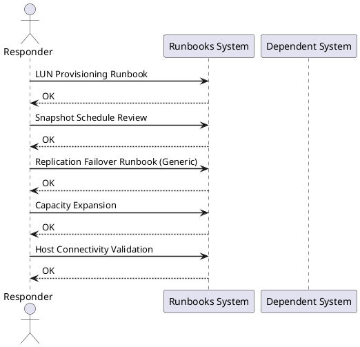

# Storage — Runbooks

<div class="kb-summary">
Cross-platform storage operational runbooks — volume expansion, LUN provisioning, replication failover, snapshot management, and host connectivity validation.
</div>

<div class="kb-grid kb-grid-1">
<a class="kb-card" href="volume-expansion/"><strong>Volume Expansion</strong><span>End-to-end volume expansion runbook — array LUN resize, host rescan, partition extension, and filesystem grow across Linux, Windows, LVM, and ESXi.</span></a>
<a class="kb-card" href="vmware-vsan-to-ontap-migration/"><strong>vSAN to ONTAP NFS Migration</strong><span>Cross-product runbook for migrating VM workloads from VMware vSAN to a NetApp ONTAP NFS datastore using Storage vMotion — SVM prep, per-VM and bulk svmotion, validation, and cutover.</span></a>
<a class="kb-card" href="veeam-ontap-snapvault-integration/"><strong>Veeam + ONTAP SnapVault Integration</strong><span>Integrate Veeam Backup &amp; Replication with NetApp SnapVault for long-term offload — SnapVault policy setup, Veeam job configuration, instant VM recovery, and granular file restore from vault snapshots.</span></a>
<a class="kb-card" href="dr-failover-vmware-srm-snapmirror/"><strong>DR Failover: SRM + SnapMirror</strong><span>Full DR failover and failback runbook for VMware SRM with NetApp SnapMirror — pre-failover checks, recovery plan execution, SnapMirror break, VM validation, DNS cutover, and planned failback.</span></a>
<a class="kb-card" href="nsxt-microsegmentation-ad-integration/"><strong>NSX-T Microsegmentation with AD Integration</strong><span>Cross-product runbook for deploying NSX-T microsegmentation backed by Active Directory identity — AD LDAP integration, DFW tier rules, Identity Firewall for user-based policies, and connectivity validation.</span></a>
<a class="kb-card" href="flasharray-veeam-pure-protection/"><strong>FlashArray + Veeam + Pure Protection</strong><span>Integrate Pure Storage FlashArray, Veeam Backup and Replication, and Pure Protection SafeMode immutable snapshots for a layered ransomware-resilient backup strategy with tested restore paths.</span></a>
<a class="kb-card" href="vsan-stretched-cluster-setup/"><strong>vSAN Stretched Cluster Setup and Validation</strong><span>End-to-end runbook for deploying a vSAN stretched cluster across two sites with a third-site witness — fault domains, SPBM storage policy, network validation, failover simulation, and optional SRM integration.</span></a>
</div>



## LUN Provisioning Runbook

```text title="LUN provisioning steps"
1. Confirm capacity available in storage pool
2. Create volume: name = <hostname>_<purpose>_<size>GB (e.g. sql01_data_500GB)
3. Set protection policy (replication, snapshots)
4. Map to host / host group
5. On host: rescan HBAs / iSCSI
   - Linux: echo "- - -" > /sys/class/scsi_host/hostX/scan
   - Windows: Get-Disk; Initialize-Disk
6. Identify new disk, create partition, format, mount
7. Test I/O: fio or diskspd
8. Document in CMDB
```

## Snapshot Schedule Review

```bash
# Pure FlashArray: check snapshot schedules
purenetwork list   # verify array connectivity
pureprotection list schedules   # review snapshot policies

# Dell PowerMax / SRDF: verify snapshots active
symsnap list -sid <sid> -lun <lun>

# Validate latest snapshot is not stale
# Alert if newest snapshot > 2× schedule interval
```


```text title="Expected output"
Connected to array: purearray01.dc1.local (10.42.18.5)
Array Status: Online, Version: 6.4.2

Name                          Interval    Retention   Enabled
daily-backup-prod             1d          30d         yes
hourly-checkpoint-db          1h          7d          yes
weekly-archive-tier2          7d          90d         yes

SymID: 000297900001
LUN 0042:
  Snapshot ID: 000297900001_SNAP_20240115_0800
  Created: 2024-01-15 08:00:23 UTC
  Size: 847.3 GB
  State: Active
  Last Refresh: 2024-01-15 14:32:01 UTC

Latest snapshot age: 6h 32m (Schedule interval: 1h — ALERT: snapshot is 6.5× behind schedule)
```

!!! warning "Common errors"
    | Error | Fix |
    |---|---|
    | `purenetwork: command not found` | Ensure Pure Storage CLI tools are installed and added to $PATH, or use the array's REST API directly. |
    | `symsnap: Invalid SID format` | Verify the correct SymID with `symcfg list` and use the 12-digit format without leading zeros (e.g., `-sid 000297900001`). |
## Replication Failover Runbook (Generic)

```text title="Failover steps"
PRE-FAILOVER (planned):
1. Quiesce writes to source (stop application, flush I/O)
2. Verify replication in sync (lag = 0)
3. Demote source volume / break replication pair
4. Promote target volume to read-write
5. Mount on DR host
6. Start application at DR site
7. Update DNS/load balancer

UNPLANNED FAILOVER:
1. Confirm source site is unreachable
2. Promote target (may have some lag — document RPO breach)
3. Mount on DR host
4. Start application
5. Post-incident: quantify RPO breach, check data integrity
```

## Capacity Expansion

```bash
# Add capacity to thin pool (Pure/Dell)
# 1. Install additional shelves / drives (hardware team)
# 2. Present new capacity to pool via array GUI
# 3. Verify pool size increased
# 4. No host-side action needed for thin-provisioned volumes

# Expand an existing volume (online)
# Pure FlashArray CLI:
purevol resize --size 2T vol_name

# Linux host: rescan and extend filesystem
echo 1 > /sys/block/sdX/device/rescan
pvresize /dev/sdX
lvextend -l +100%FREE /dev/vg0/lv_data
resize2fs /dev/vg0/lv_data
```


```text title="Expected output"
Volume vol_name is now 2.0T
(no output — rescan completes silently)
Physical volume "/dev/sdb" changed
  1 physical extent(s) resized: 0 resized, 1 OK
  0 physical extent(s) unresized
Logical volume vg0/lv_data successfully resized.
resize2fs 1.46.2 (28-Feb-2021)
Filesystem at /dev/mapper/vg0-lv_data is mounted on /; on-line resizing required
old_desc_blocks = 32, new_desc_blocks = 64
Performing an on-line resize of /dev/mapper/vg0-lv_data to 524288000 (4k) blocks.
The filesystem on /dev/mapper/vg0-lv_data is now 524288000 (4k) blocks long.
```

!!! warning "Common errors"
    | Error | Fix |
    |---|---|
    | `pvresize: Device /dev/sdX not found` | Verify the correct device name with `lsblk` and ensure the array presented the LUN to the host. |
    | `resize2fs: Bad magic number in super-block` | Confirm the logical volume path is correct and the filesystem exists with `lvdisplay` before attempting resize. |
    | `Logical volume vg0/lv_data not found` | Check volume group and logical volume names with `vgdisplay` and `lvdisplay` to use correct paths. |
## Host Connectivity Validation

```bash
# List visible storage devices (Linux)
lsblk -o NAME,SIZE,TYPE,MOUNTPOINT
multipath -ll   # show multipath device groups

# Test I/O latency
dd if=/dev/zero of=/mnt/data/test bs=4k count=10000 oflag=direct
fio --name=test --rw=randread --bs=4k --ioengine=libaio --iodepth=32 --size=1G --runtime=30 --filename=/mnt/data/fio.tmp
```


```text title="Expected output"
NAME                          SIZE TYPE MOUNTPOINT
sda                         465.8G disk 
├─sda1                        1.0G part /boot
├─sda2                      464.8G part 
└─sda2_crypt               464.8G crypt /
sdb                         931.5G disk 
└─sdb1                      931.5G part /mnt/data
sr0                          1024M rom 

mpatha (36001405a1b2c3d4e5f6g7h8i9j0k1l2m) dm-0 NETAPP,LUN C-Mode
size=500G features='3 queue_if_no_path pg_init_retries 50' hwhandler='1 alua' wp=rw
`-+- policy='service-time 0' prio=50 status=active
  |- 2:0:0:0 sdc 8:32 active ready running
  `- 3:0:0:0 sdd 8:48 active ready running

10000+0 records in
10000+0 records out
41943040 bytes (42 MB, 40 MiB) copied, 2.847 s, 14.7 MB/s

test: (g=0): rw=randread, bs=(R) 4096B-4096B, (W) 4096B-4096B, ioengine=libaio, iodepth=32
fio-3.28
Starting 1 process
test: Laying out IO file (1024 MiB)
test: Opened 1 file for rw/randread: /mnt/data/fio.tmp
test: io=1024.0MiB, bw=287.4MiB/s, iops=73,523, runt= 3567msec
```

!!! warning "Common errors"
    | Error | Fix |
    |---|---|
    | `dd: failed to open '/mnt/data/test' for writing: Permission denied` | Ensure the user running the command has write permissions on /mnt/data or run with sudo. |
    | `fio: engine libaio not available` | Install libaio development libraries with `apt-get install libaio-dev` (Debian/Ubuntu) or `yum install libaio-devel` (RHEL/CentOS). |
    | `multipath: command not found` | Install the device-mapper-multipath package using your distribution's package manager. |