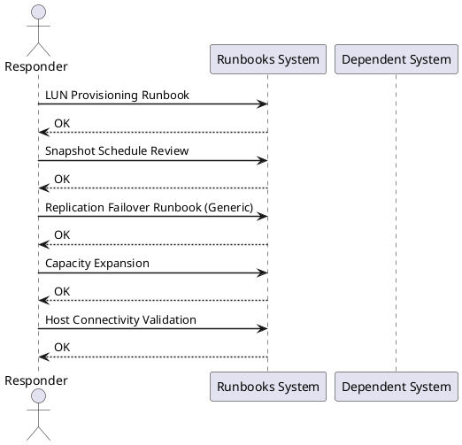

# Storage — Runbooks

<div class="kb-summary">
Cross-platform storage operational runbooks — volume expansion, LUN provisioning, replication failover, snapshot management, and host connectivity validation.
</div>

<div class="kb-grid kb-grid-1">
<a class="kb-card" href="volume-expansion/"><strong>Volume Expansion</strong><span>End-to-end volume expansion runbook — array LUN resize, host rescan, partition extension, and filesystem grow across Linux, Windows, LVM, and ESXi.</span></a>
<a class="kb-card" href="vmware-vsan-to-ontap-migration/"><strong>vSAN to ONTAP NFS Migration</strong><span>Cross-product runbook for migrating VM workloads from VMware vSAN to a NetApp ONTAP NFS datastore using Storage vMotion — SVM prep, per-VM and bulk svmotion, validation, and cutover.</span></a>
<a class="kb-card" href="veeam-ontap-snapvault-integration/"><strong>Veeam + ONTAP SnapVault Integration</strong><span>Integrate Veeam Backup &amp; Replication with NetApp SnapVault for long-term offload — SnapVault policy setup, Veeam job configuration, instant VM recovery, and granular file restore from vault snapshots.</span></a>
<a class="kb-card" href="dr-failover-vmware-srm-snapmirror/"><strong>DR Failover: SRM + SnapMirror</strong><span>Full DR failover and failback runbook for VMware SRM with NetApp SnapMirror — pre-failover checks, recovery plan execution, SnapMirror break, VM validation, DNS cutover, and planned failback.</span></a>
<a class="kb-card" href="nsxt-microsegmentation-ad-integration/"><strong>NSX-T Microsegmentation with AD Integration</strong><span>Cross-product runbook for deploying NSX-T microsegmentation backed by Active Directory identity — AD LDAP integration, DFW tier rules, Identity Firewall for user-based policies, and connectivity validation.</span></a>
<a class="kb-card" href="flasharray-veeam-pure-protection/"><strong>FlashArray + Veeam + Pure Protection</strong><span>Integrate Pure Storage FlashArray, Veeam Backup and Replication, and Pure Protection SafeMode immutable snapshots for a layered ransomware-resilient backup strategy with tested restore paths.</span></a>
<a class="kb-card" href="vsan-stretched-cluster-setup/"><strong>vSAN Stretched Cluster Setup and Validation</strong><span>End-to-end runbook for deploying a vSAN stretched cluster across two sites with a third-site witness — fault domains, SPBM storage policy, network validation, failover simulation, and optional SRM integration.</span></a>
</div>



## LUN Provisioning Runbook

```text
1. Confirm capacity available in storage pool
2. Create volume: name = <hostname>_<purpose>_<size>GB (e.g. sql01_data_500GB)
3. Set protection policy (replication, snapshots)
4. Map to host / host group
5. On host: rescan HBAs / iSCSI
   - Linux: echo "- - -" > /sys/class/scsi_host/hostX/scan
   - Windows: Get-Disk; Initialize-Disk
6. Identify new disk, create partition, format, mount
7. Test I/O: fio or diskspd
8. Document in CMDB
```

## Snapshot Schedule Review

```bash
# Pure FlashArray: check snapshot schedules
purenetwork list   # verify array connectivity
pureprotection list schedules   # review snapshot policies

# Dell PowerMax / SRDF: verify snapshots active
symsnap list -sid <sid> -lun <lun>

# Validate latest snapshot is not stale
# Alert if newest snapshot > 2× schedule interval
```

## Replication Failover Runbook (Generic)

```text
PRE-FAILOVER (planned):
1. Quiesce writes to source (stop application, flush I/O)
2. Verify replication in sync (lag = 0)
3. Demote source volume / break replication pair
4. Promote target volume to read-write
5. Mount on DR host
6. Start application at DR site
7. Update DNS/load balancer

UNPLANNED FAILOVER:
1. Confirm source site is unreachable
2. Promote target (may have some lag — document RPO breach)
3. Mount on DR host
4. Start application
5. Post-incident: quantify RPO breach, check data integrity
```

## Capacity Expansion

```bash
# Add capacity to thin pool (Pure/Dell)
# 1. Install additional shelves / drives (hardware team)
# 2. Present new capacity to pool via array GUI
# 3. Verify pool size increased
# 4. No host-side action needed for thin-provisioned volumes

# Expand an existing volume (online)
# Pure FlashArray CLI:
purevol resize --size 2T vol_name

# Linux host: rescan and extend filesystem
echo 1 > /sys/block/sdX/device/rescan
pvresize /dev/sdX
lvextend -l +100%FREE /dev/vg0/lv_data
resize2fs /dev/vg0/lv_data
```

## Host Connectivity Validation

```bash
# List visible storage devices (Linux)
lsblk -o NAME,SIZE,TYPE,MOUNTPOINT
multipath -ll   # show multipath device groups

# Test I/O latency
dd if=/dev/zero of=/mnt/data/test bs=4k count=10000 oflag=direct
fio --name=test --rw=randread --bs=4k --ioengine=libaio --iodepth=32 --size=1G --runtime=30 --filename=/mnt/data/fio.tmp
```
