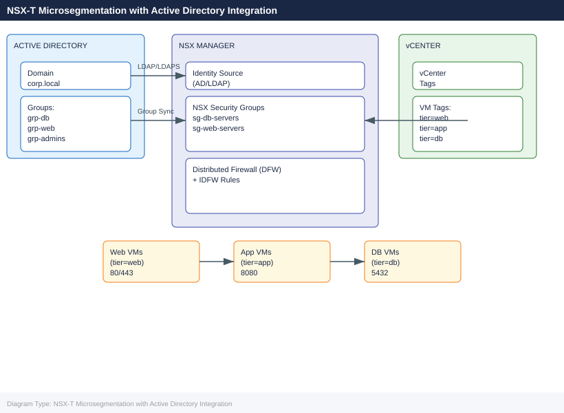
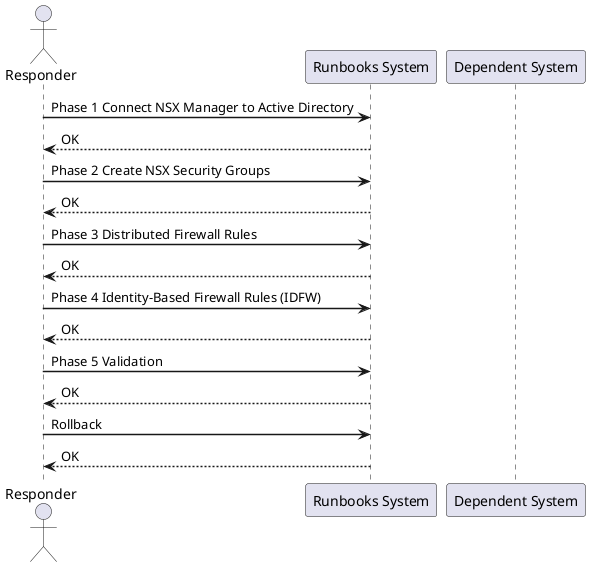
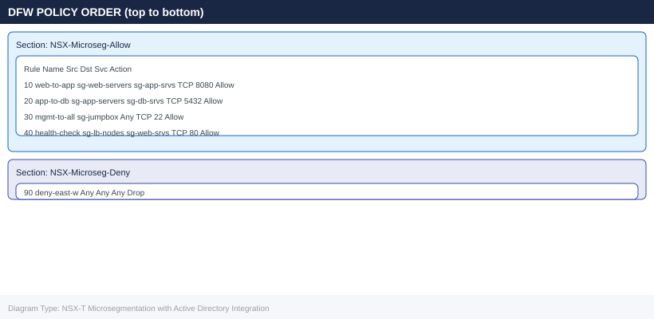

---
tags:
  - nsx-t
  - nsx
  - active-directory
  - microsegmentation
  - distributed-firewall
  - identity-firewall
  - vcenter
  - security
  - runbook
---

# NSX-T Microsegmentation with Active Directory Integration

<div class="kb-summary">
Cross-product runbook for deploying NSX-T microsegmentation backed by Active Directory identity. Covers AD LDAP integration, security group creation from AD groups, Distributed Firewall (DFW) tier rules, Identity Firewall (IDFW) for user-based policies, and full connectivity validation with rollback steps.
</div>





## Before You Begin

**Prerequisites:**

| Component | Requirement |
|---|---|
| NSX Manager | NSX-T 3.1+ deployed (cluster or single node), admin credentials |
| vCenter | Integrated with NSX-T via Compute Manager |
| Active Directory | Domain functional level 2008 R2+; service account with read access to OU |
| LDAP connectivity | NSX Manager → AD LDAP (TCP 389) or LDAPS (TCP 636) |
| ESXi hosts | NSX-T kernel modules installed and host transport nodes prepared |
| VM tagging | vCenter tags created: `tier=web`, `tier=app`, `tier=db` |
| Horizon (IDFW only) | Windows Desktop VMs joined to domain; Guest Introspection deployed |

**Accounts needed:**

```text
nsx_ldap_svc@corp.local — service account, Domain Users, read-only LDAP bind
NSX admin credentials
vCenter administrator credentials
```

---

## Phase 1: Connect NSX Manager to Active Directory

### 1.1 Add AD as Identity Source (UI)

1. Log into NSX Manager: `https://nsxmgr.corp.local`
2. Navigate to **System → Identity Sources → Add**
3. Fill in:
   - **Name:** `corp.local`
   - **Type:** Active Directory over LDAP
   - **Domain:** `corp.local`
   - **Base DN:** `DC=corp,DC=local`
   - **Bind DN:** `CN=nsx_ldap_svc,OU=ServiceAccounts,DC=corp,DC=local`
   - **Password:** `<service account password>`
   - **LDAP server:** `192.168.1.10:389` (or use LDAPS on 636)
4. Click **Test** — confirm "Connection Successful"
5. Click **Save**

### 1.2 Add AD via nsxcli

```bash
# SSH to NSX Manager
ssh admin@nsxmgr.corp.local

# Verify LDAP connectivity from NSX Manager
get firewall identity ldap-servers

# Add identity source via API (alternative to UI)
curl -sk -u admin:<password> \
  -X POST https://nsxmgr.corp.local/api/v1/aaa/vidm/domains \
  -H "Content-Type: application/json" \
  -d '{
    "name": "corp.local",
    "ldap_info": {
      "hostname": "192.168.1.10",
      "port": 389,
      "protocol": "LDAP",
      "base_dn": "DC=corp,DC=local",
      "bind_identity": "CN=nsx_ldap_svc,OU=ServiceAccounts,DC=corp,DC=local",
      "bind_password": "<password>"
    }
  }'
```

### 1.3 Verify Group Sync

```bash
# List synced groups
curl -sk -u admin:<password> \
  https://nsxmgr.corp.local/api/v1/aaa/groups?domain_id=corp.local | \
  python3 -m json.tool | grep display_name

# Expected output contains:
#   "display_name": "grp-db-admins"
#   "display_name": "grp-web-admins"
```

---

## Phase 2: Create NSX Security Groups

### 2.1 Tag VMs in vCenter

```powershell
# PowerCLI — tag VMs by tier
Connect-VIServer -Server vcenter.corp.local

$tagCat = Get-TagCategory -Name "nsx-tier"
# If category doesn't exist:
# New-TagCategory -Name "nsx-tier" -Cardinality Single

$tagWeb = Get-Tag -Name "web" -Category $tagCat
$tagApp = Get-Tag -Name "app" -Category $tagCat
$tagDb  = Get-Tag -Name "db"  -Category $tagCat

# Apply tags
Get-VM -Name "webvm*" | New-TagAssignment -Tag $tagWeb
Get-VM -Name "appvm*" | New-TagAssignment -Tag $tagApp
Get-VM -Name "dbvm*"  | New-TagAssignment -Tag $tagDb
```

### 2.2 Create Security Groups in NSX Manager (UI)

1. Navigate to **Security → Inventory → Groups → Add Group**
2. Create `sg-web-servers`:
   - **Criteria:** Tag equals `web` (scope: `nsx-tier`)
3. Create `sg-app-servers`:
   - **Criteria:** Tag equals `app` (scope: `nsx-tier`)
4. Create `sg-db-servers`:
   - **Criteria:** Tag equals `db` (scope: `nsx-tier`)
5. Create `sg-ad-db-admins` (AD-based):
   - **Criteria:** Identity Group → `corp.local\grp-db-admins`

### 2.3 Create Groups via API

```bash
# Create sg-web-servers backed by vCenter tag
curl -sk -u admin:<password> \
  -X POST https://nsxmgr.corp.local/policy/api/v1/infra/domains/default/groups/sg-web-servers \
  -H "Content-Type: application/json" \
  -d '{
    "display_name": "sg-web-servers",
    "expression": [{
      "resource_type": "Condition",
      "member_type": "VirtualMachine",
      "key": "Tag",
      "operator": "EQUALS",
      "value": "web|nsx-tier"
    }]
  }'

# Verify membership
curl -sk -u admin:<password> \
  "https://nsxmgr.corp.local/policy/api/v1/infra/domains/default/groups/sg-web-servers/members/virtual-machines" | \
  python3 -m json.tool | grep display_name
```

---

## Phase 3: Distributed Firewall Rules

### 3.1 DFW Section Structure



### 3.2 Create DFW Policy via API

```bash
# Create the allow policy section
curl -sk -u admin:<password> \
  -X PATCH https://nsxmgr.corp.local/policy/api/v1/infra/domains/default/security-policies/NSX-Microseg-Allow \
  -H "Content-Type: application/json" \
  -d '{
    "display_name": "NSX-Microseg-Allow",
    "category": "Application",
    "sequence_number": 100,
    "rules": [
      {
        "display_name": "web-to-app",
        "source_groups": ["/infra/domains/default/groups/sg-web-servers"],
        "destination_groups": ["/infra/domains/default/groups/sg-app-servers"],
        "services": ["/infra/services/TCP-8080"],
        "action": "ALLOW",
        "sequence_number": 10,
        "logged": true
      },
      {
        "display_name": "app-to-db",
        "source_groups": ["/infra/domains/default/groups/sg-app-servers"],
        "destination_groups": ["/infra/domains/default/groups/sg-db-servers"],
        "services": ["/infra/services/TCP-5432"],
        "action": "ALLOW",
        "sequence_number": 20,
        "logged": true
      }
    ]
  }'

# Create default-deny section (lower sequence = lower priority in NSX policy model)
curl -sk -u admin:<password> \
  -X PATCH https://nsxmgr.corp.local/policy/api/v1/infra/domains/default/security-policies/NSX-Microseg-Deny \
  -H "Content-Type: application/json" \
  -d '{
    "display_name": "NSX-Microseg-Deny",
    "category": "Application",
    "sequence_number": 900,
    "rules": [
      {
        "display_name": "deny-east-west",
        "source_groups": ["ANY"],
        "destination_groups": ["ANY"],
        "services": ["ANY"],
        "action": "DROP",
        "sequence_number": 90,
        "logged": true
      }
    ]
  }'
```

### 3.3 Create Custom Service (TCP 8080)

```bash
curl -sk -u admin:<password> \
  -X PATCH https://nsxmgr.corp.local/policy/api/v1/infra/services/TCP-8080 \
  -H "Content-Type: application/json" \
  -d '{
    "display_name": "TCP-8080",
    "service_entries": [{
      "resource_type": "L4PortSetServiceEntry",
      "display_name": "TCP-8080",
      "l4_protocol": "TCP",
      "destination_ports": ["8080"]
    }]
  }'
```

---

## Phase 4: Identity-Based Firewall Rules (IDFW)

IDFW maps AD user sessions to IP addresses via Guest Introspection and creates user-aware DFW rules. Most commonly used for Horizon VDI desktop pools.

### 4.1 Prerequisites for IDFW

```text
1. VMware Guest Introspection (GI) deployed on ESXi hosts
2. NSX Guest Introspection service VM running on each host
3. Windows VMs joined to corp.local domain
4. NSX Guest Introspection Thin Agent (VMCI) installed in Windows VMs
```

### 4.2 Enable Identity Firewall on NSX Manager

1. Navigate to **Security → Distributed Firewall → Identity Firewall Settings**
2. Enable **Active Directory** event log collection
3. Add AD domain: `corp.local` — provide DC IPs, bind credentials
4. Enable **Guest Introspection** as user session source
5. Click **Save**

### 4.3 Create Identity Firewall Rule

```bash
# Rule: allow grp-db-admins to reach db servers on TCP 5432 (admin sessions only)
curl -sk -u admin:<password> \
  -X PATCH https://nsxmgr.corp.local/policy/api/v1/infra/domains/default/security-policies/NSX-Microseg-IDFW \
  -H "Content-Type: application/json" \
  -d '{
    "display_name": "NSX-Microseg-IDFW",
    "category": "Application",
    "sequence_number": 50,
    "rules": [
      {
        "display_name": "idfw-dbadmins-to-db",
        "source_groups": ["/infra/domains/default/groups/sg-ad-db-admins"],
        "destination_groups": ["/infra/domains/default/groups/sg-db-servers"],
        "services": ["/infra/services/TCP-5432"],
        "action": "ALLOW",
        "sequence_number": 10,
        "logged": true,
        "profiles": ["/infra/context-profiles/AD_Identity"]
      }
    ]
  }'
```

### 4.4 Verify AD User-to-IP Mapping

```bash
# SSH to NSX Manager
ssh admin@nsxmgr.corp.local

# Check active user-IP mappings
nsxcli> get firewall identity users

# Expected output:
# User: CORP\dbadmin01   IP: 192.168.10.55   VM: CORP-W10-001   Domain: corp.local
# User: CORP\webadmin01  IP: 192.168.10.56   VM: CORP-W10-002   Domain: corp.local
```

---

## Phase 5: Validation

### 5.1 Test Connectivity Between Tiers

```bash
# From a web VM — should succeed (port 8080 to app)
ssh root@webvm01
curl -v http://192.168.20.10:8080/health
nc -zv 192.168.20.10 8080

# From a web VM — should FAIL (port 5432 to db, blocked by DFW)
nc -zv 192.168.30.10 5432
# Expected: Connection timed out (dropped by default-deny rule)

# From an app VM — should succeed (port 5432 to db)
ssh root@appvm01
nc -zv 192.168.30.10 5432
```

### 5.2 Check DFW Hit Counters

```bash
# SSH to an ESXi host that runs the VMs
ssh root@esxi01.corp.local

# List DFW filter names
vsipioctl getfilters

# Check rule hit counts for a specific VM's vNIC filter
vsipioctl getrules -f nic-XXXX-eth0-vmware-sfw.2 | grep -A5 "rule_id"

# Via nsxcli on NSX Manager
ssh admin@nsxmgr.corp.local
nsxcli> get firewall stats
```

### 5.3 Verify DFW Rule Application via API

```bash
# Get realized state of DFW policy
curl -sk -u admin:<password> \
  "https://nsxmgr.corp.local/policy/api/v1/infra/domains/default/security-policies/NSX-Microseg-Allow/rules" | \
  python3 -m json.tool | grep -E '"display_name"|"action"'
```

### 5.4 Verify Group Membership

```bash
curl -sk -u admin:<password> \
  "https://nsxmgr.corp.local/policy/api/v1/infra/domains/default/groups/sg-db-servers/members/virtual-machines" | \
  python3 -m json.tool | grep display_name
# Should list: dbvm01, dbvm02, dbvm03
```

---

## Rollback

If microsegmentation causes unexpected connectivity loss:

### Option A: Disable DFW Section (Fast)

```bash
# Disable the deny-east-west rule immediately
curl -sk -u admin:<password> \
  -X PATCH https://nsxmgr.corp.local/policy/api/v1/infra/domains/default/security-policies/NSX-Microseg-Deny/rules/deny-east-west \
  -H "Content-Type: application/json" \
  -d '{"disabled": true}'
```

### Option B: Add Emergency Permit Rule (UI)

1. Navigate to **Security → Distributed Firewall**
2. In section `NSX-Microseg-Allow`, add rule at top (sequence 1):
   - Source: Any | Destination: Any | Service: Any | **Action: Allow**
3. Click **Publish**
4. Investigate blocked flows via **Security → Firewall Logs**

### Option C: Disable DFW on Segment (Per-Scope)

```bash
# Disable DFW enforcement on a specific segment
curl -sk -u admin:<password> \
  -X PATCH https://nsxmgr.corp.local/policy/api/v1/infra/segments/seg-web \
  -H "Content-Type: application/json" \
  -d '{"admin_state": "UP", "advanced_config": {"urpf_mode": "NONE"}}'
```

---

## See Also

- [NSX-T Overview](../../virtualization/vmware/nsx/)
- [NSX-T Troubleshooting](../../virtualization/vmware/nsx/troubleshooting/)
- [VMware vCenter](../../virtualization/vmware/vcenter/)
- [DR Failover: SRM + SnapMirror](dr-failover-vmware-srm-snapmirror/)
- [vSAN Stretched Cluster Setup](vsan-stretched-cluster-setup/)
