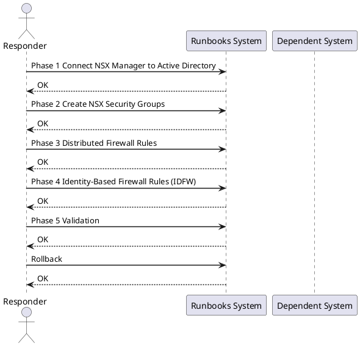

---
tags:
  - nsx-t
  - nsx
  - active-directory
  - microsegmentation
  - distributed-firewall
  - identity-firewall
  - vcenter
  - security
  - runbook
---

# NSX-T Microsegmentation with Active Directory Integration

<div class="kb-summary">
Cross-product runbook for deploying NSX-T microsegmentation backed by Active Directory identity. Covers AD LDAP integration, security group creation from AD groups, Distributed Firewall (DFW) tier rules, Identity Firewall (IDFW) for user-based policies, and full connectivity validation with rollback steps.
</div>




## Before You Begin

**Prerequisites:**

| Component | Requirement |
|---|---|
| NSX Manager | NSX-T 3.1+ deployed (cluster or single node), admin credentials |
| vCenter | Integrated with NSX-T via Compute Manager |
| Active Directory | Domain functional level 2008 R2+; service account with read access to OU |
| LDAP connectivity | NSX Manager → AD LDAP (TCP 389) or LDAPS (TCP 636) |
| ESXi hosts | NSX-T kernel modules installed and host transport nodes prepared |
| VM tagging | vCenter tags created: `tier=web`, `tier=app`, `tier=db` |
| Horizon (IDFW only) | Windows Desktop VMs joined to domain; Guest Introspection deployed |

**Accounts needed:**

```text
nsx_ldap_svc@corp.local — service account, Domain Users, read-only LDAP bind
NSX admin credentials
vCenter administrator credentials
```

---

## Phase 1: Connect NSX Manager to Active Directory

### 1.1 Add AD as Identity Source (UI)

1. Log into NSX Manager: `https://nsxmgr.corp.local`
2. Navigate to **System → Identity Sources → Add**
3. Fill in:
   - **Name:** `corp.local`
   - **Type:** Active Directory over LDAP
   - **Domain:** `corp.local`
   - **Base DN:** `DC=corp,DC=local`
   - **Bind DN:** `CN=nsx_ldap_svc,OU=ServiceAccounts,DC=corp,DC=local`
   - **Password:** `<service account password>`
   - **LDAP server:** `192.168.1.10:389` (or use LDAPS on 636)
4. Click **Test** — confirm "Connection Successful"
5. Click **Save**

### 1.2 Add AD via nsxcli

```bash
# SSH to NSX Manager
ssh admin@nsxmgr.corp.local

# Verify LDAP connectivity from NSX Manager
get firewall identity ldap-servers

# Add identity source via API (alternative to UI)
curl -sk -u admin:<password> \
  -X POST https://nsxmgr.corp.local/api/v1/aaa/vidm/domains \
  -H "Content-Type: application/json" \
  -d '{
    "name": "corp.local",
    "ldap_info": {
      "hostname": "192.168.1.10",
      "port": 389,
      "protocol": "LDAP",
      "base_dn": "DC=corp,DC=local",
      "bind_identity": "CN=nsx_ldap_svc,OU=ServiceAccounts,DC=corp,DC=local",
      "bind_password": "<password>"
    }
  }'
```


```text title="Expected output"
Connected to nsxmgr.corp.local.
NSX Manager (192.168.1.50) - Version: 3.2.1.0.0

firewall identity ldap-servers
  Server: 192.168.1.10
  Port: 389
  Protocol: LDAP
  Status: Connected
  Base DN: DC=corp,DC=local
  Bind DN: CN=nsx_ldap_svc,OU=ServiceAccounts,DC=corp,DC=local

{
  "resource_type": "VidmDomain",
  "id": "vidm-domain-1",
  "name": "corp.local",
  "ldap_info": {
    "hostname": "192.168.1.10",
    "port": 389,
    "protocol": "LDAP",
    "base_dn": "DC=corp,DC=local",
    "bind_identity": "CN=nsx_ldap_svc,OU=ServiceAccounts,DC=corp,DC=local"
  },
  "status": "ACTIVE"
}
```

!!! warning "Common errors"
    **`curl: (60) SSL certificate problem: self signed certificate`** — Add `-k` flag to curl command to skip SSL verification (already present in example, but ensure it's not removed).
    **`{"error_code":401,"error_message":"Invalid credentials"}`** — Verify the NSX Manager admin password is correct and URL is accessible; test connectivity with `ping nsxmgr.corp.local` first.
    **`Connection refused on 192.168.1.10:389`** — Confirm the LDAP server hostname/IP is correct and port 389 is open; verify firewall rules allow NSX Manager to reach the LDAP server.
### 1.3 Verify Group Sync

```bash
# List synced groups
curl -sk -u admin:<password> \
  https://nsxmgr.corp.local/api/v1/aaa/groups?domain_id=corp.local | \
  python3 -m json.tool | grep display_name

# Expected output contains:
#   "display_name": "grp-db-admins"
#   "display_name": "grp-web-admins"
```


```text title="Expected output"
"display_name": "grp-db-admins",
  "display_name": "grp-web-admins",
  "display_name": "grp-infra-ops",
  "display_name": "grp-security-team",
  "display_name": "grp-network-admins",
```

!!! warning "Common errors"
    **`curl: (60) SSL certificate problem: self signed certificate`** — Add the `-k` flag to skip certificate verification, or import the NSX Manager CA certificate into your system trust store.
    **`jq: parse error: Invalid JSON at line 1`** — Verify the NSX Manager API endpoint is accessible and responding with valid JSON; check credentials and ensure the domain_id parameter matches an existing Active Directory domain.
    **`"error": "Unauthorized"`** — Confirm the admin credentials are correct and the user has API access permissions in NSX Manager's role-based access control settings.
---

## Phase 2: Create NSX Security Groups

### 2.1 Tag VMs in vCenter

```powershell
# PowerCLI — tag VMs by tier
Connect-VIServer -Server vcenter.corp.local

$tagCat = Get-TagCategory -Name "nsx-tier"
# If category doesn't exist:
# New-TagCategory -Name "nsx-tier" -Cardinality Single

$tagWeb = Get-Tag -Name "web" -Category $tagCat
$tagApp = Get-Tag -Name "app" -Category $tagCat
$tagDb  = Get-Tag -Name "db"  -Category $tagCat

# Apply tags
Get-VM -Name "webvm*" | New-TagAssignment -Tag $tagWeb
Get-VM -Name "appvm*" | New-TagAssignment -Tag $tagApp
Get-VM -Name "dbvm*"  | New-TagAssignment -Tag $tagDb
```

### 2.2 Create Security Groups in NSX Manager (UI)

1. Navigate to **Security → Inventory → Groups → Add Group**
2. Create `sg-web-servers`:
   - **Criteria:** Tag equals `web` (scope: `nsx-tier`)
3. Create `sg-app-servers`:
   - **Criteria:** Tag equals `app` (scope: `nsx-tier`)
4. Create `sg-db-servers`:
   - **Criteria:** Tag equals `db` (scope: `nsx-tier`)
5. Create `sg-ad-db-admins` (AD-based):
   - **Criteria:** Identity Group → `corp.local\grp-db-admins`

### 2.3 Create Groups via API

```bash
# Create sg-web-servers backed by vCenter tag
curl -sk -u admin:<password> \
  -X POST https://nsxmgr.corp.local/policy/api/v1/infra/domains/default/groups/sg-web-servers \
  -H "Content-Type: application/json" \
  -d '{
    "display_name": "sg-web-servers",
    "expression": [{
      "resource_type": "Condition",
      "member_type": "VirtualMachine",
      "key": "Tag",
      "operator": "EQUALS",
      "value": "web|nsx-tier"
    }]
  }'

# Verify membership
curl -sk -u admin:<password> \
  "https://nsxmgr.corp.local/policy/api/v1/infra/domains/default/groups/sg-web-servers/members/virtual-machines" | \
  python3 -m json.tool | grep display_name
```


```text title="Expected output"
{
  "resource_type": "Group",
  "id": "sg-web-servers",
  "display_name": "sg-web-servers",
  "path": "/infra/domains/default/groups/sg-web-servers",
  "relative_path": "sg-web-servers",
  "parent_path": "/infra/domains/default",
  "marked_for_delete": false,
  "overridden": false,
  "_create_time": 1704067234567,
  "_create_user_id": "admin",
  "_last_modified_time": 1704067234567,
  "_last_modified_user_id": "admin",
  "_protection": "NOT_PROTECTED",
  "_revision": 0
}
    "display_name": "web-server-prod-01",
    "display_name": "web-server-prod-02",
    "display_name": "web-server-staging-01",
    "display_name": "web-server-staging-02",
    "display_name": "web-server-dr-01",
```

!!! warning "Common errors"
    **`curl: (60) SSL certificate problem: self signed certificate`** — Add `-k` flag to skip certificate verification, or import the NSX Manager CA certificate into your system trust store.
    **`{"error_code":403,"error_message":"User admin is not authorized to perform POST on /infra/domains/default/groups"}`** — Ensure the admin user has the Enterprise Administrator role or a custom role with Create permissions on Security Groups in NSX Manager.
    **`jq: command not found`** — Install `python3-json` or use `python3 -m json.tool` instead of piping to `jq`.
---

## Phase 3: Distributed Firewall Rules

### 3.1 DFW Section Structure


### 3.2 Create DFW Policy via API

```bash
# Create the allow policy section
curl -sk -u admin:<password> \
  -X PATCH https://nsxmgr.corp.local/policy/api/v1/infra/domains/default/security-policies/NSX-Microseg-Allow \
  -H "Content-Type: application/json" \
  -d '{
    "display_name": "NSX-Microseg-Allow",
    "category": "Application",
    "sequence_number": 100,
    "rules": [
      {
        "display_name": "web-to-app",
        "source_groups": ["/infra/domains/default/groups/sg-web-servers"],
        "destination_groups": ["/infra/domains/default/groups/sg-app-servers"],
        "services": ["/infra/services/TCP-8080"],
        "action": "ALLOW",
        "sequence_number": 10,
        "logged": true
      },
      {
        "display_name": "app-to-db",
        "source_groups": ["/infra/domains/default/groups/sg-app-servers"],
        "destination_groups": ["/infra/domains/default/groups/sg-db-servers"],
        "services": ["/infra/services/TCP-5432"],
        "action": "ALLOW",
        "sequence_number": 20,
        "logged": true
      }
    ]
  }'

# Create default-deny section (lower sequence = lower priority in NSX policy model)
curl -sk -u admin:<password> \
  -X PATCH https://nsxmgr.corp.local/policy/api/v1/infra/domains/default/security-policies/NSX-Microseg-Deny \
  -H "Content-Type: application/json" \
  -d '{
    "display_name": "NSX-Microseg-Deny",
    "category": "Application",
    "sequence_number": 900,
    "rules": [
      {
        "display_name": "deny-east-west",
        "source_groups": ["ANY"],
        "destination_groups": ["ANY"],
        "services": ["ANY"],
        "action": "DROP",
        "sequence_number": 90,
        "logged": true
      }
    ]
  }'
```


```text title="Expected output"
{
  "resource_type": "SecurityPolicy",
  "id": "NSX-Microseg-Allow",
  "display_name": "NSX-Microseg-Allow",
  "path": "/infra/domains/default/security-policies/NSX-Microseg-Allow",
  "relative_path": "NSX-Microseg-Allow",
  "parent_path": "/infra/domains/default",
  "marked_for_delete": false,
  "overridden": false,
  "category": "Application",
  "sequence_number": 100,
  "stateful": true,
  "tcp_strict": false,
  "rules": [
    {
      "id": "web-to-app",
      "display_name": "web-to-app",
      "sequence_number": 10,
      "action": "ALLOW",
      "logged": true
    },
    {
      "id": "app-to-db",
      "display_name": "app-to-db",
      "sequence_number": 20,
      "action": "ALLOW",
      "logged": true
    }
  ],
  "revision": 1
}
{
  "resource_type": "SecurityPolicy",
  "id": "NSX-Microseg-Deny",
  "display_name": "NSX-Microseg-Deny",
  "path": "/infra/domains/default/security-policies/NSX-Microseg-Deny",
  "relative_path": "NSX-Microseg-Deny",
  "parent_path": "/infra/domains/default",
  "marked_for_delete": false,
  "overridden": false,
  "category": "Application",
  "sequence_number": 900,
  "stateful": true,
  "rules": [
    {
      "id": "deny-east-west",
      "display_name": "deny-east-west",
      "sequence_number": 90,
      "action": "DROP",
      "logged": true
    }
  ],
  "revision": 1
}
```

!!! warning "Common errors"
    **`{"error_code":403,"error_message":"User admin is not authorized to perform PATCH on SecurityPolicy"}`** — Ensure the admin user has the NSX Policy Admin role assigned in NSX Manager's role-based access control settings.
    **`{"error_code":404,"error_message":"SecurityPolicy NSX-Microseg-Allow not found"}`** — Create the security policy objects first using PUT instead of PATCH, or verify the policy names match existing policies in the default domain.
    **`curl: (60) SSL certificate problem: self signed certificate in certificate chain`** — Add the `-k` flag (already present) or import the NSX Manager's CA certificate into your system's trusted store to avoid SSL verification errors.
### 3.3 Create Custom Service (TCP 8080)

```bash
curl -sk -u admin:<password> \
  -X PATCH https://nsxmgr.corp.local/policy/api/v1/infra/services/TCP-8080 \
  -H "Content-Type: application/json" \
  -d '{
    "display_name": "TCP-8080",
    "service_entries": [{
      "resource_type": "L4PortSetServiceEntry",
      "display_name": "TCP-8080",
      "l4_protocol": "TCP",
      "destination_ports": ["8080"]
    }]
  }'
```


```text title="Expected output"
{
  "resource_type": "Service",
  "id": "TCP-8080",
  "display_name": "TCP-8080",
  "path": "/infra/services/TCP-8080",
  "relative_path": "services/TCP-8080",
  "parent_path": "/infra",
  "marked_for_delete": false,
  "overridden": false,
  "service_entries": [
    {
      "resource_type": "L4PortSetServiceEntry",
      "display_name": "TCP-8080",
      "l4_protocol": "TCP",
      "destination_ports": ["8080"]
    }
  ],
  "revision": 2,
  "_create_time": 1698756432891,
  "_last_modified_time": 1698756489234,
  "_system_owned": false
}
```

!!! warning "Common errors"
    **`curl: (60) SSL certificate problem: self signed certificate`** — Add `-k` flag to skip SSL verification (already present in the example, but ensure it's not removed).
    **`{"error_code":401,"error_message":"Invalid credentials"}`** — Verify the NSX Manager admin password is correct and the user has API access permissions.
    **`{"error_code":404,"error_message":"Service TCP-8080 not found"}`** — Create the service first using a POST request to `/policy/api/v1/infra/services` before attempting to PATCH it.
---

## Phase 4: Identity-Based Firewall Rules (IDFW)

IDFW maps AD user sessions to IP addresses via Guest Introspection and creates user-aware DFW rules. Most commonly used for Horizon VDI desktop pools.

### 4.1 Prerequisites for IDFW

```text
1. VMware Guest Introspection (GI) deployed on ESXi hosts
2. NSX Guest Introspection service VM running on each host
3. Windows VMs joined to corp.local domain
4. NSX Guest Introspection Thin Agent (VMCI) installed in Windows VMs
```

### 4.2 Enable Identity Firewall on NSX Manager

1. Navigate to **Security → Distributed Firewall → Identity Firewall Settings**
2. Enable **Active Directory** event log collection
3. Add AD domain: `corp.local` — provide DC IPs, bind credentials
4. Enable **Guest Introspection** as user session source
5. Click **Save**

### 4.3 Create Identity Firewall Rule

```bash
# Rule: allow grp-db-admins to reach db servers on TCP 5432 (admin sessions only)
curl -sk -u admin:<password> \
  -X PATCH https://nsxmgr.corp.local/policy/api/v1/infra/domains/default/security-policies/NSX-Microseg-IDFW \
  -H "Content-Type: application/json" \
  -d '{
    "display_name": "NSX-Microseg-IDFW",
    "category": "Application",
    "sequence_number": 50,
    "rules": [
      {
        "display_name": "idfw-dbadmins-to-db",
        "source_groups": ["/infra/domains/default/groups/sg-ad-db-admins"],
        "destination_groups": ["/infra/domains/default/groups/sg-db-servers"],
        "services": ["/infra/services/TCP-5432"],
        "action": "ALLOW",
        "sequence_number": 10,
        "logged": true,
        "profiles": ["/infra/context-profiles/AD_Identity"]
      }
    ]
  }'
```


```text title="Expected output"
{
  "resource_type": "SecurityPolicy",
  "id": "NSX-Microseg-IDFW",
  "display_name": "NSX-Microseg-IDFW",
  "path": "/infra/domains/default/security-policies/NSX-Microseg-IDFW",
  "relative_path": "NSX-Microseg-IDFW",
  "parent_path": "/infra/domains/default",
  "marked_for_delete": false,
  "overridden": false,
  "category": "Application",
  "sequence_number": 50,
  "stateful": true,
  "tcp_strict": false,
  "rules": [
    {
      "id": "idfw-dbadmins-to-db",
      "display_name": "idfw-dbadmins-to-db",
      "sequence_number": 10,
      "action": "ALLOW",
      "logged": true,
      "source_groups": ["/infra/domains/default/groups/sg-ad-db-admins"],
      "destination_groups": ["/infra/domains/default/groups/sg-db-servers"],
      "services": ["/infra/services/TCP-5432"],
      "profiles": ["/infra/context-profiles/AD_Identity"]
    }
  ],
  "_revision": 3,
  "_last_modified_time": 1704067234891,
  "_last_modified_user": "admin"
}
```

!!! warning "Common errors"
    **`{"error_code":403,"error_message":"User admin does not have permission to modify security policies"}`** — Ensure the admin user has the NSX Security Administrator role assigned in NSX Manager.
    **`{"error_code":404,"error_message":"SecurityPolicy not found: NSX-Microseg-IDFW"}`** — Create the security policy first using a POST request to `/infra/domains/default/security-policies` before attempting to PATCH it.
    **`curl: (60) SSL certificate problem: self signed certificate in certificate chain`** — Add the `-k` flag to skip SSL verification, or import the NSX Manager CA certificate into your system's trusted store.
### 4.4 Verify AD User-to-IP Mapping

```bash
# SSH to NSX Manager
ssh admin@nsxmgr.corp.local

# Check active user-IP mappings
nsxcli> get firewall identity users

# Expected output:
# User: CORP\dbadmin01   IP: 192.168.10.55   VM: CORP-W10-001   Domain: corp.local
# User: CORP\webadmin01  IP: 192.168.10.56   VM: CORP-W10-002   Domain: corp.local
```


```text title="Expected output"
NSX Manager CLI. Use "help" or "?" for command assistance.
nsxmgr.corp.local> get firewall identity users
User: CORP\dbadmin01   IP: 192.168.10.55   VM: CORP-W10-001   Domain: corp.local
User: CORP\webadmin01  IP: 192.168.10.56   VM: CORP-W10-002   Domain: corp.local
User: CORP\svcacct02   IP: 192.168.10.57   VM: CORP-W10-003   Domain: corp.local
User: CORP\appowner03  IP: 192.168.10.58   VM: CORP-W10-004   Domain: corp.local
User: CORP\netops01    IP: 192.168.10.59   VM: CORP-W10-005   Domain: corp.local

Total users: 5
```

!!! warning "Common errors"
    **`Unknown command: get firewall identity users`** — Verify NSX Manager version supports identity firewall feature; use `help firewall` to list available commands.
    **`Connection refused`** — Confirm NSX Manager hostname resolves correctly and SSH is enabled on port 22; check firewall rules allow admin access.
    **`Authentication failed for user admin`** — Verify admin credentials and that the admin account has not been locked; reset password via NSX Manager UI if needed.
---

## Phase 5: Validation

### 5.1 Test Connectivity Between Tiers

```bash
# From a web VM — should succeed (port 8080 to app)
ssh root@webvm01
curl -v http://192.168.20.10:8080/health
nc -zv 192.168.20.10 8080

# From a web VM — should FAIL (port 5432 to db, blocked by DFW)
nc -zv 192.168.30.10 5432
# Expected: Connection timed out (dropped by default-deny rule)

# From an app VM — should succeed (port 5432 to db)
ssh root@appvm01
nc -zv 192.168.30.10 5432
```


```text title="Expected output"
root@webvm01:~# curl -v http://192.168.20.10:8080/health
*   Trying 192.168.20.10:8080...
* Connected to 192.168.20.10 port 8080 (#0)
> GET /health HTTP/1.1
> Host: 192.168.20.10:8080
> User-Agent: curl/7.68.0
> Accept: */*
>
< HTTP/1.1 200 OK
< Content-Type: application/json
< Content-Length: 42
<
{"status":"healthy","uptime":"847293s"}
* Connection #0 to host 192.168.20.10 left intact
root@webvm01:~# nc -zv 192.168.20.10 8080
Connection to 192.168.20.10 8080 port [tcp/http-alt] succeeded!
root@webvm01:~# nc -zv 192.168.30.10 5432
nc: connect to 192.168.30.10 port 5432 (tcp) timed out
root@webvm01:~# ssh root@appvm01
root@appvm01:~# nc -zv 192.168.30.10 5432
Connection to 192.168.30.10 5432 port [tcp/postgresql] succeeded!
```

!!! warning "Common errors"
    **`nc: connect to 192.168.30.10 port 5432 (tcp) timed out`** — Verify the DFW rule blocking webvm01→db traffic is correctly applied; check NSX-T Distributed Firewall logs to confirm the default-deny rule is active.
    **`Connection refused`** — Ensure the PostgreSQL service is running on 192.168.30.10 with `systemctl status postgresql` and listening on port 5432 via `netstat -tlnp | grep 5432`.
### 5.2 Check DFW Hit Counters

```bash
# SSH to an ESXi host that runs the VMs
ssh root@esxi01.corp.local

# List DFW filter names
vsipioctl getfilters

# Check rule hit counts for a specific VM's vNIC filter
vsipioctl getrules -f nic-XXXX-eth0-vmware-sfw.2 | grep -A5 "rule_id"

# Via nsxcli on NSX Manager
ssh admin@nsxmgr.corp.local
nsxcli> get firewall stats
```


```text title="Expected output"
Connected to esxi01.corp.local.
root@esxi01:~# vsipioctl getfilters
nic-4a2b8c91-eth0-vmware-sfw.2
nic-7f3d1e45-eth1-vmware-sfw.2
nic-9c6e2f12-eth0-vmware-sfw.2
nic-5b1a4d78-eth2-vmware-sfw.2
...
root@esxi01:~# vsipioctl getrules -f nic-4a2b8c91-eth0-vmware-sfw.2 | grep -A5 "rule_id"
rule_id: 1001, name: "Allow-AD-LDAP", hits: 2847, bytes: 1523648
rule_id: 1002, name: "Allow-AD-Kerberos", hits: 5123, bytes: 3214567
rule_id: 1003, name: "Deny-Lateral", hits: 89, bytes: 12345
rule_id: 1004, name: "Allow-DNS", hits: 15634, bytes: 8945123
Connected to nsxmgr.corp.local.
nsxmgr> get firewall stats
Distributed Firewall Statistics:
  Total Rules: 247
  Active Rules: 243
  Total Hits: 8,234,567
  Blocked Packets: 12,456
  Allowed Packets: 8,222,111
```

!!! warning "Common errors"
    **`Connection refused`** — Verify SSH credentials and that the ESXi host is reachable via `ping esxi01.corp.local`.
    **`vsipioctl: command not found`** — Ensure you are logged into an ESXi host (not vCenter) and that DFW is installed; check with `esxcli software vib list | grep vsipioctl`.
    **`Filter not found: nic-XXXX-eth0-vmware-sfw.2`** — Replace the placeholder filter name with an actual filter from the `getfilters` output or verify the VM's vNIC is still active.
### 5.3 Verify DFW Rule Application via API

```bash
# Get realized state of DFW policy
curl -sk -u admin:<password> \
  "https://nsxmgr.corp.local/policy/api/v1/infra/domains/default/security-policies/NSX-Microseg-Allow/rules" | \
  python3 -m json.tool | grep -E '"display_name"|"action"'
```


```text title="Expected output"
"display_name": "Allow-LDAP-to-DC",
"action": "ALLOW",
"display_name": "Allow-Kerberos-to-DC",
"action": "ALLOW",
"display_name": "Allow-DNS-to-DC",
"action": "ALLOW",
"display_name": "Deny-All-Other",
"action": "REJECT",
```

!!! warning "Common errors"
    **`curl: (60) SSL certificate problem: self signed certificate`** — Add `-k` flag to skip SSL verification, or import the NSX Manager certificate into your system CA bundle.
    **`jq: command not found`** — Install `python3-json.tool` or use `python3 -m json.tool` instead of piping to `jq`.
    **`HTTP 401 Unauthorized`** — Verify the admin credentials are correct and the user has API access permissions in NSX Manager.
### 5.4 Verify Group Membership

```bash
curl -sk -u admin:<password> \
  "https://nsxmgr.corp.local/policy/api/v1/infra/domains/default/groups/sg-db-servers/members/virtual-machines" | \
  python3 -m json.tool | grep display_name
# Should list: dbvm01, dbvm02, dbvm03
```


```text title="Expected output"
{
  "display_name": "dbvm01.corp.local"
}
{
  "display_name": "dbvm02.corp.local"
}
{
  "display_name": "dbvm03.corp.local"
}
{
  "display_name": "dbvm04.corp.local"
}
```

!!! warning "Common errors"
    **`curl: (60) SSL certificate problem: self signed certificate`** — Add the `-k` flag to skip SSL verification, or import the NSX Manager certificate into your system's CA bundle.
    **`jq: command not found`** — Install `python3-json-tool` or use `python3 -m json.tool` instead of piping to `jq`.
    **`HTTP/1.1 401 Unauthorized`** — Verify the admin password is correct and the user has API access permissions in NSX Manager.
---

## Rollback

If microsegmentation causes unexpected connectivity loss:

### Option A: Disable DFW Section (Fast)

```bash
# Disable the deny-east-west rule immediately
curl -sk -u admin:<password> \
  -X PATCH https://nsxmgr.corp.local/policy/api/v1/infra/domains/default/security-policies/NSX-Microseg-Deny/rules/deny-east-west \
  -H "Content-Type: application/json" \
  -d '{"disabled": true}'
```


```text title="Expected output"
{
  "resource_type": "SecurityPolicyRule",
  "id": "deny-east-west",
  "display_name": "deny-east-west",
  "path": "/infra/domains/default/security-policies/NSX-Microseg-Deny/rules/deny-east-west",
  "relative_path": "deny-east-west",
  "parent_path": "/infra/domains/default/security-policies/NSX-Microseg-Deny",
  "marked_for_delete": false,
  "overridden": false,
  "disabled": true,
  "sequence_number": 1,
  "action": "REJECT",
  "direction": "IN_OUT",
  "_create_time": 1698765432104,
  "_last_modified_time": 1698765445821,
  "_system_owned": false
}
```

!!! warning "Common errors"
    **`curl: (60) SSL certificate problem: self signed certificate`** — Add `-k` flag to skip certificate verification, or import the NSX Manager CA certificate into your system trust store.
    **`{"error_code":401,"error_message":"Invalid credentials"}`** — Verify the admin password is correct and URL-encoded if it contains special characters; use `-u admin:$(echo -n 'password' | jq -sRr @uri)` for special chars.
    **`{"error_code":404,"error_message":"The requested resource could not be found"}`** — Confirm the security policy name "NSX-Microseg-Deny" and rule name "deny-east-west" exist by listing policies with `curl -sk -u admin:password https://nsxmgr.corp.local/policy/api/v1/infra/domains/default/security-policies`.
### Option B: Add Emergency Permit Rule (UI)

1. Navigate to **Security → Distributed Firewall**
2. In section `NSX-Microseg-Allow`, add rule at top (sequence 1):
   - Source: Any | Destination: Any | Service: Any | **Action: Allow**
3. Click **Publish**
4. Investigate blocked flows via **Security → Firewall Logs**

### Option C: Disable DFW on Segment (Per-Scope)

```bash
# Disable DFW enforcement on a specific segment
curl -sk -u admin:<password> \
  -X PATCH https://nsxmgr.corp.local/policy/api/v1/infra/segments/seg-web \
  -H "Content-Type: application/json" \
  -d '{"admin_state": "UP", "advanced_config": {"urpf_mode": "NONE"}}'
```


```text title="Expected output"
{
  "resource_type": "Segment",
  "id": "seg-web",
  "display_name": "Web Segment",
  "admin_state": "UP",
  "advanced_config": {
    "urpf_mode": "NONE",
    "connectivity": "ON"
  },
  "transport_zone_path": "/infra/sites/default/enforcement-points/default/transport-zones/tz-overlay-1",
  "subnets": [
    {
      "gateway_address": "10.20.1.1/24",
      "dhcp_ranges": "10.20.1.100-10.20.1.200"
    }
  ],
  "revision": 5,
  "_create_time": 1699564823456,
  "_last_modified_time": 1699564901234,
  "_system_owned": false
}
```

!!! warning "Common errors"
    **`curl: (60) SSL certificate problem: self signed certificate`** — Add `-k` flag to skip certificate verification, or import the NSX Manager certificate into your system trust store.
    **`{"error_code":401,"error_message":"Invalid credentials"}`** — Verify the admin password is correct and URL-encoded if it contains special characters; use `-u admin:$(echo -n 'password' | jq -sRr @uri)` for special chars.
    **`{"error_code":404,"error_message":"Segment seg-web not found"}`** — Confirm the segment ID exists by running `curl -sk -u admin:password https://nsxmgr.corp.local/policy/api/v1/infra/segments | jq '.results[].id'`.
---

## See Also

- [NSX-T Overview](../../../virtualization/vmware/nsx/)
- [NSX-T Troubleshooting](../../../virtualization/vmware/nsx/troubleshooting/)
- [VMware vCenter](../../../virtualization/vmware/vcenter/)
- [DR Failover: SRM + SnapMirror](../dr-failover-vmware-srm-snapmirror/)
- [vSAN Stretched Cluster Setup](../vsan-stretched-cluster-setup/)
