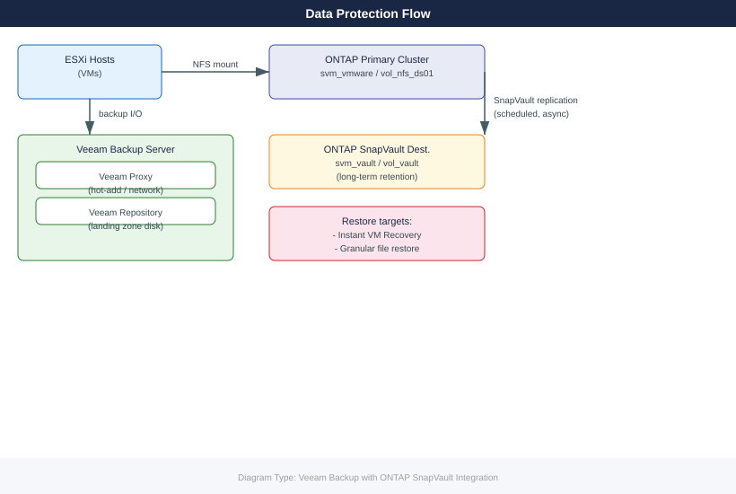
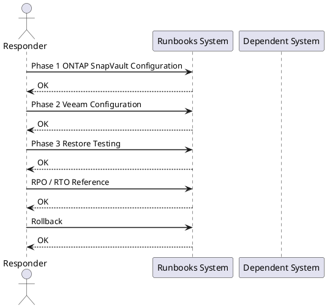

---
tags:
  - veeam
  - netapp
  - ontap
  - snapvault
  - backup
  - data-protection
  - runbook
---

# Veeam Backup with ONTAP SnapVault Integration

*Applies to: Storage (multi-vendor)*

<div class="kb-summary">
Cross-product runbook for integrating Veeam Backup &amp; Replication with NetApp ONTAP SnapVault. Covers ONTAP SnapVault source/destination configuration, Veeam storage system registration, backup job creation with NFS datastore, SnapVault offload, restore testing, and RPO/RTO targets.
</div>





## Before You Begin

**Prerequisites:**

| Component | Requirement |
|---|---|
| Veeam B&R | Version 12+ with Enterprise or above licence (SnapVault integration requires Enterprise) |
| ONTAP Primary | ONTAP 9.10+; SnapMirror/SnapVault licence active; SVM with NFS datastore volume |
| ONTAP Destination | Separate ONTAP cluster (or different SVM on same cluster) with SnapVault dest volume |
| Cluster Peering | ONTAP cluster peer and SVM peer relationships established between primary and destination |
| Network | Veeam server has IP connectivity to ONTAP management LIFs; intercluster LIFs peered |
| Credentials | ONTAP vsadmin (per-SVM) or cluster-admin for Veeam storage registration |

**Verify cluster peering before starting:**

```bash
# On primary ONTAP cluster
cluster peer show
vserver peer show

# On destination cluster
cluster peer show
vserver peer show

# Confirm intercluster LIFs are up
network interface show -role intercluster
```


```text title="Expected output"
Cluster Peer Status (Primary):
Peer Cluster Name         Peer Address       State
------------------------  -----------------  -------
ontap-dr-cluster          192.168.100.50     peered
ontap-dr-cluster          192.168.100.51     peered

Vserver Peer Status (Primary):
Vserver     Peer Vserver    Peer Cluster        State
-----------  ---------------  ------------------  -------
svm_prod     svm_dr           ontap-dr-cluster    peered
svm_prod     svm_dr           ontap-dr-cluster    peered

Cluster Peer Status (Destination):
Peer Cluster Name         Peer Address       State
------------------------  -----------------  -------
ontap-prod-cluster        192.168.100.10     peered
ontap-prod-cluster        192.168.100.11     peered

Vserver Peer Status (Destination):
Vserver     Peer Vserver    Peer Cluster        State
-----------  ---------------  ------------------  -------
svm_dr       svm_prod         ontap-prod-cluster  peered
svm_dr       svm_prod         ontap-prod-cluster  peered

Intercluster LIFs Status:
Vserver Name: cluster
  Logical Interface: ic_lif_01
    Address: 192.168.100.10
    Status: up
  Logical Interface: ic_lif_02
    Address: 192.168.100.11
    Status: up

Vserver Name: svm_prod
  Logical Interface: svm_ic_lif_01
    Address: 192.168.100.20
    Status: up
```

!!! warning "Common errors"
    **`Error: command failed: permission denied`** — Ensure your ONTAP user account has the "admin" role or appropriate cluster/vserver permissions assigned.
    **`Error: Cluster peer relationship does not exist`** — Verify cluster peering was established with `cluster peer create` and that both cluster names are correctly configured.
    **`Error: Network interface is down`** — Check physical port connectivity and VLAN configuration, then bring the intercluster LIF online with `network interface modify -vserver <vserver> -lif <lif_name> -status-admin up`.
---

## Phase 1: ONTAP SnapVault Configuration

### 1.1 Prepare Destination SVM and Volume

```bash
# On DESTINATION ONTAP cluster
# Create destination SVM (if not already existing)
vserver create -vserver svm_vault -rootvolume svm_vault_root \
  -rootvolume-security-style unix -language C.UTF-8

# Create SnapVault destination volume (DP type)
volume create -vserver svm_vault -volume vol_vault_vmware \
  -aggregate aggr1_vault_node01 -size 20T \
  -type DP

# Verify
volume show -vserver svm_vault -volume vol_vault_vmware -fields type,state
```


```text title="Expected output"
[Job: 9373] Executing job...
[Job: 9373] completed successfully.
Vserver "svm_vault" created.

[Job: 9374] Executing job...
[Job: 9374] completed successfully.
Volume "vol_vault_vmware" has been created.

Vserver Name: svm_vault
Volume Name: vol_vault_vmware
Type: DP
State: online
```

!!! warning "Common errors"
    **`Error: command failed: Cannot create Vserver "svm_vault": Vserver with name "svm_vault" already exists.`** — Verify the SVM name is unique or use an existing SVM with `vserver show` before creation.
    
    **`Error: command failed: Cannot create volume "vol_vault_vmware": Insufficient space in aggregate "aggr1_vault_node01".`** — Check available aggregate space with `storage aggregate show -aggregate aggr1_vault_node01` and increase size or use a different aggregate.
    
    **`Error: command failed: Cannot create volume "vol_vault_vmware": Vserver "svm_vault" does not exist.`** — Ensure the destination SVM creation completed successfully before attempting to create the volume.
### 1.2 Create SnapVault Policy and Schedule

```bash
# On PRIMARY ONTAP cluster — create a SnapVault policy
snapmirror policy create -vserver svm_vmware \
  -policy vault_policy_daily -type vault \
  -comment "Daily SnapVault to DR cluster"

# Add retention rules
snapmirror policy add-rule -vserver svm_vmware \
  -policy vault_policy_daily -snapmirror-label daily \
  -keep 30

snapmirror policy add-rule -vserver svm_vmware \
  -policy vault_policy_daily -snapmirror-label weekly \
  -keep 12

# Create snapshot schedule on primary (to generate labelled snapshots)
job schedule cron create -name daily_vault_snap \
  -dayofweek * -hour 22 -minute 0

snapshot policy create -vserver svm_vmware \
  -policy vault_snap_policy -enabled true \
  -schedule1 daily_vault_snap -count1 2 \
  -snapmirror-label1 daily

volume modify -vserver svm_vmware -volume vol_nfs_ds01 \
  -snapshot-policy vault_snap_policy
```


```text title="Expected output"
Vserver: svm_vmware
Policy: vault_policy_daily
Type: vault
Comment: Daily SnapVault to DR cluster
Transfer Priority: normal
Ignore atime: false

Rule #1
  SnapMirror Label: daily
  Keep: 30
  Preserve: false
  Warn: false

Rule #2
  SnapMirror Label: weekly
  Keep: 12
  Preserve: false
  Warn: false

Job schedule "daily_vault_snap" created successfully.

Snapshot policy "vault_snap_policy" created successfully.

Volume modify successful: "vol_nfs_ds01" snapshot policy set to "vault_snap_policy".
```

!!! warning "Common errors"
    **`Error: command failed: Vserver "svm_vmware" does not exist.`** — Verify the SVM name with `vserver show` and correct the vserver parameter in all commands.
    **`Error: command failed: Snapshot policy "vault_snap_policy" does not exist on Vserver "svm_vmware".`** — Ensure the snapshot policy creation command completes successfully before applying it to the volume.
    **`Error: command failed: Job schedule "daily_vault_snap" does not exist.`** — Create the job schedule before referencing it in the snapshot policy; verify with `job schedule cron show`.
### 1.3 Initialise SnapVault Relationship

```bash
# On PRIMARY cluster — create and initialise SnapVault relationship
snapmirror create -source-path svm_vmware:vol_nfs_ds01 \
  -destination-path svm_vault:vol_vault_vmware \
  -policy vault_policy_daily -type XDP

# Trigger initial baseline transfer (can take hours for large volumes)
snapmirror initialize -destination-path svm_vault:vol_vault_vmware

# Monitor transfer progress
snapmirror show -destination-path svm_vault:vol_vault_vmware \
  -fields state,transfer-bytes,progress

# Confirm relationship is healthy once complete
snapmirror show -destination-path svm_vault:vol_vault_vmware \
  -fields state,lag-time,newest-snapshot
```


```text title="Expected output"
Operation succeeded: SnapMirror relationship created.

Operation succeeded: SnapMirror relationship initialized.

Destination Path                State             Transfer Bytes  Progress
-------------------------------- ----------------- --------------- --------
svm_vault:vol_vault_vmware      transferring      847.3GB         73%

Destination Path                State             Lag Time        Newest Snapshot
-------------------------------- ----------------- --------------- ----------------------
svm_vault:vol_vault_vmware      snapmirrored      0h2m            vault.1@20240119_0200
```

!!! warning "Common errors"
    **`Error: command failed: Relationship does not exist`** — Verify the source volume path is correct and the SnapVault policy exists on the source cluster using `snapmirror policy show`.
    **`Error: transfer failed: Insufficient space on destination volume`** — Increase the destination volume size using `volume modify -vserver svm_vault -volume vol_vault_vmware -size +500GB` or reduce source data.
    **`Error: Snapmirror relationship is in unhealthy state`** — Check network connectivity between clusters and review SnapMirror logs with `event log show -severity error | grep snapmirror` to identify the root cause.
---

## Phase 2: Veeam Configuration

### 2.1 Add ONTAP Storage System to Veeam

```powershell
# Veeam PowerShell — add NetApp ONTAP as managed storage
Add-VBRStorageSystem -Name "ontap-primary" `
  -Type NetAppOntap `
  -Ip "<ontap-mgmt-ip>" `
  -Credentials (Get-VBRCredentials -Name "ontap-vsadmin")

# Verify the storage system is visible and volumes are discovered
Get-VBRStorageSystem | Where-Object { $_.Name -eq "ontap-primary" }
```

> **Note:** In the Veeam console you can also navigate to **Storage Infrastructure > Add Storage > NetApp ONTAP** and use the wizard.

### 2.2 Rescan Storage to Discover NFS Datastore

```powershell
# Rescan storage system to pick up vol_nfs_ds01
$storage = Get-VBRStorageSystem -Name "ontap-primary"
Sync-VBRStorageSystem -StorageSystem $storage
```

### 2.3 Create Backup Job with NFS Datastore Source

```powershell
# Create a new VMware backup job
$repo       = Get-VBRBackupRepository -Name "Veeam-Repo-01"
$vmList     = Find-VBRViEntity -Name "Production-Cluster" -VMsAndTemplates
$storSys    = Get-VBRStorageSystem -Name "ontap-primary"

$job = Add-VBRViBackupJob `
  -Name "ONTAP-NFS-VMBackup" `
  -Entity $vmList `
  -BackupRepository $repo

# Enable application-aware processing
$jobOptions = Get-VBRJobOptions -Job $job
$jobOptions.ViSourceOptions.SetStorageSnapshotOptions(
    [Veeam.Backup.Core.BackupOptions+StorageSnapshotOptions]::SnapProvider_NetApp
)
Set-VBRJobOptions -Job $job -Options $jobOptions

# Set schedule — daily at 23:00
$schedule = New-VBRJobScheduleOptions -Type Daily -DailyTime "23:00"
Set-VBRJobSchedule -Job $job -ScheduleOptions $schedule

Write-Host "Job created: $($job.Name)"
```

### 2.4 Enable SnapVault Offload in Veeam

SnapVault offload configuration is done through **Backup Job Properties > Storage > Secondary Target** in the Veeam console:

1. Open the backup job properties.
2. Go to **Storage** tab > click **Advanced**.
3. Select **Integration** tab.
4. Enable **Failover to storage snapshots** and **Keep SnapVault secondary copy**.
5. Select the SnapVault destination SVM (`svm_vault`) and volume (`vol_vault_vmware`).
6. Set retention to match the SnapVault policy rules (30 daily, 12 weekly).

```powershell
# Alternatively — verify SnapVault integration is active after config:
$job = Get-VBRJob -Name "ONTAP-NFS-VMBackup"
$job.GetStorageOptions() | Select-Object -ExpandProperty SnapVaultEnabled
```

---

## Phase 3: Restore Testing

### 3.1 Instant VM Recovery from Veeam

```powershell
# Locate the latest restore point
$restorePoint = Get-VBRRestorePoint -Name "app-server-01" |
  Sort-Object CreationTime -Descending | Select-Object -First 1

# Start instant VM recovery (VM runs directly from backup)
Start-VBRInstantRecovery -RestorePoint $restorePoint `
  -VMName "app-server-01-TEST" `
  -Server (Get-VBRServer -Name "vcenter.corp.local") `
  -ResourcePool (Get-VBRViResourcePool -Name "Resources") `
  -Datastore (Get-VBRViDatastore -Name "ONTAP-NFS-DS01") `
  -PowerUp

# Monitor recovery
Get-VBRInstantRecoverySession | Select-Object VMName,State,Duration
```

### 3.2 Granular File Restore from SnapVault Snapshot

```bash
# On DESTINATION cluster — list available SnapVault snapshots
snapshot show -vserver svm_vault -volume vol_vault_vmware

# Mount a specific snapshot as read-only clone for file browse
volume clone create -vserver svm_vault \
  -flexclone vol_vault_browse \
  -parent-volume vol_vault_vmware \
  -parent-snapshot <snapshot-name> \
  -type RO \
  -junction-path /vol_vault_browse

# Mount the clone on a Linux recovery host (NFS)
# mount -t nfs <vault-lif-ip>:/vol_vault_browse /mnt/restore

# Copy specific files out, then destroy clone when done
volume unmount -vserver svm_vault -volume vol_vault_browse
volume clone delete -vserver svm_vault -volume vol_vault_browse
```

```powershell
# Or use Veeam Explorer for granular file-level restore
Start-VBRRestoreVMFiles -RestorePoint $restorePoint `
  -Server (Get-VBRServer -Name "vcenter.corp.local") `
  -Reason "Granular restore test $(Get-Date -Format yyyy-MM-dd)"
```

---

## RPO / RTO Reference

| Restore Type | RPO | RTO | Notes |
|---|---|---|---|
| Veeam instant VM recovery | Up to 24h (daily job) | 5–15 min | VM runs from backup repo; migrate to production when ready |
| Veeam full VM restore | Up to 24h | 30–90 min | Depends on VM disk size and network throughput |
| Veeam file-level restore | Up to 24h | 10–30 min | Granular; uses Veeam Explorer |
| SnapVault clone mount | Up to 22h (snapshot schedule) | 5–10 min | Read-only; fastest for bulk file recovery |
| SnapVault full restore | Up to 22h | 1–4h | Restores entire volume from SnapVault copy |

> **RPO notes:** SnapVault snapshots are taken at 22:00 daily, giving a worst-case RPO of ~22 hours. Veeam jobs run at 23:00. To tighten RPO, add a mid-day snapshot label (e.g. `hourly`, keep 4) and a corresponding Veeam job or increase Veeam job frequency.

---

## Rollback

**If SnapVault initialisation fails:**

```bash
# Delete the failed relationship and retry
snapmirror delete -destination-path svm_vault:vol_vault_vmware
snapmirror release -source-path svm_vmware:vol_nfs_ds01 -destination-path svm_vault:vol_vault_vmware

# Re-create from scratch after fixing network/peering issues
snapmirror create -source-path svm_vmware:vol_nfs_ds01 \
  -destination-path svm_vault:vol_vault_vmware \
  -policy vault_policy_daily -type XDP
snapmirror initialize -destination-path svm_vault:vol_vault_vmware
```


```text title="Expected output"
Operation succeeded: SnapMirror relationship deleted.
Operation succeeded: SnapMirror relationship released.
Operation succeeded: SnapMirror relationship created with UUID 550e8400-e29b-41d4-a716-446655440000.
Operation succeeded: SnapMirror initialize started on destination "svm_vault:vol_vault_vmware".
```

!!! warning "Common errors"
    **`Error: command failed: Relationship does not exist`** — Verify the source and destination paths are correct and the relationship exists before attempting deletion with `snapmirror show`.
    **`Error: command failed: Cannot release SnapMirror relationship, transfer in progress`** — Wait for the current transfer to complete using `snapmirror show -fields transfer-state` before releasing the relationship.
**If Veeam job fails due to storage snapshot errors:**

```powershell
# Disable NetApp integration and fall back to standard CBT-based backup
$job = Get-VBRJob -Name "ONTAP-NFS-VMBackup"
$opts = Get-VBRJobOptions -Job $job
$opts.ViSourceOptions.UseChangeTracking = $true
# Disable SnapVault secondary target in job properties (UI or SDK)
Set-VBRJobOptions -Job $job -Options $opts
```

---

## See Also

- [ONTAP Operations](/storage/products/netapp/ontap/operations/)
- [SnapMirror Operations](/storage/products/netapp/snapmirror/operations/)
- [SnapMirror Architecture](/storage/products/netapp/snapmirror/architecture/)
- [Veeam Operations](/backup/products/veeam/operations/)
- [Veeam Architecture](/backup/products/veeam/architecture/)
- [Veeam Deploy](/backup/products/veeam/deploy/)
- [Storage Runbooks Index](/storage/runbooks/)
