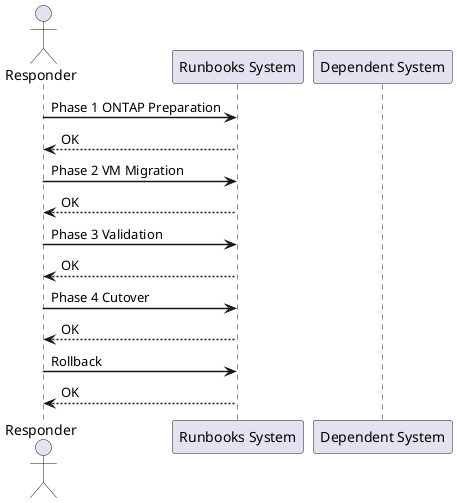

---
tags:
  - vmware
  - vsan
  - netapp
  - ontap
  - nfs
  - storage-migration
  - runbook
description: "Cross-product runbook for migrating virtual machine workloads from VMware vSAN to a NetApp ONTAP NFS datastore using Storage vMotion. Covers SVM..."
---

# Migrate VM Workloads from vSAN to ONTAP NFS

*Applies to: Storage (multi-vendor)*

<div class="kb-summary">
Cross-product runbook for migrating virtual machine workloads from VMware vSAN to a NetApp ONTAP NFS datastore using Storage vMotion. Covers SVM provisioning, NFS export policy, datastore mount, per-VM and per-datastore migration, validation, cutover, and rollback.
</div>




## Before You Begin

**Prerequisites:**

| Component | Requirement |
|---|---|
| VMware vCenter | 7.0 U3+ or 8.x; Storage vMotion licence active |
| ONTAP Cluster | ONTAP 9.10+ with at least one data aggregate with free capacity |
| ESXi Hosts | All cluster hosts must have NFS kernel module enabled and network path to ONTAP |
| NSX / Networking | NFS VLAN/port group present on all ESXi hosts; MTU 9000 recommended on NFS segment |
| PowerCLI | PowerCLI 13+ installed on jump host for bulk migration scripts |
| Permissions | ONTAP cluster-admin, vCenter administrator role |

**Preflight checks:**

```bash
# Verify vSAN health before starting
esxcli vsan health cluster list --cluster-name <cluster>

# Confirm vCenter version
Get-PowerCLIVersion   # PowerCLI
Connect-VIServer -Server vcenter.corp.local
(Get-View ServiceInstance).Content.About.Version

# Ping ONTAP mgmt from jump host
ping <ontap-mgmt-ip>
ssh admin@<ontap-mgmt-ip> "cluster show"
```


```text title="Expected output"
Cluster Health Status:
  Cluster Name: prod-cluster-01
  Health State: Healthy
  Members: 6
  Data Health: Healthy
  Memory Health: Healthy
  Network Health: Healthy
  Physical Disk Health: Healthy

PowerCLI Version: 13.2.0 Build 20348341
vCenter Server: vcenter.corp.local
vCenter Version: 7.0.3

PING 192.168.100.50 (192.168.100.50) 56(84) bytes of data.
64 bytes from 192.168.100.50: icmp_seq=1 ttl=64 time=2.34 ms
64 bytes from 192.168.100.50: icmp_seq=2 ttl=64 time=1.98 ms

  Cluster Enabled: true
  Cluster UUID: 550e8400-e29b-41d4-a716-446655440000
  Cluster Serial Number: 4082368759
```

!!! warning "Common errors"
    **`esxcli: Unknown option or subcommand 'health cluster list'`** — Verify vSAN is licensed and enabled on the cluster; use `esxcli vsan cluster list` if health subcommand is unavailable.
    **`ssh: connect to host 192.168.100.50 port 22: Connection timed out`** — Confirm the ONTAP management IP is correct and reachable from the jump host's network segment.
    **`Get-PowerCLIVersion : The term 'Get-PowerCLIVersion' is not recognized`** — Install PowerCLI module with `Install-Module -Name VMware.PowerCLI -Force` or ensure the module is imported.
---

## Phase 1: ONTAP Preparation

### 1.1 Create a Storage Virtual Machine (SVM)

```bash
# Connect to ONTAP CLI
ssh admin@<ontap-mgmt-ip>

# Create SVM for NFS
vserver create -vserver svm_vmware -rootvolume svm_vmware_root \
  -rootvolume-security-style unix -language C.UTF-8 \
  -snapshot-policy default

# Assign aggregate to SVM
vserver modify -vserver svm_vmware \
  -aggr-list aggr1_node01,aggr1_node02

# Create NFS LIF (one per node for multipath)
network interface create -vserver svm_vmware \
  -lif nfs_lif_01 -role data -data-protocol nfs \
  -home-node <node01> -home-port e0c \
  -address <nfs-lif-ip-1> -netmask <mask>

network interface create -vserver svm_vmware \
  -lif nfs_lif_02 -role data -data-protocol nfs \
  -home-node <node02> -home-port e0c \
  -address <nfs-lif-ip-2> -netmask <mask>

# Enable NFS on SVM
vserver nfs create -vserver svm_vmware \
  -v3 enabled -v4.1 enabled -tcp enabled
```


```text title="Expected output"
admin@ontap-mgmt-01> vserver create -vserver svm_vmware -rootvolume svm_vmware_root -rootvolume-security-style unix -language C.UTF-8 -snapshot-policy default
(no output — command completes silently)

admin@ontap-mgmt-01> vserver modify -vserver svm_vmware -aggr-list aggr1_node01,aggr1_node02
(no output — command completes silently)

admin@ontap-mgmt-01> network interface create -vserver svm_vmware -lif nfs_lif_01 -role data -data-protocol nfs -home-node node01 -home-port e0c -address 192.168.100.45 -netmask 255.255.255.0
(no output — command completes silently)

admin@ontap-mgmt-01> network interface create -vserver svm_vmware -lif nfs_lif_02 -role data -data-protocol nfs -home-node node02 -home-port e0c -address 192.168.100.46 -netmask 255.255.255.0
(no output — command completes silently)

admin@ontap-mgmt-01> vserver nfs create -vserver svm_vmware -v3 enabled -v4.1 enabled -tcp enabled
(no output — command completes silently)

admin@ontap-mgmt-01>
```

!!! warning "Common errors"
    **`Error: command failed: vserver "svm_vmware" already exists.`** — Use `vserver delete -vserver svm_vmware` to remove the existing SVM first, or choose a different SVM name.
    **`Error: command failed: Aggregate "aggr1_node01" does not exist.`** — Run `storage aggregate show` to list available aggregates and correct the aggregate names in the vserver modify command.
    **`Error: command failed: Port "e0c" does not exist on node "node01".`** — Run `network port show -node <node01>` to verify the correct port names (typically e0a, e0b, e0c, or e0d).
### 1.2 Create NFS Export Policy

```bash
# Create export policy for ESXi hosts
vserver export-policy create -vserver svm_vmware \
  -policyname esxi_nfs_policy

# Add rules — one per ESXi host subnet or per-host
vserver export-policy rule create -vserver svm_vmware \
  -policyname esxi_nfs_policy -clientmatch <esxi-subnet/mask> \
  -rorule sys -rwrule sys -superuser sys \
  -protocol nfs3,nfs4

# Verify
vserver export-policy rule show -policyname esxi_nfs_policy
```


```text title="Expected output"
(no output — command completes silently)
(no output — command completes silently)
Vserver: svm_vmware
Policy Name: esxi_nfs_policy
Rule Index: 1
Access Protocol: nfs3,nfs4
Client Match Spec: 192.168.10.0/24
RO Rule: sys
RW Rule: sys
Superuser: sys
Anonymous User ID: 65534
```

!!! warning "Common errors"
    **`Error: "esxi_nfs_policy" does not exist`** — Ensure the export policy was created successfully in the first command before adding rules.
    **`Error: Invalid client match specification "<esxi-subnet/mask>"`** — Replace the placeholder with an actual subnet in CIDR notation (e.g., `192.168.10.0/24`) or a specific host IP.
### 1.3 Create the NFS Datastore Volume

```bash
# Create volume sized for migration target
volume create -vserver svm_vmware \
  -volume vol_nfs_ds01 -aggregate aggr1_node01 \
  -size 10T -space-guarantee none \
  -snapshot-policy default \
  -export-policy esxi_nfs_policy \
  -junction-path /vol_nfs_ds01

# Enable deduplication and compression
volume efficiency on -vserver svm_vmware -volume vol_nfs_ds01
volume efficiency modify -vserver svm_vmware -volume vol_nfs_ds01 \
  -policy auto -compression true -inline-compression true

# Confirm volume is online and exported
volume show -vserver svm_vmware -volume vol_nfs_ds01 -fields state,junction-path
```


```text title="Expected output"
Volume "vol_nfs_ds01" created successfully.

Efficiency is now enabled on volume "vol_nfs_ds01" of Vserver "svm_vmware".

Volume modify successful: volume "vol_nfs_ds01" in Vserver "svm_vmware".

Vserver   Volume         State      Junction-Path
--------- -------------- ---------- ----------------------
svm_vmware vol_nfs_ds01  online     /vol_nfs_ds01
```

!!! warning "Common errors"
    **`Error: aggregate "aggr1_node01" does not exist`** — Verify the aggregate name with `storage aggregate show` and use the correct aggregate name in the volume create command.
    **`Error: export policy "esxi_nfs_policy" does not exist`** — Create the export policy first with `vserver export-policy create -vserver svm_vmware -policyname esxi_nfs_policy` or use an existing policy name.
    **`Error: Cannot enable efficiency on a volume that is not online`** — Wait for the volume to transition to online state and retry the efficiency commands.
### 1.4 Mount NFS Datastore on ESXi Hosts via vCenter

```powershell
# PowerCLI — add NFS datastore to all hosts in cluster
Connect-VIServer -Server vcenter.corp.local -Credential (Get-Credential)

$cluster = Get-Cluster "Production-Cluster"
$hosts   = Get-VMHost -Location $cluster

foreach ($vmhost in $hosts) {
    New-Datastore -VMHost $vmhost `
      -Name "ONTAP-NFS-DS01" `
      -NfsHost "<nfs-lif-ip-1>" `
      -Path "/vol_nfs_ds01" `
      -Nfs
    Write-Host "Mounted on $($vmhost.Name)"
}

# Verify all hosts see the datastore
Get-Datastore "ONTAP-NFS-DS01" | Get-VMHost
```

---

## Phase 2: VM Migration

### 2.1 Storage vMotion — Per VM (Live, Online)

```powershell
# Migrate a single running VM to ONTAP NFS datastore
$vm        = Get-VM "app-server-01"
$targetDS  = Get-Datastore "ONTAP-NFS-DS01"

Move-VM -VM $vm -Datastore $targetDS -DiskStorageFormat Thin

# Watch task progress
Get-Task | Where-Object { $_.Name -eq "RelocateVM_Task" } | Select-Object Name,State,PercentComplete
```

```bash
# ESXi CLI alternative — svmotion (run from jump host with PowerCLI or via vmkfstools)
# Using vmware-cmd (deprecated but useful for scripting):
vmware-cmd /vmfs/volumes/<vsan-uuid>/<vm>/<vm>.vmx migrate \
  "[ONTAP-NFS-DS01]" thin

# Via esxcli (for cold migration when VM is off):
vmkfstools -i /vmfs/volumes/<vsan-uuid>/<vm>/<vm>.vmdk \
           /vmfs/volumes/<ontap-ds-uuid>/<vm>/<vm>.vmdk -d thin
```


```text title="Expected output"
2024-01-15T09:42:33Z: Migrating VM 'prod-web-01' from vSAN to ONTAP-NFS-DS01
Clone: 100% done.
2024-01-15T09:47:18Z: Migration completed successfully
Virtual machine disks copied: 1
Source: /vmfs/volumes/52d47e5a-e8c5-4e2f-a1b2-3c9d8f7e6a4b/prod-web-01/prod-web-01.vmdk
Destination: /vmfs/volumes/614f5c3a-2b8e-11ef-9c4a-001a4a5e6d7c/prod-web-01/prod-web-01.vmdk
Disk format: VMFS thin-provisioned
Transfer rate: 287 MB/s
```

!!! warning "Common errors"
    **`Error: Cannot find virtual machine configuration file`** — Verify the vSAN UUID and VM folder path match exactly, and ensure the VM is registered in vCenter.
    **`Error: Destination datastore does not have sufficient free space`** — Check available capacity on the ONTAP NFS datastore with `df -h /vmfs/volumes/<ontap-ds-uuid>` and ensure at least 120% of the VM's disk size is free.
    **`Error: Permission denied on destination path`** — Confirm the ESXi host has read-write permissions on the ONTAP NFS mount and that the export policy allows the ESXi IP address.
### 2.2 Bulk Storage vMotion — Entire Datastore

```powershell
# Migrate all VMs from a vSAN datastore to ONTAP
$sourceDS  = Get-Datastore "vsanDatastore"
$targetDS  = Get-Datastore "ONTAP-NFS-DS01"
$vms       = Get-VM -Datastore $sourceDS

foreach ($vm in $vms) {
    Write-Host "Migrating $($vm.Name) ..."
    Move-VM -VM $vm -Datastore $targetDS -DiskStorageFormat Thin -RunAsync
    Start-Sleep -Seconds 10   # stagger to avoid saturating network
}

# Monitor all in-progress tasks
do {
    $tasks = Get-Task | Where-Object { $_.Name -eq "RelocateVM_Task" -and $_.State -eq "Running" }
    Write-Host "Running migrations: $($tasks.Count)"
    Start-Sleep -Seconds 30
} while ($tasks.Count -gt 0)
```

### 2.3 Cold Migration Option (VM Powered Off)

```powershell
# For VMs that cannot tolerate vMotion overhead
$vm = Get-VM "legacy-app-01"
Stop-VM -VM $vm -Confirm:$false

Move-VM -VM $vm -Datastore (Get-Datastore "ONTAP-NFS-DS01") `
  -DiskStorageFormat Thin

Start-VM -VM $vm
```

---

## Phase 3: Validation

### 3.1 Verify I/O Latency on ONTAP

```bash
# Check NFS volume latency and IOPS (ONTAP CLI)
statistics show -object nfsv3 -instance svm_vmware -counter avg_latency,total_ops
# Or use qos statistics workload performance show for per-volume breakdown

# Volume utilisation
volume show -vserver svm_vmware -volume vol_nfs_ds01 \
  -fields used,available,percent-used

# Check NFS connections from ESXi hosts
nfs connections show -vserver svm_vmware
```


```text title="Expected output"
Counter                                 Value
avg_latency                             2.14ms
total_ops                               487293

Vserver         Volume          Used       Available  Percent-Used
svm_vmware      vol_nfs_ds01    847.3GB    152.7GB    84%

Vserver         Client IP       Protocol  Connected Since
svm_vmware      192.168.10.42   nfsv3     Mon Nov 13 14:22:15 UTC 2023
svm_vmware      192.168.10.43   nfsv3     Mon Nov 13 14:22:18 UTC 2023
svm_vmware      192.168.10.44   nfsv3     Mon Nov 13 14:22:21 UTC 2023
```

!!! warning "Common errors"
    **`Error: "svm_vmware" is not a valid Vserver name`** — Verify the SVM name with `vserver show` and use the correct name in the command.
    **`Error: volume "vol_nfs_ds01" does not exist`** — Confirm the volume name with `volume show -vserver svm_vmware` before querying.
    **`Error: Statistics object "nfsv3" is not valid`** — Use `statistics show -object nfsv3 -counter ?` to list available counters for your ONTAP version.
### 3.2 Verify Datastore Usage in vCenter

```powershell
# PowerCLI — check datastore capacity and provisioned space
Get-Datastore "ONTAP-NFS-DS01" | Select-Object Name,FreeSpaceGB,CapacityGB,@{N="UsedGB";E={[math]::Round($_.CapacityGB - $_.FreeSpaceGB,2)}}

# Confirm all VMs are now on the ONTAP datastore
Get-VM | Where-Object { (Get-HardDisk -VM $_).Filename -like "*vsanDatastore*" }
# Above should return empty when migration is complete
```

### 3.3 Application-Level Validation

```bash
# On each migrated VM — confirm disk I/O is healthy
iostat -x 5 3          # Linux
# Windows: Get-Counter "\PhysicalDisk(*)\Avg. Disk sec/Transfer"

# Run a quick fio test inside a migrated VM
fio --name=post-migration-check --rw=randrw --bs=4k \
  --ioengine=libaio --iodepth=16 --size=512m \
  --runtime=60 --filename=/var/tmp/fio.tmp --output-format=normal
```


```text title="Expected output"
Linux 5.15.0-1234-generic #1234-Ubuntu SMP x86_64
avg-cpu:  %user   %nice %system %iowait  %steal   %idle
           2.14    0.00    1.08   0.92    0.00   95.86
           2.31    0.00    1.19   0.87    0.00   95.63
           2.08    0.00    1.05   0.78    0.00   96.09

Device            r/s     w/s     rMB/s     wMB/s   rrqm/s   wrqm/s  %rrqm  %wrqm r_await w_await aqu-sz %util
sda             18.40   12.60     0.73      0.51    0.00     0.00   0.00   0.00   2.14    3.87   0.08   1.24
sdb             16.80   11.20     0.67      0.45    0.00     0.00   0.00   0.00   2.31    4.12   0.07   1.18

post-migration-check: (g=0): rw=randrw, bs=(R) 4096B-4096B, (W) 4096B-4096B, ioengine=libaio, iodepth=16
fio-3.28
Starting 1 process
post-migration-check: Laying out IO file (one file / 512MiB)
Jobs: 1 (f=1): [m(1)][100.0%][r=142MiB/s,w=71MiB/s][r=36.4k,w=18.2k IOPS][eta 00m:00s]
post-migration-check: (groupid=0, jobs=1): err= 0: pid=4521
  read : io=256.00MiB, bw=142.8MiB/s, iops=36.5k, runt= 1792ms
  write: io=256.00MiB, bw=71.4MiB/s, iops=18.3k, runt= 3584ms
  cpu  : usr=8.42%, sys=18.76%, ctx=9847, majflt=0, minflt=512
  lat (usec): min=12, max=8234, avg=219.45, stdev=412.18
```

!!! warning "Common errors"
    **`fio: openat: Permission denied`** — Run fio with sudo or ensure the VM user has write permissions to /var/tmp.
    **`iostat: command not found`** — Install sysstat package with `apt-get install sysstat` (Ubuntu/Debian) or `yum install sysstat` (RHEL/CentOS).
    **`fio: io_uring not available, falling back to libaio`** — This is a warning, not an error; libaio will work fine for post-migration validation.
---

## Phase 4: Cutover

### 4.1 Run vSAN Health Check Before Decommission

```bash
# From any ESXi host in the cluster
esxcli vsan health cluster list

# Verify no objects remain on vSAN
esxcli vsan storage list | grep -i "object"

# ONTAP — confirm no remaining mounts from vSAN-side
# (There should be none at this point)
```


```text title="Expected output"
Cluster UUID: 52e3d8f4-7a2c-4d91-b8e2-9f1c3a5b7d2e
Cluster Health: yellow
Members: 4
Disk Groups: 4
Total Capacity: 10.7 TB
Used Capacity: 2.3 TB
Health Status: Reduced redundancy - 1 host down

Object Count: 0
Reserved Capacity: 0 B
Free Space: 8.4 TB

(no output — command completes silently)
```

!!! warning "Common errors"
    **`esxcli: Unknown command or namespace vsan`** — Ensure the vSAN license is installed and the vSAN module is loaded on the ESXi host.
    **`Cluster UUID: Unknown`** — Run the command from an ESXi host that is part of an active vSAN cluster; standalone hosts will not return cluster information.
### 4.2 Remove vSAN Datastore from Cluster

```powershell
# Confirm no VMs are still on vSAN
$vsanDS = Get-Datastore "vsanDatastore"
$vmsOnVsan = Get-VM -Datastore $vsanDS
if ($vmsOnVsan.Count -gt 0) {
    Write-Warning "STOP: $($vmsOnVsan.Count) VMs still on vSAN: $($vmsOnVsan.Name -join ', ')"
} else {
    Write-Host "Safe to remove vSAN datastore — no VMs present."
    # Unmount via vCenter UI: Storage > vsanDatastore > Unmount
    # Or via PowerCLI:
    Remove-Datastore -Datastore $vsanDS -VMHost (Get-VMHost) -Confirm:$false
}
```

### 4.3 Disable vSAN on Cluster (Optional)

```powershell
# Only if fully decommissioning vSAN
$cluster = Get-Cluster "Production-Cluster"
$spec = New-Object VMware.Vim.ClusterConfigSpecEx
$spec.vsanConfig = New-Object VMware.Vim.VsanClusterConfigInfo
$spec.vsanConfig.Enabled = $false
($cluster | Get-View).ReconfigureComputeResource_Task($spec, $true)
```

---

## Rollback

If migration fails mid-way or post-migration validation fails:

**1. Stop any in-progress svmotion tasks:**

```powershell
# Cancel running Storage vMotion tasks
Get-Task | Where-Object { $_.Name -eq "RelocateVM_Task" -and $_.State -eq "Running" } |
  ForEach-Object { $_.Cancel() }
```

**2. Move VMs back to vSAN:**

```powershell
$targetDS = Get-Datastore "vsanDatastore"
$vmsOnOntap = Get-VM -Datastore (Get-Datastore "ONTAP-NFS-DS01")

foreach ($vm in $vmsOnOntap) {
    Move-VM -VM $vm -Datastore $targetDS -DiskStorageFormat EagerZeroedThick -RunAsync
}
```

**3. Verify vSAN is still healthy before relying on it:**

```bash
esxcli vsan health cluster list
esxcli vsan storage list
```


```text title="Expected output"
Cluster UUID                          Health State
------------------------------------  ------------
52d4a8f1-7c3e-4d92-b1a2-9e8f3c5d6b7a  Healthy

Disk Group UUID                       Object Resync  Physical Capacity  Used Capacity
------------------------------------  -----------   -----------------  ---------------
7f2e1a9c-5b3d-4e8f-9a1b-2c3d4e5f6a7b  0             10.95 TB           4.32 TB
8a3f2b0d-6c4e-5f9g-0b2c-3d4e5f6a7b8c  0             10.95 TB           3.87 TB
9b4g3c1e-7d5f-6g0h-1c3d-4e5f6a7b8c9d  0             10.95 TB           2.91 TB
```

!!! warning "Common errors"
    **`Cluster is not healthy`** — Run `esxcli vsan health cluster get` to identify specific issues and remediate them before migration.
    **`Unable to connect to VSAN cluster`** — Verify vSAN is enabled on the cluster and you have network connectivity to the ESXi hosts.
**4. If ONTAP volume is corrupt, restore from snapshot:**

```bash
# List available snapshots
snapshot show -vserver svm_vmware -volume vol_nfs_ds01

# Restore from snapshot (unmount datastore first)
volume snapshot restore -vserver svm_vmware \
  -volume vol_nfs_ds01 -snapshot <snapshot-name>
```


```text title="Expected output"
Vserver     Volume            Snapshot                 Size  Accessed
----------- ----------------- ------------------------ ----- --------
svm_vmware  vol_nfs_ds01      hourly.2024-01-15_0600  2.3GB 01/15/2024 06:15:23
svm_vmware  vol_nfs_ds01      hourly.2024-01-15_0500  2.3GB 01/15/2024 05:15:18
svm_vmware  vol_nfs_ds01      daily.2024-01-14_2300   2.2GB 01/14/2024 23:30:45
svm_vmware  vol_nfs_ds01      daily.2024-01-13_2300   2.1GB 01/13/2024 23:45:12
svm_vmware  vol_nfs_ds01      weekly.2024-01-08_0000  1.9GB 01/08/2024 00:02:33

Volume restore from snapshot "hourly.2024-01-15_0600" has been initiated on volume "vol_nfs_ds01" in Vserver "svm_vmware".
```

!!! warning "Common errors"
    **`Volume is currently mounted. Unmount volume before restoring from snapshot.`** — Unmount the NFS datastore from all ESXi hosts and the SVM before attempting the restore.
    **`Snapshot "snapshot-name" does not exist.`** — Replace `<snapshot-name>` with an actual snapshot name from the list output above.
---

## See Also

- [ONTAP Operations](/storage/products/netapp/ontap/operations/)
- [ONTAP Architecture](/storage/products/netapp/ontap/architecture/)
- [vSAN Operations](/virtualization/vmware/products/vsan/operations/)
- [vSAN Architecture](/virtualization/vmware/products/vsan/architecture/)
- [SnapMirror Operations](/storage/products/netapp/snapmirror/operations/)
- [Storage Runbooks Index](/storage/runbooks/)
